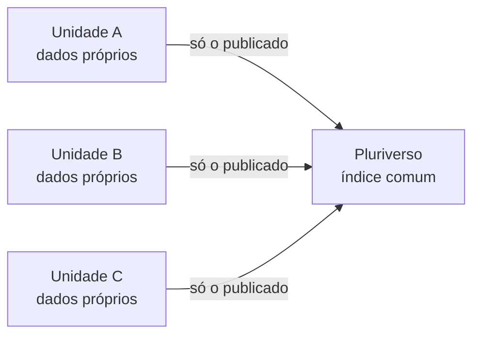

# Arquitetura BioCultural — resumo em uma página

Versão 4.0. Citável: [10.5281/zenodo.21738427](https://doi.org/10.5281/zenodo.21738427).

## O que é

Uma forma de reunir o conhecimento tradicional associado à biodiversidade **sem tirá-lo das mãos de quem o detém**. Cada comunidade ou iniciativa mantém a sua própria base de dados. Só o que ela decide publicar aparece num índice comum.

## O problema

Esse conhecimento está espalhado: artigos, registros de campo, acervos de museus, obras de naturalistas antigos. Os sistemas que tentam juntá-lo costumam guardar tudo numa base única, de uma instituição. Aí quem decide o que se publica é a instituição, e não a comunidade. O termo de consentimento diz uma coisa. A estrutura do sistema permite outra.

## A proposta

- **Federação soberana.** Cada comunidade ou iniciativa opera a sua *Unidade Federada*, com seus dados em um arquivo próprio. Um índice comum, o *Pluriverso*, só lê o que foi marcado como público. Quem quiser pode retirar o que publicou ou sair da federação.
- **Conhecimento × Evidência.** *Conhecimento* é o que a comunidade diz, por si, sobre a sua relação com a biodiversidade. *Evidência* é o que um terceiro (um artigo, um museu, um naturalista) registrou sobre essa relação. Evidência não vale menos. Só tem outro dono. E só a comunidade decide sobre o seu Conhecimento.
- **Quatro tipos de fonte, quatro ferramentas.**

| Tipo de fonte | Ferramenta |
|---|---|
| Registro feito com a comunidade | BioCultRelatos |
| Artigos científicos | BioCultDB |
| Acervos históricos e de museus | BioCultAcervos |
| Obras de naturalistas (séculos XVII a XIX) | BioCultNaturalistas |

## Objetivo

Mostrar que é possível reunir esse conhecimento com a soberania garantida **pela própria estrutura**, e não só por promessa.

## Por que importa

- **Legal:** a lei brasileira da biodiversidade (Lei 13.123/2015) exige consentimento das comunidades.
- **Ética:** os princípios C.A.R.E. pedem benefício coletivo, autoridade para controlar, responsabilidade e ética.
- **Científica:** dados organizados, com origem clara e citáveis.
- **Para as comunidades:** decidir, e poder voltar atrás.

## Onde estamos

Só o BioCultDB está em produção. As outras ferramentas estão em documentação ou em construção. Nenhuma comunidade tradicional participa diretamente ainda: a interlocução é feita por um Ponto-Focal, indicado pelo USEFLORA. A governança da arquitetura funciona em reuniões, com perguntas abertas no GitHub. O Comitê Federado ainda não existe.

Versão longa: [resumo executivo completo](../docs/Pesquisa/resumoExecutivo-completo.md).

## Por onde seguir

| Se você é… | Leia |
|---|---|
| Participante da governança da arquitetura | [Guia da governança da arquitetura](guia-governanca-arquitetura.md) |
| De uma comunidade, ou fala por ela | [Guia: comunidades e dados](guia-comunidades-e-dados.md) |
| Quem instala e mantém as ferramentas | [Guia das ferramentas](guia-ferramentas.md) |
| Pesquisador ou pesquisadora | [Guia dos pesquisadores](guia-pesquisadores.md) |
| Curioso com algum termo | [Glossário](glossario.md) |
| Novo no GitHub | [Como usar o GitHub](guia-github.md) |

*Para a equipe técnica: visão completa em [`../docs/README.md`](../docs/tecnico/README.md).*
