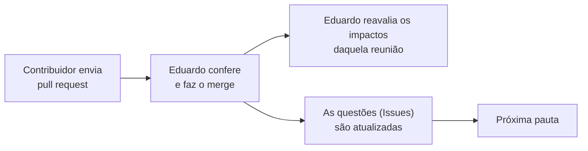

# Como usar o GitHub

Guia desta pasta para participar do projeto pelo site do GitHub: corrigir uma memória de reunião, responder
a uma questão ou abrir uma questão nova. Não é preciso instalar nada nem conhecer git.

Cada correção vira um **pedido de alteração** (*pull request*). Eduardo recebe um aviso, confere
o texto e incorpora a correção ao documento. Nada que você fizer apaga a versão anterior: o GitHub
guarda todo o histórico.

---

## Antes de começar

- Entre no GitHub com a sua conta. Se ainda não tem, crie uma em <https://github.com/signup>.
- Se você participa com frequência, peça a Eduardo acesso de colaborador ao repositório. Sem esse
  acesso o guia também funciona (ver "Perguntas comuns").
- As memórias ficam em:
  <https://github.com/edalcin/Arquitetura-BioCultural/tree/main/Governanca/Arquitetura/Reunioes>

---

## Os 4 passos

### 1. Abrir o arquivo e clicar no lápis

Clique no nome da memória (por exemplo, `2026-09-18-reuniao-sofia.md`). No canto superior direito
do texto, clique no **lápis** (✏️, *Edit this file*).

### 2. Editar o texto

Corrija o que for preciso, direto na caixa de texto.

- Os asteriscos (`**assim**`) deixam o texto em **negrito**. Mantenha os pares de asteriscos.
- Uma linha que começa com `-` ou `1.` é item de lista. Mantenha o sinal no início da linha.
- A aba **Preview** mostra como o texto vai ficar.

### 3. Clicar em "Commit changes…"

O botão verde fica no canto superior direito. Abre uma janela:

1. Em **Commit message**, escreva uma frase curta sobre a correção
   (ex.: `Corrige exemplo de hierarquia na decisão 5`).
2. Marque **"Create a new branch for this commit and start a pull request"**.
   **Não** marque "Commit directly to the main branch".
3. Clique em **Propose changes**.

### 4. Clicar em "Create pull request"

Abre uma página de resumo. Se quiser, explique a correção na caixa de descrição. Clique no botão
verde **Create pull request**.

Pronto. Eduardo recebe o aviso e faz o resto.

---

## Perguntas comuns

**Quero corrigir mais de uma memória.** Repita os 4 passos para cada arquivo. Um pedido por
correção é o normal.

**Esqueci uma coisa depois de enviar.** Envie um novo pedido com os mesmos 4 passos.

**Marquei a opção errada no passo 3 e o commit foi direto.** Não tem problema. Avise Eduardo; o
histórico guarda a versão anterior.

**O botão do lápis não aparece.** Confira se você entrou com a sua conta e se está vendo o
arquivo, não a pasta.

**O GitHub criou um *fork* (uma cópia do repositório na minha conta).** Isso acontece quando a sua
conta não tem acesso de colaborador. Siga os mesmos passos: o *pull request* chega ao repositório
original do mesmo modo. Com acesso de colaborador, o lápis cria o ramo direto no repositório
original, sem *fork*. Um *fork* que não é mais necessário pode ser apagado; Eduardo ajuda.

---

## Issues: as questões da governança da arquitetura

Uma *Issue* é uma página com título e conversa, dentro do próprio repositório. Aqui, **cada questão
aberta da arquitetura é uma *Issue***, com um número que não muda (por exemplo, `#9`). As pautas
levam direto a elas. Não é preciso editar nenhum documento para participar.

- **Painel de todas as questões:** <https://github.com/edalcin/Arquitetura-BioCultural/issues/6>
  (fixado no alto da lista).
- **Questões da próxima reunião:** <https://github.com/edalcin/Arquitetura-BioCultural/milestone/1>.

### Como participar

Eduardo cria as questões, com a ajuda da IA, depois que o resumo de uma reunião foi revisado por
você. Você **comenta**: é só escrever na caixa de texto no fim da página e clicar em **Comment**.

Cada questão diz, numa seção própria, **o que fecha a questão**: que resposta, de quem e onde. Você
pode responder por escrito ali mesmo. Uma resposta escrita vale como decisão, a não ser que você
escolha outra regra na questão [#8](https://github.com/edalcin/Arquitetura-BioCultural/issues/8).

Quando a questão é respondida, Eduardo a **fecha** com um comentário curto de três linhas:

```text
Decisão: a resposta, em uma ou duas frases
Onde: reunião de DD/MM, decisão N do resumo  |  nesta Issue, por @conta, em DD/MM
Efeito na arquitetura: o item de impacto (I-xx), ou "nenhum"
```

Nada se apaga: questões fechadas continuam visíveis e podem ser **reabertas**, porque uma decisão
pode mudar.

### O que querem dizer as etiquetas

| Etiqueta | Quer dizer |
|---|---|
| `para-ponto-focal` | O Ponto-Focal responde ou opina |
| `para-comunidades` | Só as comunidades respondem; o Ponto-Focal leva a pergunta, sem prazo |
| `para-gestao` | Tarefa de Eduardo. Não entra na pauta |
| `decisao` | Pede uma escolha entre opções |
| `informe` | Pede uma notícia, não uma escolha |
| `duvida` | Dúvida sobre um documento ou uma questão |
| `aguarda-terceiros` | Depende de alguém de fora da reunião |
| `fonte-primaria` | Registro feito diretamente com a comunidade (BioCultRelatos) |
| `fonte-secundaria` | Artigos científicos publicados (BioCultDB) |
| `fonte-acervos` | Acervos históricos e de museus (BioCultAcervos) |
| `fonte-naturalistas` | Obras de naturalistas dos séculos XVII a XIX (BioCultNaturalistas) |

As etiquetas `fonte-…` dizem a que **tipo de fonte** a questão se refere. Servem para chamar a pessoa
certa da governança quando ela participar. Uma questão sem etiqueta de fonte vale para todas.

### Abrir uma questão sua

1. Abra <https://github.com/edalcin/Arquitetura-BioCultural/issues/new/choose>.
2. Escolha **Dúvida** (não entendi um documento ou uma questão) ou **Questão para a governança da
   arquitetura** (uma pergunta nova). O formulário mostra o que escrever em cada campo.
3. Clique em **Create**.

Para chamar alguém para a conversa, escreva `@` e o nome da conta (ex.: `@edalcin`). A pessoa recebe
um aviso.

### Cuidados

- **Tudo é público.** O repositório é aberto. Nunca escreva numa *Issue* conhecimento tradicional de
  uma comunidade, nome de detentor, local sensível ou dado pessoal. Fale do **desenho** (que campo,
  que regra, que opção), nunca do **valor** de um registro concreto. Eduardo pode editar ou apagar um
  comentário que exponha conhecimento tradicional.
- Um assunto por *Issue*. Dois assuntos? Duas *Issues*.
- Não há pergunta boba. Dúvida de quem não é da área técnica mostra onde a documentação precisa
  melhorar.
- Prefere responder por e-mail ou mensagem? Pode. Eduardo copia a resposta para a questão, com a
  data.

---

## O que acontece depois



Uma correção numa memória pode mudar a leitura que a arquitetura faz da reunião. Por isso cada
pedido passa pela conferência de Eduardo antes de entrar, e as questões e a próxima pauta só são
atualizadas **depois** da sua revisão do resumo: elas nunca carregam uma leitura que você ainda vai
corrigir.
