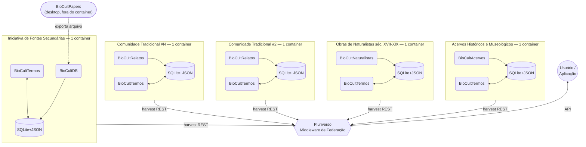
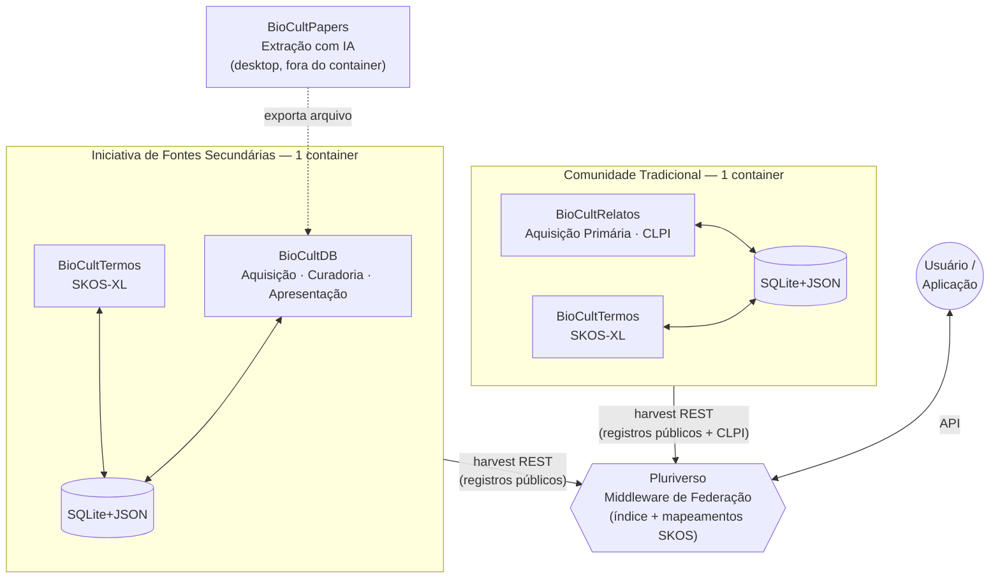

# Arquitetura para um Sistema de Informações sobre Conhecimento Tradicional Associado à Biodiversidade - Versão 3.2

[](https://doi.org/10.5281/zenodo.21396738)
[](CHANGELOG.md)

## Visão Geral

Este repositório contém a proposta de arquitetura para um sistema de informações dedicado a registrar e documentar evidências da relação entre comunidades tradicionais e a biodiversidade, provenientes de múltiplas fontes, com respeito pleno e absoluto aos princípios **C.A.R.E.** (Collective Benefit, Authority to Control, Responsibility, Ethics). A versão 3.0 redefine o sistema como uma **arquitetura explicitamente federada**: cada iniciativa ou comunidade é completamente soberana na gestão de seus próprios dados. O **Pluriverso** atua como middleware de federação, provendo acesso integrado ao conjunto de CTAs das entidades federadas. A versão 3.1 aprofunda essa soberania na camada de persistência: cada unidade federada passa a armazenar seus dados em um único arquivo **SQLite com JSON** (JSON1), compartilhado entre as ferramentas da própria unidade, eliminando a dependência de um servidor de banco de dados centralizado. A versão 3.2 amplia as fontes de evidência suportadas de duas para quatro: além de fontes secundárias (artigos científicos) e primárias (registro de campo), a federação passa a acolher acervos históricos/museológicos e obras de naturalistas dos séculos XVII-XIX.

> "Se os dados não estão fisicamente sob o controle de quem os gerou, a soberania é apenas uma promessa bonita em um termo de consentimento."
>
> — Eduardo Dalcin, em [*Sementes Livres, Solos Próprios: Por que o Conhecimento Tradicional exige uma Arquitetura Federada*](https://eduardo.dalc.in/por-que-o-conhecimento-tradicional-exige-uma-arquitetura-federada/), post que resume e ilustra didaticamente esta proposta de arquitetura federada.

---

## Motivação e Justificativa

### O Problema: Evidências Dispersas e Não Registradas

A relação entre comunidades tradicionais brasileiras e a biodiversidade produziu, ao longo de séculos, um vasto conjunto de evidências: conhecimentos, práticas e usos documentados em artigos científicos, relatados diretamente por seus detentores em campo, preservados em acervos históricos e museológicos, e registrados nas obras de naturalistas que visitaram o Brasil entre os séculos XVII e XIX. Essas evidências existem — mas estão dispersas em bibliotecas, museus, bases de dados isoladas e na memória viva das comunidades, sem uma arquitetura comum que permita registrá-las, relacioná-las e compartilhá-las com o devido respeito à sua origem.

### A Motivação: Registrar e Compartilhar Evidências com Respeito Pleno ao C.A.R.E.

A Arquitetura BioCultural nasce da necessidade de **registrar e documentar evidências da relação entre comunidades tradicionais e a biodiversidade**, provenientes de diferentes fontes. O objetivo é ofertar uma arquitetura que permita registrar e compartilhar essas evidências com respeito **pleno e absoluto** aos princípios **C.A.R.E.** (Collective Benefit, Authority to Control, Responsibility, Ethics) — independentemente de a fonte ser um artigo científico, um relato de campo, um item de acervo museológico ou a obra de um naturalista do século XVIII: se a evidência descreve o conhecimento ou a prática de uma comunidade tradicional, essa comunidade mantém autoridade sobre como ela é registrada, usada e compartilhada.

### Quatro Fontes de Evidência

| Tipo de Fonte | Descrição | Ferramenta(s) |
|---|---|---|
| **Fontes secundárias** | Artigos científicos publicados | [BioCultDB](https://github.com/edalcin/BioCultDB) + [BioCultPapers](https://github.com/edalcin/BioCultPapers) |
| **Fontes primárias** | Relatos registrados diretamente em campo, junto às comunidades (CLPI obrigatório) | [BioCultRelatos](https://github.com/edalcin/BioCultRelatos) |
| **Acervos históricos e museológicos** | Coleções, registros e documentos preservados em museus e arquivos históricos | [BioCultAcervos](https://github.com/edalcin/BioCultAcervos) |
| **Obras de naturalistas** | Relatos e obras de naturalistas em visita ao Brasil nos séculos XVII, XVIII e XIX | [BioCultNaturalistas](https://github.com/edalcin/BioCultNaturalistas) |

Cada fonte exige um processo de aquisição e curadoria diferente — mas todas convergem para o mesmo objetivo: uma evidência registrada, rastreável até sua origem, e compartilhada sob os princípios C.A.R.E.

### Imperativo Legal e Ético

Registrar essas evidências com respeito ao C.A.R.E. não é apenas um princípio — é uma obrigação legal:
- **Lei 13.123/2015** (Lei da Biodiversidade): exige consentimento e repartição de benefícios no acesso e uso de conhecimento tradicional associado
- **Protocolo de Nagoya**: exige rastreabilidade de origem e consentimento no acesso a conhecimento tradicional
- **CDB Art. 8(j)**: exige respeito, preservação e manutenção do conhecimento tradicional com aprovação e participação de seus detentores

### Iniciativas Complementares

Esta arquitetura não é a primeira a buscar sistematizar conhecimento tradicional associado à biodiversidade no Brasil. Iniciativas como o Projeto GEF "Entre-Ciências", a Rede de Conhecimentos sobre Sociobiodiversidade (RCS) e a modernização do SISGEN perseguem objetivos convergentes — ver seção "Iniciativas Governamentais e Institucionais Brasileiras" mais abaixo, ou os resumos completos em [docs/iniciativas/](docs/iniciativas/README.md). A Arquitetura BioCultural não busca substituí-las, e sim oferecer um modelo de arquitetura federada, soberano por design, que qualquer iniciativa pode adotar para registrar e compartilhar suas evidências com respeito ao C.A.R.E.

---

## Objetivos

- **Registrar** evidências da relação entre comunidades tradicionais e a biodiversidade, provenientes de fontes secundárias, primárias, acervos históricos/museológicos e obras de naturalistas
- **Documentar** a proveniência de cada evidência, com rastreabilidade completa até sua fonte original
- **Compartilhar** essas evidências com pesquisadores, comunidades e público geral, com respeito pleno e absoluto aos princípios C.A.R.E.
- **Federar** múltiplas ferramentas e fontes sob uma arquitetura comum, sem centralizar dados nem comprometer a soberania de nenhuma comunidade ou iniciativa

---

## Arquitetura do Sistema — Versão 3.2 (Federada)

A versão 3.2 organiza o sistema como uma **federação de entidades soberanas**, conectadas pelo **Pluriverso**, acolhendo quatro tipos de fonte de evidência. Cada membro da federação mantém sua própria infraestrutura de dados — um único arquivo SQLite compartilhado entre suas ferramentas — e vocabulários. O Pluriverso coleta periodicamente os registros públicos de cada membro e os disponibiliza via API unificada.



### Princípios da Federação

- **Soberania total**: cada unidade controla seu próprio SQLite (arquivo), compartilhado entre suas ferramentas, e define o que é público
- **Harvest periódico**: Pluriverso coleta registros `visibility: public` via endpoint REST de cada membro — dado nunca é acessado sem publicação explícita
- **Harmonização semântica**: Pluriverso mantém mapeamentos SKOS-XL (`skos:exactMatch`, `skos:closeMatch`) entre os vocabulários de diferentes membros
- **Saída reversível**: membro que deixa a federação tem seus dados removidos imediatamente do índice central (purge by member)
- **Governança comunitária**: comitê com representantes de cada membro toma decisões sobre admissão, contrato de publicação e mapeamentos

### Tipos de Membros da Federação

| Tipo | Componentes | Fonte de Dados |
|------|-------------|----------------|
| Iniciativa de Fontes Secundárias | BioCultDB + BioCultPapers + BioCultTermos + SQLite+JSON (um por unidade, 1 container) | Literatura científica (artigos, PDFs) |
| Comunidade Tradicional | BioCultRelatos + BioCultTermos + SQLite+JSON (um por unidade, 1 container) | Registro primário direto (CLPI obrigatório) |
| Acervos Históricos e Museológicos | BioCultAcervos + BioCultTermos + SQLite+JSON (um por unidade, 1 container) | Coleções, registros e documentos de acervos e museus |
| Obras de Naturalistas (séc. XVII–XIX) | BioCultNaturalistas + BioCultTermos + SQLite+JSON (um por unidade, 1 container) | Relatos e obras de naturalistas em visita ao Brasil |

**Legenda:**
- Cada membro opera de forma completamente independente
- Membro expõe endpoint REST paginado para harvest pelo Pluriverso
- Linha `harvest REST` representa coleta periódica (não tempo real)

## Projetos Implementados

Esta arquitetura possui implementações concretas que materializam os conceitos propostos:

### BioCultDB - Banco de Dados de Conhecimento Tradicional de Fontes Secundárias

[](https://github.com/edalcin/BioCultDB)

Interface web para gerenciamento de conhecimento tradicional secundário extraído de artigos científicos. Implementa os três contextos arquiteturais principais:

**Características:**

- **Três Interfaces Especializadas:**
  - **Aquisição** (porta 3001): Entrada de dados por pesquisadores
  - **Curadoria** (porta 3002): Validação e aprovação de registros
  - **Apresentação** (porta 3003): Consulta pública com busca avançada
- **Stack Tecnológico:** Node.js, Express, SQLite (JSON, better-sqlite3), HTMX, Alpine.js, Tailwind CSS
- **Estrutura de Dados:** Hierárquica (Referência → Comunidade → Planta → Uso)
- **Workflow C.A.R.E.:** Implementação de status (pendente/aprovado/rejeitado)
- **29 Classificações de Comunidades:** Conforme [Decreto nº 8.750, de 9 de maio 2016](https://www.planalto.gov.br/ccivil_03/_Ato2015-2018/2016/Decreto/D8750.htm)

#### etnoChat - Interface Conversacional com IA

Componente da camada de Apresentação que permite interação com o banco de dados através de linguagem natural.

**Funcionalidades:**
- Formulação de perguntas em linguagem natural sobre comunidades e plantas
- Sugestões automáticas de buscas e relacionamentos entre dados
- Explicações contextualizadas sobre registros etnobotânicos
- Integração com MCP (Model Context Protocol) para comunicação com modelos de IA

**Acesso:** Rota `/etnochat` na porta 3003

#### Painel Analítico - Dashboard Interativo

Componente da camada de Apresentação para exploração e análise visual dos dados etnobotânicos.

**Funcionalidades:**
- **Cartões Resumidos:** Total de comunidades, referências aprovadas, plantas únicas e autores
- **Visualizações Geográficas:** Mapas de calor com distribuição por estado
- **Gráficos Interativos:**
  - Evolução temporal de publicações (gráfico de área)
  - Top 10 plantas mais citadas (gráfico de barras)
- **Tabelas Analíticas:**
  - Autores mais produtivos
  - Comunidades com maior diversidade botânica
  - Referências mais abrangentes
- **Filtros Avançados:** Estado, tipo de comunidade e período de publicação

**Stack:** Google Charts, HTMX, Alpine.js, Tailwind CSS

**Acesso:** Rota `/painel` na porta 3003

### BioCultPapers - Extração Automatizada com IA

[](https://github.com/edalcin/BioCultPapers)

Aplicativo desktop Windows para extração automatizada de metadados de artigos científicos em PDF usando inteligência artificial.

**Características:**

- **Plataforma:** Windows (.NET 8, WPF, MVVM)
- **Extração com IA:**
  - Google Gemini (15 req/min, gratuito)
  - OpenAI GPT
  - Anthropic Claude
- **Integração Nativa:** Persistência local SQLite+JSON; entrega ao BioCultDB por exportação de arquivo
- **Dados Extraídos:**
  - Obrigatórios: Título, autores, ano, abstract
  - Opcionais: Espécies (nomes vernaculares e científicos), usos, comunidades, localização

### BioCultTermos - Plataforma de Gestão Terminológica

[](https://github.com/edalcin/BioCultTermos)

Plataforma digital para preservação e organização do conhecimento etnobotânico através de um sistema estruturado de glossários, vocabulários controlados e tesauros, seguindo o padrão **[SKOS-XL](https://www.w3.org/TR/skos-reference/skos-xl.html)** (W3C Simple Knowledge Organization System eXtension for Labels). É o **módulo de vocabulário controlado da federação**, embutido via **git submodule** em cada unidade federada (BioCultDB, BioCultRelatos, BioCultAcervos, BioCultNaturalistas) — não é exclusivo de nenhuma delas. O repositório standalone está congelado como produto: toda evolução de código ocorre a partir das unidades hospedeiras (ver [ADR-007](docs/architecture-decisions/ADR-007-shared-bioculttermos-module.md)).

**Propósito:**

Documentar termos e conhecimentos de comunidades tradicionais brasileiras sobre plantas e animais, garantindo reconhecimento cultural, padronização terminológica e justiça na distribuição de benefícios. O padrão SKOS-XL viabiliza interoperabilidade com padrões de dados abertos (Linked Data, RDF) e integração com iniciativas como GBIF, SiBBr e Wikidata.

**Características:**

- **Gestão de Conceitos (SKOS-XL):**
  - Criação com identificadores únicos (URIs) e suporte multilíngue
  - Rótulos preferenciais e alternativos (`skosxl:prefLabel` / `skosxl:altLabel`)
  - Relações hierárquicas (`skos:broader` / `skos:narrower`)
  - Relações associativas (`skos:related`)
  - Desambiguação de termos idênticos
  - Polihierarquia (múltiplos conceitos mais amplos)

- **Sistema de Notas (SKOS):**
  - Notas de escopo (`skos:scopeNote`) e definições (`skos:definition`)
  - Notas históricas (`skos:historyNote`) e editoriais (`skos:editorialNote`)
  - Exemplos de uso (`skos:example`)

- **Gestão de Fontes:**
  - Rastreabilidade de origens (bibliográficas, conhecimento tradicional)
  - Conformidade com princípios CARE para governança de dados indígenas

- **Recursos Técnicos:**
  - **Exportação:** SKOS-XL/RDF, JSON-LD, Dublin Core, CSV
  - **APIs:** REST para integração com a ferramenta principal de cada unidade hospedeira e sistemas externos
  - **Containerização:** Docker com GitHub Actions

**Integração na Arquitetura:**

O BioCultTermos funciona como **infraestrutura terminológica** embutida via git submodule em cada uma das quatro unidades federadas — um único repositório de código, consumido de forma independente por cada unidade, que mantém soberania total sobre seus próprios dados (arquivo SQLite/`ConceptScheme` nunca compartilhado entre unidades). Detalhes do mecanismo de distribuição e propagação de código entre unidades em [ADR-007](docs/architecture-decisions/ADR-007-shared-bioculttermos-module.md).

Nos três contextos de cada ferramenta principal:

1. **Aquisição:** Fornece vocabulários controlados (SKOS-XL) para padronização na entrada de dados, autocomplete de termos validados
2. **Curadoria:** Oferece base para validação semântica, normalização de nomenclatura vernacular e desambiguação de termos
3. **Apresentação:** Permite navegação por tesauros estruturados e busca expandida por sinônimos e termos relacionados

**Status por unidade hospedeira:** BioCultDB — implementado, em produção; BioCultRelatos, BioCultAcervos, BioCultNaturalistas — padrão definido e documentado (`docs/decisions/ADR-001-integracao-bioculttermos.md` + `integracao.md` de cada repositório), implementação pendente.

### BioCultRelatos - Plataforma de Registros de Conhecimento Tradicional Primário

[](https://github.com/edalcin/BioCultRelatos)

Plataforma para aquisição, registro e gestão de dados de conhecimento tradicional associado à biodiversidade provenientes de **fontes primárias** — registrado diretamente junto às comunidades tradicionais. Complementa o **BioCultDB**, que é dedicado a fontes secundárias (artigos científicos, livros).

**Diferença fundamental em relação ao BioCultDB:**

| | BioCultDB | BioCultRelatos |
|---|---|---|
| **Fonte** | Secundária (artigos, livros) | Primária (comunidades, campo) |
| **Origem dos dados** | Literatura científica | Registro direto com detentores |
| **Consentimento** | Não aplicável | CLPI obrigatório |
| **Curadoria** | Validação bibliográfica | Validação comunitária |

**Propósito:**

Registrar diretamente o conhecimento tradicional sobre biodiversidade das comunidades tradicionais brasileiras, com todos os protocolos éticos e legais requeridos (Consentimento Livre, Prévio e Informado — CLPI, conforme Lei 13.123/2015). Este projeto está em fase inicial de desenvolvimento.

**Integração na Arquitetura:**

Na arquitetura federada, o BioCultRelatos é o componente central de uma **Comunidade Tradicional** membro da federação. Cada comunidade opera sua própria instância do BioCultRelatos com seu próprio SQLite soberano (compartilhado com o BioCultTermos da comunidade). O BioCultTermos da comunidade fornece suporte terminológico local. Os dados marcados como `visibility: public` (após CLPI) são coletados periodicamente pelo Pluriverso via endpoint REST.

### BioCultAcervos - Registro de Evidências em Acervos Históricos e Museológicos

[](https://github.com/edalcin/BioCultAcervos)

Plataforma dedicada ao registro de evidências da relação entre comunidades tradicionais e a biodiversidade preservadas em **acervos históricos e museológicos** — coleções, registros e documentos que atestam essa relação ao longo do tempo, complementando as fontes secundárias (artigos) e primárias (campo).

**Propósito:**

Sistematizar e tornar rastreável o conhecimento tradicional associado à biodiversidade documentado em acervos de museus, arquivos e coleções históricas, com o mesmo rigor de proveniência e respeito aos princípios C.A.R.E. aplicado às demais fontes da arquitetura.

**Integração na Arquitetura:**

Na arquitetura federada, o BioCultAcervos é o componente central de um novo tipo de membro — **Acervos Históricos e Museológicos** — seguindo o mesmo padrão dos demais membros: container próprio, arquivo SQLite+JSON compartilhado com uma instância soberana do BioCultTermos, e endpoint de harvest REST para o Pluriverso. **Projeto em fase inicial (apenas repositório e documentação).**

### BioCultNaturalistas - Registro de Evidências em Obras de Naturalistas (séc. XVII-XIX)

[](https://github.com/edalcin/BioCultNaturalistas)

Plataforma dedicada ao registro de evidências da relação entre comunidades tradicionais e a biodiversidade presentes em **obras e relatórios de naturalistas** que visitaram o Brasil nos séculos XVII, XVIII e XIX — uma fonte histórica rica e ainda pouco sistematizada sobre o conhecimento tradicional da época.

**Propósito:**

Extrair e sistematizar evidências de conhecimento tradicional associado à biodiversidade registradas em obras históricas de naturalistas, preservando a rastreabilidade até a obra original e respeitando os princípios C.A.R.E. na forma como esse conhecimento histórico é atribuído e compartilhado.

**Integração na Arquitetura:**

Na arquitetura federada, o BioCultNaturalistas é o componente central do tipo de membro **Obras de Naturalistas**, seguindo o mesmo padrão dos demais membros: container próprio, arquivo SQLite+JSON compartilhado com uma instância soberana do BioCultTermos, e endpoint de harvest REST para o Pluriverso. **Projeto em fase inicial (apenas repositório e documentação).**

### Pluriverso - Middleware de Federação

[](https://github.com/edalcin/pluriverso)

Middleware que conecta todos os membros da federação — sem gerenciar seus dados. Implementa o harvest periódico via REST, mantém o índice central dos registros públicos e a camada de mapeamento semântico SKOS-XL entre os vocabulários de diferentes membros, expondo uma API pública unificada para pesquisadores e aplicações.

**Responsabilidades:**

- **Harvest periódico**: coleta registros `visibility: public` de cada membro via endpoint REST paginado
- **Índice central**: cópia derivada dos dados públicos (SQLite+JSON + FTS5), nunca a fonte de verdade
- **Mapeamento semântico**: `skos:exactMatch`/`skos:closeMatch`/`skos:broadMatch` entre `ConceptScheme`s de membros diferentes
- **API pública unificada**: busca textual e semântica, filtros por membro/fonte/comunidade/espécie/região, atribuição de origem (`member_id`)
- **Governança**: suporta o Comitê Federado nas decisões sobre admissão, contrato de publicação e mapeamentos

**Integração na Arquitetura:**

Na arquitetura federada, o Pluriverso é o único componente com visão de todos os membros — mas nunca acessa dados além do que cada membro publica explicitamente. **Projeto em fase inicial (ainda sem implementação de código).**

### Integração Federada entre Projetos



O fluxo federado funciona assim:

1. **BioCultPapers** processa PDFs e extrai metadados usando IA, exportando arquivo importado pelo BioCultDB da Iniciativa #1
2. **BioCultDB** (Aquisição/Curadoria/Apresentação) gerencia dados secundários; publica registros aprovados no endpoint de harvest
3. **BioCultRelatos** registra conhecimento primário diretamente de comunidades (CLPI obrigatório); publica registros consentidos no endpoint de harvest
4. **BioCultTermos** (instância por membro) fornece vocabulários SKOS-XL soberanos; Pluriverso mantém mapeamentos entre instâncias
5. **Pluriverso** coleta periodicamente via REST, indexa registros públicos e disponibiliza via API unificada
6. Usuário acessa o conjunto federado de CTAs pelo Pluriverso sem interagir diretamente com cada membro

> Acervos históricos/museológicos (BioCultAcervos) e obras de naturalistas (BioCultNaturalistas) seguirão o mesmo padrão de publicação e harvest, uma vez implementados — ver "Projetos Implementados" acima.

---

## Metodologia e Tecnologias

A documentação arquitetural segue o **[C4 Model](https://c4model.com/)** (Context, Container, Component, Code), e a camada de persistência adota bancos orientados a documentos (SQLite+JSON). Detalhes completos — níveis do C4 Model, contextos de Aquisição/Curadoria/Apresentação, comparação de abordagens de banco de dados e integrações externas potenciais — estão em **[docs/metodologia-e-tecnologias.md](docs/metodologia-e-tecnologias.md)**.

## Princípios Orientadores

### C.A.R.E. Principles

- **Collective Benefit**: Os dados devem beneficiar as comunidades que os originaram
- **Authority to Control**: Comunidades mantêm autoridade sobre seus conhecimentos
- **Responsibility**: Responsabilidade ética no manejo dos dados
- **Ethics**: Respeito às práticas éticas e culturais

### Legislação

O sistema respeita:
- Lei da Biodiversidade (Lei 13.123/2015)
- Protocolo de Nagoya
- Legislações locais sobre conhecimento tradicional

## Estrutura da Documentação

Este repositório está organizado da seguinte forma:

```
Arquitetura-BioCultural/
├── README.md (este arquivo)
├── docs/
│   ├── metodologia-e-tecnologias.md
│   ├── c4-model/
│   │   ├── 01-context-diagram.md
│   │   ├── 02-container-diagram.md
│   │   └── 03-component-diagram.md
│   ├── architecture-decisions/
│   │   ├── ADR-001-database-selection.md
│   │   ├── ADR-002-api-standards.md
│   │   └── ADR-003-data-model.md
│   └── diagrams/
│       ├── data-flow.md
│       └── integration-patterns.md
```

### Navegação da Documentação

1. **[Diagrama de Contexto](docs/c4-model/01-context-diagram.md)** - Visão de alto nível do sistema e seus usuários
2. **[Diagrama de Containers](docs/c4-model/02-container-diagram.md)** - Componentes principais e suas tecnologias
3. **[Diagrama de Componentes](docs/c4-model/03-component-diagram.md)** - Detalhamento interno de cada contexto
4. **[Decisões Arquiteturais](docs/architecture-decisions/)** - ADRs documentando escolhas técnicas
5. **[Metodologia e Tecnologias](docs/metodologia-e-tecnologias.md)** - C4 Model, contextos de Aquisição/Curadoria/Apresentação e tecnologias avaliadas


---

## Integração com Referências e Iniciativas

### Arquitetura Inspirada em NIKMAS

A proposta de arquitetura incorpora lições aprendidas do projeto **NIKMAS (National Indigenous Knowledge Management System)** da África do Sul, especialmente:

- **Modelo de Dados Dual**: Preservação simultânea de artefatos originais (gravações audiovisuais, fotos) e estruturas de metadados formais para proteção legal
- **Arquitetura Distribuída**: Nó central com Pontos de Presença (PoPs) regionais para captura descentralizada e sincronização seletiva respeitando confidencialidade
- **Segurança Multi-Camadas**: Controle de acesso baseado em políticas (XACML) para proteção de conhecimento sensível
- **Catálogo de Detentores**: Base de dados de indivíduos e comunidades detentores de conhecimento com rastreamento de proveniência
- **Curadoria Estruturada**: Interface dedicada para especialistas validarem e anotarem dados

### Acesso via Comunicações Móveis

Reconhecendo que muitas comunidades tradicionais em áreas remotas têm acesso móvel limitado mas penetrante, a arquitetura prevê:

- **Aplicações Mobile Offline-First**: Captura de dados sem necessidade de conexão permanente
- **Integração SMS/USSD**: Acesso a informações via mensagens de texto para regiões com infraestrutura móvel limitada
- **WhatsApp Integration**: Suporte a plataforma popular para comunicação e consultas
- **Apps Comunitárias**: Desenvolvimento de aplicativos customizados para diferentes contextos culturais

Esta abordagem segue exemplos bem-sucedidos como **CyberTracker** e **MAPEO**, que demonstram o potencial de tecnologias móveis para empoderamento comunitário em monitoramento participativo.

### Validação e Certificação de Dados

O sistema implementa um **workflow robusto de validação** em múltiplas etapas:

1. **Validação Estrutural**: Verificação automática de conformidade com padrões de dados 
2. **Validação Taxonômica**: Integração com bases brasileiras (Flora e Funga para flora/fungos, Fauna para fauna) com fallback para GBIF API quando não encontrado nas bases brasileiras
3. **Validação Semântica**: Integração com vocabulários existentes
4. **Curadoria Especializada**: Revisão por especialistas de domínio (botânicos, etnobólogos, farmacêuticos tradicionais)
5. **Validação Comunitária**: Participação de detentores de conhecimento na certificação de dados antes de publicação
6. **Rastreabilidade Completa**: Logs de auditoria de todas as mudanças e validações

### Aquisição de Dados Primários

Para coleta ética e consentida de dados diretamente das comunidades:

- **Processo CLPI (Consentimento Livre, Prévio e Informado)**: Implementação de protocolo completo baseado em Lei 13.123/2015
- **Registro Comunitário**: Interface para comunidades registrarem autonomamente seu próprio conhecimento
- **Acordos Eletrônicos**: Armazenamento e rastreamento de acordos de compartilhamento de benefícios
- **Documentação Audiovisual**: Suporte a preservação de conhecimento em múltiplas formas (áudio, vídeo, foto, texto)

### Integração com Plataforma de Territórios Tradicionais do MPF

A arquitetura está projetada para **integração bidirecional** com a [Plataforma de Territórios Tradicionais](https://territoriostradicionais.mpf.mp.br/) do Ministério Público Federal:

- **Sincronização de Polígonos Territoriais**: Importação automática de limites geográficos de territórios indígenas e tradicionais
- **Cruzamento Espacial**: Associação de registros de conhecimento com territórios de origem
- **Rastreabilidade Geográfica**: Visualização interativa de onde conhecimentos são praticados
- **Dados Públicos do MPF**: Acesso a informações sobre status de demarcação, conflitos e historicamente de ocupação
- **API de Integração**: Endpoints REST para consulta e sincronização de dados territoriais

Esta integração fortalece:
- Rastreabilidade de conhecimento até sua origem territorial
- Suporte a processos de demarcação e regularização
- Monitoramento de ameaças a territórios que guardam conhecimento tradicional
- Conformidade com Lei 13.123/2015 sobre proveniência geográfica

### Padrões de Dados Abertos

A arquitetura adota e contribui para padrões de dados abertos reconhecidos:

- **Darwin Core**: Para ocorrências de espécies e dados de biodiversidade
- **Dublin Core Estendido**: Para metadados ricos e flexíveis
- **SocioBio Standard**: Padrão específico para dados de sociobiodiversidade brasileira (ver [projeto SocioBio no GitHub](https://github.com/sibbr/sociobio))

### Interoperabilidade com Sistemas Nacionais

Integração planejada com principais sistemas brasileiros:

- **SiBBr** (Sistema de Informação sobre Biodiversidade Brasileira): Nó brasileiro do GBIF
- **SisGen** (Sistema Nacional de Gestão do Patrimônio Genético): Rastreamento de acesso e repartição de benefícios
- **CNPq**: Integração com dados de pesquisadores e grupos de pesquisa
- **GBIF Global**: Contribuição de dados brasileiros para rede global de biodiversidade

---

## Iniciativas Relacionadas e Complementares

Esta arquitetura integra projetos implementados e dialoga com iniciativas em desenvolvimento:

### Projetos da Arquitetura (Implementados)
- **[BioCultDB](https://github.com/edalcin/BioCultDB)** - Interface web com três contextos (Aquisição, Curadoria, Apresentação) para conhecimento tradicional de fontes secundárias; membro de referência da federação
- **[BioCultPapers](https://github.com/edalcin/BioCultPapers)** - Aplicativo desktop com extração automatizada de metadados via IA (Gemini, GPT-4, Claude); componente exclusivo de iniciativas de fontes secundárias
- **[BioCultTermos](https://github.com/edalcin/BioCultTermos)** - Infraestrutura terminológica SKOS-XL; cada membro da federação opera sua própria instância soberana

### Projetos em Desenvolvimento
- **[BioCultRelatos](https://github.com/edalcin/BioCultRelatos)** - Plataforma para aquisição de dados primários (CLPI) diretamente de comunidades tradicionais; componente central de cada comunidade membro
- **[BioCultAcervos](https://github.com/edalcin/BioCultAcervos)** - Registro de evidências de conhecimento tradicional preservadas em acervos históricos e museológicos; novo tipo de membro da federação
- **[BioCultNaturalistas](https://github.com/edalcin/BioCultNaturalistas)** - Registro de evidências de conhecimento tradicional em obras de naturalistas em visita ao Brasil (séc. XVII-XIX); novo tipo de membro da federação
- **[Pluriverso](https://github.com/edalcin/pluriverso)** - Middleware de federação; harvest periódico, índice central, mapeamentos semânticos SKOS e API pública unificada

### Iniciativas Governamentais e Institucionais Brasileiras (Complementares)

O Brasil possui outras iniciativas de peso dedicadas à sistematização de conhecimento tradicional associado à biodiversidade — não concorrentes, e sim parte do mesmo esforço nacional:
- **[Projeto GEF "Entre-Ciências"](https://www.thegef.org/projects-operations/projects/11269)** (2025-2029, MCTI) — fortalecimento de PIPCTAFs para gestão de dados de sociobiodiversidade via SiBBr
- **Rede de Conhecimentos sobre Sociobiodiversidade (RCS)** (ICMBio/CNPT + UFSC) — integração de bases dispersas com protocolos comunitários e CLPI
- **Modernização do SISGEN** (RNP-MMA-BID) — interoperabilidade do patrimônio genético e CTA via IPT, com padrões FAIR e CARE

Resumos completos de cada iniciativa em [docs/iniciativas/](docs/iniciativas/README.md). A Arquitetura BioCultural não busca substituir essas iniciativas, e sim oferecer um modelo de arquitetura federada, soberano por design, que pode inspirar ou ser adotado por qualquer uma delas.

### Dados da Sociobiodiversidade
- **[Useflora](https://github.com/nperoni/Useflora)** - Banco de dados etnobotânicos com registro comunitário onde comunidades definem níveis de acesso

### Padrões de Dados
- **[SocioBio](https://github.com/sibbr/sociobio)** - Padrão de dados para sociobiodiversidade brasileira, desenvolvido pelo SiBBr
- **[CESP SiBBr 2024](https://github.com/sibbr/cesp-sibbr-2024)** - Iniciativa de ciência aberta e interoperabilidade do Sistema de Informação sobre Biodiversidade Brasileira

### Vocabulários e Terminologia
- **[EtnoVocab](https://github.com/edalcin/etnovocab)** - Vocabulário controlado para termos etnobotânicos e etnobiológicos
- **[EtnoVector](https://github.com/edalcin/etnovector)** - Vetorização e representação semântica de conceitos etnobotânicos

### Estruturas de Dados e Documentação
- **[Estrutura de Dados Etnobotânicos](https://github.com/edalcin/Estrutura-de-Dados-Etnobotanicos)** - Modelos e esquemas para armazenamento de informações etnobotânicas

Estes projetos complementares fornecem:
- Implementações concretas da arquitetura (BioCultDB e BioCultPapers)
- Padrões de dados interoperáveis
- Vocabulários controlados para melhorar a qualidade dos dados
- Exemplos práticos de implementação
- Recursos para curadoria e validação de informações etnobotânicas

---

## Referências

Para a lista completa de referências bibliográficas organizadas segundo a norma **ABNT NBR 6023:2018** (padrão brasileiro), consulte [Referencias.md](Referencias.md).

Essa documentação incorpora referências a:
- Legislação brasileira e internacional relevante (Lei 13.123/2015, Protocolo de Nagoia, Convenção 169 OIT)
- Padrões de dados abertos (Darwin Core, Plinian Core, Dublin Core, SocioBio)
- Arquitetura de sistemas (NIKMAS, Fedora, OAIS)
- Governança de dados (FAIR, CARE)
- Tecnologias móveis (CyberTracker, MAPEO)
- Etnobiologia e conhecimento tradicional
- Iniciativas brasileiras práticas (GEF Entre-Ciências, SISGEN, Useflor@, RCS)
- Data sovereignty e consentimento livre, prévio e informado (CLPI)

---

## Histórico de Versões

Para acompanhar a evolução completa desta arquitetura, consulte o [CHANGELOG.md](CHANGELOG.md) que documenta todas as versões e mudanças significativas desde a versão 1.0.0 inicial até a versão 3.2.0 (quatro fontes de evidência, com persistência SQLite+JSON por unidade).

---

## Citação

Se você usar esta proposta de arquitetura em seu trabalho, por favor cite como:

**APA:**
```
Dalcin, E. (2026). Arquitetura para um Sistema de Informações sobre Conhecimento Tradicional Associado à Biodiversidade - Versão 3.2 (Version v3.2) [Software documentation]. Zenodo. https://doi.org/10.5281/zenodo.21396738
```

**BibTeX:**
```bibtex
@software{dalcin2026,
  author = {Dalcin, Eduardo},
  title = {Arquitetura para um Sistema de Informações sobre Conhecimento Tradicional Associado à Biodiversidade - Versão 3.2},
  version = {v3.2},
  year = {2026},
  publisher = {Zenodo},
  doi = {10.5281/zenodo.21396738},
  url = {https://doi.org/10.5281/zenodo.21396738}
}
```

**DOI:** [10.5281/zenodo.21396738](https://doi.org/10.5281/zenodo.21396738)

---

## Contribuindo

Este é um projeto em fase de proposta. Contribuições e sugestões são bem-vindas através de issues e pull requests.

## Licença

A definir - considerando licenças que respeitem os princípios C.A.R.E. e protejam adequadamente o conhecimento tradicional.

## Contato

Para mais informações sobre este projeto, entre em contato através das issues deste repositório.

---

## Agradecimentos

A formulação desta proposta técnica e a consolidação de sua visão ética e conceitual não seriam possíveis sem os diálogos, provocações e insights preciosos de parceiros fundamentais. Registro meu profundo agradecimento à Viviane Fonseca, do Jardim Botânico do Rio de Janeiro (JBRJ); ao Lucas Zelesco, da Fundação Nacional dos Povos Indígenas (FUNAI); e aos membros do Comitê Gestor Useflora, cuja dedicação à salvaguarda da sociobiodiversidade e ao respeito às comunidades tradicionais inspirou cada linha de código e de arquitetura deste projeto.
