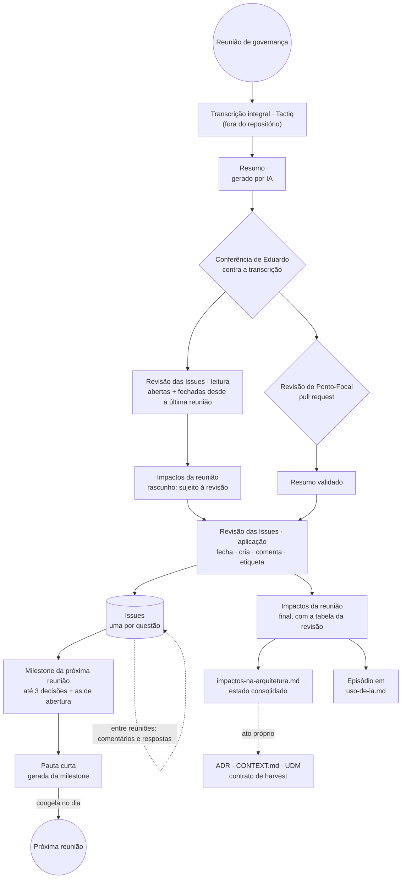

# Governança da arquitetura — reuniões, questões, pautas, resumos e impactos

Esta pasta guarda o registro das **reuniões de governança da arquitetura**: a forma em que a camada
de arquitetura opera enquanto o Comitê Federado não existe (`docs/tecnico/CONTEXT.md`). Hoje participam Eduardo
(gestão da arquitetura) e Sofia Zank (Ponto-Focal do UseFlora); a entrada de outras pessoas, por
iniciativa parceira ou por tipo de fonte, é a questão
[#11](https://github.com/edalcin/Arquitetura-BioCultural/issues/11). O ciclo destas reuniões é
procedimento de pesquisa ([`projetoPesquisa.md`](../../Pesquisa/projetoPesquisa.md) §7.2, itens 7 a 9). As
demais reuniões (apresentação, comitê, articulação) têm só resumo.

**Onde ficam os arquivos:** pautas, resumos e impactos de cada reunião estão na subpasta
[`Reunioes/`](Reunioes/). Nesta pasta ficam este ciclo, o [método de evolução](metodo-de-evolucao.md)
e os documentos da nova fase da arquitetura. Os pedidos à IA de cada momento do ciclo estão no
[roteiro de prompts](roteiro-de-prompts.md).

Desde 03/10/2026 o ciclo segue o Cenário B de
[`novaFaseArquitetura-analise.md`](novaFaseArquitetura-analise.md): **cada questão aberta é uma
*Issue* do GitHub**. Histórico das mudanças de método: [`metodo-de-evolucao.md`](metodo-de-evolucao.md) §5.

## Um lugar para cada coisa

| O quê | Onde | Como muda |
|---|---|---|
| **Questão** — tudo o que espera resposta de uma pessoa: decisão, informe, pergunta às comunidades, ato de gestão | Uma *Issue* por questão, com número fixo ([lista](https://github.com/edalcin/Arquitetura-BioCultural/issues)) | Viva: comentários, etiquetas, fechamento |
| Questões candidatas à próxima reunião | *Milestone* "Próxima reunião" (ou "Reunião AAAA-MM-DD", quando houver data) | Viva |
| Painel das questões de desenho, com as decisões já tomadas | *Issue* fixada [#6](https://github.com/edalcin/Arquitetura-BioCultural/issues/6) (mapa) | Viva |
| **Pauta** | `Reunioes/proxima-pauta-reuniao-<fórum>.md` → `Reunioes/AAAA-MM-DD-pauta-reuniao-<fórum>.md` | Gerada da *milestone*; congela no dia da reunião |
| **Resumo** | `Reunioes/AAAA-MM-DD-reuniao-<fórum>.md` | Escrito uma vez; o Ponto-Focal corrige por *pull request* |
| **Impactos da reunião**, com a **Revisão das Issues** | `Reunioes/AAAA-MM-DD-impactos-reuniao-<fórum>.md` | Escrito uma vez |
| O que muda na arquitetura (itens `I-xx`) | [`impactos-na-arquitetura.md`](../../tecnico/impactos-na-arquitetura.md), estado consolidado | Vivo |
| Episódio de uso de IA da reunião | [`uso-de-ia.md`](../../Pesquisa/IA/uso-de-ia.md) | Uma entrada por reunião |
| Pedidos feitos à IA, literais | [`registro-de-prompts.md`](../../Pesquisa/IA/registro-de-prompts.md) | Só acréscimo |

`<fórum>` é `sofia` até a decisão sobre a composição da governança (#11, #12); a troca para
`governanca` será feita de uma vez, num *commit* só.

**Questão e item de impacto são coisas diferentes, e as duas ficam.** A *Issue* é **a pergunta a uma
pessoa**, escrita para quem conhece o conhecimento tradicional e não é da área de sistemas. O item
`I-xx` é **o que muda na arquitetura**, escrito para a equipe técnica e para a IA. Uma *Issue* pode
alimentar vários itens; um item pode esperar várias *Issues*. O campo "Liga-se a" da *Issue* e o
campo "Questão aberta" do item ligam um ao outro.

## O ciclo: do registro da reunião aos documentos



**A regra que o diagrama mostra: primeiro validar, depois derivar.** Nada que o Ponto-Focal lê — as
*Issues* e a pauta — muda antes de o resumo estar validado por ele. Só o rascunho dos impactos, que é
técnico, pode nascer antes, marcado "sujeito à revisão do Ponto-Focal".

Os passos, cada um com o que o encerra. O pedido à IA de cada passo está no
[roteiro de prompts](roteiro-de-prompts.md), entre colchetes:

1. **Reunião e transcrição.** O Tactiq transcreve tudo, com anuência dos participantes. A
   transcrição não entra no repositório. *Encerra:* arquivo de transcrição salvo fora do repositório.
2. **Resumo** [C1]. A IA gera o resumo a partir da transcrição e da pauta congelada. *Encerra:* resumo no
   repositório, com "Revisão: pendente" no cabeçalho.
3. **Conferência de Eduardo.** O resumo é conferido contra a transcrição. *Encerra:* toda decisão
   conferida; toda leitura incerta registrada nas "Notas de leitura da transcrição".
4. **Revisão das Issues — leitura** (seção abaixo) [C2]. *Encerra:* tabela de ações propostas, uma linha
   por *Issue* revista.
5. **Impactos da reunião, rascunho** [C2]. Confronta cada decisão com os documentos de arquitetura e traz
   a tabela da revisão. Marcado "sujeito à revisão do Ponto-Focal". *Encerra:* documento no
   repositório com a marca.
6. **Revisão do Ponto-Focal**, por *pull request* ([guia do GitHub](../../../ComecePorAqui/guia-github.md)).
   Sem prazo fixo; se passar uma semana, Eduardo pergunta. *Encerra:* *pull request* incorporado, ou
   o Ponto-Focal diz que não há correção.
7. **Revisão das Issues — aplicação** [C3]. Refaz a leitura com o resumo validado (as correções do
   Ponto-Focal podem mudar a ação) e executa: fecha, cria, comenta, troca etiquetas e *milestone*,
   atualiza "Decisões até agora" no mapa (#6). *Encerra:* toda linha da tabela com a ação feita.
8. **Impactos finais e estado consolidado** [C3]. Tira a marca de rascunho, ajusta às correções do
   Ponto-Focal e atualiza [`impactos-na-arquitetura.md`](../../tecnico/impactos-na-arquitetura.md). *Encerra:* todo
   item revisto com *Situação*, *Questão aberta* e *Histórico* atualizados.
9. **Milestone da próxima reunião** [P1]. Eduardo escolhe **no máximo três decisões**, pelo critério "o
   que destrava mais", **mais as decisões de abertura** e os informes. *Decisão de abertura* é uma
   decisão sobre o funcionamento da própria governança (anuência, licença, forma de trabalhar), de
   resposta curta, tratada nos 5 minutos da Abertura sem a estrutura em quatro partes. O Ponto-Focal
   pode trocar uma questão por outra, comentando na *Issue*. *Encerra:* *milestone* montada, 5 a 7
   dias antes da reunião.
10. **Pauta** [P2]. A IA gera a pauta a partir da *milestone*, logo depois de uma Revisão das Issues —
    leitura feita no mesmo dia (o estado pode ter mudado entre reuniões). Se uma questão muda, a pauta
    é gerada de novo. *Encerra:* pauta no repositório, com até 1.000 palavras.
11. **Episódio** [C3]. Entrada da reunião em [`uso-de-ia.md`](../../Pesquisa/IA/uso-de-ia.md), com as *Issues*
    criadas, fechadas e comentadas pela IA. *Encerra:* os campos obrigatórios preenchidos.
12. **No dia da reunião** [P3]. A pauta congela: `git mv` para o nome com a data. A *milestone* passa a
    se chamar "Reunião AAAA-MM-DD", com a data como prazo. *Encerra:* pauta renomeada e *milestone*
    datada.

Em toda sessão, o pedido feito à IA é registrado literalmente em
[`registro-de-prompts.md`](../../Pesquisa/IA/registro-de-prompts.md), antes do trabalho.

## Revisão das Issues — obrigatória

Faz parte de toda geração de impactos e de toda geração de pauta (passos 4, 7 e 10). Cobre **todas
as *Issues* abertas** e **todas as fechadas desde a última reunião**, uma por uma, lendo os
comentários.

```bash
gh issue list --state open --limit 300 --json number,title,labels,milestone,updatedAt
gh issue list --state closed --search "closed:>=AAAA-MM-DD" --json number,title,stateReason
gh issue view <N> --comments
```

Para cada *Issue*, cinco perguntas:

1. **A reunião, ou um comentário, respondeu?** Fecha com o comentário de formato fixo
([`issue-tracker.md`](../../tecnico/agents/issue-tracker.md)), citando a decisão do resumo ou o
   comentário. Resposta dada na própria *Issue* entre reuniões entra no resumo seguinte, na seção
   "Decisões entre reuniões".
2. **O estado mudou?** Resposta parcial, notícia de terceiros, pedido de troca na pauta: comentário
   curto que diz o que mudou.
3. **As etiquetas estão certas?** Quem responde, tipo, situação e tipo de fonte.
4. **E a *milestone*?** Tratada e fechada; não tratada e volta; sai da *milestone* para a fila.
5. **Algum bloqueio caiu?** Quem a bloqueava fechou: ela pode entrar numa próxima *milestone*.

E duas perguntas sobre o que falta:

6. **O resumo abriu questões novas?** Decisões que abrem, pendências, perguntas às comunidades: cada
   uma vira uma *Issue* nova, pelo modelo de questão.
7. **Uma fechada precisa reabrir?** A classificação de um conhecimento muda nos dois sentidos (decisão
   8 de 29/09); as decisões de governança também podem mudar.

**O registro da revisão** fica no documento de impactos da reunião, numa seção própria: uma linha por
*Issue*, com `| Issue | Antes | Ação | Depois | Por quê |`. Como as *Issues* não ficam no histórico do
git, esta tabela é a cópia versionada do estado delas a cada reunião.

## Regras de cada documento

**Questão (*Issue*).** Escrita para quem tem conhecimento profundo, acadêmico ou de vivência, do
conhecimento tradicional associado à biodiversidade, e não é da área de sistemas. Título em forma de
pergunta, em português simples, sem códigos. Corpo pelo modelo de questão: o que está em jogo; o que
a arquitetura faz hoje; opções com a consequência de cada uma; a pergunta em uma frase; **para fechar
esta questão** (que resposta, de quem, onde); origem com link; "liga-se a", o único lugar com
códigos. Convenções completas: [`issue-tracker.md`](../../tecnico/agents/issue-tracker.md).

**Pauta.** Gerada da *milestone*, para ser lida em poucos minutos:

- Abertura, com as decisões de abertura em uma linha cada; **até três decisões**, cada uma com o que está em jogo, o que a arquitetura faz hoje, as
  opções e a pergunta; informes em uma linha; "Para levar às comunidades"; "Andando fora da pauta",
  que mostra que nada se perdeu;
- cada item é um *link* para a *Issue*, com o título por extenso. Nenhum outro código. Num arquivo do
  repositório o GitHub não transforma `#12` em *link*: usar o endereço completo;
- sem retrospecto e sem tabelas de rastreio: o estado está nas *Issues*;
- até 1.000 palavras;
- congela no dia da reunião e nunca recebe o resultado dela.

**Resumo.** Mesma estrutura das reuniões anteriores — cabeçalho, *Overview*, Decisões, *Insights*,
Pendências e encaminhamentos, Pontos de atenção, Notas de leitura da transcrição, *Links* —, com
quatro ajustes:

- o cabeçalho traz o *link* da *milestone* da reunião;
- logo depois do *Overview*, a seção **"Da pauta"**, em três linhas: tratadas; não tratadas, que
  voltam; temas novos. Se houve decisões na própria *Issue* desde a reunião anterior, a seção
  **"Decisões entre reuniões"** vem em seguida;
- cada decisão termina com a *Issue* que ela fecha ou abre: "(fecha #12)";
- "Pendências e encaminhamentos" é uma lista de *Issues* criadas ou atualizadas, uma por linha.

Fica de fora tudo o que não diz respeito à arquitetura. O Ponto-Focal pode corrigir e apagar trechos
por *pull request*.

**Impactos da reunião.** Classifica cada decisão em *fecha*, *contradiz*, *acrescenta*, *confirma* ou
*abre*, com o documento de destino citado **por seção** (não por número de linha, que muda). Numeração
`I-xx` contínua entre reuniões, nunca reutilizada. Traz a tabela da Revisão das Issues. Não altera
nenhum documento de destino: aponta. Depois, atualiza o estado consolidado.

**Estado consolidado** ([`impactos-na-arquitetura.md`](../../tecnico/impactos-na-arquitetura.md)). Um índice curto
e um bloco de campos fixos por item, com *Situação* em vocabulário fechado: `aberto`, `em revisão`,
`confirmado`, `aplicado`, `fora do canal`.

## Entre reuniões

Toda conversa acontece na *Issue* da questão: dúvida, opinião, notícia, resposta das comunidades. Uma
dúvida sobre um documento usa o modelo "Dúvida". Guia para quem participa:
[guia do GitHub](../../../ComecePorAqui/guia-github.md).

## Índice das reuniões

| Data | Com quem | Pauta | Resumo | Impactos |
|---|---|---|---|---|
| 2026-08-18 | Comitê Gestor do USEFLORA | — | [resumo](Reunioes/2026-08-18-reuniao-useflora.md) | — (anterior ao ciclo) |
| 2026-09-16 | Sofia Zank (Ponto-Focal UseFlora) | [preparação](../pautaComunidades/preparacao-reuniao-2026-09-16.md) | [resumo](Reunioes/2026-09-16-reuniao-sofia.md) | [impactos](Reunioes/2026-09-16-impactos-reuniao-sofia.md) |
| 2026-09-18 | Sofia Zank | anotações de Sofia | [resumo](Reunioes/2026-09-18-reuniao-sofia.md) | [impactos](Reunioes/2026-09-18-impactos-reuniao-sofia.md) |
| 2026-09-29 | Sofia Zank | [pauta](Reunioes/2026-09-29-pauta-reuniao-sofia.md) | [resumo](Reunioes/2026-09-29-reuniao-sofia.md) | [impactos](Reunioes/2026-09-29-impactos-reuniao-sofia.md) |
| — | — | [retrato da última pauta no formato antigo](Reunioes/2026-10-03-retrato-pauta-formato-antigo.md) (03/10, não usada) | — | — |
| a definir | Sofia Zank; Viviane Kruel, se aceitar | [próxima pauta](Reunioes/proxima-pauta-reuniao-sofia.md) · [milestone](https://github.com/edalcin/Arquitetura-BioCultural/milestone/1) | — | — |
