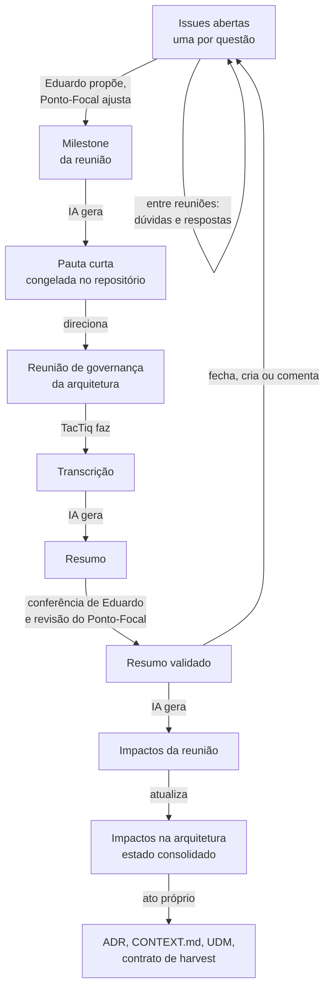

# Nova fase da Arquitetura Biocultural — análise e recomendações

- **Data:** 2026-09-30
- **Pedido:** [`novaFaseArquitetura.md`](novaFaseArquitetura.md) — "uma análise e um relatório exaustivo sobre
  possíveis ajustes metodológicos e documentais necessários, para análise e posterior implementação.
  Apresente alternativas e recomendações de forma didática."
- **Base:** todos os documentos de [`reunioes/`](Reunioes/) (resumos, impactos e pautas de 16/09, 18/09 e
  29/09; `README.md`; guia de contribuição); [`ia/uso-de-ia.md`](../../Pesquisa/IA/uso-de-ia.md);
  [`projetoPesquisa.md`](../../Pesquisa/projetoPesquisa.md) §7.2; [`proximosPassos.md`](../../tecnico/proximosPassos.md); o estado do
  repositório no GitHub (Issue #3; *pull requests* #1, #2 e #4 — este incorporado em 30/09, `c2d7884`).
- **Estado:** **implementado (Cenário B) em 2026-10-03**, por decisão de Eduardo, antes da reunião,
  com as opções recomendadas da §8 e uma etiqueta por tipo de fonte. Os desvios em relação a este
  relatório estão em [`metodo-de-evolucao.md`](metodo-de-evolucao.md) §5 (M-10). O texto abaixo é o
  relatório como foi escrito em 30/09; só os *links* para a pauta antiga e o plano da §7 foram
  atualizados. A pauta antiga ficou como
  [retrato](Reunioes/2026-10-03-retrato-pauta-formato-antigo.md).

> **Como ler.** A §1 dá a resposta curta. A §2 mostra o que os documentos provam, com números. A §3
> fixa os princípios. A §4 compara três alternativas. A §5 detalha a recomendada, documento por
> documento. A §6 lista os riscos. A §7 dá o plano de implementação. A §8 lista as decisões que só
> Eduardo pode tomar. Os apêndices mostram o resultado na prática: as *Issues* iniciais, o modelo de
> *Issue* e um exemplo de pauta curta.

---

## 1. Resposta curta

**O problema, em uma frase.** A pauta faz dois trabalhos ao mesmo tempo: diz o que se decide na
próxima reunião **e** guarda o estado de tudo o que ainda está aberto. O segundo trabalho cresce a
cada reunião e esconde o primeiro.

**A recomendação, em cinco pontos.**

1. **Uma *Issue* por questão aberta.** A *Issue* passa a ser o único lugar do estado de cada questão.
   O número dela (`#12`) não muda de uma pauta para outra.
2. **A pauta fica curta e nasce das *Issues*.** No máximo três decisões por reunião; informes em uma
   linha; a seção "Para levar às comunidades" continua. Saem as tabelas de rastreio. Saem os códigos:
   cada item aparece com o número da *Issue* e o título por extenso.
3. **Primeiro validar, depois derivar.** A pauta e as *Issues* só são atualizadas depois da revisão
   do resumo. Hoje tudo nasce na mesma sessão, antes da revisão.
4. **Impactos em blocos de formato fixo.** Um bloco por item, com campos sempre iguais. A IA filtra
   sem interpretar; a pessoa lê sem decifrar tabela. Estados com vocabulário fechado. Referência por
   seção do documento de destino, não por número de linha.
5. **As perguntas para as comunidades viram produto próprio.** Um *label* próprio, e uma folha em
   linguagem simples que o Ponto-Focal pode levar impressa.

**Cenário recomendado:** B — *Issues* como fila única de questões (§4). Avaliação independente com
`judge()`, sobre o diagnóstico da §2: B = 0,83; A = 0,09; C = 0,08 (confiança 0,74). O mesmo
`judge()` estimou em 0,65 a probabilidade de B ter risco relevante de baixa adoção. Por isso a §6
traz mitigação explícita.

---

## 2. Diagnóstico — o que os documentos mostram

### 2.1 A pauta cresce a cada reunião

| Documento | Linhas | Palavras | Códigos (total / distintos) |
|---|---|---|---|
| [Preparação da reunião de 16/09](../pautaComunidades/preparacao-reuniao-2026-09-16.md) | 99 | 1.117 | 5 / 3 |
| [Pauta de 29/09](Reunioes/2026-09-29-pauta-reuniao-sofia.md) | 190 | 2.121 | 67 / 43 |
| [Próxima pauta, hoje retrato](Reunioes/2026-10-03-retrato-pauta-formato-antigo.md) | 286 | 3.212 | 91 / 50 |

*Códigos contados:* `I-xx`, `ADR-0xx`, `Kn`, `①`…`⑳`, `Pn qn`, `d. n`, `§n`. *Método:* expressão
regular sobre os três arquivos, em 2026-09-30.

Em duas reuniões, as palavras quase triplicaram e os códigos passaram de 5 para 91. A reunião
continua com 60 minutos de referência. Esta é a tendência que [`novaFaseArquitetura.md`](novaFaseArquitetura.md)
previu: "uma tendência ao acúmulo de pendências, o que vai gerar um documento longo e de difícil
interpretação".

### 2.2 A pauta faz dois trabalhos

Na próxima pauta, 70 das 286 linhas (24%) são três tabelas de **rastreio**, e não de pauta:

| Seção | Linhas | O que faz |
|---|---|---|
| Estado de partida | 9 | Resume a situação de cada frente |
| Retrospecto da pauta de 29/09 | 35 (26 itens) | Diz o que aconteceu com cada item da pauta anterior |
| Rastreio da pauta das comunidades | 26 (18 itens) | Diz onde está cada item da pasta `pautaComunidades/`, congelada em 28/09 |

A regra do [`reunioes/README.md`](README.md) manda **copiar** a tabela de rastreio para a
pauta seguinte e atualizar a coluna *Estado*. Cada cópia herda as linhas da anterior e soma as novas.
É este o mecanismo do acúmulo. Ele não é defeito de redação: é consequência de usar um documento
congelado (a pauta) para guardar um estado que muda (as pendências).

### 2.3 Uma questão, seis nomes

A mesma pergunta — *o conteúdo sagrado descrito num artigo fica guardado no banco ou não?* — tem um
identificador diferente em cada documento:

| Onde aparece | Identificador |
|---|---|
| [`pautaComunidades/pauta-comunidades.md`](../pautaComunidades/pauta-comunidades.md) | Pauta 6, questão 1 (`P6 q1`) |
| [Resumo de 16/09](Reunioes/2026-09-16-reuniao-sofia.md) | decisão 3 |
| [Estado consolidado dos impactos](../../tecnico/impactos-na-arquitetura.md) | `I-04` |
| [Pauta de 29/09](Reunioes/2026-09-29-pauta-reuniao-sofia.md) | pergunta 3.2 |
| [Resumo de 29/09](Reunioes/2026-09-29-reuniao-sofia.md) | decisão 4 |
| [Próxima pauta, hoje retrato](Reunioes/2026-10-03-retrato-pauta-formato-antigo.md) | item 2.1 |

A pergunta vizinha (*sagrado equivale a privado?*) tem mais três: `④` em `proximosPassos.md`,
`H-Q1` na ADR-016 e `I-03` no estado consolidado.

Duas consequências:

- **O Ponto-Focal se perde.** Resumo de 29/09, *Insights*: Sofia "estudou a pauta na véspera e não
  conseguiu associar `I-03`, `I-14`, `⑭` e `⑮` ao que significavam".
- **A regra atual de *Issue* quebra.** O README pede que a dúvida cite "o nome do arquivo e o número
  do item". Mas o número do item muda a cada pauta (3.2 virou 2.1), e o arquivo `proxima-pauta-…` muda
  de nome quando a reunião é marcada. A referência que Sofia escrever hoje aponta para o lugar
  errado depois.

### 2.4 Cinco listas de pendências

Hoje uma pendência que depende de pessoas pode estar em cinco lugares:

1. [`proximosPassos.md`](../../tecnico/proximosPassos.md) — pendências `①` a `⑱`;
2. [`reunioes/impactos-na-arquitetura.md`](../../tecnico/impactos-na-arquitetura.md) — itens `I-01` a `I-19`;
3. [`pautaComunidades/pauta-comunidades.md`](../pautaComunidades/pauta-comunidades.md) — Pautas 1 a 7
   (congelada, mas copiada na tabela de rastreio);
4. a seção "Pendências e encaminhamentos" de cada resumo;
5. a seção "Itens que ficam fora desta reunião" de cada pauta.

Exemplo: os **princípios mínimos da federação** estão em `proximosPassos.md` (`⑭`), na pauta de 29/09
(item 4.4), nas pendências do resumo de 29/09 e na próxima pauta (Bloco 1, item 3). São quatro textos
diferentes para a mesma pendência. Quem atualiza um pode esquecer os outros três.

### 2.5 A pauta é maior do que a reunião

- **29/09:** referência de 60 min; a reunião durou 105 min. O Bloco 4 (oito questões, 10 min) não foi
  tratado e passou inteiro para a próxima pauta.
- **Próxima pauta:** Abertura, quatro blocos, seis questões no Bloco 4 com 10 min, três perguntas para
  as comunidades — outra vez em 60 min.

O último bloco não é alcançado e volta. Na reunião seguinte, ele volta maior.

### 2.6 Documentos derivados antes da validação

O episódio E-04 de [`ia/uso-de-ia.md`](../../Pesquisa/IA/uso-de-ia.md) registra: o documento de impactos e a próxima
pauta "foram gerados na mesma sessão do resumo, antes desta conferência".

O *pull request* #4, de Sofia sobre o resumo de 29/09, mostra o custo:

- **decisão 9:** "não sabe se algo é **sagrado**" passou a "não sabe se algo é **secreto**";
- **decisão 7:** o embargo vale "mesmo em situações em que um outro coletivo representativo tenha
  autorizado a inserção".

Quando o PR chegou, o item `I-18` (impactos de 29/09, §3) e a pergunta 3.2 da próxima pauta diziam
"sagrado? sigilo? publicação?": os documentos derivados carregavam uma leitura que o Ponto-Focal já
tinha corrigido. A correção foi feita à mão, num *commit* próprio (`de6a5ac`, 30/09), em três
documentos. O guia de contribuição prevê que "Eduardo reavalia os impactos"; nenhuma regra dizia o
que acontece com a pauta. A correção também abriu uma pergunta nova (o "não sei" vale para o
sagrado?), que só existe porque a revisão veio depois da derivação.

### 2.7 A origem das afirmações da IA não fica visível

Resumo de 29/09, *Insights*: "quando a IA atualiza a pauta, 'faz da cabeça dele', e ele próprio fica
em dúvida sobre a origem de algumas afirmações". O remédio usado foi perguntar ao agente, ao vivo.
Hoje nenhum item da pauta tem um campo obrigatório de origem. O remédio estrutural é este campo.

### 2.8 *Issues*: canal previsto, ainda não adotado

- **O caminho de correção funciona.** Sofia fez os *pull requests* #1, #2 e #4, todos incorporados.
  O guia tem quatro passos e um objeto concreto: o resumo que ela quer corrigir.
- **O caminho de conversa ainda não começou.** A única *Issue* do repositório é a #3, aberta por
  Eduardo em 29/09 ("Você viu as questões pendentes com o USEFLORA?"), sem comentário até esta data.
- **Nada está configurado.** Só os *labels* padrão do GitHub; nenhum *template* (a pasta `.github/`
  não existe); *Discussions* desligado; *Projects* ligado e sem uso.

Leitura: o caminho de correção pegou porque parte de um objeto concreto que já é de Sofia. Para a
*Issue* pegar do mesmo modo, ela precisa ser **uma pergunta concreta dirigida a Sofia**, criada por
Eduardo — e não um fórum em branco que Sofia tem de abrir.

### 2.9 O que funciona e deve ficar

- O **resumo**: estrutura, linguagem e tom ([`novaFaseArquitetura.md`](novaFaseArquitetura.md)).
- A seção **"Para Sofia levar às comunidades"** (idem).
- A **estrutura didática em quatro partes** — o que está em jogo; o que a arquitetura faz hoje; as
  opções com a consequência de cada uma; a pergunta em uma frase. Ela vem do *insight* de 16/09: "o
  papel da governança é expor consequência, não escolher".
- A regra de **congelar** a pauta e de escrever uma vez os documentos por reunião (proveniência).
- O **guia de contribuição** por *pull request*.
- A **fronteira** do papel: o Ponto-Focal desenha o campo e nunca preenche o valor.
- A **anuência** e a transcrição fora do repositório.
- As **notas de leitura da transcrição**: são evidência para a pesquisa sobre uso de IA
  (`projetoPesquisa.md` §7.5).

---

## 3. Princípios para o ajuste

Tirados de [`novaFaseArquitetura.md`](novaFaseArquitetura.md) e dos resumos. Toda alternativa da §4 é
avaliada contra eles.

1. **Nada se perde.** "A AB é uma construção coletiva onde todas as críticas, sugestões e
   contribuições devem ser registradas e consideradas." Toda contribuição tem registro e destino.
2. **Um lugar para cada coisa.** O estado de uma questão vive num lugar só. Os outros documentos
   apontam para ele.
3. **Escrito para quem vai ler.** A pauta é lida pelo Ponto-Focal e por quem não é da área técnica. O
   estado consolidado dos impactos é lido pela IA e pelo gestor da arquitetura.
4. **A IA propõe; uma pessoa valida.** Nenhum item nasce sem origem que se possa conferir.
5. **O tempo é o das comunidades.** Uma questão pode ficar meses aberta sem pesar na pauta.
6. **Desenho, nunca valor.** O repositório é público. Nenhum Conhecimento Tradicional, nome de
   detentor ou local sensível entra em documento ou *Issue*.
7. **O que se decide fica versionado.** O ciclo é procedimento de pesquisa (`projetoPesquisa.md`
   §7.2, itens 7 e 8).

---

## 4. Alternativas

### Cenário A — Ajuste mínimo, sem *Issues*

**O que muda.** Os três documentos continuam. A pauta ganha limites (tamanho, número de decisões) e
perde os códigos. As tabelas de rastreio saem da pauta e vão para o estado consolidado dos impactos.

**A favor.** Nenhuma ferramenta nova. Nenhuma curva de aprendizagem para Sofia.

**Contra.** O acúmulo muda de lugar, mas continua: o estado consolidado passa a guardar também o
rastreio de pautas. As cinco listas continuam cinco. A questão continua sem número estável. A
conversa entre reuniões continua sem lugar.

### Cenário B — *Issues* como fila única de questões (recomendado)

**O que muda.** Cada questão aberta vira uma *Issue*, com número estável. Poucos *labels* dizem quem
responde. Uma *milestone* por reunião diz o que entra na pauta. Um *template* obriga as quatro partes
didáticas e o campo de origem. A pauta fica curta, é gerada da *milestone* e é congelada no
repositório. O resumo e os impactos continuam, com ajustes.

**A favor.** Resolve o acúmulo na causa (o estado sai da pauta). Dá um número estável a cada
questão. Junta as cinco listas numa fila. Dá lugar à conversa entre reuniões. Deixa a questão que
espera as comunidades aberta sem pesar na pauta. Usa só recursos nativos do GitHub.

**Contra.** Sofia precisa receber avisos e comentar no GitHub. As *Issues* não ficam no histórico do
git. Exige uma migração inicial (cerca de 25 *Issues*, Apêndice A).

### Cenário C — B com automação e quadros

**O que muda.** Tudo de B, mais: quadro no GitHub *Projects*; *Discussions* para conversa aberta; um
*workflow* do GitHub Actions que gera a pauta sozinho.

**A favor.** Visão em quadro; conversa aberta separada da fila de decisões; menos trabalho manual.

**Contra.** Três superfícies em vez de uma, para uma Ponto-Focal que ainda não usa a primeira. A
geração da pauta já é feita pelo agente de IA, sob pedido; automatizar tira o momento em que Eduardo
confere o que a IA escreveu (princípio 4).

### Comparação

| Critério | A | B | C |
|---|---|---|---|
| Resolve o acúmulo na causa | Não | Sim | Sim |
| Número estável por questão | Não | Sim | Sim |
| Carga para o Ponto-Focal | Baixa | Média | Alta |
| Carga para o gestor | Baixa | Média | Média, depois baixa |
| Registro versionado | Sim | Sim, pela pauta e pelo resumo congelados | Sim |
| Risco de adoção | Nenhum | Médio | Alto |
| Esforço de implantação | Horas | Uma sessão | Várias sessões |

**Recomendação: B.** C pode vir depois, peça por peça, se B mostrar que precisa (§7, Fase 5).

---

## 5. Recomendação detalhada — cenário B

### 5.1 O novo *workflow*



**O que muda em relação ao *workflow* de hoje:**

| Hoje | Proposto |
|---|---|
| O resumo subsidia a próxima pauta diretamente | O resumo validado atualiza as *Issues*; a pauta nasce das *Issues* |
| A pauta anterior "leva pendências" por meio de um retrospecto | O que não foi tratado fica na *milestone* e passa para a seguinte. O resumo registra isso em uma linha |
| Impactos e pauta nascem antes da revisão do resumo | Nascem depois (§5.4) |
| Três tabelas de rastreio em cada pauta | Nenhuma. O estado está nas *Issues* |
| Arquivo `proxima-pauta-…`, renomeado com `git mv` | A *milestone* é a pauta viva. O arquivo só nasce, já com a data no nome, quando a pauta congela |

O número de documentos por reunião não muda: pauta, resumo e impactos. Muda o conteúdo da pauta e o
momento em que cada documento nasce.

### 5.2 A *Issue* como unidade de questão

**O que é uma questão.** Tudo o que espera resposta de uma pessoa: uma decisão, um informe, uma
pergunta às comunidades, um ato de gestão. Uma *Issue*, uma questão.

**Título.** A pergunta em português simples, sem código. Exemplo: *"Conteúdo sagrado descrito num
artigo: a unidade guarda ou não guarda?"*

**Corpo.** O *template* do Apêndice B: as quatro partes didáticas, mais **Origem** (de onde a
questão veio, com *link*) e **Liga-se a** (os itens de impacto e documentos técnicos, para a IA). O
campo Origem é obrigatório: é ele que responde "de onde veio isto?" (§2.7).

**Quem cria.** Eduardo, com a IA, depois da validação do resumo. Sofia comenta. Sofia também pode
abrir uma *Issue* de dúvida, com um *template* simples (título e texto).

***Labels*.** Sete, em três grupos. Nomes sem acento, para facilitar filtros.

| Grupo | *Label* | Quer dizer |
|---|---|---|
| Quem responde | `para-ponto-focal` | O Ponto-Focal responde ou opina |
| | `para-comunidades` | Só as comunidades respondem; o Ponto-Focal leva |
| | `para-gestao` | Ato técnico ou de gestão do Eduardo. Não entra na pauta |
| Tipo | `decisao` | Pede escolha entre opções |
| | `informe` | Pede notícia, não escolha |
| | `duvida` | Dúvida sobre um documento |
| Situação | `aguarda-terceiros` | Depende de alguém fora da reunião (Comitê Gestor, Nivaldo e Carol, interlocutor de fontes primárias) |

*Labels* por tema (`tema-sagrado`, `tema-detentor`…) ajudariam a IA a agrupar questões por ADR. Não
são necessários no início: o campo "Liga-se a" já faz esse trabalho. Acrescentar só se faltar.

***Milestones*.** Uma por reunião: "Próxima reunião" enquanto não houver data; "Reunião AAAA-MM-DD"
quando houver, com a data como prazo. A *milestone* é a lista de candidatas à pauta. Uma *Issue* sem
*milestone* está na fila, sem prazo — é o lugar das questões que esperam as comunidades.

**Fechamento.** Toda *Issue* fecha com um comentário de formato fixo:

```text
Decisão: <a resposta, em uma ou duas frases>
Onde: reunião de DD/MM, decisão N do resumo  |  nesta Issue, por @conta, em DD/MM
Efeito na arquitetura: I-xx (ou "nenhum")
```

- **Fechar como concluída** (*Close as completed*) = respondida.
- **Fechar como não planejada** (*Close as not planned*) = saiu do escopo, com o motivo.
- **Reabrir** é normal. A decisão 8 de 29/09 diz que a classificação muda nos dois sentidos; as
  decisões de governança também podem mudar.

**Relação com os itens de impacto.** São coisas diferentes, e as duas ficam. A *Issue* é **a
pergunta a uma pessoa**. O item `I-xx` é **o que muda na arquitetura**. Uma *Issue* pode alimentar
vários itens, e um item pode esperar várias *Issues*. Exemplo: `I-04` espera a *Issue* "conteúdo
sagrado de artigo".

**Relação com as outras listas (§2.4).**

- `proximosPassos.md`: as pendências que dependem de pessoas (`⑭`, `⑮`, `⑨`, `⑩`…) viram *Issues*; o
  arquivo passa a apontar para elas. As técnicas (`②`, `⑪`…) ficam onde estão.
- `pauta-comunidades.md`: as questões ainda abertas viram *Issues*, com Origem "Pauta 2, questão 5".
  A tabela de rastreio da próxima pauta fica como o último retrato, congelado.
- Seções "Pendências" do resumo e "Itens fora" da pauta: viram listas de *links* para *Issues*.

**Privacidade.** O *template* repete a regra do guia: falar do desenho (que campo, que regra, que
opção), nunca do valor de um registro concreto. Eduardo modera: pode editar ou apagar um comentário
que exponha Conhecimento Tradicional.

### 5.3 A nova pauta

**Estrutura** (o exemplo completo está no Apêndice C):

```text
# Pauta — reunião de governança da arquitetura, DD/MM/AAAA
Participantes · duração · link da milestone

## Abertura (5 min)
## Para decidir hoje (até 3 questões)
   ### [#NN] Título da questão
   O que está em jogo · O que a arquitetura faz hoje · Opções · Pergunta
## Informes (uma linha cada)
## Para levar às comunidades
## Andando fora da pauta (uma linha)
   N questões esperam as comunidades · M esperam terceiros · link para a lista
```

**Regras.**

1. **No máximo três decisões.** Critério de escolha: o que destrava mais. Exemplo de hoje: duas
   questões destravam a ADR-019. Eduardo propõe a *milestone*; Sofia pode trocar uma questão por
   outra, comentando na *Issue*.
2. **Meta de tamanho:** até 1.000 palavras. Hoje são 3.212.
3. **Nenhum código.** Cada item aparece como *link* para a *Issue*, com o título por extenso. O texto
   de "O que a arquitetura faz hoje" diz a regra em palavras ("hoje o trecho fica no banco e não
   aparece para o público"), não o código da regra. O detalhe técnico fica na *Issue*, no campo
   "Liga-se a".
4. **Sem retrospecto.** A comparação entre o que foi proposto e o que aconteceu vai para o resumo, em
   uma seção de três linhas (§5.4).
5. **Informes em uma linha.** Informe não precisa de estrutura didática: pede notícia.
6. **A seção "Para levar às comunidades" continua**, com as *Issues* `para-comunidades` que o
   Ponto-Focal ainda não levou.

**Geração e congelamento.**

1. Eduardo monta a *milestone*, de 5 a 7 dias antes da reunião.
2. A IA gera a pauta a partir da *milestone* (`gh issue list --milestone …`).
3. Sofia lê e comenta nas *Issues*. Se algo muda, a IA gera de novo.
4. No dia da reunião, a pauta é gravada como `AAAA-MM-DD-pauta-reuniao-….md` e congela.

**Detalhe técnico que importa.** Num arquivo `.md` do repositório, o GitHub **não** transforma `#12`
em *link* (só o faz em *Issues*, *pull requests* e comentários). A pauta e o resumo precisam do *link*
completo: `[#12](https://github.com/edalcin/Arquitetura-BioCultural/issues/12)`.

### 5.4 O resumo

A estrutura, a linguagem e o tom ficam. Quatro ajustes:

1. **Cabeçalho:** acrescentar o *link* da *milestone* da reunião.
2. **Seção nova "Da pauta", logo depois do *Overview*,** com três linhas: tratadas; não tratadas, que
   voltam; temas novos, com as *Issues* criadas. Substitui o retrospecto da pauta seguinte.
3. **Cada decisão termina com a *Issue* que ela fecha ou abre.** Exemplo: "(fecha [#12](…))".
4. **"Pendências e encaminhamentos"** vira uma lista de *Issues* criadas ou atualizadas, uma por
   linha.

**A barreira de validação (§2.6).** A ordem passa a ser:

1. A IA gera o resumo.
2. Eduardo confere o resumo contra a transcrição.
3. Sofia revisa por *pull request*, pelo guia de contribuição.
4. Depois do *merge*: a IA atualiza as *Issues* e gera o documento de impactos e o episódio.

O prazo da revisão de Sofia é uma decisão da §8 (item 3). A opção recomendada deixa o documento de
impactos nascer depois do passo 2, marcado "sujeito à revisão do Ponto-Focal", e só mexe nas
*Issues* depois do passo 3. As *Issues* são o que Sofia lê; elas não podem carregar uma leitura que
ela ainda vai corrigir.

### 5.5 Impactos na arquitetura — formato para a IA, legível para pessoas

**O que se observa no formato atual.**

- **A coluna *Estado* mistura dois eixos.** Exemplo: "Não aplicado. Confirmado em 29/09". Uma parte diz
  se o destino foi alterado; a outra diz se a leitura foi confirmada.
- **A referência é por número de linha** (`ADR-015:284`). Ela quebra na primeira alteração do
  destino. A ADR-018 já pode ser escrita, e ela altera vários destinos citados por linha.
- **Células de tabela com parágrafos.** A pessoa lê mal; a IA precisa interpretar prosa.
- **Nenhum *link* para a questão aberta**, nem para o documento que o item vai alimentar.

**Proposta: um índice curto e um bloco fixo por item.**

Índice no topo, com células curtas:

```text
| Item | Título curto | Situação | Alimenta | Questão aberta |
| I-04 | Conteúdo sagrado de artigo | em revisão | ADR-019 | #NN |
```

Um bloco por item, sempre com os mesmos campos:

```text
### I-04 — Conteúdo sagrado de artigo não é persistido

- **Situação:** em revisão
- **Tipo:** contradiz
- **Destino:** ADR-015, K6 — rejeição de *redaction at rest* ("…trecho citado…")
- **Origem:** decisão 3 de 16/09 (resumo); revista pela decisão 4 de 29/09 (resumo)
- **Questão aberta:** #NN
- **Alimenta:** ADR-019
- **Histórico:** 16/09 criado · 29/09 em revisão
- **Leitura:** duas a quatro linhas.
```

**Vocabulário fechado para Situação** (hoje é texto livre):

| Situação | Quer dizer | Itens de hoje (proposta de enquadramento) |
|---|---|---|
| `aberto` | Falta resposta para existir leitura | I-14, I-15, I-19 |
| `em revisão` | Há leitura, e ela foi contestada | I-04 |
| `confirmado` | Leitura confirmada; pronto para o destino | I-01, I-02, I-06, I-07, I-08, I-16 (ADR-018); I-09, I-10, I-11, I-13 |
| `aplicado` | Destino alterado; cita o *commit* ou a ADR | nenhum |
| `fora do canal` | Espera outro interlocutor | I-05 |

`I-03`, `I-12`, `I-17` e `I-18` têm, cada um, uma parte confirmada e outra aberta (`I-18`, depois do PR #4: confirmado para secreto e publicação; aberto para sagrado). Um item com duas situações é sinal
de que deveria ser dois. Proposta, a decidir na implementação: separar a parte aberta num item novo
(`I-20`, por exemplo), sem reutilizar números.

**Como a IA usa o formato.** Para escrever a ADR-018, o agente filtra os blocos com "Situação:
confirmado" e "Alimenta: ADR-018", e segue os *links* de Origem. É um filtro, não uma interpretação.

**Destino por seção, não por linha.** Citar a seção ou o ponto (K6, §4.1) e um trecho curto do texto
vigente. A linha pode entrar como dica, nunca como única referência.

**Os documentos de impactos por reunião ficam.** São a análise escrita uma vez, e a sua estrutura
(*fecha*, *contradiz*, *acrescenta*, *confirma*, *abre*) funciona. Ganham os *links* para as *Issues*.

**Alternativas consideradas e descartadas.**

| Alternativa | Por que não |
|---|---|
| Cabeçalho YAML por item | Mais fácil para máquina, pior para pessoa. Os campos fixos em Markdown já são previsíveis para a IA |
| Um arquivo por item (`impactos/I-04.md`) | 19 arquivos hoje, mais a cada reunião. Fragmenta a leitura humana |
| O item de impacto como *Issue* | Mistura a pergunta a Sofia com a análise técnica, e põe texto técnico no canal que deve ser simples |

### 5.6 Perguntas para as comunidades

A seção "Para Sofia levar às comunidades" é o exemplo que o próprio pedido elogia. Proposta:

- **Um *label*** (`para-comunidades`) junta essas perguntas, de todas as reuniões, numa lista só.
- **A pauta repete as que ainda não foram levadas.**
- **Folha para levar, sob pedido.** Quando Sofia for a uma reunião dos Guardiões ou do Conselho do
  UseFlora, a IA gera uma folha de uma página com as perguntas abertas, sem *links* nem códigos,
  pronta para imprimir. Não é um documento permanente: nasce quando Sofia pede.
- **O caminho da resposta.** Sofia traz a resposta; ela entra num comentário da *Issue*, escrito por
  Sofia ou por Eduardo com a menção "resposta trazida por Sofia em DD/MM"; a *Issue* fecha.
- **A fronteira continua.** As comunidades respondem sobre o desenho (como chamam o sagrado; quem pode
  pedir embargo). Nenhuma resposta sobre um registro concreto entra no repositório.

### 5.7 Pastas e nomes

| Opção | O que é | A favor | Contra |
|---|---|---|---|
| **A — Manter a pasta plana, com a data na frente** (recomendada) | Como hoje | A data agrupa pauta, resumo e impactos na listagem. Nenhum *link* quebra | Nenhum relevante |
| B — Uma subpasta por reunião | `reunioes/2026-09-29/resumo.md` | Agrupa por reunião | Quebra todos os *links*; não resolve nada que a data já não resolva |

**O sufixo `-sofia`.** Os arquivos levam o nome de uma pessoa. O pedido chama estas reuniões de
**reuniões de Governança da Arquitetura**, e a de 29/09 já teve uma terceira participante. Se o fórum
se ampliar (convite a Viviane Kruel), o sufixo passa a enganar. Hoje são dez arquivos: renomear custa
pouco agora e mais depois. A decisão depende do nome do fórum (§8, item 4).

**O arquivo `proxima-pauta-…` deixa de existir.** A *milestone* ocupa o lugar dele (§5.3).

**`pautaComunidades/`** continua congelada. Nenhuma mudança.

### 5.8 Registro de pesquisa e uso de IA

- **As *Issues* não ficam no git.** O registro versionado continua garantido por dois documentos: a
  pauta congelada (texto de cada questão no dia da reunião) e o resumo (as decisões). Se as decisões
  puderem acontecer dentro de uma *Issue* (§8, item 2), então é preciso também uma cópia versionada
  das *Issues* fechadas a cada reunião (`gh issue list --state closed --json …`).
- **O episódio em `uso-de-ia.md`** ganha uma linha: *Issues* criadas, fechadas ou comentadas pela IA.
  É dado novo para a pesquisa: mostra quanto da fila a IA propõe e quanto uma pessoa confirma.
- **`docs/tecnico/agents/issue-tracker.md`** ganha a convenção de *labels* e de fechamento. É o arquivo que os
  agentes de IA leem antes de mexer em *Issues*.
- **Medidas para avaliar o novo formato** (registrar em `uso-de-ia.md`, §4): palavras e códigos por
  pauta; fração das questões da pauta que a reunião tratou; *Issues* respondidas por Sofia entre
  reuniões; dias entre a reunião e o resumo validado.

---

## 6. Riscos e mitigações

| Risco | Evidência | Mitigação |
|---|---|---|
| Sofia não usa as *Issues* | Issue #3 sem comentário; `judge()` 0,65 | Eduardo cria todas as *Issues*; Sofia só comenta. Cada *Issue* menciona `@sofiazank`, e o GitHub avisa por e-mail. Dez minutos de demonstração na próxima reunião. A pauta leva direto às *Issues*. **Plano B:** Sofia responde por e-mail ou mensagem, e Eduardo copia para a *Issue* com a menção "resposta por e-mail em DD/MM" |
| Conhecimento Tradicional numa *Issue* pública | Repositório público | Aviso no *template*; regra do guia; Eduardo modera e apaga o comentário |
| Decisão escondida num comentário | — | Comentário de fechamento com formato fixo (§5.2); o resumo seguinte lista as decisões tomadas entre reuniões |
| Excesso de avisos | — | Uma *Issue* por questão; criação em lote depois da validação do resumo, não ao longo da semana |
| Perda da comparação entre pauta e reunião | Retrospecto de hoje | Seção "Da pauta" no resumo; a *milestone* mostra o que fechou e o que ficou aberto |
| Comunidades sem acesso ao GitHub | Sofia é a ponte | As *Issues* são ferramenta de Eduardo e Sofia. As comunidades recebem a folha impressa (§5.6) |
| Duas fontes durante a migração | — | Migração de uma vez; a próxima pauta atual fica como último retrato, com nota |
| Dependência do GitHub | — | Pautas e resumos congelados no git; cópia das *Issues* fechadas, se a §8, item 2, pedir |
| *Links* quebrados na renomeação | — | Uma renomeação só, num *commit* só, com busca de todos os *links* |

---

## 7. Plano de implementação

### Fase 0 — Antes de tudo, independente deste relatório ✔

- [x] Incorporar o *pull request* #4 de Sofia (`c2d7884`) e atualizar, no documento de impactos de
      29/09, no estado consolidado e na próxima pauta, a leitura de `I-17` (decisão 7) e de `I-18`
      (decisão 9: "secreto", não "sagrado") — `de6a5ac`, 30/09.

### Fase 1 — Antes da próxima reunião

A proposta seria decidida **na** reunião (Bloco 0 da pauta antiga, hoje
[retrato](Reunioes/2026-10-03-retrato-pauta-formato-antigo.md)). Eduardo decidiu antes, em 03/10.

- [x] Mandar a Sofia o *link* deste documento, com a indicação das seções mais úteis para ela: §1,
      §2.3, Apêndice C — feito pela [Issue #5](https://github.com/edalcin/Arquitetura-BioCultural/issues/5)
      (30/09), que também testa o formato do Apêndice B.

### Fase 2 — Na próxima reunião

- [x] Escolher A, B ou C — **B**, escolhido por Eduardo em 03/10/2026, com as opções recomendadas da
      §8. A opinião de Sofia entra na abertura da próxima reunião; a §8, item 2, virou a
      [questão #8](https://github.com/edalcin/Arquitetura-BioCultural/issues/8).

### Fase 3 — Logo depois da aprovação (uma sessão de trabalho)

Se B for aprovado, a pauta atual é a **última no formato antigo** e muda de papel: deixa de ser a
lista de pendências e fica como retrato congelado.

- [x] Criar os sete *labels* (§5.2) — mais quatro de **tipo de fonte** (`fonte-primaria`,
      `fonte-secundaria`, `fonte-acervos`, `fonte-naturalistas`) e `wayfinder:map`.
- [x] Criar dois *templates*: `.github/ISSUE_TEMPLATE/questao.yml` (Apêndice B, com o campo
      "Para fechar esta questão") e `duvida.yml`.
- [x] Converter em *Issues* tudo o que a pauta atual não resolveu: questões
      [#7 a #34](https://github.com/edalcin/Arquitetura-BioCultural/issues); correspondência item a
      item no [retrato](Reunioes/2026-10-03-retrato-pauta-formato-antigo.md). Painel:
      [#6](https://github.com/edalcin/Arquitetura-BioCultural/issues/6).
- [x] Criar a *milestone* da reunião seguinte
      ([Próxima reunião](https://github.com/edalcin/Arquitetura-BioCultural/milestone/1)). A *Issue*
      #3 já estava fechada (teste); a #5 foi fechada com a decisão.
- [x] Gerar a primeira pauta curta a partir da *milestone*
      ([`reunioes/proxima-pauta-reuniao-sofia.md`](Reunioes/proxima-pauta-reuniao-sofia.md)).
- [x] Atualizar [`reunioes/README.md`](README.md), o
      [guia de contribuição](../../../ComecePorAqui/guia-github.md) (seção de *Issues*) e
      [`agents/issue-tracker.md`](../../tecnico/agents/issue-tracker.md).
- [ ] Mandar a Sofia uma mensagem curta com três *links*: a pauta, a *milestone* e uma *Issue*. O mapa
      (#6) menciona `@sofiazank`, e o GitHub a avisa; a mensagem pessoal fica com Eduardo.

### Fase 4 — Na reunião seguinte e depois dela

- [ ] Dez minutos: mostrar a *milestone* e uma *Issue*. Perguntar: "O novo formato funciona para
      você?"
- [ ] Primeiro resumo com a seção "Da pauta" e as decisões ligadas às *Issues*.
- [x] Reestruturar [`reunioes/impactos-na-arquitetura.md`](../../tecnico/impactos-na-arquitetura.md) em
      índice e blocos (§5.5) — feito em 03/10, antes da reunião.
- [x] Atualizar os documentos que descrevem o ciclo: `projetoPesquisa.md` §7.2, itens 7 a 9;
      `docs/tecnico/CONTEXT.md` (Ponto-Focal, Reunião de Governança da Arquitetura, Questão, Tipo de Fonte);
      `docs/Pesquisa/resumoExecutivo-completo.md` §5; `ia/uso-de-ia.md` §1 (diagrama e campos do episódio);
      `proximosPassos.md` (pendências de pessoas → *Issues*) — feito em 03/10.

### Fase 5 — Depois de duas reuniões no formato novo

- [ ] Comparar as medidas da §5.8 com os números da §2.1.
- [ ] Decidir se alguma peça do cenário C faz falta.

---

## 8. Decisões para Eduardo

Cada decisão vem com as opções e a consequência. A recomendada está marcada.

**1. Cenário.**

- A — Ajuste mínimo, sem *Issues*. O acúmulo muda de lugar.
- **B — *Issues* como fila única (recomendado).** Resolve o acúmulo na causa; pede adoção de Sofia.
- C — B com quadros e automação. Mais superfícies do que a Ponto-Focal usa hoje.

**2. Uma decisão pode acontecer fora da reunião?**

- Não: a *Issue* só prepara; a decisão é sempre na reunião. Mais lento; o registro fica todo no
  resumo.
- **Sim, quando o Ponto-Focal escreve a resposta na *Issue* (recomendado).** O resumo seguinte lista
  a decisão em "Decisões entre reuniões". Exige cópia versionada das *Issues* fechadas (§5.8).
- Sim, também quando Eduardo registra uma resposta dada por e-mail. Mais rápido; a autoria fica
  indireta.

**3. Quando os documentos derivados nascem?**

- Tudo espera a revisão de Sofia. O ciclo fica tão lento quanto a revisão.
- **Impactos depois da conferência de Eduardo, marcados "sujeito à revisão"; *Issues* e pauta depois
  da revisão de Sofia (recomendado).**
- Tudo na mesma sessão, como hoje. É o que produziu o problema da §2.6.

**4. Nome do fórum e sufixo dos arquivos.**

- Manter `-sofia`. Nada muda; o nome engana se o fórum se ampliar.
- `-useflora`. Nomeia a iniciativa parceira, não a pessoa.
- **`-governanca`, se Viviane aceitar o convite (recomendado).** Nomeia o que as reuniões são. Até a
  resposta, manter `-sofia`.

**5. O termo "Reunião de Governança da Arquitetura" entra no `docs/tecnico/CONTEXT.md`?**

O pedido usa o termo; o glossário não o tem. O **Comitê Federado** é o corpo formal da camada de
arquitetura, e não está constituído (`propostaGovernanca.md` §2).

- Não entra. O termo fica informal.
- **Entra, como a forma em que a camada de arquitetura opera enquanto o Comitê Federado não existe
  (recomendado).** Liga-se ao item `I-15`.

***6. Labels* por tema.**

- **Não por agora (recomendado).** O campo "Liga-se a" basta.
- Sim, desde o início.

---

## Apêndice A — *Issues* iniciais (propostas, não criadas)

Tiradas da pauta antiga (hoje [retrato](Reunioes/2026-10-03-retrato-pauta-formato-antigo.md)), do
[resumo de 29/09](Reunioes/2026-09-29-reuniao-sofia.md) e de [`proximosPassos.md`](../../tecnico/proximosPassos.md). A
coluna "Liga-se a" usa códigos porque é para a IA e para Eduardo; o título, que Sofia lê, não usa.

| # | Título proposto | *Labels* | Origem | Liga-se a |
|---|---|---|---|---|
| 1 | A anuência para transcrição e IA vale também para as reuniões de 16/09 e 18/09? | `para-ponto-focal`, `decisao` | Próxima pauta, Abertura 1 | `uso-de-ia.md` §1 |
| 2 | Viviane aceita ser interlocutora de fontes primárias? | `informe`, `aguarda-terceiros` | Resumo 29/09, pendências | I-15, I-05 |
| 3 | Nivaldo e Carol já conversaram sobre domesticação e manejo? Eduardo pode ouvir? | `informe`, `aguarda-terceiros` | Resumo 29/09, pendências | I-19 |
| 4 | O Comitê Gestor respondeu sobre os princípios mínimos da federação? | `informe`, `aguarda-terceiros` | Reunião de 18/08 | `⑭` |
| 5 | A lista de povos indígenas da FUNAI já circulou? | `informe`, `aguarda-terceiros` | Resumo 29/09, pendências | I-16 |
| 6 | Conteúdo sagrado descrito num artigo: a unidade guarda ou não guarda? | `para-ponto-focal`, `decisao` | Próxima pauta, 2.1 | I-04 → ADR-019 |
| 7 | Sagrado e sigilo: uma marca ou duas? | `para-ponto-focal`, `decisao` | Próxima pauta, 2.2 | I-03 → ADR-019 |
| 8 | Conflito entre coletivos em unidades diferentes: o embargo a pedido basta, mesmo contra uma autorização já dada? | `para-ponto-focal`, `decisao` | Próxima pauta, 3.1 | I-17 |
| 9 | "Não tenho certeza" sobre o que é secreto ou publicável: vale também para o sagrado? Quem recebe o relatório? | `para-ponto-focal`, `decisao` | Próxima pauta, 3.2 (já ajustada ao PR #4) | I-18, I-09 |
| 10 | Onde nasce a correção que uma comunidade faz de um artigo? | `para-ponto-focal`, `decisao` | Próxima pauta, 4.1 | I-14 |
| 11 | Quem compõe a governança da arquitetura? | `para-ponto-focal`, `decisao` | Próxima pauta, 4.2 | I-15, `⑮` |
| 12 | Uso real de rótulos TK e BC: quais agregadores e quais países levantar? | `para-ponto-focal`, `decisao` | Próxima pauta, 4.3 | — |
| 13 | Rótulos brasileiros: quais famílias entram (época, gênero, usos permitidos)? | `para-ponto-focal`, `decisao` | Próxima pauta, 4.4 | I-12; Pauta 2, q1–q4 |
| 14 | Como a comunidade muda o rótulo sem depender do curador? | `para-ponto-focal`, `decisao` | Próxima pauta, 4.5 | Pauta 2, q5 |
| 15 | A arquitetura guarda um contato para a pessoa mudar de ideia? | `para-ponto-focal`, `decisao` | Próxima pauta, 4.6 | Pauta 1, q4 |
| 16 | Como as comunidades chamam o sagrado, o secreto, o sigilo e o mistério? | `para-comunidades` | Próxima pauta, comunidades 1 | I-03 |
| 17 | "Na dúvida entre dois coletivos, fica privado" é aceitável? Que documento prova que um coletivo é representativo? | `para-comunidades` | Próxima pauta, comunidades 2 | I-17 |
| 18 | Quando uma comunidade não sabe se pode publicar, a quem ela quer pedir ajuda? | `para-comunidades` | Próxima pauta, comunidades 3 | I-18 |
| 19 | Quem edita um vídeo quando uma pessoa recusa aparecer, e quem confere? | `aguarda-terceiros` | Pauta de 29/09, 3.3 | I-05, `⑨` |
| 20 | Onde mora o vídeo original? | `aguarda-terceiros` | Pauta das comunidades | `⑩` |
| 21 | Registros do BioCultDB sem regime enunciativo: gravar "evidência" | `para-gestao` | Preparação de 16/09, §2 e §4 | — |
| 22 | Política de remoção do banco a pedido da comunidade | `para-ponto-focal`, `decisao` | Resumo 16/09, decisão 10 (adiada) | Pauta 4 |
| 23 | ICMBio / Programa Monitora: mensagem a Rodrigo Jorge | `para-gestao` | Resumo 29/09, pendências | — |
| 24 | Farmacopeia popular: retomar quando houver cenário | `aguarda-terceiros` | Resumo 29/09, pendências | — |
| 25 | Pontos-focais das outras iniciativas parceiras | `para-gestao` | Pauta de 29/09, itens fora | — |

Fica de fora a *fork* de Sofia (tarefa pontual, sem questão). A revisão do resumo de 29/09 já foi
feita (PR #4).

---

## Apêndice B — Modelo de *Issue* de questão

Vira um *Issue Form* do GitHub (`.github/ISSUE_TEMPLATE/questao.yml`). Aqui, o texto que aparece
para quem lê:

```markdown
> Repositório público. Fale do desenho (que campo, que regra, que opção), nunca de um registro
> concreto de uma comunidade.

**O que está em jogo**
Duas a quatro frases, em palavras simples.

**O que a arquitetura faz hoje**
A regra de hoje, dita em palavras.

**Opções**
| | Opção A | Opção B |
|---|---|---|
| O que acontece | | |
| A favor | | |
| Contra | | |

**Pergunta**
Uma frase.

**Origem**
De onde veio esta questão, com link (resumo e decisão, pauta e item, ou comentário).

**Liga-se a** (para a equipe técnica)
Itens de impacto e documentos: I-04; ADR-015, K6.
```

O *template* de dúvida (`duvida.yml`) tem só dois campos: "Sobre qual documento?" e "Qual é a dúvida?".

---

## Apêndice C — Exemplo de pauta curta

Com as questões de hoje. Os números `#NN` são provisórios.

```markdown
# Pauta — reunião de governança da arquitetura, DD/MM/2026

- Participantes: Sofia Zank (UseFlora, Ponto-Focal), Eduardo Dalcin (gestão da arquitetura)
- Duração: 60 min · Milestone: <link>

## Abertura (5 min)
- [#NN] A anuência para transcrição e IA vale também para 16/09 e 18/09?
- O novo formato de pauta funciona para você?

## Para decidir hoje (45 min)

### [#NN] Conteúdo sagrado descrito num artigo: a unidade guarda ou não guarda? (20 min)
**O que está em jogo.** Um artigo publicado descreve como um conhecimento sagrado é usado. O
BioCultDB lê o artigo. A pergunta é o que acontece com esse trecho dentro do banco.
**O que a arquitetura faz hoje.** Guarda o trecho e não o mostra ao público.
**Opções.** A — guardar e não publicar: nada se perde, mas o trecho pode vazar por erro.
B — não guardar: nada vaza, mas a perda é definitiva.
**Pergunta.** A ou B? Se depender da comunidade, qual vale até ela decidir?

### [#NN] Sagrado e sigilo: uma marca ou duas? (15 min)
(mesma estrutura)

### [#NN] Conflito entre coletivos em unidades diferentes: o embargo a pedido basta? (10 min)
(mesma estrutura)

## Informes (5 min)
- [#NN] Viviane aceita ser interlocutora de fontes primárias?
- [#NN] Nivaldo e Carol já conversaram sobre domesticação e manejo?
- [#NN] O Comitê Gestor respondeu sobre os princípios mínimos da federação?

## Para levar às comunidades
- [#NN] Como vocês chamam o sagrado, o secreto, o sigilo e o mistério?
- [#NN] "Na dúvida entre dois coletivos, fica privado" é aceitável?
- [#NN] Quando não sabem se podem publicar, a quem querem pedir ajuda?

## Andando fora da pauta (5 min)
- N questões esperam as comunidades, M esperam terceiros: <link para a lista>
```

Com as três decisões escritas por extenso, a estimativa é de 700 a 900 palavras, contra 3.212 da próxima pauta atual. As
questões que não entram — Relato sobre artigo, composição da governança, rótulos, contato para mudar
de ideia — continuam abertas, com número, e entram numa das próximas *milestones*.
