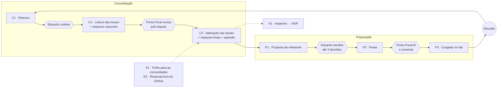

# Roteiro de prompts — preparar e consolidar as reuniões de governança da arquitetura

> **O que este documento é.** Os pedidos (*prompts*) que Eduardo cola no agente de IA em cada
> momento do ciclo das reuniões. O **procedimento** não está aqui: está nos passos do
> [ciclo](README.md#o-ciclo-do-registro-da-reunião-aos-documentos) e na
> [Revisão das Issues](README.md#revisão-das-issues--obrigatória). Cada prompt só diz ao agente
> **qual passo executar** e **onde parar**. Se o procedimento muda, muda o README; o prompt continua
> o mesmo.
>
> **Para quem.** Eduardo, que opera a IA. A linha "O que cada pessoa faz" mostra a cada participante
> quando chega a sua vez. O guia para quem não é técnico é o
> [guia da governança da arquitetura](../../../ComecePorAqui/guia-governanca-arquitetura.md).

## Regras de uso

1. **Um prompt por momento; todo prompt para num portão.** Portão é o ponto em que uma pessoa
   confere antes de o ciclo seguir: a conferência de Eduardo, a revisão do Ponto-Focal, a escolha
   da *milestone*. O agente nunca passa de um portão no mesmo pedido.
2. **Primeiro validar, depois derivar.** Nada que o Ponto-Focal lê (*Issues*, pauta) muda antes de o
   resumo estar validado. Por isso C2 só lê as *Issues*, e C3 só roda depois do *pull request*.
3. **Os campos `<…>` são trocados antes de colar.** O resto é colado como está.
4. **Registro literal.** O prompt colado entra completo no
   [registro de prompts](../../Pesquisa/IA/registro-de-prompts.md), com os campos já trocados, e o
   código do roteiro (`roteiro C2`) no campo "Skills invocadas". Uma mudança feita na hora fica
   visível na comparação com este documento.
5. **A IA propõe; uma pessoa decide.** Nenhum prompt pede ao agente que responda a uma questão de
   desenho ou fale pelas comunidades.

## Visão geral



| Momento | Prompt | Passos do ciclo | Para em |
|---|---|---|---|
| Consolidação | [C1 — Resumo da reunião](#c1--resumo-da-reunião) | 2 | Conferência de Eduardo (3) |
| | [C2 — Leitura das Issues e impactos em rascunho](#c2--leitura-das-issues-e-impactos-em-rascunho) | 4, 5 | Revisão do Ponto-Focal (6) |
| | [C3 — Aplicação, impactos finais e episódio](#c3--aplicação-impactos-finais-e-episódio) | 7, 8, 11 | — |
| Preparação | [P1 — Proposta de milestone](#p1--proposta-de-milestone) | leitura, 9 | Escolha de Eduardo |
| | [P2 — Pauta](#p2--pauta) | 10 | Leitura do Ponto-Focal |
| | [P3 — Congelar a pauta](#p3--congelar-a-pauta) | 12 | — |
| Entre reuniões | [E1 — Folha para levar às comunidades](#e1--folha-para-levar-às-comunidades) | — | — |
| | [E2 — Resposta recebida fora do GitHub](#e2--resposta-recebida-fora-do-github) | — | — |
| Depois do ciclo | [A1 — Dos impactos confirmados a uma ADR](#a1--dos-impactos-confirmados-a-uma-adr) | ato próprio | Revisão de Eduardo |

---

## Consolidação — depois da reunião

### C1 — Resumo da reunião

**Quando:** a transcrição do Tactiq está salva como `docs/Governanca/Arquitetura/Reunioes/<AAAA-MM-DD>-transcricao.txt`
(o `.gitignore` mantém os `.txt` fora do repositório).

**O que cada pessoa faz:** Eduardo cola o prompt e depois confere o resumo contra a transcrição.
Sofia ainda não faz nada.

```text
Roteiro C1. Reunião de governança da arquitetura de <AAAA-MM-DD>.
Transcrição: docs/Governanca/Arquitetura/Reunioes/<AAAA-MM-DD>-transcricao.txt
Pauta congelada: docs/Governanca/Arquitetura/Reunioes/<AAAA-MM-DD>-pauta-reuniao-<fórum>.md
Execute o passo 2 do ciclo de docs/Governanca/Arquitetura/README.md: gere o resumo
Reunioes/<AAAA-MM-DD>-reuniao-<fórum>.md pelas "Regras de cada documento" (Resumo), com
"Revisão: pendente" no cabeçalho, a seção "Da pauta" e cada decisão ligada à Issue que ela fecha
ou abre. Marque nas "Notas de leitura da transcrição" toda leitura incerta.
Não crie, feche nem comente Issues. Não gere impactos nem pauta. Pare e me mostre a lista de
decisões e as leituras incertas, para a minha conferência.
```

### C2 — Leitura das Issues e impactos em rascunho

**Quando:** Eduardo conferiu o resumo (passo 3) e fez o commit dele.

**O que cada pessoa faz:** Eduardo cola o prompt, confere a tabela de ações e avisa Sofia de que o
resumo está pronto para a revisão dela. Sofia revisa o resumo por *pull request*
([guia do GitHub](../../../ComecePorAqui/guia-github.md)), ou diz que não há correção.

```text
Roteiro C2. Reunião de <AAAA-MM-DD>; resumo conferido por mim.
Execute os passos 4 e 5 do ciclo de docs/Governanca/Arquitetura/README.md:
1. Revisão das Issues — leitura: todas as abertas e as fechadas desde <AAAA-MM-DD da reunião
   anterior>, uma por uma, com os comentários; as sete perguntas da seção "Revisão das Issues".
2. Gere Reunioes/<AAAA-MM-DD>-impactos-reuniao-<fórum>.md marcado "sujeito à revisão do
   Ponto-Focal", com a tabela | Issue | Antes | Ação | Depois | Por quê |.
Só leia as Issues: não crie, feche, comente nem troque etiquetas. Não mexa no estado consolidado
nem na pauta. Pare e me mostre a tabela de ações propostas.
```

### C3 — Aplicação, impactos finais e episódio

**Quando:** o resumo está validado: *pull request* de Sofia incorporado, ou "sem correções".

**O que cada pessoa faz:** Eduardo cola o prompt e confere as *Issues* alteradas. Sofia recebe os
avisos do GitHub das *Issues* novas e comentadas.

```text
Roteiro C3. Reunião de <AAAA-MM-DD>; resumo validado pelo Ponto-Focal em <PR #N | "sem correções", DD/MM>.
Execute os passos 7, 8 e 11 do ciclo de docs/Governanca/Arquitetura/README.md:
1. Refaça a Revisão das Issues — leitura com o resumo validado; mostre o que mudou em relação à
   tabela do rascunho.
2. Aplique a tabela, em lote: feche (comentário de formato fixo de
   docs/tecnico/agents/issue-tracker.md), crie pelo modelo .github/ISSUE_TEMPLATE/questao.yml,
   comente, troque etiquetas e milestone; atualize "Decisões até agora" no mapa (Issue #6).
3. Tire a marca de rascunho do documento de impactos, ajuste às correções e atualize
   docs/tecnico/impactos-na-arquitetura.md (Situação, Questão aberta, Histórico).
4. Acrescente o episódio da reunião em docs/Pesquisa/IA/uso-de-ia.md, com o campo Issues.
5. Atualize o índice das reuniões no README e docs/tecnico/proximosPassos.md.
Não gere a pauta. Faça um commit só e me mostre a lista de Issues alteradas.
```

---

## Preparação — antes da reunião seguinte

### P1 — Proposta de milestone

**Quando:** de 5 a 7 dias antes da reunião, ou assim que houver data.

**O que cada pessoa faz:** Eduardo cola o prompt e escolhe as decisões. Sofia pode trocar uma
questão por outra, comentando na *Issue*.

```text
Roteiro P1. Próxima reunião de governança da arquitetura: <AAAA-MM-DD | sem data>.
Faça a Revisão das Issues — leitura de docs/Governanca/Arquitetura/README.md (abertas e
fechadas desde <AAAA-MM-DD da última reunião>, com os comentários). Depois, para o passo 9,
proponha a milestone: no máximo três questões "decisao" pelo critério "o que destrava mais",
com uma linha de justificativa cada, mais os informes e as "para-comunidades" ainda não levadas.
Mostre também as questões que ficam de fora e por quê.
Não altere nenhuma Issue nem a milestone. Pare e espere a minha escolha.
```

### P2 — Pauta

**Quando:** Eduardo escolheu as questões da *milestone*.

**O que cada pessoa faz:** Eduardo cola o prompt, confere a pauta e manda o *link* a Sofia. Sofia
lê e comenta nas *Issues*. Se uma questão muda, Eduardo cola o P2 de novo.

```text
Roteiro P2. Escolhi para a milestone <nome da milestone>: <#N, #N, #N> (decisões) e <#N, …> (informes).
1. Ponha estas Issues na milestone e tire as que não escolhi.
2. Execute o passo 10 do ciclo de docs/Governanca/Arquitetura/README.md: refaça a Revisão das
   Issues — leitura de hoje e gere Reunioes/proxima-pauta-reuniao-<fórum>.md pelas regras da
   Pauta (até 3 decisões com as quatro partes, informes em uma linha, "Para levar às
   comunidades", "Andando fora da pauta", links completos, nenhum outro código, até 1.000
   palavras). Informe a contagem de palavras.
Não feche nem comente Issues. Pare e me mostre a pauta.
```

### P3 — Congelar a pauta

**Quando:** no dia da reunião, antes de ela começar.

**O que cada pessoa faz:** Eduardo cola o prompt. Na reunião, todos usam a pauta congelada.

```text
Roteiro P3. Hoje, <AAAA-MM-DD>, é o dia da reunião.
Execute o passo 12 do ciclo de docs/Governanca/Arquitetura/README.md: git mv da próxima pauta
para Reunioes/<AAAA-MM-DD>-pauta-reuniao-<fórum>.md, renomeie a milestone para
"Reunião <AAAA-MM-DD>" com a data como prazo, crie a milestone "Próxima reunião" vazia, corrija
os links para a pauta (README, metodo-de-evolucao.md, mapa #6) e faça o commit.
Não mude o texto da pauta.
```

---

## Entre reuniões

### E1 — Folha para levar às comunidades

**Quando:** Sofia vai a uma reunião dos Guardiões ou do Conselho do UseFlora.

**O que cada pessoa faz:** Eduardo cola o prompt e manda a folha a Sofia. Sofia leva a folha e
traz as respostas (ver E2).

```text
Roteiro E1. Gere uma folha de uma página, para imprimir, com as Issues abertas
"para-comunidades" <todas | #N, #N>. Para cada uma: a pergunta em linguagem simples e, em duas
frases, por que ela importa. Sem links, sem códigos, sem termos técnicos. Nenhum conhecimento
tradicional, nome de detentor ou local. Não grave no repositório: me mostre o texto.
```

### E2 — Resposta recebida fora do GitHub

**Quando:** uma resposta chegou por e-mail, mensagem ou conversa, e não por comentário na *Issue*.

**O que cada pessoa faz:** Eduardo cola o prompt com a resposta. Quem respondeu confere o
comentário pelo aviso do GitHub.

```text
Roteiro E2. Resposta à Issue #<N>, dada por <pessoa> em <DD/MM>, por <e-mail | mensagem | conversa>:
"<texto da resposta, sem conhecimento tradicional nem dado pessoal>"
Comente na Issue com "Resposta trazida por <pessoa> em <DD/MM>, por <meio>:" e o texto.
Se a resposta fecha a questão, proponha o comentário de fechamento de formato fixo
(docs/tecnico/agents/issue-tracker.md) e espere a minha confirmação antes de fechar.
```

---

## Depois do ciclo

### A1 — Dos impactos confirmados a uma ADR

**Quando:** o estado consolidado tem itens `confirmado` que alimentam a mesma ADR.

**O que cada pessoa faz:** Eduardo cola o prompt e revisa a ADR proposta. Quando a ADR muda uma
regra que o Ponto-Focal discutiu, Eduardo avisa na *Issue* de origem.

```text
Roteiro A1. ADR de destino: <ADR-0NN — título | nova>.
Em docs/tecnico/impactos-na-arquitetura.md, filtre os blocos com "Situação: confirmado" e
"Alimenta: <ADR-0NN>". Siga os links de Origem até os resumos. Escreva a ADR em
docs/tecnico/architecture-decisions/ pelo formato das ADRs existentes, com estado "Proposto", cada
regra citando o item I-xx e a decisão de origem. Liste os documentos de destino que a ADR obriga a
mudar (CONTEXT.md, modelo de dados, contrato de harvest, C4), sem mudá-los.
Depois de eu aceitar: marque os itens como "aplicado", com a ADR e o commit, e registre no
CHANGELOG.md.
```

Para outro destino (CONTEXT.md, modelo de dados, contrato de *harvest*), use o mesmo prompt com o
destino trocado.
