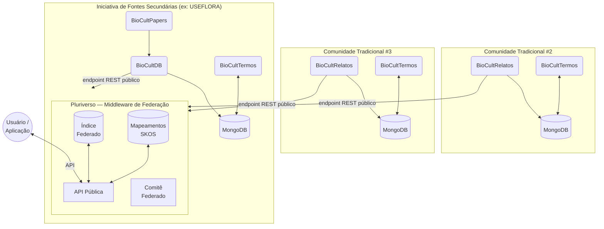

# ADR-004: Arquitetura Federada v3.0

## Status

**Aceito** — Junho 2026

## Contexto

A versão 2.0 da Arquitetura BioCultural operava com um MongoDB compartilhado entre todos os componentes (BioCultDB, BioCultTermos, BioCultRelatos). Embora funcional, esse modelo centralizado cria uma contradição estrutural com os princípios **C.A.R.E.** (Collective Benefit, Authority to Control, Responsibility, Ethics):

- Uma iniciativa de sistematização de fontes secundárias (ex: USEFLORA) e uma comunidade tradicional que registra seu próprio conhecimento primário **não deveriam compartilhar infraestrutura de dados**. A comunidade não tem controle real sobre seus dados se eles residem em um banco gerido por uma terceira instituição.
- A escalabilidade para múltiplas comunidades independentes exige que cada uma seja **soberana na gestão de seus próprios dados**.
- Iniciativas institucionais e comunidades tradicionais possuem governanças, ciclos de vida e políticas de acesso radicalmente distintos.

A versão 3.0 redefine a arquitetura como **explicitamente federada**: cada entidade (iniciativa de fontes secundárias ou comunidade tradicional) é completamente independente e soberana. O **Pluriverso** é introduzido como middleware de federação, servindo como ponto único de acesso ao conjunto federado de CTAs.

## Decisões

### D1 — Modelo de Acesso do Pluriverso: Harvest Periódico (Push por REST)

Cada membro da federação expõe um **endpoint REST paginado** com seus registros públicos. O Pluriverso agenda coletas periódicas nesses endpoints e mantém um **índice central** dos dados públicos.

**Alternativas descartadas:**
- *Pull em tempo real (query federada)*: latência alta, disponibilidade dependente de todos os membros simultaneamente, complexidade de agregação distribuída.
- *Push direto (membro notifica Pluriverso)*: menor latência, mas exige que cada membro implemente chamada ao Pluriverso e gerencie retries — acoplamento indesejado.

**Consequência:** Delay de até N horas (configurável) entre publicação no membro e visibilidade no índice do Pluriverso. Aceitável dado que os dados são de natureza científica e cultural, não transacional.

### D2 — Gestão Terminológica: BioCultTermos por Membro + Mapeamento Federado

Cada membro opera sua **própria instância do BioCultTermos** com seu `skos:ConceptScheme` soberano. O Pluriverso mantém uma **camada de mapeamento semântico** com `skos:exactMatch`, `skos:closeMatch` e `skos:broadMatch` entre conceitos de membros diferentes.

**Alternativas descartadas:**
- *BioCultTermos compartilhado central*: viola CARE — quem administra o BioCultTermos central controla os vocabulários de todos os membros.
- *Sem mapeamento central*: usuário recebe termos sem harmonização, impossibilitando buscas semânticas federadas.

**Consequência:** O Pluriverso assume responsabilidade pela curadoria dos mapeamentos semânticos entre membros. Esse é um esforço contínuo que requer um curador da federação com conhecimento de SKOS-XL.

### D3 — Governança do Pluriverso: Comitê Federado

O Pluriverso é governado por um **comitê composto por representantes de cada membro**. Decisões sobre admissão/remoção de membros, contrato de publicação, e mapeamentos semânticos são tomadas por consenso ou maioria qualificada, conforme protocolo de governança a ser definido pelo comitê.

**Alternativas descartadas:**
- *Instituição âncora*: cria dependência institucional e pode ser percebida como centralização velada por comunidades tradicionais.
- *Sem governança formal*: sem regras claras, o primeiro conflito entre membros fica sem mediação.

**Consequência:** A federação é mais lenta para decidir, mas suas decisões têm legitimidade junto às comunidades. O protocolo de governança (quórum, mandatos, processo de votação) deve ser documentado separadamente.

### D4 — Política de Saída de Membro: Remoção Imediata e Completa

Quando um membro decide sair da federação, **todos os seus dados são removidos imediatamente do índice central do Pluriverso**, incluindo os mapeamentos SKOS que envolvem seus conceitos. O processo é auditável.

**Alternativas descartadas:**
- *Remoção com período de carência*: membro perde controle por N dias — viola CARE.
- *Dados permanecem anonimizados*: dado ainda circula sem consentimento do membro — viola CARE.

**Consequência:** O Pluriverso deve implementar operação `purge_by_member(member_id)` que remove registros e mapeamentos. Pesquisadores que dependiam dos dados desse membro veem um gap nos resultados — isso é o comportamento correto e esperado segundo os princípios CARE.

### D5 — Posição do MongoDB: Pertence à Iniciativa #1

O MongoDB atualmente em uso pelo BioCultDB e BioCultTermos deixa de ser "recurso compartilhado da arquitetura" e passa a ser **recurso de infraestrutura pertencente à iniciativa de fontes secundárias** (Iniciativa #1). A mudança é conceitual e de documentação — não há movimentação de dados.

**Consequência:** Cada novo membro que entrar na federação (comunidade ou nova iniciativa) opera seu próprio MongoDB. A Iniciativa #1 (BioCultDB + BioCultTermos + BioCultPapers) continua usando seu MongoDB existente.

### D6 — Protocolo de Publicação: Harvest REST Paginado

Cada membro expõe um endpoint REST que retorna seus registros públicos de forma paginada (ex: `GET /api/federation/records?page=1&size=100`). O Pluriverso coleta periodicamente.

O contrato mínimo do endpoint:
- Retorna apenas registros com `visibility: public`
- Paginação obrigatória
- Suporte a filtro por `updated_since` para coletas incrementais
- Identificador único de registro estável (`member_id` + `record_id`)

**Consequência:** Cada membro (BioCultDB, BioCultRelatos, futuras implementações) precisa implementar esse endpoint. É a única dependência técnica que membros têm em relação à federação.

### D7 — Posição do BioCultPapers: Exclusivo de Iniciativas de Fontes Secundárias

O BioCultPapers é ferramenta especializada em extração de CTA de literatura científica (PDFs). Permanece como componente exclusivo de **iniciativas de fontes secundárias**. Comunidades tradicionais que registram conhecimento primário usam BioCultRelatos.

**Alternativas descartadas:**
- *BioCultPapers como ferramenta genérica*: torna o diagrama ambíguo e dilui a distinção conceitual primário/secundário.
- *BioCultPapers como serviço da federação*: cria dependência central desnecessária.

**Consequência:** A linha conceitual primário/secundário permanece clara na arquitetura. Uma comunidade que quiser sistematizar literatura científica sobre si mesma cria uma instância de iniciativa de fontes secundárias separada.

## Diagrama da Arquitetura Federada



## Contrato de Publicação (endpoint de harvest)

Cada membro deve implementar:

```
GET /api/federation/records
  ?page=<int>          # paginação, obrigatório
  &size=<int>          # registros por página (máx. 500)
  &updated_since=<ISO> # coleta incremental, opcional

Resposta:
{
  "member_id": "iniciativa-useflora",
  "total": 1523,
  "page": 1,
  "records": [
    {
      "id": "<member_id>/<record_id>",
      "visibility": "public",
      "updated_at": "2026-06-01T00:00:00Z",
      "data": { ... }  // campos definidos pelo Comitê Federado
    }
  ]
}
```

## Necessidades de Implementação por Componente

| Componente | Mudanças necessárias para v3.0 |
|---|---|
| **BioCultDB** | Implementar endpoint `/api/federation/records`; remover pressuposto de MongoDB compartilhado |
| **BioCultPapers** | Nenhuma — alimenta o MongoDB da Iniciativa #1 como hoje |
| **BioCultTermos** | Cada instância torna-se soberana; publicar `ConceptScheme` via endpoint para harvest pelo Pluriverso |
| **BioCultRelatos** | Implementar endpoint `/api/federation/records`; implementar CLPI antes de `visibility: public` |
| **Pluriverso** | Novo componente: harvest scheduler, índice central, mapeamento SKOS, API pública, interface de governança |

## Consequências

### Positivas
- CARE implementado na essência: cada membro é soberano sobre seus dados
- Escalabilidade: novos membros entram sem alterar infraestrutura existente
- Resiliência: falha de um membro não afeta o índice central
- Interoperabilidade semântica via mapeamentos SKOS-XL no Pluriverso

### Negativas
- Delay no índice federado (harvest periódico, não tempo real)
- Curadoria de mapeamentos semânticos é esforço humano contínuo
- Cada membro precisa implementar e manter o endpoint de publicação
- Governança por comitê é mais lenta que decisão centralizada

### Mitigações
- Delay: configurar frequência de harvest por urgência do dado (diária para dados científicos é adequado)
- Mapeamentos: iniciar com mapeamentos automáticos por similaridade, validar manualmente
- Endpoint: fornecer biblioteca de referência (SDK) para facilitar implementação pelos membros

## Referências

- [Princípios CARE para Governança de Dados Indígenas](https://www.gida-global.org/care)
- [SKOS-XL W3C Recommendation](https://www.w3.org/TR/skos-reference/skos-xl.html)
- [ADR-001: Abordagem de Armazenamento de Dados](ADR-001-database-selection.md)
- [ADR-002: Padrões de API e Integração](ADR-002-api-standards.md)
- [ADR-003: Modelo de Dados para Conhecimento Tradicional](ADR-003-data-model.md)
- [NIKMAS — National Indigenous Knowledge Management System](https://www.sahra.org.za/)

## Data de Revisão

Revisar após implementação do endpoint de harvest no BioCultDB e primeira coleta pelo Pluriverso (estimado: final de 2026).
