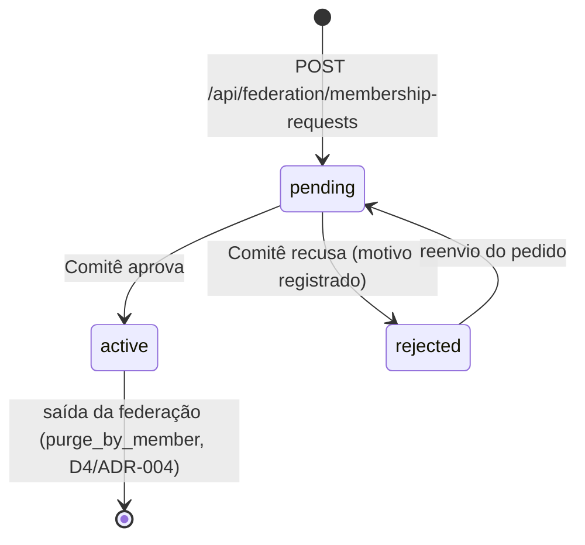

# ADR-006: Protocolo de Inscrição na Federação

## Status

**Aceito** — Julho 2026

## Contexto

O ADR-004 estabeleceu a arquitetura federada e definiu, entre outras decisões, **D3 — Governança do Pluriverso: Comitê Federado** ("decisões sobre admissão/remoção de membros... são tomadas por consenso ou maioria qualificada") e **D6 — Protocolo de Publicação: Harvest REST Paginado** (o contrato mínimo do endpoint que cada membro expõe). Nenhuma das duas decisões, porém, especifica **como** uma instância nova chega até a decisão do Comitê: não há mecanismo técnico de inscrição, formulário, fila de pedidos ou verificação de que a URL de um candidato a membro realmente implementa o contrato de harvest.

Essa lacuna se torna concreta com a ampliação da federação para quatro tipos de membro (v3.2): Fontes Secundárias, Comunidade Tradicional, Acervos Históricos/Museológicos e Obras de Naturalistas. Comunidades e instituições que já operam sua própria instância (BioCultDB, BioCultRelatos, BioCultAcervos ou BioCultNaturalistas) precisam de um caminho autoatendido para solicitar entrada na federação, sem abrir mão da governança humana exigida por D3.

## Decisão

Adotar um **protocolo de inscrição self-service com fila de aprovação do Comitê Federado**, nunca admissão automática. A decisão se desdobra em cinco pontos (E1–E5):

### E1 — Cadastro Self-Service pela Própria Interface do Pluriverso

A mesma interface pública usada para consultas federadas ganha um formulário de inscrição, acessível a qualquer comunidade ou instituição. O solicitante informa:

- **Nome do membro**
- **Tipo de membro** (`fontes_secundarias` | `comunidade_tradicional` | `acervos_historicos` | `obras_naturalistas`) — determina qual ferramenta se espera encontrar na URL-BASE (BioCultDB, BioCultRelatos, BioCultAcervos ou BioCultNaturalistas, respectivamente)
- **URL-BASE** da instância já em operação (ex.: `https://minha-comunidade.example.org`)
- **Contato responsável** (e-mail)
- **Declaração de conformidade C.A.R.E.**

**Alternativas descartadas:**
- *Inscrição só por Git (PR ao registry)*: exige literacia em Git de todo candidato a membro — barreira alta para comunidades tradicionais e acervos museológicos, público-alvo primário da v3.2.
- *Admissão só por convite pessoal do mantenedor*: não escala e recria um ponto único de decisão, na prática, mesmo com Comitê nominal.

**Consequência:** o Pluriverso passa a expor uma superfície de escrita pública (`POST /api/federation/membership-requests`), que exige tratamento como fronteira de confiança (ver E3).

### E2 — Fila de Estados: `pending` → `active` | `rejected`

Todo pedido nasce em `pending`. Só o Comitê Federado move um pedido para `active` (aprovado, entra no agendador de harvest) ou `rejected` (recusado, com motivo obrigatório registrado). Um pedido `rejected` pode ser reenviado pelo solicitante, voltando a `pending`.

**Alternativas descartadas:**
- *Aprovação automática se o probe técnico (E3) passar*: viola D3 — verificação técnica não substitui avaliação humana de legitimidade, conformidade C.A.R.E. e adequação do tipo de membro.
- *Estado intermediário de "revisão" separado de "pendente"*: complexidade desnecessária para o volume esperado de pedidos; dois estados (pendente/decidido) bastam.

**Consequência:** o Comitê precisa de uma superfície de trabalho (lista de `pending` + metadados) para decidir — não necessariamente um painel dedicado; uma listagem simples (`GET /api/federation/membership-requests?status=pending`) atende ao estágio inicial.

### E3 — Verificação Técnica Automática como Sinal, Nunca como Gate

Antes de entrar visível na fila, o Pluriverso faz probe em `{URL-BASE}/api/federation/records?page=1&size=1` — o mesmo contrato definido no ADR-004/D6. O probe confere: resposta paginada válida, presença de `visibility` e `member_id`, **HTTPS obrigatório**, e bloqueio de IP privado/loopback/link-local (RFC1918, `127.0.0.0/8`, `169.254.0.0/16` etc. — mitigação de SSRF, já que o Pluriverso está prestes a fazer uma requisição de saída para uma URL fornecida por terceiro não autenticado). O resultado (ok/erro, timestamp) fica anexado ao pedido e visível ao Comitê, mas **não bloqueia** a entrada na fila — um endpoint ainda não pronto pode ser um pedido antecipado legítimo.

**Alternativas descartadas:**
- *Rejeitar automaticamente pedidos com probe falho*: candidato pode estar em fase de implantação; rejeição automática perde o pedido em vez de dar visibilidade ao Comitê para orientar o solicitante.
- *Sem probe algum*: Comitê teria que testar manualmente cada URL — repete trabalho que a máquina faz melhor e mais rápido.

**Consequência:** o Pluriverso precisa de um cliente HTTP com timeout curto, allowlist de esquema (`https://` apenas) e resolução de DNS validada contra ranges privados antes de conectar.

### E4 — Autenticação da Decisão do Comitê (fora de escopo deste ADR)

A ativação/recusa de um pedido (`PATCH /api/federation/membership-requests/{id}`) exige que quem decide seja identificável como membro do Comitê Federado. O mecanismo concreto de autenticação (conta individual, token compartilhado, SSO) é **decisão de implementação do Pluriverso**, não deste ADR — fica registrado como requisito não-funcional a resolver antes do primeiro deploy com inscrição aberta.

**Consequência:** o endpoint de decisão não pode ser implementado como rota pública sem autenticação; é bloqueador para abrir a fila de inscrição em produção.

### E5 — `member_id` Não é Reciclado

Uma vez gerado (na aprovação), um `member_id` nunca é reatribuído a outro solicitante, mesmo que o pedido original seja recusado depois de ativo (saída da federação) ou que o mesmo nome seja reenviado. Evita colisão de identidade em mapeamentos SKOS-XL que referenciam `member_id` de forma permanente (ADR-004, seção "Transparência de Origem").

**Consequência:** o gerador de `member_id` precisa checar unicidade contra o histórico completo de pedidos, não só contra membros `active`.

## Modelo de Dados Mínimo

Tabela `membership_requests` (mesmo padrão de persistência SQLite+JSON do ADR-005):

| Campo | Tipo | Notas |
|---|---|---|
| `id` | TEXT (UUID) | chave primária |
| `member_name` | TEXT | nome informado pelo solicitante |
| `member_type` | TEXT | `fontes_secundarias` \| `comunidade_tradicional` \| `acervos_historicos` \| `obras_naturalistas` |
| `url_base` | TEXT | URL-BASE da instância |
| `contact_email` | TEXT | contato responsável |
| `care_declaration` | TEXT | declaração de conformidade C.A.R.E. |
| `status` | TEXT | `pending` \| `active` \| `rejected` |
| `technical_check` | TEXT (JSON) | resultado do probe (E3): ok/erro, timestamp |
| `member_id` | TEXT | gerado só na aprovação (E5); `NULL` até então |
| `created_at` / `decided_at` | TEXT (ISO-8601) | |
| `decided_by` | TEXT | identificador do membro do Comitê que decidiu |
| `rejection_reason` | TEXT | obrigatório quando `status = rejected` |

## Consequências

### Positivas
- Comunidades e instituições sem literacia em Git conseguem solicitar entrada na federação pela mesma interface que já usam para consultar dados.
- Governança humana (D3) permanece intacta — nenhum pedido vira membro sem decisão explícita do Comitê.
- Verificação técnica automática poupa o Comitê de testar manualmente cada endpoint, sem transformar isso em gate automático.

### Negativas
- Superfície de escrita pública nova (`POST /api/federation/membership-requests`) é alvo potencial de spam e SSRF.
  - *Mitigação*: rate limit no endpoint de submissão; validação anti-SSRF no probe (E3); HTTPS obrigatório.
- Fila de aprovação depende de o Comitê revisar pedidos com regularidade — sem isso, vira gargalo.
  - *Mitigação*: fica fora do escopo técnico deste ADR; é responsabilidade de processo do Comitê, a documentar em seu protocolo de governança (ADR-004, D3).
- Autenticação da decisão do Comitê (E4) é pré-requisito não resolvido aqui — bloqueia deploy em produção da fila de inscrição até ser definida.

## Relações

- Complementa **D3** e **D6** do ADR-004 (Arquitetura Federada) — não os substitui; a decisão de *quem* aprova (D3) e o contrato do harvest (D6) permanecem como estão.
- Usa o padrão de persistência do **ADR-005** (SQLite+JSON) para a tabela `membership_requests` no Índice Central do Pluriverso.

## Referências

- [ADR-004: Arquitetura Federada v3.0](ADR-004-federated-architecture.md)
- [ADR-005: Persistência SQLite com JSON por Unidade Federada (v3.1)](ADR-005-sqlite-json-persistence.md)
- [OWASP SSRF Prevention Cheat Sheet](https://cheatsheetseries.owasp.org/cheatsheets/Server_Side_Request_Forgery_Prevention_Cheat_Sheet.html)

## Data de Revisão

Revisar após a primeira inscrição real processada pelo Pluriverso em produção (estimado: junto da primeira implementação de código do Pluriverso).
