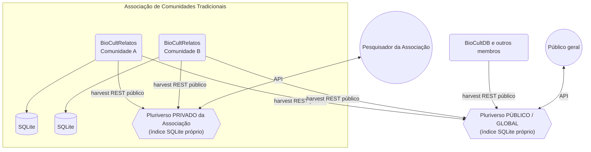

# ADR-009: Topologia Multi-Instância do Pluriverso

## Status

**Aceito** — Julho 2026

## Contexto

- O ADR-004 introduziu o Pluriverso como "middleware de federação" e, implicitamente, como **instância
  única** ("o único componente com visão de todos os membros").
- Cenário concreto novo: uma **associação de comunidades tradicionais** opera **vários `BioCultRelatos`** e
  quer uma **instância própria do Pluriverso** para federar/acessar os dados das suas comunidades, sem
  depender do Pluriverso público global.
- Isso generaliza o Pluriverso de singleton para **componente instanciável em múltiplos escopos**.

## Requisitos

### Funcionais

- Múltiplas instâncias do Pluriverso devem poder coexistir sem infraestrutura compartilhada
- Cada instância mantém sua própria lista de membros e fila de inscrição
- Um mesmo membro pode ser coletado por mais de uma instância simultaneamente

### Não-Funcionais

- Auto-hospedagem trivial por associações com recursos técnicos limitados
- Nenhuma hierarquia de governança entre instâncias
- Soberania de dados dos membros preservada independentemente do número de instâncias que os coletam

## Opções Consideradas

### Opção 1: Pluriverso permanece singleton global — rejeitada

**Prós:**
- Modelo mais simples; um único índice, uma única governança

**Contras:**
- Não atende ao cenário de associação que quer federar apenas os `BioCultRelatos` das suas próprias
  comunidades, sem depender de infraestrutura, governança ou disponibilidade de um Pluriverso público de
  terceiros
- Contradiz a soberania de federação: a associação ficaria refém de um comitê externo para acessar dados de
  suas próprias comunidades

### Opção 2: Pluriverso instanciável, cada instância soberana e autocontida — escolhida

**Prós:**
- Cada associação/organização pode operar sua própria instância, com sua própria governança e escopo
- Engine embutida sem servidor (ADR-008) torna cada instância trivial de auto-hospedar
- Não exige nenhuma mudança no contrato de harvest REST dos membros (ADR-004/D6) — múltiplos coletores
  lendo o mesmo endpoint público são inofensivos
- Sem hierarquia entre instâncias: preserva a filosofia do "pluriverso" (múltiplos mundos autônomos)

**Contras:**
- Mapeamentos SKOS e curadoria semântica duplicados entre instâncias que compartilham membros — *mitigação*:
  aceitável, cada instância é soberana sobre sua própria curadoria
- Sem visão cross-instância — *mitigação*: coerente com soberania, não é um requisito

## Decisão

O Pluriverso passa a ser **instanciável em múltiplos escopos**, não mais um singleton global. A decisão se
desdobra em sete pontos (MI1–MI7):

- **MI1 — O Pluriverso é instanciável, não singleton.** Podem coexistir múltiplas instâncias: uma
  pública/global (referência) e instâncias privadas/escopadas (ex.: de uma associação). Cada instância é
  soberana e autocontida.
- **MI2 — Cada instância = um container + um arquivo SQLite próprio (ADR-008).** Nenhuma infraestrutura
  compartilhada entre instâncias; auto-hospedagem trivial. A soberania estende-se à **camada de federação**,
  não só aos membros.
- **MI3 — Membership escopado por instância.** Cada instância mantém sua própria lista de membros e sua
  própria fila de inscrição (`membership_requests`, ADR-006). A instância da associação federa **apenas** os
  `BioCultRelatos` das suas comunidades.
- **MI4 — Um membro pode ser coletado por mais de uma instância simultaneamente.** Harvest é apenas
  **leitura do endpoint REST público** do membro (ADR-004/D6); múltiplos coletores lendo o mesmo endpoint
  público não violam a soberania do membro. Um mesmo `BioCultRelatos` pode estar no Pluriverso global **e**
  no da associação.
- **MI5 — `member_id` é escopado por instância.** Gerado por cada Pluriverso na aprovação (ADR-006/E5); o
  mesmo membro tem `member_id` distinto em instâncias distintas. Não há registro global de identidade entre
  instâncias; mapeamentos SKOS são locais a cada instância.
- **MI6 — Governança por instância.** Cada instância tem seu próprio Comitê Federado (ADR-004/D3) no seu
  escopo. A associação governa sua federação privada; o Comitê global governa a pública. **Sem hierarquia**
  entre instâncias.
- **MI7 — Acesso a dados: público agora; harvest autenticado para `restricted` como extensão futura.** Hoje
  **toda** instância (pública ou privada) coleta apenas `visibility: public` do endpoint público — a
  instância privada difere por **escopo** (só os membros da associação) e por **soberania de federação**, não
  por acesso a dados adicionais. **Extensão futura documentada (não implementada agora):** um harvester
  autenticado por token poderia receber também registros `restricted` compartilhados dentro da associação;
  exigiria estender o contrato de harvest (ADR-004/D6, ADR-006) com autenticação + escopo de visibilidade por
  harvester, a ser formalizado em ADR próprio quando/se necessária.

### Diagrama

Um membro (`BioCultRelatos` de uma comunidade da associação) coletado pelo Pluriverso privado da associação
**e** pelo global:

## Consequências

### Positivas

- Soberania na camada de federação; associações auto-hospedam; resiliência; busca focada/curada por escopo

### Negativas

- Mapeamentos SKOS e curadoria **duplicados** entre instâncias que compartilham membros
- Sem visão cross-instância — aceitável e coerente com soberania
- `member_id` distinto por instância pode confundir proveniência

### Mitigações

- Duplicação de curadoria é aceitável no contexto de soberania: cada instância decide sua própria
  harmonização semântica
- `member_id` sempre atribuído e interpretado **relativo à instância** que o gerou; nunca tratado como
  identidade global

## Relações

- Estende o **ADR-004** (remove a premissa implícita de instância única; D1–D7 valem por instância)
- Complementa o **ADR-006** (fila de inscrição passa a ser por instância; protocolo em si inalterado)
- Depende do **ADR-008** (engine embutida sem servidor viabiliza N instâncias)

## Referências

- [ADR-004: Arquitetura Federada v3.0](ADR-004-federated-architecture.md)
- [ADR-006: Protocolo de Inscrição na Federação](ADR-006-federation-membership-protocol.md)
- [ADR-008: Engine de Banco de Dados do Pluriverso](ADR-008-pluriverso-database-engine.md)
- Princípios CARE (Collective Benefit, Authority to Control, Responsibility, Ethics)

## Data de Revisão

Após a primeira instância privada real de Pluriverso operada por uma associação.
