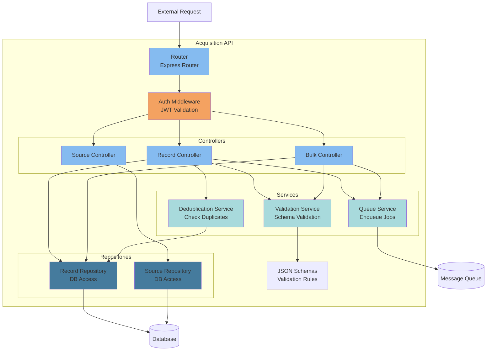
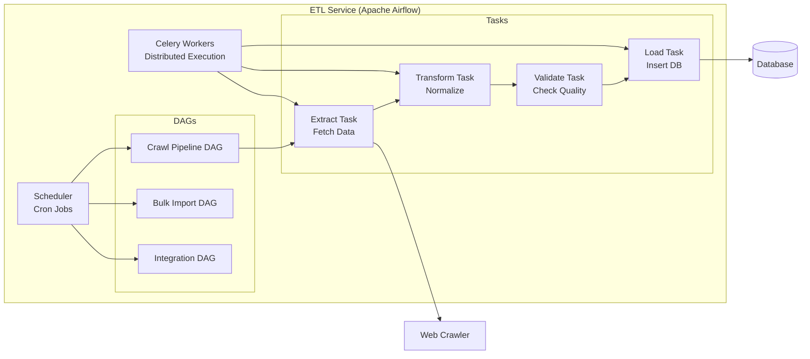
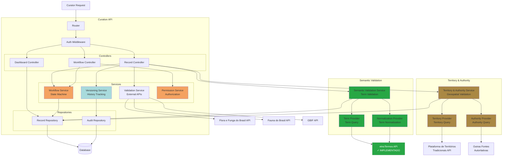
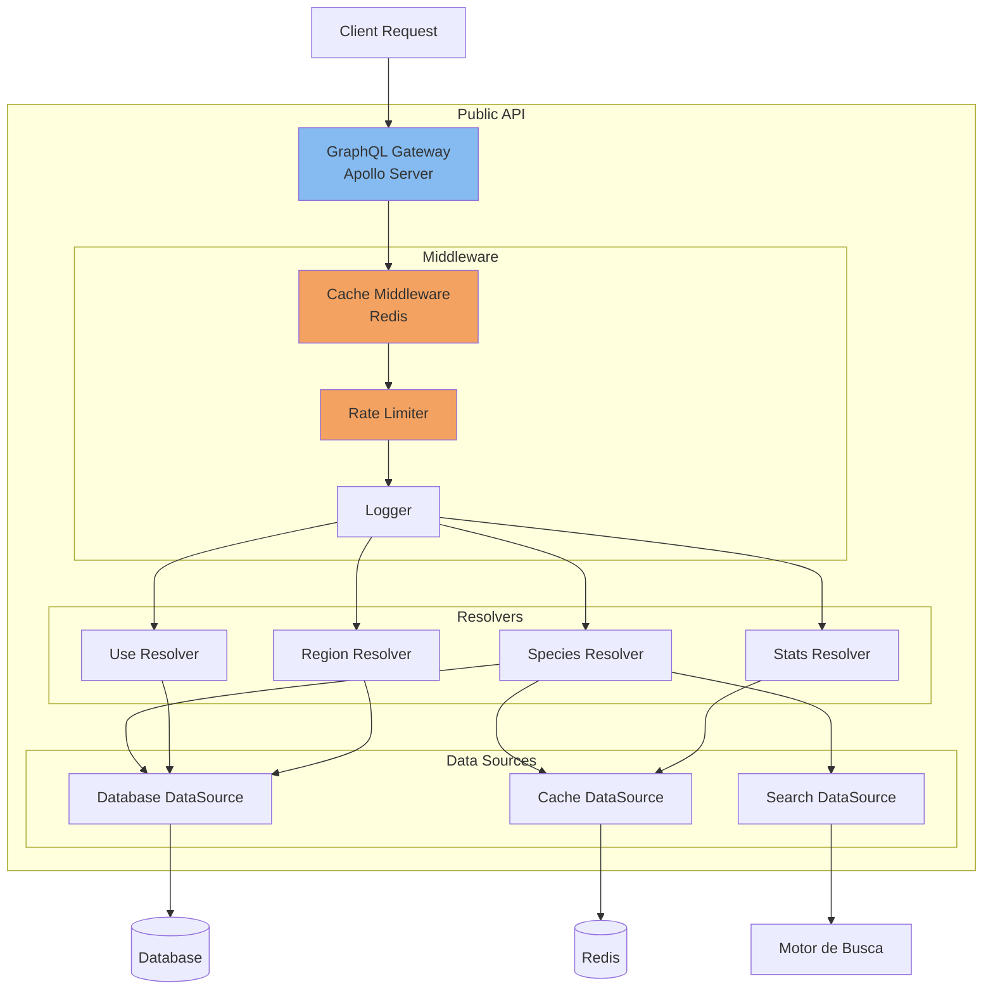
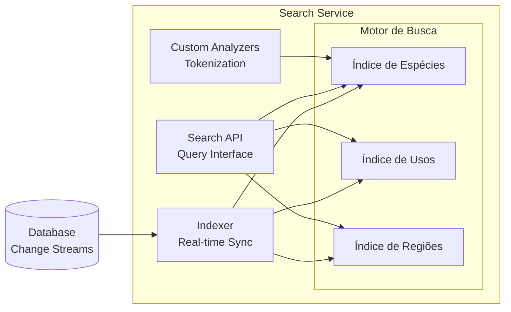
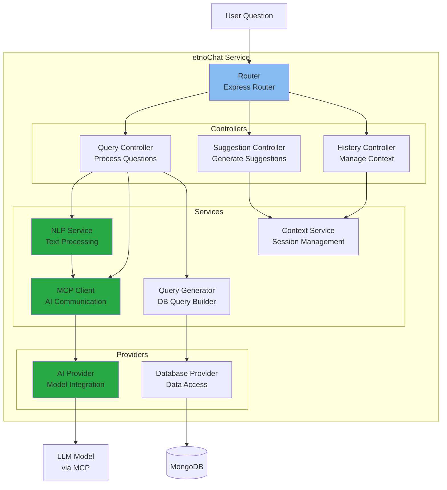
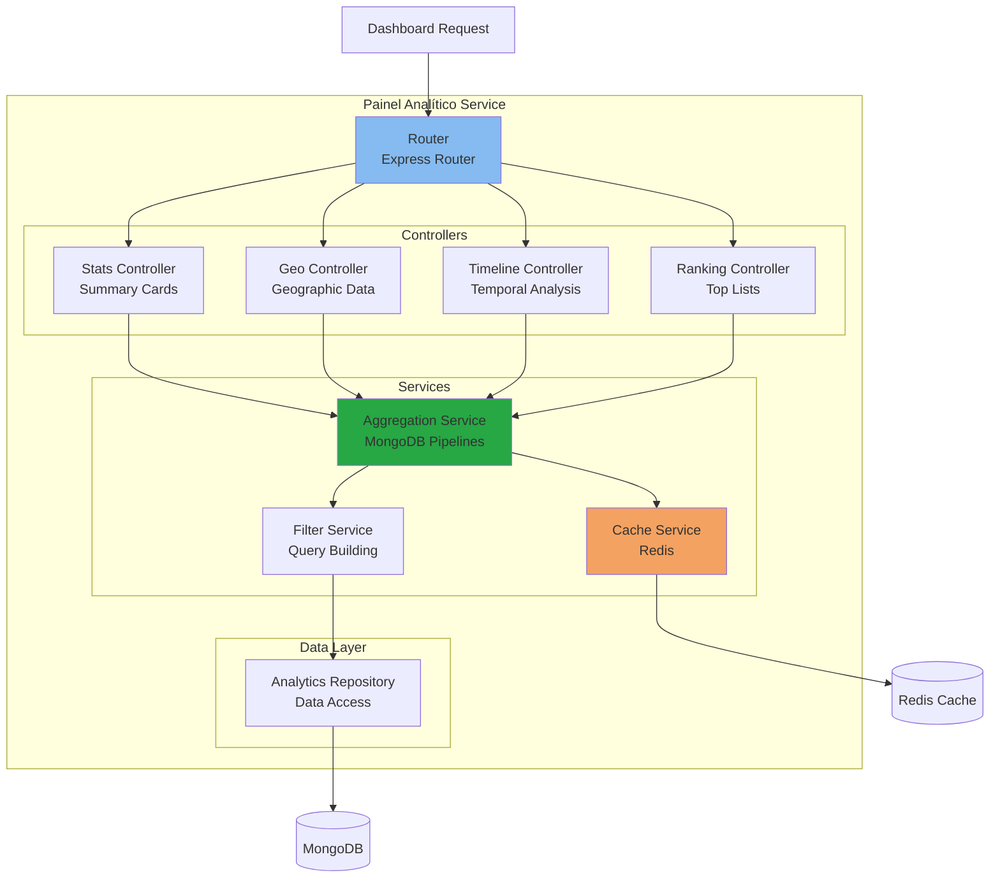

# C4 Model - Level 3: Diagrama de Componentes

## Visão Geral

Este documento detalha os componentes internos de cada container do sistema, organizados pelos três contextos principais: Aquisição, Curadoria e Apresentação.

**Versão 1.4** - Atualizado com etnoChat (interface conversacional) e Painel Analítico (dashboard interativo)

---

## Contexto 1: Aquisição

### Acquisition API - Componentes Internos



#### Componentes Detalhados

##### 1. Router (Express Router)
**Responsabilidade:** Roteamento de requisições HTTP

**Rotas:**
```javascript
POST   /records              → RecordController.create()
POST   /bulk                 → BulkController.import()
GET    /status/:id           → RecordController.getStatus()
POST   /validate             → RecordController.validate()
GET    /sources              → SourceController.list()
POST   /sources              → SourceController.register()
```

##### 2. Auth Middleware
**Responsabilidade:** Autenticação e autorização

**Funções:**
- Validar JWT token
- Verificar permissões (RBAC)
- Adicionar contexto de usuário na request
- Rate limiting por usuário

```javascript
const authMiddleware = async (req, res, next) => {
  const token = req.headers.authorization?.split(' ')[1];
  if (!token) return res.status(401).json({ error: 'Unauthorized' });

  try {
    const payload = jwt.verify(token, SECRET);
    req.user = await UserRepository.findById(payload.userId);
    next();
  } catch (error) {
    res.status(401).json({ error: 'Invalid token' });
  }
};
```

##### 3. Record Controller
**Responsabilidade:** Orquestrar criação de registros

**Métodos:**
```javascript
class RecordController {
  async create(req, res) {
    // 1. Validar schema
    const validation = await ValidationService.validate(req.body);
    if (!validation.valid) return res.status(400).json(validation.errors);

    // 2. Verificar duplicação
    const isDuplicate = await DeduplicationService.check(req.body);
    if (isDuplicate) return res.status(409).json({ error: 'Duplicate' });

    // 3. Salvar com status 'pending'
    const record = await RecordRepository.create({
      ...req.body,
      status: 'pending',
      createdBy: req.user.id
    });

    // 4. Enfileirar para processamento
    await QueueService.enqueue('acquisition.new', record);

    return res.status(201).json(record);
  }
}
```

##### 4. Validation Service
**Responsabilidade:** Validar estrutura de dados

**JSON Schema Example:**
```json
{
  "$schema": "http://json-schema.org/draft-07/schema#",
  "type": "object",
  "required": ["scientificName", "uses", "source"],
  "properties": {
    "scientificName": {
      "type": "string",
      "minLength": 3
    },
    "commonNames": {
      "type": "array",
      "items": { "type": "string" }
    },
    "uses": {
      "type": "array",
      "items": {
        "type": "object",
        "required": ["description", "category"],
        "properties": {
          "description": { "type": "string" },
          "category": {
            "type": "string",
            "enum": ["medicinal", "food", "ritual", "construction"]
          },
          "preparationMethod": { "type": "string" }
        }
      }
    },
    "location": {
      "type": "object",
      "properties": {
        "latitude": { "type": "number" },
        "longitude": { "type": "number" },
        "region": { "type": "string" }
      }
    },
    "source": {
      "type": "object",
      "required": ["type"],
      "properties": {
        "type": {
          "type": "string",
          "enum": ["primary", "secondary"]
        },
        "reference": { "type": "string" },
        "doi": { "type": "string" }
      }
    }
  }
}
```

##### 5. Deduplication Service
**Responsabilidade:** Detectar registros duplicados

**Algoritmo:**
```javascript
class DeduplicationService {
  async check(record) {
    // Busca exata por nome científico + fonte
    const exactMatch = await RecordRepository.findOne({
      scientificName: record.scientificName,
      'source.doi': record.source.doi
    });
    if (exactMatch) return { isDuplicate: true, matchId: exactMatch.id };

    // Busca fuzzy por similaridade
    const similarRecords = await RecordRepository.search({
      scientificName: { $regex: record.scientificName, $options: 'i' }
    });

    for (const similar of similarRecords) {
      const similarity = this.calculateSimilarity(record, similar);
      if (similarity > 0.85) {
        return {
          isDuplicate: true,
          matchId: similar.id,
          similarity
        };
      }
    }

    return { isDuplicate: false };
  }

  calculateSimilarity(record1, record2) {
    // Levenshtein distance ou algoritmo similar
    // Comparar: scientificName, uses, location
  }
}
```

##### 6. Queue Service
**Responsabilidade:** Enfileirar jobs para processamento assíncrono

```javascript
class QueueService {
  constructor() {
    this.channel = null; // RabbitMQ channel
  }

  async enqueue(queueName, data, options = {}) {
    const message = JSON.stringify({
      data,
      timestamp: new Date(),
      retries: 0
    });

    await this.channel.sendToQueue(queueName, Buffer.from(message), {
      persistent: true,
      ...options
    });
  }
}
```

---

### ETL Service - Componentes Internos



#### DAG: Crawl Pipeline

```python
from airflow import DAG
from airflow.operators.python import PythonOperator
from datetime import datetime, timedelta

default_args = {
    'owner': 'data-team',
    'retries': 3,
    'retry_delay': timedelta(minutes=5)
}

with DAG(
    'crawl_journals',
    default_args=default_args,
    schedule_interval='0 2 * * *',  # Diariamente às 2h
    start_date=datetime(2025, 1, 1),
    catchup=False
) as dag:

    extract_task = PythonOperator(
        task_id='extract_articles',
        python_callable=extract_articles_from_journals
    )

    transform_task = PythonOperator(
        task_id='transform_to_standard_format',
        python_callable=transform_data
    )

    validate_task = PythonOperator(
        task_id='validate_data_quality',
        python_callable=validate_records
    )

    load_task = PythonOperator(
        task_id='load_to_database',
        python_callable=load_records
    )

    extract_task >> transform_task >> validate_task >> load_task
```

---

## Contexto 2: Curadoria

### Curation API - Componentes Internos



#### Componentes Detalhados

##### 1. Workflow Service
**Responsabilidade:** Gerenciar máquina de estados da curadoria

**Estado Transitions:**
```javascript
class WorkflowService {
  constructor() {
    this.states = {
      'pending': ['in_review', 'rejected'],
      'in_review': ['in_validation', 'pending', 'rejected'],
      'in_validation': ['approved', 'in_review'],
      'approved': ['published'],
      'published': [],
      'rejected': []
    };
  }

  async transition(recordId, newState, userId, comments) {
    const record = await RecordRepository.findById(recordId);

    // Validar transição permitida
    if (!this.states[record.status].includes(newState)) {
      throw new Error(`Invalid transition: ${record.status} → ${newState}`);
    }

    // Verificar permissões
    const hasPermission = await PermissionService.canTransition(
      userId,
      record,
      newState
    );
    if (!hasPermission) throw new Error('Unauthorized');

    // Criar versão histórica
    await VersioningService.createVersion(record);

    // Atualizar estado
    record.status = newState;
    record.lastModifiedBy = userId;
    record.lastModifiedAt = new Date();
    await RecordRepository.update(record);

    // Registrar auditoria
    await AuditRepository.log({
      recordId,
      userId,
      action: `transition_${record.status}_to_${newState}`,
      comments,
      timestamp: new Date()
    });

    // Notificar interessados
    await NotificationService.notify({
      type: 'status_changed',
      recordId,
      newStatus: newState
    });

    return record;
  }
}
```

##### 2. Validation Service (External)
**Responsabilidade:** Integrar com APIs externas para validação

```javascript
class ValidationService {
  async validateTaxonomy(scientificName) {
    // 1. Tentar Flora e Funga do Brasil para flora/fungos
    let floraResponse;
    try {
      floraResponse = await axios.get(
        `https://floradobrasil.jbrj.gov.br/api/v1/search`,
        { params: { name: scientificName } }
      );
      if (floraResponse.data.results.length > 0) {
        return this.buildValidationResponse(
          floraResponse.data.results[0],
          'Flora e Funga do Brasil',
          'flora'
        );
      }
    } catch (error) {
      console.log('Flora e Funga retornou erro. Tentando Fauna...');
    }

    // 2. Tentar Fauna do Brasil para fauna
    let faunaResponse;
    try {
      faunaResponse = await axios.get(
        `https://fauna.jbrj.gov.br/api/v1/search`,
        { params: { name: scientificName } }
      );
      if (faunaResponse.data.results.length > 0) {
        return this.buildValidationResponse(
          faunaResponse.data.results[0],
          'Fauna do Brasil',
          'fauna'
        );
      }
    } catch (error) {
      console.log('Fauna do Brasil retornou erro. Tentando GBIF...');
    }

    // 3. Fallback para GBIF
    let gbifResponse;
    try {
      gbifResponse = await axios.get(
        `https://api.gbif.org/v1/species/match`,
        { params: { name: scientificName } }
      );
      if (gbifResponse.data.matchType === 'EXACT') {
        return this.buildValidationResponse(gbifResponse.data, 'GBIF', 'global');
      }
    } catch (error) {
      console.log('GBIF também falhou');
    }

    // 4. Nenhuma base encontrou
    return {
      found: false,
      status: 'not_found',
      message: 'Espécie não encontrada em nenhuma base (Flora/Fauna/GBIF)',
      suggestedName: null,
      source: 'none'
    };
  }

  buildValidationResponse(data, source, type) {
    return {
      found: true,
      status: 'approved',
      scientificName: data.scientificName || data.name,
      family: data.family,
      taxonomy: this.extractTaxonomy(data),
      source: source,
      type: type,
      message: `Nomenclatura validada via ${source}`,
      suggestedName: data.scientificName || data.name
    };
  }

  extractTaxonomy(data) {
    return {
      kingdom: data.kingdom,
      phylum: data.phylum,
      class: data.class,
      order: data.order,
      family: data.family,
      genus: data.genus,
      species: data.species
    };
  }

  generateRecommendation(flora, fauna, gbif) {
    if (flora && flora.data?.results?.length > 0) {
      return {
        status: 'approved',
        message: 'Nomenclatura validada pela Flora e Funga do Brasil',
        suggestedName: flora.data.results[0].scientificName,
        source: 'Flora e Funga do Brasil'
      };
    } else if (fauna && fauna.data?.results?.length > 0) {
      return {
        status: 'approved',
        message: 'Nomenclatura validada pela Fauna do Brasil',
        suggestedName: fauna.data.results[0].scientificName,
        source: 'Fauna do Brasil'
      };
    } else if (gbif && gbif.data?.matchType === 'EXACT' && gbif.data?.confidence >= 95) {
      return {
        status: 'approved',
        message: 'Taxonomia validada com alta confiança via GBIF',
        suggestedName: gbif.data.scientificName,
        source: 'GBIF'
      };
    } else if (gbif && gbif.data?.matchType === 'FUZZY') {
      return {
        status: 'review',
        message: 'Nome similar encontrado via GBIF. Revisar sugestão.',
        suggestedName: gbif.data.scientificName
      };
    } else {
      return {
        status: 'not_found',
        message: 'Espécie não encontrada em Flora/Fauna/GBIF. Verificar nomenclatura.',
        suggestedName: null
      };
    }
  }
}
```

##### 3. Versioning Service
**Responsabilidade:** Rastrear histórico de alterações

```javascript
class VersioningService {
  async createVersion(record) {
    const version = {
      recordId: record.id,
      versionNumber: record.version + 1,
      snapshot: JSON.parse(JSON.stringify(record)), // Deep clone
      createdAt: new Date(),
      createdBy: record.lastModifiedBy
    };

    await AuditRepository.insertVersion(version);

    // Atualizar número de versão no registro
    record.version += 1;
  }

  async getHistory(recordId) {
    return await AuditRepository.findVersions({ recordId })
      .sort({ versionNumber: -1 });
  }

  async revert(recordId, versionNumber, userId) {
    const version = await AuditRepository.findVersion({
      recordId,
      versionNumber
    });

    if (!version) throw new Error('Version not found');

    // Criar nova versão antes de reverter
    const currentRecord = await RecordRepository.findById(recordId);
    await this.createVersion(currentRecord);

    // Restaurar snapshot
    const restoredRecord = version.snapshot;
    restoredRecord.lastModifiedBy = userId;
    restoredRecord.lastModifiedAt = new Date();

    await RecordRepository.update(restoredRecord);

    return restoredRecord;
  }
}
```

##### 4. Permission Service
**Responsabilidade:** Controle de acesso granular

**RBAC Matrix:**
| Role | Create | Read | Update | Approve | Publish | Delete |
|------|--------|------|--------|---------|---------|--------|
| Researcher | ✓ | ✓ | Own | ✗ | ✗ | Own |
| Curator | ✓ | ✓ | ✓ | ✓ | ✗ | ✗ |
| Admin | ✓ | ✓ | ✓ | ✓ | ✓ | ✓ |
| Community Rep | ✓ | ✓ | Own | Own | Own | ✗ |

```javascript
class PermissionService {
  async canTransition(userId, record, newState) {
    const user = await UserRepository.findById(userId);

    // Regras por estado de destino
    const rules = {
      'in_review': ['researcher', 'curator', 'admin'],
      'in_validation': ['curator', 'admin'],
      'approved': ['curator', 'admin'],
      'published': ['admin'],
      'rejected': ['curator', 'admin']
    };

    // Verificar papel do usuário
    if (!rules[newState].includes(user.role)) return false;

    // Representante de comunidade pode controlar próprios dados
    if (user.role === 'community_rep') {
      return record.community === user.community;
    }

    return true;
  }

  async canEdit(userId, recordId) {
    const user = await UserRepository.findById(userId);
    const record = await RecordRepository.findById(recordId);

    if (user.role === 'admin' || user.role === 'curator') return true;
    if (user.role === 'researcher' && record.createdBy === userId) return true;
    if (user.role === 'community_rep' && record.community === user.community) return true;

    return false;
  }
}
```

##### 5. Territory & Authority Service
**Responsabilidade:** Validar proveniência territorial e autoridade de dados

```javascript
class TerritoryAndAuthorityService {
  constructor() {
    this.territoryProvider = new TerritoryProvider();
    this.authorityProvider = new AuthorityProvider();
  }

  async validateProvenance(record) {
    // 1. Validação territorial por coordenadas
    const territoryValidation = await this.territoryProvider.validateCoordinates(
      record.coordinates.latitude,
      record.coordinates.longitude
    );

    // 2. Validação contra fontes autoritativas
    const authorityValidations = await this.authorityProvider.validateRecord(record);

    // 3. Compilar resultado
    return {
      territory: territoryValidation,
      authorities: authorityValidations,
      legalCompliance: {
        lei_13123: this.checkLei13123Compliance(territoryValidation),
        nagoya_protocol: authorityValidations.length > 0,
        care_principles: true
      }
    };
  }

  checkLei13123Compliance(territoryValidation) {
    // Verifica se conhecimento pode ser rastreado a sua origem territorial
    return territoryValidation.found === true;
  }
}

class TerritoryProvider {
  constructor() {
    this.mlfBaseURL = 'https://territoriostradicionais.mpf.mp.br/api/v1';
    this.cache = new Map(); // Redis em produção
  }

  async validateCoordinates(latitude, longitude) {
    const cacheKey = `territory:${latitude}:${longitude}`;

    // Verificar cache
    if (this.cache.has(cacheKey)) {
      return this.cache.get(cacheKey);
    }

    try {
      const response = await axios.get(
        `${this.mlfBaseURL}/territories/point-in-polygon`,
        { params: { lat: latitude, lon: longitude } }
      );

      const result = response.data.found ? {
        found: true,
        territoryId: response.data.territory.id,
        territoryName: response.data.territory.name,
        people: response.data.territory.people
      } : {
        found: false,
        message: 'Coordenadas fora de territórios conhecidos'
      };

      // Cache por 7 dias
      this.cache.set(cacheKey, result);
      return result;
    } catch (error) {
      console.error('Territory validation error:', error);
      return { found: false, error: error.message };
    }
  }

  async searchTerritoryByPeople(peopleName) {
    const response = await axios.get(
      `${this.mlfBaseURL}/territories`,
      { params: { people: peopleName } }
    );

    return response.data.territories || [];
  }
}

class AuthorityProvider {
  constructor() {
    this.sources = this.loadConfiguredSources();
  }

  loadConfiguredSources() {
    // Carrega configuração de sources do arquivo de configuração
    return [
      {
        name: 'SISGEN',
        baseURL: process.env.SISGEN_API_URL,
        priority: 1
      },
      {
        name: 'SiBBr',
        baseURL: process.env.SIBBR_API_URL,
        priority: 2
      }
    ];
  }

  async validateRecord(record) {
    const results = [];

    for (const source of this.sources) {
      try {
        const result = await this.validateAgainstSource(source, record);
        results.push({
          source: source.name,
          ...result,
          success: true
        });
      } catch (error) {
        results.push({
          source: source.name,
          success: false,
          error: error.message
        });
      }
    }

    return results;
  }

  async validateAgainstSource(source, record) {
    const response = await axios.post(
      `${source.baseURL}/validate`,
      {
        scientificName: record.scientificName,
        region: record.region,
        community: record.community
      },
      { timeout: 5000 }
    );

    return response.data;
  }
}
```

##### 6. Semantic Validation Service
**Responsabilidade:** Validar e normalizar termos vernaculares usando o etnoTermos

```javascript
class SemanticValidationService {
  constructor() {
    this.termProvider = new TermProvider();
    this.normalizationProvider = new NormalizationProvider();
  }

  async validateTerms(record) {
    const results = {
      vernacularNames: [],
      uses: [],
      normalized: false
    };

    // 1. Validar nomes vernaculares
    for (const name of record.vernacularNames || []) {
      const termValidation = await this.termProvider.validateTerm(name);
      results.vernacularNames.push({
        original: name,
        ...termValidation
      });
    }

    // 2. Validar tipos de uso
    for (const use of record.uses || []) {
      const useValidation = await this.termProvider.validateTerm(use.category);
      results.uses.push({
        original: use.category,
        ...useValidation
      });
    }

    // 3. Tentar normalização automática
    if (results.vernacularNames.some(v => !v.found)) {
      const normalizations = await this.normalizationProvider.suggestNormalizations(
        results.vernacularNames.filter(v => !v.found).map(v => v.original)
      );
      results.suggestions = normalizations;
    }

    results.normalized = results.vernacularNames.every(v => v.found);
    return results;
  }

  async enrichWithRelations(record) {
    const enrichments = {
      broader_terms: [],
      narrower_terms: [],
      related_terms: [],
      synonyms: []
    };

    for (const name of record.vernacularNames || []) {
      const relations = await this.termProvider.getTermRelations(name);
      if (relations) {
        enrichments.broader_terms.push(...(relations.broader || []));
        enrichments.narrower_terms.push(...(relations.narrower || []));
        enrichments.related_terms.push(...(relations.related || []));
        enrichments.synonyms.push(...(relations.equivalents || []));
      }
    }

    // Remove duplicatas
    Object.keys(enrichments).forEach(key => {
      enrichments[key] = [...new Set(enrichments[key])];
    });

    return enrichments;
  }
}

class TermProvider {
  constructor() {
    this.etnoTermosBaseURL = process.env.ETNOTERMOS_API_URL || 'http://localhost:8080/api';
    this.cache = new Map(); // Redis em produção
  }

  async validateTerm(term) {
    const cacheKey = `term:${term.toLowerCase()}`;

    // Verificar cache
    if (this.cache.has(cacheKey)) {
      return this.cache.get(cacheKey);
    }

    try {
      const response = await axios.get(
        `${this.etnoTermosBaseURL}/terms/search`,
        { params: { q: term, exact: true } }
      );

      const result = response.data.results.length > 0 ? {
        found: true,
        termId: response.data.results[0].id,
        preferredTerm: response.data.results[0].term,
        definition: response.data.results[0].definition,
        source: 'etnoTermos'
      } : {
        found: false,
        message: 'Termo não encontrado no vocabulário controlado'
      };

      // Cache por 24 horas
      this.cache.set(cacheKey, result);
      return result;
    } catch (error) {
      console.error('Term validation error:', error);
      return { found: false, error: error.message };
    }
  }

  async getTermRelations(term) {
    try {
      // Primeiro, buscar o termo
      const searchResponse = await axios.get(
        `${this.etnoTermosBaseURL}/terms/search`,
        { params: { q: term } }
      );

      if (searchResponse.data.results.length === 0) {
        return null;
      }

      const termId = searchResponse.data.results[0].id;

      // Buscar relações em paralelo
      const [broader, narrower, related, equivalents] = await Promise.all([
        axios.get(`${this.etnoTermosBaseURL}/terms/${termId}/broader`),
        axios.get(`${this.etnoTermosBaseURL}/terms/${termId}/narrower`),
        axios.get(`${this.etnoTermosBaseURL}/terms/${termId}/related`),
        axios.get(`${this.etnoTermosBaseURL}/terms/${termId}/equivalents`)
      ]);

      return {
        broader: broader.data.terms?.map(t => t.term) || [],
        narrower: narrower.data.terms?.map(t => t.term) || [],
        related: related.data.terms?.map(t => t.term) || [],
        equivalents: equivalents.data.terms?.map(t => t.term) || []
      };
    } catch (error) {
      console.error('Get term relations error:', error);
      return null;
    }
  }
}

class NormalizationProvider {
  constructor() {
    this.etnoTermosBaseURL = process.env.ETNOTERMOS_API_URL || 'http://localhost:8080/api';
  }

  async suggestNormalizations(terms) {
    const suggestions = [];

    for (const term of terms) {
      try {
        // Busca fuzzy no etnoTermos
        const response = await axios.get(
          `${this.etnoTermosBaseURL}/terms/search`,
          { params: { q: term, fuzzy: true, limit: 5 } }
        );

        if (response.data.results.length > 0) {
          suggestions.push({
            original: term,
            suggestions: response.data.results.map(r => ({
              term: r.term,
              definition: r.definition,
              score: r.score
            }))
          });
        }
      } catch (error) {
        console.error('Normalization suggestion error:', error);
      }
    }

    return suggestions;
  }
}
```

**Response de Validação Semântica:**
```json
{
  "vernacularNames": [
    {
      "original": "mandioca",
      "found": true,
      "termId": "ET001",
      "preferredTerm": "mandioca",
      "definition": "Raiz tuberosa da planta Manihot esculenta",
      "source": "etnoTermos"
    },
    {
      "original": "macaxera",
      "found": false,
      "message": "Termo não encontrado no vocabulário controlado"
    }
  ],
  "uses": [
    {
      "original": "alimentação",
      "found": true,
      "termId": "USE001",
      "preferredTerm": "alimentação",
      "source": "etnoTermos"
    }
  ],
  "suggestions": [
    {
      "original": "macaxera",
      "suggestions": [
        {
          "term": "macaxeira",
          "definition": "Variedade de mandioca de baixo teor de ácido cianídrico",
          "score": 0.95
        }
      ]
    }
  ],
  "normalized": false
}
```

**Response de Enriquecimento com Relações:**
```json
{
  "broader_terms": ["tubérculos", "alimentos tradicionais"],
  "narrower_terms": ["aipim", "macaxeira", "mandioca-brava"],
  "related_terms": ["farinha de mandioca", "tapioca", "beiju"],
  "synonyms": ["cassava", "yuca", "aipim"]
}
```

---

## Contexto 3: Apresentação

### Public API - Componentes Internos



#### GraphQL Schema

```graphql
type Query {
  # Espécies
  species(id: ID!): Species
  searchSpecies(
    name: String
    family: String
    region: String
    use: String
    limit: Int = 20
    offset: Int = 0
  ): SpeciesConnection!

  # Usos Tradicionais
  uses(category: UseCategory, limit: Int = 20): [TraditionalUse!]!
  useCategories: [UseCategory!]!

  # Regiões
  regions: [Region!]!
  regionStats(regionId: ID!): RegionStats!

  # Estatísticas
  stats: GlobalStats!
}

type Species {
  id: ID!
  scientificName: String!
  commonNames: [String!]!
  family: String
  kingdom: String
  images: [Image!]!
  uses: [TraditionalUse!]!
  regions: [Region!]!
  verified: Boolean!
  lastUpdated: DateTime!
}

type TraditionalUse {
  id: ID!
  description: String!
  category: UseCategory!
  preparationMethod: String
  community: String
  source: Source!
  verified: Boolean!
}

enum UseCategory {
  MEDICINAL
  FOOD
  RITUAL
  CONSTRUCTION
  CRAFT
  OTHER
}

type Source {
  type: SourceType!
  reference: String
  doi: String
  year: Int
}

enum SourceType {
  PRIMARY
  SECONDARY
}

type Region {
  id: ID!
  name: String!
  country: String!
  coordinates: Coordinates
  speciesCount: Int!
}

type Coordinates {
  latitude: Float!
  longitude: Float!
}

type SpeciesConnection {
  edges: [SpeciesEdge!]!
  pageInfo: PageInfo!
  totalCount: Int!
}

type SpeciesEdge {
  node: Species!
  cursor: String!
}

type PageInfo {
  hasNextPage: Boolean!
  hasPreviousPage: Boolean!
  startCursor: String
  endCursor: String
}

type GlobalStats {
  totalSpecies: Int!
  totalUses: Int!
  totalCommunities: Int!
  verifiedRecords: Int!
  lastUpdate: DateTime!
}
```

#### Resolvers Implementation

```javascript
// Species Resolver
const speciesResolver = {
  Query: {
    species: async (_, { id }, { dataSources }) => {
      // Tentar cache primeiro
      const cached = await dataSources.cache.get(`species:${id}`);
      if (cached) return JSON.parse(cached);

      // Buscar no banco
      const species = await dataSources.db.findSpeciesById(id);

      // Cachear resultado
      await dataSources.cache.set(
        `species:${id}`,
        JSON.stringify(species),
        { EX: 3600 } // 1 hora
      );

      return species;
    },

    searchSpecies: async (_, args, { dataSources }) => {
      const { name, family, region, use, limit, offset } = args;

      // Usar motor de busca para busca avançada
      const results = await dataSources.search.searchSpecies({
        query: {
          bool: {
            must: [
              name && { multi_match: { query: name, fields: ['scientificName', 'commonNames'] } },
              family && { term: { family: family } },
              region && { term: { 'regions.id': region } },
              use && { nested: { path: 'uses', query: { match: { 'uses.category': use } } } }
            ].filter(Boolean)
          }
        },
        from: offset,
        size: limit
      });

      return {
        edges: results.hits.map(hit => ({
          node: hit._source,
          cursor: Buffer.from(hit._id).toString('base64')
        })),
        pageInfo: {
          hasNextPage: results.total.value > offset + limit,
          hasPreviousPage: offset > 0,
          startCursor: results.hits[0] ? Buffer.from(results.hits[0]._id).toString('base64') : null,
          endCursor: results.hits[results.hits.length - 1] ? Buffer.from(results.hits[results.hits.length - 1]._id).toString('base64') : null
        },
        totalCount: results.total.value
      };
    }
  },

  Species: {
    uses: async (parent, _, { dataSources }) => {
      return await dataSources.db.findUsesBySpeciesId(parent.id);
    },

    regions: async (parent, _, { dataSources }) => {
      return await dataSources.db.findRegionsBySpeciesId(parent.id);
    },

    images: async (parent, _, { dataSources }) => {
      return parent.images.map(img => ({
        url: `${process.env.CDN_URL}/images/species/${parent.id}/${img.filename}`,
        caption: img.caption,
        credit: img.credit
      }));
    }
  }
};
```

#### Cache Middleware

```javascript
class CacheMiddleware {
  constructor(redis) {
    this.redis = redis;
  }

  async cacheQuery(query, ttl = 3600) {
    return async (resolve, parent, args, context, info) => {
      const key = this.generateCacheKey(info.fieldName, args);

      // Verificar cache
      const cached = await this.redis.get(key);
      if (cached) {
        console.log(`Cache HIT: ${key}`);
        return JSON.parse(cached);
      }

      // Executar resolver
      const result = await resolve(parent, args, context, info);

      // Cachear resultado
      await this.redis.set(key, JSON.stringify(result), { EX: ttl });
      console.log(`Cache MISS: ${key}`);

      return result;
    };
  }

  generateCacheKey(fieldName, args) {
    const argsHash = crypto
      .createHash('md5')
      .update(JSON.stringify(args))
      .digest('hex');
    return `gql:${fieldName}:${argsHash}`;
  }

  async invalidate(pattern) {
    const keys = await this.redis.keys(pattern);
    if (keys.length > 0) {
      await this.redis.del(...keys);
    }
  }
}
```

#### Rate Limiter

```javascript
class RateLimiter {
  constructor(redis) {
    this.redis = redis;
  }

  async checkLimit(apiKey, limit = 100, window = 60) {
    const key = `rate:${apiKey}`;
    const current = await this.redis.incr(key);

    if (current === 1) {
      await this.redis.expire(key, window);
    }

    if (current > limit) {
      throw new Error(`Rate limit exceeded. Max ${limit} requests per ${window}s`);
    }

    return {
      remaining: limit - current,
      reset: await this.redis.ttl(key)
    };
  }
}
```

---

### Search Service - Componentes Internos



#### Mapeamento de Índices do Motor de Busca

```json
{
  "species": {
    "mappings": {
      "properties": {
        "scientificName": {
          "type": "text",
          "analyzer": "scientific_name_analyzer",
          "fields": {
            "keyword": { "type": "keyword" }
          }
        },
        "commonNames": {
          "type": "text",
          "analyzer": "standard"
        },
        "family": { "type": "keyword" },
        "kingdom": { "type": "keyword" },
        "uses": {
          "type": "nested",
          "properties": {
            "description": { "type": "text" },
            "category": { "type": "keyword" }
          }
        },
        "regions": {
          "type": "nested",
          "properties": {
            "id": { "type": "keyword" },
            "name": { "type": "text" },
            "country": { "type": "keyword" }
          }
        },
        "verified": { "type": "boolean" },
        "lastUpdated": { "type": "date" }
      }
    },
    "settings": {
      "analysis": {
        "analyzer": {
          "scientific_name_analyzer": {
            "type": "custom",
            "tokenizer": "standard",
            "filter": ["lowercase", "asciifolding"]
          }
        }
      }
    }
  }
}
```

#### Real-time Indexing

```javascript
// Change Streams para sincronização em tempo real com o motor de busca
const changeStream = db.collection('records').watch();

changeStream.on('change', async (change) => {
  switch (change.operationType) {
    case 'insert':
      await searchClient.index({
        index: 'species',
        id: change.fullDocument._id,
        document: transformToSearchDocument(change.fullDocument)
      });
      break;

    case 'update':
      await searchClient.update({
        index: 'species',
        id: change.documentKey._id,
        doc: transformToSearchDocument(change.updateDescription.updatedFields)
      });
      break;

    case 'delete':
      await searchClient.delete({
        index: 'species',
        id: change.documentKey._id
      });
      break;
  }
});
```

---

### etnoChat - Componentes Internos



#### Componentes Detalhados

##### 1. NLP Service
**Responsabilidade:** Processar e normalizar texto de entrada

```javascript
class NLPService {
  async processQuery(text) {
    return {
      normalized: this.normalize(text),
      entities: this.extractEntities(text),
      intent: this.classifyIntent(text),
      language: this.detectLanguage(text)
    };
  }

  extractEntities(text) {
    // Extrair menções a plantas, comunidades, usos
    const patterns = {
      plants: /(?:planta|espécie|erva|árvore)\s+(\w+)/gi,
      communities: /(?:comunidade|povo|grupo)\s+(\w+)/gi,
      uses: /(?:uso|utilização|para)\s+(\w+)/gi
    };

    return {
      plants: [...text.matchAll(patterns.plants)].map(m => m[1]),
      communities: [...text.matchAll(patterns.communities)].map(m => m[1]),
      uses: [...text.matchAll(patterns.uses)].map(m => m[1])
    };
  }

  classifyIntent(text) {
    const intents = {
      search: ['quais', 'liste', 'encontre', 'busque'],
      count: ['quantas', 'quantos', 'total', 'número'],
      compare: ['compare', 'diferença', 'entre'],
      explain: ['explique', 'o que é', 'como']
    };

    for (const [intent, keywords] of Object.entries(intents)) {
      if (keywords.some(k => text.toLowerCase().includes(k))) {
        return intent;
      }
    }
    return 'general';
  }
}
```

##### 2. MCP Client Service
**Responsabilidade:** Comunicação com modelos de IA via MCP

```javascript
class MCPClientService {
  constructor() {
    this.mcpEndpoint = process.env.MCP_ENDPOINT;
  }

  async sendToModel(processedQuery, context) {
    const prompt = this.buildPrompt(processedQuery, context);

    const response = await fetch(this.mcpEndpoint, {
      method: 'POST',
      headers: { 'Content-Type': 'application/json' },
      body: JSON.stringify({
        messages: [
          { role: 'system', content: this.getSystemPrompt() },
          { role: 'user', content: prompt }
        ],
        context: context.history
      })
    });

    return response.json();
  }

  getSystemPrompt() {
    return `Você é um assistente especializado em etnobotânica brasileira.
    Responda perguntas sobre plantas, comunidades tradicionais e usos medicinais
    baseando-se apenas nos dados do banco de dados fornecido.
    Sempre cite as fontes (referências) quando disponíveis.`;
  }

  buildPrompt(query, context) {
    return `
      Pergunta do usuário: ${query.normalized}
      Entidades detectadas: ${JSON.stringify(query.entities)}
      Dados relevantes do banco: ${JSON.stringify(context.relevantData)}
    `;
  }
}
```

##### 3. Query Generator
**Responsabilidade:** Converter intenções em queries MongoDB

```javascript
class QueryGenerator {
  generateQuery(processedQuery) {
    const { intent, entities } = processedQuery;

    switch (intent) {
      case 'search':
        return this.buildSearchQuery(entities);
      case 'count':
        return this.buildAggregation(entities);
      case 'compare':
        return this.buildComparisonQuery(entities);
      default:
        return this.buildGeneralQuery(entities);
    }
  }

  buildSearchQuery(entities) {
    const query = {};

    if (entities.plants.length > 0) {
      query['plantas.nome_cientifico'] = {
        $regex: entities.plants.join('|'),
        $options: 'i'
      };
    }

    if (entities.communities.length > 0) {
      query['comunidades.nome'] = {
        $regex: entities.communities.join('|'),
        $options: 'i'
      };
    }

    if (entities.uses.length > 0) {
      query['plantas.usos.descricao'] = {
        $regex: entities.uses.join('|'),
        $options: 'i'
      };
    }

    return query;
  }
}
```

---

### Painel Analítico - Componentes Internos



#### Componentes Detalhados

##### 1. Aggregation Service
**Responsabilidade:** Executar pipelines de agregação MongoDB

```javascript
class AggregationService {
  constructor(cacheService, repository) {
    this.cache = cacheService;
    this.repo = repository;
  }

  async getStats(filters = {}) {
    const cacheKey = `stats:${JSON.stringify(filters)}`;
    const cached = await this.cache.get(cacheKey);
    if (cached) return JSON.parse(cached);

    const stats = await this.repo.aggregate([
      { $match: this.buildMatch(filters) },
      {
        $facet: {
          communities: [
            { $unwind: '$comunidades' },
            { $group: { _id: null, count: { $addToSet: '$comunidades.nome' } } },
            { $project: { total: { $size: '$count' } } }
          ],
          references: [
            { $match: { status: 'approved' } },
            { $count: 'total' }
          ],
          plants: [
            { $unwind: '$comunidades' },
            { $unwind: '$comunidades.plantas' },
            { $group: { _id: null, count: { $addToSet: '$comunidades.plantas.nome_cientifico' } } },
            { $project: { total: { $size: '$count' } } }
          ],
          authors: [
            { $project: { authors: { $split: ['$autores', ';'] } } },
            { $unwind: '$authors' },
            { $group: { _id: null, count: { $addToSet: '$authors' } } },
            { $project: { total: { $size: '$count' } } }
          ]
        }
      }
    ]);

    await this.cache.set(cacheKey, JSON.stringify(stats), 'EX', 3600);
    return stats;
  }

  async getGeoDistribution(type, filters = {}) {
    const cacheKey = `geo:${type}:${JSON.stringify(filters)}`;
    const cached = await this.cache.get(cacheKey);
    if (cached) return JSON.parse(cached);

    const pipeline = type === 'references'
      ? this.buildReferenceGeoPipeline(filters)
      : this.buildCommunityGeoPipeline(filters);

    const result = await this.repo.aggregate(pipeline);
    await this.cache.set(cacheKey, JSON.stringify(result), 'EX', 3600);
    return result;
  }

  buildReferenceGeoPipeline(filters) {
    return [
      { $match: { ...this.buildMatch(filters), status: 'approved' } },
      { $unwind: '$comunidades' },
      {
        $group: {
          _id: '$comunidades.localizacao.uf',
          count: { $sum: 1 }
        }
      },
      { $sort: { count: -1 } }
    ];
  }

  async getTimeline(filters = {}) {
    return this.repo.aggregate([
      { $match: { ...this.buildMatch(filters), status: 'approved' } },
      {
        $group: {
          _id: '$ano',
          count: { $sum: 1 }
        }
      },
      { $sort: { _id: 1 } }
    ]);
  }

  async getTopPlants(limit = 10, filters = {}) {
    return this.repo.aggregate([
      { $match: { ...this.buildMatch(filters), status: 'approved' } },
      { $unwind: '$comunidades' },
      { $unwind: '$comunidades.plantas' },
      {
        $group: {
          _id: '$comunidades.plantas.nome_cientifico',
          count: { $sum: 1 },
          vernacular: { $first: '$comunidades.plantas.nomes_vernaculares' }
        }
      },
      { $sort: { count: -1 } },
      { $limit: limit }
    ]);
  }
}
```

##### 2. Filter Service
**Responsabilidade:** Construir queries de filtro dinâmicas

```javascript
class FilterService {
  buildFilters(params) {
    const filters = {};

    if (params.state) {
      filters['comunidades.localizacao.uf'] = params.state;
    }

    if (params.communityType) {
      filters['comunidades.tipo'] = params.communityType;
    }

    if (params.startYear || params.endYear) {
      filters.ano = {};
      if (params.startYear) filters.ano.$gte = parseInt(params.startYear);
      if (params.endYear) filters.ano.$lte = parseInt(params.endYear);
    }

    return filters;
  }

  getAvailableFilters() {
    return {
      states: this.getDistinctStates(),
      communityTypes: this.getDistinctCommunityTypes(),
      yearRange: this.getYearRange()
    };
  }
}
```

##### 3. Cache Service
**Responsabilidade:** Gerenciar cache de agregações

```javascript
class DashboardCacheService {
  constructor(redis) {
    this.redis = redis;
    this.defaultTTL = 3600; // 1 hora
  }

  async get(key) {
    return this.redis.get(`dashboard:${key}`);
  }

  async set(key, value, ttl = this.defaultTTL) {
    return this.redis.set(`dashboard:${key}`, value, 'EX', ttl);
  }

  async invalidatePattern(pattern) {
    const keys = await this.redis.keys(`dashboard:${pattern}`);
    if (keys.length > 0) {
      await this.redis.del(...keys);
    }
  }

  // Invalidar cache quando novos dados são aprovados
  async onDataApproved() {
    await this.invalidatePattern('stats:*');
    await this.invalidatePattern('geo:*');
    await this.invalidatePattern('timeline:*');
    await this.invalidatePattern('ranking:*');
  }
}
```

---

## Padrões de Comunicação

### 1. Request-Response (Síncrono)
- Frontend → API Gateway → Backend APIs
- APIs → Database/Cache

### 2. Event-Driven (Assíncrono)
- Database Change Streams → Search Indexer
- Workflow Transitions → Notification Service

### 3. Queue-Based (Assíncrono)
- Acquisition API → Queue → ETL Service
- Crawler → Queue → Validation Service

---

## Qualidade de Código

### Testing Strategy

**Unit Tests:**
- Componentes isolados (Services, Repositories)
- Cobertura mínima: 80%
- Framework: Jest (JavaScript), Pytest (Python)

**Integration Tests:**
- APIs endpoints
- Database interactions
- External API mocking

**E2E Tests:**
- Fluxos críticos (Cypress/Playwright)
- Workflow de curadoria completo
- Busca e exportação pública

### Code Quality Tools

- **Linting:** ESLint, Pylint
- **Formatting:** Prettier, Black
- **Type Checking:** TypeScript, Python Type Hints
- **Security:** SonarQube, Snyk

---

## Próximos Passos

- [Architecture Decision Records](../architecture-decisions/) - Documentação de decisões técnicas
- [Data Model](../architecture-decisions/ADR-003-data-model.md) - Estrutura detalhada dos dados
