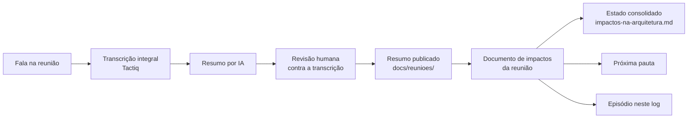

# Uso de IA na arquitetura BioCultural — método e log de episódios

> **O que este documento é.** O registro formal, como resultado de pesquisa, do uso de Inteligência
> Artificial na criação e na manutenção da arquitetura BioCultural (`docs/projetoPesquisa.md`,
> objetivo específico 12 e §7.5). Tem duas partes: o **método**, e o **log de episódios**, em que
> cada uso de IA com fonte primária conferível vira uma entrada datada.

## 1. Método: da reunião ao impacto na arquitetura

As reuniões do ciclo do Ponto-Focal (`docs/projetoPesquisa.md` §7.2, item 7) seguem esta cadeia:

- **Transcrição integral.** O [Tactiq](https://tactiq.io/pt-br) captura a fala completa de todos os
  participantes. A transcrição é a fonte primária do resto da cadeia.
- **Resumo por IA.** Um agente de IA produz o resumo a partir da transcrição: decisões, insights,
  pontos de atenção e as "Notas de leitura da transcrição", que registram cada termo corrompido e a
  leitura adotada.
- **Revisão humana.** O resumo é conferido contra a transcrição completa. Nada entra no documento
  de impactos sem esta conferência.
- **Impactos.** Cada decisão do resumo é confrontada com os documentos de arquitetura e
  classificada em *fecha*, *contradiz*, *acrescenta*, *confirma* ou *abre*, num documento de
  impactos da reunião; o estado de cada item é consolidado em `impactos-na-arquitetura.md`.
- **Próxima pauta.** Escrita a partir do resumo e dos impactos, em linguagem para quem não é da
  área técnica (`docs/reunioes/README.md`).
- **Episódio.** O ciclo só fecha quando o episódio da reunião é escrito neste log, na mesma sessão
  de trabalho em que o resumo é revisado.

A cadeia é de proveniência, no sentido PROV-O: o resumo é derivado da transcrição, que é derivada
da fala. É a mesma regra que a arquitetura aplica aos Relatos (ADR-015), aplicada ao próprio
método.

**Natureza do conteúdo.** Uma reunião do ciclo do Ponto-Focal discute como melhorar a arquitetura.
É conteúdo administrativo da camada de governança da arquitetura, e não Conhecimento Tradicional
Associado. As regras da ADR-015 sobre gravação e armazenamento soberano tratam do registro de CTA
em campo (BioCultRelatos) e não se aplicam a estas reuniões.

**Transcrições não versionadas.** A transcrição bruta é fala atribuída a terceiros, sem revisão.
Ela fica fora do repositório (`.gitignore`, regra `docs/reunioes/*.txt`). Só o resumo revisado é
publicado.

**Anuência.** O Ponto-Focal deu anuência para a transcrição e o processamento por IA na reunião de
2026-09-29 (episódio E-04). A anuência retroativa para as reuniões de 16/09 e 18/09 não foi dita em
separado e está na abertura da próxima pauta
([`proxima-pauta-reuniao-sofia.md`](../reunioes/proxima-pauta-reuniao-sofia.md)).

## 2. Quando um episódio é criado

Um episódio é **passo obrigatório** do ciclo de reuniões: uma reunião, um episódio. Só as reuniões
têm uma fonte primária externa (a transcrição) contra a qual se pode conferir o que a IA produziu.
Outros usos de IA (ADRs, UDM, código) ficam descritos em prosa na §7.5 do projeto de pesquisa até
existir um critério de conferência equivalente para eles.

Os episódios retroativos (§3) foram reconstruídos a partir dos resumos em `docs/reunioes/` e do
histórico git, e não de um registro feito na hora.

## 3. Log de episódios

Seis campos obrigatórios por episódio. Se não houve falha, o campo diz "nenhuma observada".

### E-01 — 2026-08-18 — Reunião com o Comitê Gestor do USEFLORA

| Campo | Registro |
|---|---|
| Data e etapa | 2026-08-18 — documentação de reunião (retroativo) |
| Instrumento | Resumo automático da gravação; **sem transcrição integral** |
| Entrada → saída | resumo automático → [`2026-08-18-reuniao-useflora.md`](../reunioes/2026-08-18-reuniao-useflora.md) |
| Revisão humana | Parcial: paráfrase do resumo automático; sem transcrição, a conferência não foi possível. O documento declara que não foi revisado pelos participantes |
| Falha observada | "eFlora" ficou **[não verificado]** (linha 29): sem transcrição, não se pôde decidir se era o USEFLORA ou outra base |
| Consequência na arquitetura | Nenhum item no log de impacto; a reunião é anterior ao ciclo do Ponto-Focal. A demanda de sincronização offline entrou como nota na ADR-011 |

**Por que este episódio importa.** É o contraste do método. Sem transcrição integral, uma dúvida
de leitura fica sem solução. Nos episódios seguintes, a transcrição permitiu resolver as dúvidas ou
nomeá-las com precisão.

### E-02 — 2026-09-16 — Reunião com Sofia Zank (Ponto-Focal UseFlora)

| Campo | Registro |
|---|---|
| Data e etapa | 2026-09-16 — documentação de reunião (retroativo) |
| Instrumento | Tactiq (transcrição integral) + agente de IA (resumo) |
| Entrada → saída | transcrição → [`2026-09-16-reuniao-sofia.md`](../reunioes/2026-09-16-reuniao-sofia.md) |
| Revisão humana | Revisão crítica do resumo contra a transcrição completa, que acrescentou as seções de Decisões e Insights (commits `92d4d2e`, `df5778a`) |
| Falha observada | Nomes próprios e siglas corrompidos pela transcrição automática: "CG" → CGen, "PIB" → APIB, "lokool contas" → Local Contexts, "clube universo" → Pluriverso. Uma espécie sagrada citada ("o aspa") ficou ininteligível e foi omitida |
| Consequência na arquitetura | Doze decisões; impactos I-03, I-04, I-10, I-14, I-15 e outros ([`2026-09-16-impactos-reuniao-sofia.md`](../reunioes/2026-09-16-impactos-reuniao-sofia.md)) |

### E-03 — 2026-09-18 — Reunião com Sofia Zank (Ponto-Focal UseFlora)

| Campo | Registro |
|---|---|
| Data e etapa | 2026-09-18 — documentação de reunião (retroativo) |
| Instrumento | Tactiq (transcrição integral) + agente de IA (resumo) |
| Entrada → saída | transcrição → [`2026-09-18-reuniao-sofia.md`](../reunioes/2026-09-18-reuniao-sofia.md) |
| Revisão humana | Conferência contra a transcrição; leituras incertas marcadas no resumo (commit `d2db0dc`) |
| Falha observada | "zípora" lido como UseFlora, sem certeza; "pinhuma" sem solução. **"8772" foi lido como Decreto nº 8.772/2016 sem sinal de dúvida**, mas o `CONTEXT.md` usa o nº 8.750/2016. O erro possível só foi detectado depois, no log de impacto. Em 29/09 a leitura se revelou correta: os dois decretos valem, com papéis diferentes (I-16). O caso continua valendo como alerta: uma leitura literal com aparência de fato não foi marcada como incerta |
| Consequência na arquitetura | Doze decisões; impactos I-01, I-02, I-06, I-07, I-08 e outros ([`2026-09-18-impactos-reuniao-sofia.md`](../reunioes/2026-09-18-impactos-reuniao-sofia.md)). A dúvida 8.750 × 8.772 foi para a pauta de 29/09 (item 3.5) |

### E-04 — 2026-09-29 — Reunião com Sofia Zank (Ponto-Focal UseFlora) e Viviane Kruel

| Campo | Registro |
|---|---|
| Data e etapa | 2026-09-29 — documentação de reunião (feita no mesmo dia) |
| Instrumento | Tactiq (transcrição integral) + agente de IA (resumo, impactos e próxima pauta). Durante a reunião, agente de IA consultado ao vivo, em sessão compartilhada, para responder dúvidas sobre a pauta |
| Entrada → saída | transcrição + pauta de 29/09 → [`2026-09-29-reuniao-sofia.md`](../reunioes/2026-09-29-reuniao-sofia.md), [`2026-09-29-impactos-reuniao-sofia.md`](../reunioes/2026-09-29-impactos-reuniao-sofia.md), [`proxima-pauta-reuniao-sofia.md`](../reunioes/proxima-pauta-reuniao-sofia.md) |
| Anuência | Dada por Sofia no início da reunião, para esta transcrição e o processamento por IA; retroativa a confirmar |
| Revisão humana | Pendente: conferência de Eduardo contra a transcrição e revisão de Sofia por *pull request*. O documento de impactos e a próxima pauta foram gerados na mesma sessão do resumo, antes desta conferência, e ficam sujeitos a ela |
| Falha observada | (1) A pauta de 29/09, gerada por IA, usava códigos sem texto (`I-03`, `I-14`, `⑭`, `⑮`): o Ponto-Focal estudou a pauta e não conseguiu associar os códigos ao conteúdo; o próprio autor ficou em dúvida sobre a origem de algumas afirmações. (2) Transcrição: "anuência" saiu como "a doença", e "issues" como "eixos", "nichos" e "lixo"; "Fenaleiro" e "Lucas elesco" sem leitura |
| Consequência na arquitetura | Doze decisões; itens novos I-16 a I-19; I-04 posto em revisão ([`2026-09-29-impactos-reuniao-sofia.md`](../reunioes/2026-09-29-impactos-reuniao-sofia.md)). No método: três documentos por reunião e pauta didática (`docs/projetoPesquisa.md` §7.2, item 7) |

**Por que este episódio importa.** É o primeiro em que a IA foi usada **durante** a reunião, e não
só depois: a dúvida do Ponto-Focal sobre os códigos foi resolvida perguntando ao agente, com a
fonte citada (o documento de impactos, §1). Mostra também o custo de uma pauta escrita para quem a
escreveu: a correção virou regra de método.

## 4. Observações acumuladas

- **A transcrição integral é condição da revisão.** Sem ela (E-01), a IA produz um resumo que não
  se pode conferir.
- **A falha típica é de nomes próprios, siglas e números normativos.** A transcrição automática
  corrompe esses termos, e o resumo por IA pode adotar a forma corrompida como fato (E-03, decreto).
- **O log de impacto funciona como segunda conferência.** O confronto com os documentos de
  arquitetura detectou uma falha que a revisão do resumo não detectou (E-03).
- **Documento escrito por IA precisa ser legível por quem vai usá-lo.** Uma pauta coerente para o
  autor e ilegível para o Ponto-Focal (códigos sem texto) falha no ciclo mesmo sem erro de conteúdo
  (E-04). A regra de pauta didática (`docs/reunioes/README.md`) é a correção.
