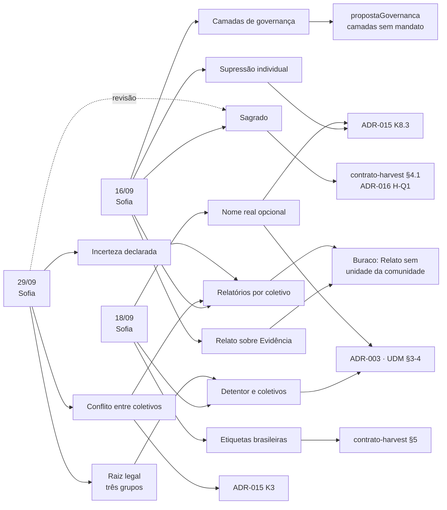

# Impactos das reuniões com o Ponto-Focal na arquitetura — estado consolidado

> **O que este documento é.** A visão única e atual de **todos os itens de impacto** (`I-01`, `I-02`…)
> que as reuniões com o Ponto-Focal produziram sobre os documentos de arquitetura. A análise de cada
> reunião fica num documento próprio, `AAAA-MM-DD-impactos-reuniao-<ponto-focal>.md`, escrito uma vez
> depois do resumo. Este documento só consolida: um bloco de formato fixo por item, com a situação atual.
>
> **Escopo.** Só entram aqui as reuniões com o Ponto-Focal. Reuniões de apresentação, de comitê ou
> de articulação institucional têm resumo próprio em `Governanca/Arquitetura/Reunioes/` e **não** geram itens de
> impacto — o Ponto-Focal é o canal por onde a interlocução com as Comunidades Tradicionais chega à
> arquitetura, e é esse canal que se rastreia aqui.
>
> **O que este documento não é.** Não é decisão, não é ADR e não altera nada. Ele **aponta** o que
> precisa mudar, onde, e por quê. A mudança acontece no documento de destino — ADR, `docs/CONTEXT.md`,
> `contrato-harvest.md`, UDM — e só por ato próprio. Enquanto o destino não muda, o texto vigente
> continua vigente, inclusive quando um item já registrou a contradição.
>
> **Estado consolidado e questões abertas.** Cada item tem um bloco de formato fixo (*Situação*,
> *Tipo*, *Destino*, *Origem*, *Questão aberta*, *Alimenta*, *Histórico*, *Leitura*), fácil de filtrar
> por pessoa e por IA. As perguntas que só uma pessoa pode responder vivem como *Issues* do GitHub;
> o mapa delas é a Issue [#6](https://github.com/edalcin/Arquitetura-BioCultural/issues/6). *Situação* usa só cinco valores: `aberto`, `em revisão`,
> `confirmado`, `aplicado` (destino alterado) e `fora do canal`.
>
> **Como usar.** Depois da "Revisão das Issues" obrigatória, descrita em [`README.md`](../Governanca/Arquitetura/README.md), e
> ao fechar o documento de impactos de uma reunião: (1) acrescente blocos novos, com numeração que
> continua a anterior e nunca é reutilizada; (2) atualize *Situação*, *Questão aberta* e *Histórico*
> dos itens que a reunião reviu; (3) atualize o índice (e as §2 a §4, se a reunião mexeu nelas).
> Um item só passa a `aplicado` quando o documento de destino for alterado, e a alteração entra no
> *Histórico*. O método completo está em [`README.md`](../Governanca/Arquitetura/README.md).

## Sumário

- [1. Estado consolidado](#1-estado-consolidado)
- [2. O buraco estrutural em aberto](#2-o-buraco-estrutural-em-aberto)
- [3. Plano mínimo de documentos, se e quando for executado](#3-plano-mínimo-de-documentos-se-e-quando-for-executado)
- [4. Verificações pendentes](#4-verificações-pendentes)

Documentos de impactos por reunião:
[16/09](../Governanca/Arquitetura/Reunioes/2026-09-16-impactos-reuniao-sofia.md) ·
[18/09](../Governanca/Arquitetura/Reunioes/2026-09-18-impactos-reuniao-sofia.md) ·
[29/09](../Governanca/Arquitetura/Reunioes/2026-09-29-impactos-reuniao-sofia.md)

---

## 1. Estado consolidado

Situação em 2026-10-03, depois de três reuniões com o Ponto-Focal. Nenhum documento de arquitetura
foi alterado por efeito delas até aqui. *Origem* é a reunião que criou o item; o documento de
impactos daquela reunião tem a análise. Referências ao destino são por seção ou ponto; o número de
linha, quando aparece, é só dica.

| Item | Título curto | Situação | Alimenta | Questão aberta |
|---|---|---|---|---|
| I-01 | Nomeação da pessoa que compartilha | confirmado | ADR-018 | — |
| I-02 | Formato do detentor individual | confirmado | ADR-018; emenda ao contrato-harvest | — |
| I-03 | Sagrado não é privado | confirmado (parte aberta) | ADR-019; emenda ao contrato-harvest (§4.1) | [#10](https://github.com/edalcin/Arquitetura-BioCultural/issues/10), [#26](https://github.com/edalcin/Arquitetura-BioCultural/issues/26) |
| I-04 | Conteúdo sagrado de artigo | em revisão | ADR-019 | [#9](https://github.com/edalcin/Arquitetura-BioCultural/issues/9) |
| I-05 | Sai a pessoa, não o vídeo | fora do canal | emenda ao ADR-015 (K8.3) | [#12](https://github.com/edalcin/Arquitetura-BioCultural/issues/12), [#24](https://github.com/edalcin/Arquitetura-BioCultural/issues/24), [#25](https://github.com/edalcin/Arquitetura-BioCultural/issues/25), [#29](https://github.com/edalcin/Arquitetura-BioCultural/issues/29) |
| I-06 | Detentor é coletivo | confirmado | ADR-018; emenda ao ADR-015 (K1, Q1); emenda ao ADR-003, UDM e CONTEXT.md | — |
| I-07 | Coletivo é entidade | confirmado | ADR-018; emenda ao contrato-harvest (§3); emenda ao ADR-003 e UDM | — |
| I-08 | Nome real opcional | confirmado | ADR-018; emenda ao ADR-003 e UDM | — |
| I-09 | Relatórios de pendência | confirmado | requisito sem ADR (`proximosPassos.md` do BioCultDB e do BioCultRelatos) | [#17](https://github.com/edalcin/Arquitetura-BioCultural/issues/17), [#28](https://github.com/edalcin/Arquitetura-BioCultural/issues/28) |
| I-10 | Rótulo afirmativo de detentor não identificado | confirmado | — | — |
| I-11 | Default privado na dúvida | confirmado | ADR-019; emenda ao ADR-015 (K7) | — |
| I-12 | Etiquetas brasileiras | confirmado (parte aberta) | emenda ao ADR-015 (K4); emenda ao contrato-harvest (§5) | [#20](https://github.com/edalcin/Arquitetura-BioCultural/issues/20), [#21](https://github.com/edalcin/Arquitetura-BioCultural/issues/21) |
| I-13 | Perfil de sensibilidade por coletivo | confirmado | emenda ao ADR-015 (K7) | — |
| I-14 | Relato da comunidade sobre Evidência | aberto | — | [#18](https://github.com/edalcin/Arquitetura-BioCultural/issues/18) |
| I-15 | Governança: composição e mandato | aberto | — | [#11](https://github.com/edalcin/Arquitetura-BioCultural/issues/11), [#12](https://github.com/edalcin/Arquitetura-BioCultural/issues/12), [#29](https://github.com/edalcin/Arquitetura-BioCultural/issues/29) |
| I-16 | Raiz legal com três grupos | confirmado | ADR-018; emenda ao CONTEXT.md e UDM | [#15](https://github.com/edalcin/Arquitetura-BioCultural/issues/15) |
| I-17 | Conflito entre coletivos | confirmado (parte aberta) | emenda ao ADR-015 (K3); requisito de relatórios de pendência | [#16](https://github.com/edalcin/Arquitetura-BioCultural/issues/16), [#27](https://github.com/edalcin/Arquitetura-BioCultural/issues/27) |
| I-18 | Incerteza declarada | confirmado (parte aberta) | emenda ao ADR-015 (K7); requisito de relatórios de pendência | [#17](https://github.com/edalcin/Arquitetura-BioCultural/issues/17), [#28](https://github.com/edalcin/Arquitetura-BioCultural/issues/28) |
| I-19 | Domesticação e manejo | aberto | — | [#13](https://github.com/edalcin/Arquitetura-BioCultural/issues/13) |

### I-01 — Três formas de nomeação, uma por pessoa

- **Situação:** confirmado
- **Tipo:** fecha (Q3 da ADR-015)
- **Destino:** ADR-015, "O que esta ADR não decide", Q3 ("Como identificar o detentor sem expor a pessoa?"); `proximosPassos.md` §4 ① ("Como identificar o detentor sem expor a pessoa"); `contrato-harvest.md` §8, pendência ① (`ADR-016`, H-Q2); linha 418 da ADR-015 como dica
- **Origem:** decisões 2 e 3 de 18/09 ([resumo](../Governanca/Arquitetura/Reunioes/2026-09-18-reuniao-sofia.md)); variação por assunto fechada pela decisão 10 de 29/09 ([resumo](../Governanca/Arquitetura/Reunioes/2026-09-29-reuniao-sofia.md)); análise em [impactos de 18/09](../Governanca/Arquitetura/Reunioes/2026-09-18-impactos-reuniao-sofia.md) e [impactos de 29/09](../Governanca/Arquitetura/Reunioes/2026-09-29-impactos-reuniao-sofia.md)
- **Questão aberta:** — (relacionada: [#22](https://github.com/edalcin/Arquitetura-BioCultural/issues/22))
- **Alimenta:** ADR-018
- **Histórico:** 18/09 criado · 29/09 confirmado (nomeação não varia por assunto)
- **Leitura:** Três formas de nomeação da pessoa que compartilha: nome verdadeiro, pseudônimo escolhido por ela, pseudônimo gerado pelo sistema. A escolha é por pessoa, não por assunto (29/09), e a exibição varia por público. Fecha o cardápio de opções; o valor por pessoa continua sendo consentimento, registro a registro. Relacionada: [#22](https://github.com/edalcin/Arquitetura-BioCultural/issues/22) (contato para mudar de ideia).

### I-02 — Formato do detentor individual no payload

- **Situação:** confirmado
- **Tipo:** fecha (pendência ① e H-Q2)
- **Destino:** `contrato-harvest.md` §8, pendência ① ("Formato do detentor individual — nome protegido, atribuição só coletiva, ou pseudônimo escolhido pela própria pessoa"); `ADR-016`, "O que esta ADR não decide", H-Q2 ("Formato do detentor individual em `holderPeople`"); linhas 250 e 132 como dica
- **Origem:** decisões 2 e 3 de 18/09 ([resumo](../Governanca/Arquitetura/Reunioes/2026-09-18-reuniao-sofia.md)); análise em [impactos de 18/09](../Governanca/Arquitetura/Reunioes/2026-09-18-impactos-reuniao-sofia.md)
- **Questão aberta:** —
- **Alimenta:** ADR-018; emenda ao contrato-harvest
- **Histórico:** 18/09 criado · 29/09 confirmado
- **Leitura:** Resolvido junto com I-01: o pseudônimo, antes só recomendado, passa a ser uma das três formas de nomeação. O campo do detentor individual pode entrar no payload quando a ADR-018 for escrita. Baixa as pendências ① e ② do contrato.

### I-03 — `sacred` não equivale a `private`; existência publicável

- **Situação:** confirmado — parte aberta: o vocabulário sagrado × sigilo, em [#10](https://github.com/edalcin/Arquitetura-BioCultural/issues/10) e [#26](https://github.com/edalcin/Arquitetura-BioCultural/issues/26)
- **Tipo:** fecha (H-Q1), contradizendo a regra interina
- **Destino:** `contrato-harvest.md` §4.1, regra interina ("para efeito de cálculo equivale a `private` — nunca atravessa, em nenhuma hipótese"); `ADR-016`, "O que esta ADR não decide", H-Q1 ("`sacred` (nível de Termo) equivale a `private` no cálculo do nível efetivo?"); linhas 96-104 e 131 como dica
- **Origem:** decisões 3 e 4 de 16/09 ([resumo](../Governanca/Arquitetura/Reunioes/2026-09-16-reuniao-sofia.md)); confirmada com ressalva pelas decisões 2 e 3 de 29/09 ([resumo](../Governanca/Arquitetura/Reunioes/2026-09-29-reuniao-sofia.md)); análise em [impactos de 16/09](../Governanca/Arquitetura/Reunioes/2026-09-16-impactos-reuniao-sofia.md) e [impactos de 29/09](../Governanca/Arquitetura/Reunioes/2026-09-29-impactos-reuniao-sofia.md)
- **Questão aberta:** [#10](https://github.com/edalcin/Arquitetura-BioCultural/issues/10), [#26](https://github.com/edalcin/Arquitetura-BioCultural/issues/26)
- **Alimenta:** ADR-019; emenda ao contrato-harvest (§4.1)
- **Histórico:** 16/09 criado · 29/09 confirmado, com ressalva sobre o vocabulário · 03/10 questões abertas #10 e #26
- **Leitura:** Registra-se o metadado do sagrado, nunca o conteúdo: afirmar que existe conhecimento sagrado é legítimo, dizer qual é, não. `sacred` sai da escala e vira dimensão do registro. Em 29/09 Sofia confirmou que "o aviso precisa aparecer" e que existe secreto não sagrado (matriz de quatro células); falta saber se o eixo que protege é o sigilo, com duas marcas independentes.

### I-04 — Conteúdo sagrado de artigo não é persistido

- **Situação:** em revisão
- **Tipo:** contradiz
- **Destino:** ADR-015, K6 — rejeição de *redaction at rest* ("A alternativa, *redaction at rest* (nunca gravar o campo restrito), […] foi **rejeitada**"); repetida em `contrato-harvest.md` §4.4; linha 284 como dica
- **Origem:** decisão 3 de 16/09 ([resumo](../Governanca/Arquitetura/Reunioes/2026-09-16-reuniao-sofia.md)); revista pela decisão 4 de 29/09 ([resumo](../Governanca/Arquitetura/Reunioes/2026-09-29-reuniao-sofia.md)); análise em [impactos de 16/09](../Governanca/Arquitetura/Reunioes/2026-09-16-impactos-reuniao-sofia.md) e [impactos de 29/09](../Governanca/Arquitetura/Reunioes/2026-09-29-impactos-reuniao-sofia.md)
- **Questão aberta:** [#9](https://github.com/edalcin/Arquitetura-BioCultural/issues/9)
- **Alimenta:** ADR-019
- **Histórico:** 16/09 criado · 29/09 em revisão · 03/10 questão aberta #9
- **Leitura:** Em 16/09 a leitura foi: conteúdo sagrado extraído de artigo não é gravado (*redaction at rest*), exceção ao K6. Em 29/09 Sofia disse que a unidade registra e não publica, que é a regra vigente. As duas respostas vêm da mesma pessoa e divergem. Nenhuma mudança na ADR-015 até a decisão. Mantém a exigência de supressão retroativa, e de liberação a pedido, para Evidência.

### I-05 — Sai a pessoa, não sai o vídeo

- **Situação:** fora do canal
- **Tipo:** contradiz
- **Destino:** ADR-015, K8.3 — enunciação coletiva ("Um participante que pede reserva reserva a gravação inteira"); `contrato-harvest.md` §4.1, quarto eixo (gravação com vários participantes); ADR-003, §1 "Registro Principal", nota de retificação, linha "acesso de mídia coletiva (K8.3)"; linhas 349-355, 80-84 e 126 como dica
- **Origem:** decisão 2 de 16/09 ([resumo](../Governanca/Arquitetura/Reunioes/2026-09-16-reuniao-sofia.md)); fora do escopo do canal pela decisão 5 de 29/09 ([resumo](../Governanca/Arquitetura/Reunioes/2026-09-29-reuniao-sofia.md)); análise em [impactos de 16/09](../Governanca/Arquitetura/Reunioes/2026-09-16-impactos-reuniao-sofia.md) e [impactos de 29/09](../Governanca/Arquitetura/Reunioes/2026-09-29-impactos-reuniao-sofia.md)
- **Questão aberta:** [#12](https://github.com/edalcin/Arquitetura-BioCultural/issues/12), [#24](https://github.com/edalcin/Arquitetura-BioCultural/issues/24), [#25](https://github.com/edalcin/Arquitetura-BioCultural/issues/25), [#29](https://github.com/edalcin/Arquitetura-BioCultural/issues/29)
- **Alimenta:** emenda ao ADR-015 (K8.3)
- **Histórico:** 16/09 criado · 29/09 fora do canal · 03/10 questões abertas #12, #24, #25 e #29
- **Leitura:** O coletivo decide sobre o Conhecimento; o indivíduo é soberano sobre imagem, voz e fala. Autorizada a publicação, a recusa individual suprimiria a pessoa, não o registro: inverte o default atual, em que a recusa bloqueia o coletivo. Segue válido e não aplicado; espera interlocutor de fontes primárias (I-15), porque a edição de vídeo é questão de fonte primária.

### I-06 — Detentor é sempre coletivo

- **Situação:** confirmado
- **Tipo:** contradiz
- **Destino:** `modelo-de-dados-unificado.md` §4 Documento canônico (`"detentor": { "tipo": "coletivo", // individual | coletivo`); ADR-015, K1, Q1 ("Existe detentor identificável — pessoa ou coletivo nomeado…") e K2, item 1 ("Detentor — pessoa ou coletivo, com sua comunidade"); `docs/CONTEXT.md`, verbete **Relato** ("um detentor (pessoa ou coletivo)"); linhas UDM 155, ADR-015 156 e 178, CONTEXT 84-90 como dica
- **Origem:** decisão 1 de 18/09 ([resumo](../Governanca/Arquitetura/Reunioes/2026-09-18-reuniao-sofia.md)); análise em [impactos de 18/09](../Governanca/Arquitetura/Reunioes/2026-09-18-impactos-reuniao-sofia.md)
- **Questão aberta:** —
- **Alimenta:** ADR-018; emenda ao ADR-015 (K1, Q1); emenda ao ADR-003, UDM e CONTEXT.md
- **Histórico:** 18/09 criado
- **Leitura:** O Conhecimento é coletivo por lei, então o detentor é sempre um Coletivo. Quem compartilhou é campo adicional e opcional (`compartilhadoPor`), e nunca substitui o vínculo com o coletivo: até a benzedeira isolada pertence ao coletivo das benzedeiras. Cai o discriminador `tipo`. Reescreve a Q1 do K1 e o verbete **Relato**.

### I-07 — Coletivo é entidade, não string

- **Situação:** confirmado
- **Tipo:** contradiz
- **Destino:** ADR-003, §1 "Registro Principal", bloco `community` ("`community: { name, ethnicity, language }`", objeto plano); `contrato-harvest.md` §3, campo `holderPeople` (tipo string); `docs/CONTEXT.md`, verbete **Fonte de Atribuição** ("Tem sempre um **tipo** e um **nome**"); linhas ADR-003 312-316, contrato 63 e CONTEXT 120 como dica
- **Origem:** decisões 5, 6 e 7 de 18/09 ([resumo](../Governanca/Arquitetura/Reunioes/2026-09-18-reuniao-sofia.md)); "segmento" confirmado em 29/09 ([resumo](../Governanca/Arquitetura/Reunioes/2026-09-29-reuniao-sofia.md)); análise em [impactos de 18/09](../Governanca/Arquitetura/Reunioes/2026-09-18-impactos-reuniao-sofia.md)
- **Questão aberta:** —
- **Alimenta:** ADR-018; emenda ao contrato-harvest (§3); emenda ao ADR-003 e UDM
- **Histórico:** 18/09 criado · 29/09 confirmado ("segmento" é a categoria legal)
- **Leitura:** Entidade `Coletivo`: categoria legal obrigatória, autodenominação com referência ao termo legal, hierarquia opcional, pertencimento N:N com pessoa. `holderPeople` precisa carregar ao menos o identificador da categoria legal: muda a **forma** do contrato. Sofia chamou o nível mínimo de "segmento" (28/09) e confirmou, em 29/09, que é a categoria do Decreto nº 8.750/2016.

### I-08 — Nome real pode não existir na persistência

- **Situação:** confirmado
- **Tipo:** contradiz
- **Destino:** ADR-003, §1 "Registro Principal", bloco `informants` ("`anonymized: true // Não incluir nome`") e `permissions.hiddenFields` ("`[\"location.coordinates\", \"community.name\"]`"); `modelo-de-dados-unificado.md` §5 ("campo ausente ≠ campo retido"); linhas ADR-003 346-352 e 407 como dica
- **Origem:** decisão 3 de 18/09 ([resumo](../Governanca/Arquitetura/Reunioes/2026-09-18-reuniao-sofia.md)); análise em [impactos de 18/09](../Governanca/Arquitetura/Reunioes/2026-09-18-impactos-reuniao-sofia.md)
- **Questão aberta:** — (relacionada: [#22](https://github.com/edalcin/Arquitetura-BioCultural/issues/22))
- **Alimenta:** ADR-018; emenda ao ADR-003 e UDM
- **Histórico:** 18/09 criado
- **Leitura:** Há quem recuse o armazenamento, não só a exibição. O nome real deixa de ser obrigatório-com-máscara e passa a opcional na própria persistência. A regra "ausente ≠ retido" ganha três estados: ausente por não se ter, retido por decisão de acesso, nunca gravado por escolha da pessoa. Não-identificação é proteção contra dano. Relacionada: [#22](https://github.com/edalcin/Arquitetura-BioCultural/issues/22).

### I-09 — Relatórios de pendência por coletivo

- **Situação:** confirmado
- **Tipo:** acrescenta
- **Destino:** Nenhum ADR hoje; `proximosPassos.md` do BioCultDB e do BioCultRelatos
- **Origem:** decisão 8 de 16/09 ([resumo](../Governanca/Arquitetura/Reunioes/2026-09-16-reuniao-sofia.md)); ganha entradas de I-17 e I-18 em 29/09 ([resumo](../Governanca/Arquitetura/Reunioes/2026-09-29-reuniao-sofia.md)); análise em [impactos de 16/09](../Governanca/Arquitetura/Reunioes/2026-09-16-impactos-reuniao-sofia.md) e [impactos de 29/09](../Governanca/Arquitetura/Reunioes/2026-09-29-impactos-reuniao-sofia.md)
- **Questão aberta:** [#17](https://github.com/edalcin/Arquitetura-BioCultural/issues/17), [#28](https://github.com/edalcin/Arquitetura-BioCultural/issues/28)
- **Alimenta:** requisito sem ADR (`proximosPassos.md` do BioCultDB e do BioCultRelatos)
- **Histórico:** 16/09 criado · 29/09 ganha entradas de I-17 e I-18 · 03/10 questões #17 e #28 (quem recebe o relatório)
- **Leitura:** Relatórios periódicos e por demanda, por coletivo: o requisito é ativo, não consultivo. Passam a ter três entradas: registro sem decisão, registro embargado (I-17) e classificação incerta (I-18). Exigem o estado "aguardando decisão" no ciclo do registro e a hierarquia de coletivos (I-07).

### I-10 — Rótulo afirmativo de detentor não identificado

- **Situação:** confirmado
- **Tipo:** acrescenta
- **Destino:** ADR-015, K1, Q4 ("A comunidade tem, hoje, autoridade reconhecida e exercível…" → "`evidencia` com **atribuição incompleta**"); linha 159 como dica
- **Origem:** decisão 7, caminho 3, de 16/09 ([resumo](../Governanca/Arquitetura/Reunioes/2026-09-16-reuniao-sofia.md)); análise em [impactos de 16/09](../Governanca/Arquitetura/Reunioes/2026-09-16-impactos-reuniao-sofia.md)
- **Questão aberta:** —
- **Alimenta:** —
- **Histórico:** 16/09 criado
- **Leitura:** A "atribuição incompleta" descreve uma lacuna. Pede-se um Notice obrigatório com redação afirmativa: *há detentor, não se sabe quem é*, nunca *não há detentor*. A razão é o dado de que cerca de 90% do CGen cai nessa categoria, usada como porta de fuga do consentimento.

### I-11 — Default privado estendido a toda dúvida

- **Situação:** confirmado
- **Tipo:** acrescenta
- **Destino:** ADR-015, K7 — tabela de padrões ("Registro de regime `evidencia` | segue o ADR-003 | Não muda"); linhas 288-296 como dica
- **Origem:** decisão 5 de 16/09 ([resumo](../Governanca/Arquitetura/Reunioes/2026-09-16-reuniao-sofia.md)); confirmado pela decisão 6 de 29/09 ([resumo](../Governanca/Arquitetura/Reunioes/2026-09-29-reuniao-sofia.md)); análise em [impactos de 16/09](../Governanca/Arquitetura/Reunioes/2026-09-16-impactos-reuniao-sofia.md)
- **Questão aberta:** —
- **Alimenta:** ADR-019; emenda ao ADR-015 (K7)
- **Histórico:** 16/09 criado · 29/09 confirmado
- **Leitura:** O K7 dá `restricted` por omissão só ao regime `conhecimento`; falta a linha para Evidência com marcação de sagrado, que é o caso do BioCultDB. O default privado vale para toda dúvida de classificação, e cada coletivo define o que é privado (ver I-13).

### I-12 — Etiquetas próprias com tabela de correspondência

- **Situação:** confirmado — parte aberta: tipos de restrição das etiquetas brasileiras e como a comunidade muda um rótulo sem o curador, em [#20](https://github.com/edalcin/Arquitetura-BioCultural/issues/20) e [#21](https://github.com/edalcin/Arquitetura-BioCultural/issues/21)
- **Tipo:** acrescenta
- **Destino:** ADR-015, K4 ("Os rótulos culturais do Local Contexts entram no modelo como campo próprio"); `contrato-harvest.md` §5, `culturalLabels` ("`id` | Identificador do rótulo. Nunca o texto"); linhas ADR-015 217-230 e contrato 152-166 como dica
- **Origem:** decisões 8, 9 e 11 de 18/09 ([resumo](../Governanca/Arquitetura/Reunioes/2026-09-18-reuniao-sofia.md)); análise em [impactos de 18/09](../Governanca/Arquitetura/Reunioes/2026-09-18-impactos-reuniao-sofia.md)
- **Questão aberta:** [#20](https://github.com/edalcin/Arquitetura-BioCultural/issues/20), [#21](https://github.com/edalcin/Arquitetura-BioCultural/issues/21)
- **Alimenta:** emenda ao ADR-015 (K4); emenda ao contrato-harvest (§5)
- **Histórico:** 18/09 criado · 03/10 questões abertas #20 e #21
- **Leitura:** O princípio das etiquetas é adotado; o conjunto internacional não. Etiquetas brasileiras com tabela de correspondência para exportação. O harvest sobrevive sem mudar de forma: basta namespace no `id` e `hubId` ausente para rótulo próprio. Adoção prática do Local Contexts adiada (decisão 10), o que mantém a Q4 da ADR-015 aberta.

### I-13 — Perfil de sensibilidade por coletivo

- **Situação:** confirmado
- **Tipo:** acrescenta
- **Destino:** ADR-015, K7 — tabela de padrões ("**Relato** | `restricted` | Publicar por omissão o que nunca foi consentido é inaceitável"); linhas 288-296 como dica
- **Origem:** insight da farmacopeia popular, 18/09 ([resumo](../Governanca/Arquitetura/Reunioes/2026-09-18-reuniao-sofia.md)); confirmado pela decisão 6 de 29/09 ([resumo](../Governanca/Arquitetura/Reunioes/2026-09-29-reuniao-sofia.md)); análise em [impactos de 18/09](../Governanca/Arquitetura/Reunioes/2026-09-18-impactos-reuniao-sofia.md)
- **Questão aberta:** —
- **Alimenta:** emenda ao ADR-015 (K7)
- **Histórico:** 18/09 criado · 29/09 confirmado
- **Leitura:** Para raizeiras e medicina tradicional, registrar é proteger, ao contrário de povos indígenas e de terreiro. O default do K7 precisa ser revisável pelo coletivo, não constante global. Não contradiz o K7: mantém `restricted` como omissão segura e admite sobreposição por decisão da comunidade.

### I-14 — Relato da comunidade sobre Evidência publicada

- **Situação:** aberto
- **Tipo:** abre — sem solução no texto vigente
- **Destino:** ADR-015, K2 ("Um Relato **vive sempre na unidade da comunidade detentora**") e "Por que o regime é campo do registro", subseção "O caso que **não** é exceção" ("BioCultAcervos, BioCultDB e BioCultNaturalistas são `evidencia` **sempre**"); ver §2 deste documento; linhas 183 e 76 como dica
- **Origem:** decisão 9 de 16/09 ([resumo](../Governanca/Arquitetura/Reunioes/2026-09-16-reuniao-sofia.md)); reafirmado em 29/09 ([resumo](../Governanca/Arquitetura/Reunioes/2026-09-29-reuniao-sofia.md)); análise em [impactos de 16/09](../Governanca/Arquitetura/Reunioes/2026-09-16-impactos-reuniao-sofia.md) e [impactos de 29/09](../Governanca/Arquitetura/Reunioes/2026-09-29-impactos-reuniao-sofia.md)
- **Questão aberta:** [#18](https://github.com/edalcin/Arquitetura-BioCultural/issues/18)
- **Alimenta:** —
- **Histórico:** 16/09 criado · 29/09 reafirmado · 03/10 questão aberta #18
- **Leitura:** Se a comunidade corrige, contesta ou acrescenta sobre uma Evidência, o que produz é Relato. Não há onde ele nascer: a comunidade quase nunca tem Unidade Federada. É também o caminho pelo qual o BioCultDB toca dado primário. Ver §2.

### I-15 — Composição e mandato das camadas de governança

- **Situação:** aberto
- **Tipo:** abre
- **Destino:** `propostaGovernanca.md` §2 (três camadas de governança), §6.1 (instâncias de decisão e papéis) e §7 (governança da arquitetura); `proximosPassos.md`
- **Origem:** decisão de 16/09 sobre camadas de governança ([resumo](../Governanca/Arquitetura/Reunioes/2026-09-16-reuniao-sofia.md)); revista em 29/09 ([resumo](../Governanca/Arquitetura/Reunioes/2026-09-29-reuniao-sofia.md)); análise em [impactos de 16/09](../Governanca/Arquitetura/Reunioes/2026-09-16-impactos-reuniao-sofia.md) e [impactos de 29/09](../Governanca/Arquitetura/Reunioes/2026-09-29-impactos-reuniao-sofia.md)
- **Questão aberta:** [#11](https://github.com/edalcin/Arquitetura-BioCultural/issues/11), [#12](https://github.com/edalcin/Arquitetura-BioCultural/issues/12), [#29](https://github.com/edalcin/Arquitetura-BioCultural/issues/29)
- **Alimenta:** —
- **Histórico:** 16/09 criado · 29/09 convite a Viviane Kruel · 03/10 questões abertas #11, #12 e #29
- **Leitura:** A camada dos dados é das comunidades e está definida; as camadas da arquitetura e das ferramentas seguem sem composição, sem mandato e sem regra de formação. Hoje a camada de arquitetura é, de fato, uma reunião de duas pessoas. Em 29/09 Eduardo convidou Viviane Kruel como interlocutora de fontes primárias (BioCultRelatos).

### I-16 — Raiz legal com três grupos; listas não exaustivas

- **Situação:** confirmado
- **Tipo:** contradiz
- **Destino:** `docs/CONTEXT.md`, verbete **Comunidade Tradicional** ("Seu tipo vem da lista de 29 categorias do Decreto 8.750/2016"); `modelo-de-dados-unificado.md` §3 Entidades, linha **Fonte de Atribuição** ("Decreto 8.750/2016, 29 categorias"); linhas CONTEXT 127-128 e UDM 77 como dica
- **Origem:** decisão 11 de 29/09 ([resumo](../Governanca/Arquitetura/Reunioes/2026-09-29-reuniao-sofia.md)); análise em [impactos de 29/09](../Governanca/Arquitetura/Reunioes/2026-09-29-impactos-reuniao-sofia.md)
- **Questão aberta:** [#15](https://github.com/edalcin/Arquitetura-BioCultural/issues/15)
- **Alimenta:** ADR-018; emenda ao CONTEXT.md e UDM
- **Histórico:** 29/09 criado · 03/10 questão #15 (lista de povos indígenas)
- **Leitura:** A raiz tem dois níveis: o **grupo legal** da Lei nº 13.123/2015 (povos indígenas, povos e comunidades tradicionais, agricultores) e a **categoria**, tirada de lista de referência por grupo, cada uma com "outro". O Decreto nº 8.750/2016 é base, não lista fechada; o nº 8.772/2016 regulamenta a lei. Falta escolher a lista de povos indígenas (ISA, IBGE ou FUNAI).

### I-17 — Conflito entre coletivos: o privado prevalece (embargo)

- **Situação:** confirmado — parte aberta: embargo entre unidades diferentes, em [#16](https://github.com/edalcin/Arquitetura-BioCultural/issues/16) e [#27](https://github.com/edalcin/Arquitetura-BioCultural/issues/27)
- **Tipo:** acrescenta; abre entre unidades
- **Destino:** ADR-015, K3 ("O nível de acesso efetivo de qualquer resposta de API é o mais restritivo entre os três níveis envolvidos"); relatórios de pendência (I-09); linha 205 como dica
- **Origem:** decisão 7 de 29/09 e caso Krahô ([resumo](../Governanca/Arquitetura/Reunioes/2026-09-29-reuniao-sofia.md)); leitura ajustada pela revisão de Sofia (PR #4); análise em [impactos de 29/09](../Governanca/Arquitetura/Reunioes/2026-09-29-impactos-reuniao-sofia.md)
- **Questão aberta:** [#16](https://github.com/edalcin/Arquitetura-BioCultural/issues/16), [#27](https://github.com/edalcin/Arquitetura-BioCultural/issues/27)
- **Alimenta:** emenda ao ADR-015 (K3); requisito de relatórios de pendência
- **Histórico:** 29/09 criado · 03/10 questões abertas #16 e #27
- **Leitura:** Se um coletivo quer publicar e outro, também representativo, não quer, fica privado até resolverem. Um coletivo representativo (com ata) pode pedir **embargo** mesmo contra autorização já dada por outro. É a regra do mais restritivo em eixo novo: K3 compara termo, Relato e registro; K8.3, pessoas; I-17, coletivos. Dentro de uma unidade é implementável; entre unidades não há mecanismo (nenhuma base central, Pluriverso só indexa).

### I-18 — Incerteza declarada como valor de classificação

- **Situação:** confirmado — parte aberta: se o "não sei" vale também para sagrado e quem recebe o relatório, em [#17](https://github.com/edalcin/Arquitetura-BioCultural/issues/17) e [#28](https://github.com/edalcin/Arquitetura-BioCultural/issues/28)
- **Tipo:** acrescenta
- **Destino:** ADR-015, K7 ("Padrões de omissão deliberadamente diferentes por nível"); UDM; relatórios de pendência (I-09); linhas 288-296 como dica
- **Origem:** decisão 9 de 29/09 ([resumo](../Governanca/Arquitetura/Reunioes/2026-09-29-reuniao-sofia.md)); leitura ajustada pela revisão de Sofia (PR #4); análise em [impactos de 29/09](../Governanca/Arquitetura/Reunioes/2026-09-29-impactos-reuniao-sofia.md)
- **Questão aberta:** [#17](https://github.com/edalcin/Arquitetura-BioCultural/issues/17), [#28](https://github.com/edalcin/Arquitetura-BioCultural/issues/28)
- **Alimenta:** emenda ao ADR-015 (K7); requisito de relatórios de pendência
- **Histórico:** 29/09 criado · 03/10 questões abertas #17 e #28
- **Leitura:** "Não tenho certeza" é valor válido quando quem classifica não sabe se algo é **secreto** ou se pode ser publicado (secreto, não sagrado). O nível efetivo é o privado; a dúvida fica gravada e entra num relatório para quem pode ajudar (Câmara Setorial dos Guardiões, APIB). Distingue "decidido privado" de "privado porque não se sabe". Liga-se a ⑱ (capacitação).

### I-19 — Evidência de domesticação e manejo

- **Situação:** aberto
- **Tipo:** abre
- **Destino:** nenhum documento hoje
- **Origem:** discussão de 29/09 ([resumo](../Governanca/Arquitetura/Reunioes/2026-09-29-reuniao-sofia.md)); análise em [impactos de 29/09](../Governanca/Arquitetura/Reunioes/2026-09-29-impactos-reuniao-sofia.md)
- **Questão aberta:** [#13](https://github.com/edalcin/Arquitetura-BioCultural/issues/13)
- **Alimenta:** —
- **Histórico:** 29/09 criado · 03/10 questão aberta #13
- **Leitura:** Evidência da relação entre grupos e plantas numa escala de tempo longa, diferente da evidência de uso. Nenhum documento de arquitetura a modela. Insumo conhecido: o UseFlora troca indicadores por categorias. Espera a reunião com Nivaldo e Carol.

---

## 2. O buraco estrutural em aberto

**I-14 — o Relato da comunidade sobre uma Evidência publicada não tem onde nascer.**

Questão aberta: [#18](https://github.com/edalcin/Arquitetura-BioCultural/issues/18).

Origem: decisão 9 de 16/09 — se a comunidade pode corrigir, contestar ou acrescentar sobre uma
Evidência, o que ela produz é Conhecimento, logo um Relato. Confirmado em 18/09 como o caminho pelo
qual o BioCultDB tangencia dado primário, e reafirmado em 29/09.

Três invariantes do texto vigente colidem:

1. ADR-015, K2 — "um Relato **vive sempre na unidade da comunidade detentora**".
2. ADR-015, "Por que o regime é campo do registro", subseção "O caso que não é exceção" — "BioCultAcervos, BioCultDB e BioCultNaturalistas são `evidencia` **sempre**".
3. Na esmagadora maioria dos casos, a comunidade que se reconhece num artigo **não tem Unidade
   Federada**.

Guardar o Relato dentro do BioCultDB é a soberania invertida que a própria ADR-015 rejeita
expressamente, na mesma subseção ("é a soberania invertida"). Não guardar em lugar nenhum perde a correção — e perder a correção é perder
exatamente o momento em que, segundo o insight de 16/09, a comunidade deixa de validar e passa a
contribuir.

Caminho conservador, para consideração e **não decidido aqui**: não acrescentar armazenamento de
Relato ao BioCultDB; usar o que já existe — `relatedResources` / `resource-relationship`
(`contrato-harvest.md` §6 `relatedResources`; exemplo em §4.3) — com um valor de `relationshipType` para contestação; e tratar a
contestação sem unidade de destino como **item do relatório de pendências** (I-09), nunca como Relato
órfão.

Resta a pergunta que nenhum documento responde: **a arquitetura oferece uma instância de
BioCultRelatos à comunidade como parte da resposta, ou não?** Enquanto não houver resposta, não há
onde o Relato nascer.

---

## 3. Plano mínimo de documentos, se e quando for executado

Registrado como proposta. **Nada disto foi feito.** Situação em 2026-10-03. A coluna *Bloqueado por* lista as Issues que travam a linha.

| Documento | Conteúdo | Itens que consome | Pronto para escrever? | Bloqueado por |
|---|---|---|---|---|
| **ADR-018 — Identificação do detentor** | Grupo legal da Lei nº 13.123 e categoria por lista não exaustiva; coletivo obrigatório, hierarquia opcional, pertencimento N:N, autodenominação; campo de quem compartilhou; três formas de nomeação, uma por pessoa; nome real opcional na persistência | I-01, I-02, I-06, I-07, I-08, I-16 | **Sim** — todos confirmados até 29/09 | [#15](https://github.com/edalcin/Arquitetura-BioCultural/issues/15) (lista de povos indígenas, só para a categoria) |
| **ADR-019 — Sagrado como dimensão, não nível** | Existência publicável × conteúdo protegido; sagrado e secreto independentes (quatro células); default privado na dúvida; supressão retroativa e liberação a pedido; sigilo por campo | I-03, I-04, I-11 | **Não** — espera o vocabulário sagrado × sigilo e a decisão sobre I-04 | [#9](https://github.com/edalcin/Arquitetura-BioCultural/issues/9), [#10](https://github.com/edalcin/Arquitetura-BioCultural/issues/10) |
| Emenda à **ADR-015** | K8.3 (supressão individual); Q1 do K1 (detentor coletivo); K3 (eixo entre coletivos); K7 (linha de Evidência sagrada, perfil por coletivo, incerteza declarada); K4 (princípio da etiqueta, não o conjunto) | I-05, I-06, I-11, I-12, I-13, I-17, I-18 | Em parte — I-05 espera interlocutor de fontes primárias | [#12](https://github.com/edalcin/Arquitetura-BioCultural/issues/12), [#24](https://github.com/edalcin/Arquitetura-BioCultural/issues/24), [#25](https://github.com/edalcin/Arquitetura-BioCultural/issues/25), [#29](https://github.com/edalcin/Arquitetura-BioCultural/issues/29), [#20](https://github.com/edalcin/Arquitetura-BioCultural/issues/20), [#21](https://github.com/edalcin/Arquitetura-BioCultural/issues/21), [#16](https://github.com/edalcin/Arquitetura-BioCultural/issues/16), [#27](https://github.com/edalcin/Arquitetura-BioCultural/issues/27), [#17](https://github.com/edalcin/Arquitetura-BioCultural/issues/17), [#28](https://github.com/edalcin/Arquitetura-BioCultural/issues/28) |
| Emenda ao **`contrato-harvest.md`** | §3 `holderPeople` estruturado; §4.1 escala sem `sacred`; §5 namespace no `id`; §8 baixa das pendências ① e ② | I-02, I-03, I-07, I-12 | Depois da ADR-018 e da ADR-019 | [#20](https://github.com/edalcin/Arquitetura-BioCultural/issues/20), [#21](https://github.com/edalcin/Arquitetura-BioCultural/issues/21) (§5, rótulos) |
| Emenda ao **ADR-003**, ao **UDM** e ao **`docs/CONTEXT.md`** | Entidade `Coletivo`; `detentor` sem enum de tipo; três estados de ausência de campo; verbete **Comunidade Tradicional** com três grupos | I-06, I-07, I-08, I-16 | Depois da ADR-018 | [#15](https://github.com/edalcin/Arquitetura-BioCultural/issues/15) |
| Requisito, sem ADR | Relatórios de pendência por coletivo, com três entradas: sem decisão, embargado, incerto → `proximosPassos.md` do BioCultDB e do BioCultRelatos | I-09, I-17, I-18 | Sim | [#17](https://github.com/edalcin/Arquitetura-BioCultural/issues/17), [#28](https://github.com/edalcin/Arquitetura-BioCultural/issues/28) (quem recebe o relatório) |

Ficam de fora do plano por não terem resposta: **I-14** ([#18](https://github.com/edalcin/Arquitetura-BioCultural/issues/18)), **I-15** ([#11](https://github.com/edalcin/Arquitetura-BioCultural/issues/11), [#12](https://github.com/edalcin/Arquitetura-BioCultural/issues/12), [#29](https://github.com/edalcin/Arquitetura-BioCultural/issues/29)), **I-19** ([#13](https://github.com/edalcin/Arquitetura-BioCultural/issues/13)) e a parte de **I-17** entre
unidades ([#16](https://github.com/edalcin/Arquitetura-BioCultural/issues/16), [#27](https://github.com/edalcin/Arquitetura-BioCultural/issues/27)).

---

## 4. Verificações pendentes

- **Número de segmentos do Decreto nº 8.750/2016.** O `docs/CONTEXT.md` (verbete **Comunidade Tradicional**) e o UDM (§3, Fonte de Atribuição) dizem 29 categorias;
  Sofia disse 28 em 29/09. A diferença pode estar em contar ou não "povos indígenas" e "juventude".
  Conferir no texto do decreto antes de escrever a ADR-018.
- **"Agricultor tradicional" × "agricultor familiar".** Sofia disse "agricultores familiares" em 29/09;
  a Lei nº 13.123/2015, art. 2º, usa *agricultor tradicional*. Conferir antes de citar.
- **Lista de referência de povos indígenas.** ISA, IBGE (Censo 2022) ou FUNAI — Viviane circula o dado
  da FUNAI. Escolher a lista padrão para I-16 ([#15](https://github.com/edalcin/Arquitetura-BioCultural/issues/15)).
- **`community: null`.** O `planoPropostaGovernanca.md` (Etapa 3, item §5.1 Titularidade) prescreve `community: null` + rótulo de
  atribuição incompleta para CTA de origem não identificável. É exatamente o **nulo silencioso** que o
  UDM §5 e o `contrato-harvest.md` §3 (parágrafo final, "Campo ausente e campo retido são coisas diferentes") proíbem, e contraria a redação afirmativa exigida por
  **I-10**. Conferir na revisão da proposta de governança.
- **Leituras incertas das transcrições** — 18/09: "zípora" lido como UseFlora, e "pinhuma" não
  resolvido; 29/09: "Fenaleiro" e "Lucas elesco" sem leitura. Não afetam nenhum item; conferir antes
  de citar aqueles trechos.
- ~~**Decreto nº 8.750/2016 × nº 8.772/2016.**~~ Resolvida em 29/09: os dois valem, com papéis
  diferentes (ver I-16).

---

## Referências

- Método, convenção de nomes e índice das reuniões: [`README.md`](../Governanca/Arquitetura/README.md)
- Documentos de destino: [`../../CONTEXT.md`](CONTEXT.md) ·
  [`../architecture-decisions/ADR-003-data-model.md`](architecture-decisions/ADR-003-data-model.md) ·
  [`../architecture-decisions/ADR-015-regime-enunciativo-e-rotulagem-de-acesso.md`](architecture-decisions/ADR-015-regime-enunciativo-e-rotulagem-de-acesso.md) ·
  [`../architecture-decisions/ADR-016-contrato-de-harvest.md`](architecture-decisions/ADR-016-contrato-de-harvest.md) ·
  [`../contrato-harvest.md`](contrato-harvest.md) ·
  [`../modelo-de-dados-unificado.md`](modelo-de-dados-unificado.md)
- Pendências e pautas: [`../proximosPassos.md`](proximosPassos.md) ·
  [`../pautaComunidades/pauta-comunidades.md`](../Governanca/pautaComunidades/pauta-comunidades.md) ·
  [`../governanca/propostaGovernanca.md`](../Governanca/Proposta/propostaGovernanca.md)
