# Atores Nacionais — Grafo de Beneficiários e Provedores de Dados

Este documento mapeia os atores nacionais envolvidos, direta ou indiretamente, na Arquitetura BioCultural — como beneficiários (destinatários do valor gerado pela arquitetura, sobretudo da repartição de benefícios) ou como provedores de dados (fontes de conhecimento, referência arquitetural ou infraestrutura de interoperabilidade).

**Metodologia**: os atores do Grupo 1 vêm dos quatro documentos de iniciativas já resumidos nesta pasta (`MCTI-GEF/`, `redeConhecimento/`, `SISGEN/`, `Useflora/`) e do `docs/projetoPesquisa.md` (objetivo específico 10). Os atores do Grupo 2 vêm de pesquisa externa sobre o panorama nacional de sistematização de dados de conhecimento tradicional associado (CTA), filtrados para excluir sistemas de monitoramento territorial/ambiental que não tratam conhecimento tradicional como dado (SOMAI, Mapi, Tô no Mapa, SinBiota).

## Grafo

```mermaid
flowchart TD
    AB((Arquitetura BioCultural))

    %% ===== Grupo 1: Iniciativas já documentadas =====
    subgraph G1["GEF · Entre-Ciências"]
        MCTI[MCTI]
        GEF[GEF]
        EC[/"Projeto GEF Entre-Ciências"/]
        MCTI -->|coordena| EC
        GEF -->|financia| EC
    end

    subgraph G2["Rede de Conhecimentos sobre a Sociobiodiversidade"]
        ICMBIO[ICMBio/CNPT]
        UFSC[UFSC · ECOHE/ARANDU/OBSERVA]
        REDE[/"Rede de Conhecimentos"/]
        ICMBIO -->|coordena| REDE
        UFSC -->|opera| REDE
    end

    subgraph G3["SISGEN · Plano de Interoperabilidade"]
        MMA[MMA]
        RNP[RNP]
        BID[BID]
        SISGENPLAN[/"Plano de Interoperabilidade SISGEN"/]
        MMA -->|coordena| SISGENPLAN
        BID -->|financia| SISGENPLAN
        RNP -->|opera| SIBBR[SiBBr]
    end

    subgraph G4["Useflora"]
        USEFLORA[/"Useflora"/]
        UFSC -->|desenvolve| USEFLORA
    end


    %% ===== Grupo 2: panorama nacional adicional =====
    subgraph G5["Patrimônio genético e CTA"]
        CGEN[CGEN]
    end
    subgraph G6["Territórios indígenas"]
        FUNAI[FUNAI]
        SII[/"SII"/]
        FUNAI -->|opera| SII
    end
    subgraph G7["Territórios tradicionais"]
        MPF[MPF/CNPCT]
        PTT[/"Plataforma de Territórios Tradicionais"/]
        MPF -->|opera| PTT
    end

    SISGENPLAN -->|publica via| IPT[IPT]
    EC -.->|interopera| SISGENSYS[SISGEN]
    EC -.->|interopera| PTT
    SISGENPLAN -->|opera| SISGENSYS
    subgraph G8["Sociedade civil"]
        ISA[ISA]
        PIB[/"PIB + Terras Indígenas no Brasil"/]
        ISA -->|opera| PIB
    end

    %% ===== Relações diretas com a arquitetura =====
    EC -->|provedor direto| AB
    REDE -->|provedor direto| AB
    SISGENPLAN -->|provedor direto| AB
    USEFLORA -->|provedor direto| AB
    JBRJ[JBRJ/ENBT] -->|provedor direto| AB
    IEB[IEB] -.->|provedor indireto| AB
    SIBBR -.->|provedor indireto| AB

    %% ===== Relações indiretas — panorama nacional =====
    CGEN -.->|provedor indireto| AB
    FUNAI -.->|provedor indireto| AB
    MPF -.->|provedor indireto| AB
    ISA -.->|provedor indireto| AB

    %% ===== Comunidade: beneficiária e provedora =====
    PIPCTAF(["Comunidades Tradicionais e Povos Indígenas (PIPCTAFs)"])
    PIPCTAF -->|beneficiário direto| AB
    PIPCTAF -->|provedor direto| AB

    classDef governo fill:#dbe9f7,stroke:#2b5f8a
    classDef academia fill:#e6f4d9,stroke:#4a7c2f
    classDef financiador fill:#fdf0d5,stroke:#b5762a
    classDef ong fill:#f3ddf2,stroke:#8a3b87
    classDef sistema fill:#eeeeee,stroke:#666666
    classDef infra fill:#dff5f0,stroke:#2c8a71
    classDef comunidade fill:#fde2e2,stroke:#a83232
    classDef centro fill:#fff2b2,stroke:#a88c00,stroke-width:2px

    class MCTI,ICMBIO,MMA,CGEN,FUNAI,MPF governo
    class UFSC,IEB,JBRJ academia
    class GEF,BID financiador
    class ISA ong
    class EC,REDE,SISGENPLAN,USEFLORA,SII,PTT,PIB,SISGENSYS,IPT sistema
    class RNP,SIBBR infra
    class PIPCTAF comunidade
    class AB centro
```

**Legenda de arestas**: seta cheia com rótulo `provedor direto`/`beneficiário direto` = relação já documentada nos arquivos do projeto. Seta tracejada = relação indireta (panorama nacional sobreposto ao domínio, sem vínculo formal hoje). Setas sem rótulo de cor (`coordena`, `opera`, `financia`, `desenvolve`, `publica via`, `interopera`) descrevem apenas a estrutura interna de cada iniciativa, não a relação com a Arquitetura BioCultural.

**Legenda de cores**: azul = governo/regulação · verde = academia/pesquisa · laranja = financiador internacional · roxo = ONG/sociedade civil · cinza = sistema/plataforma · verde-água = infraestrutura de rede · vermelho = comunidade · amarelo = a própria arquitetura.

## Tabela de apoio

| Ator | Papel institucional | Relação com a Arquitetura BioCultural | Fonte / observação |
|---|---|---|---|
| Projeto GEF "Entre-Ciências" | Iniciativa (governo + financiador internacional) | Provedor de dados, direto | `MCTI-GEF/Projeto-GEF_Entre-Ciencias_RESUMO.md`; interopera com SISGEN e Plataforma de Territórios Tradicionais |
| MCTI | Governo — coordenação | Indireto (via Entre-Ciências) | Coordena o GEF Entre-Ciências |
| GEF | Financiador internacional | Indireto (via Entre-Ciências) | US$ 6,2 milhões + cofinanciamento |
| Rede de Conhecimentos sobre a Sociobiodiversidade | Iniciativa (governo + academia) | Provedor de dados, direto | `redeConhecimento/SEI_022081189_Nota_Tecnica_1_RESUMO.md`; 15 anos de dados etnobotânicos |
| ICMBio/CNPT | Governo — coordenação | Indireto (via Rede de Conhecimentos) | Coordena em parceria com UFSC |
| UFSC (ECOHE/ARANDU/OBSERVA) | Academia — operação | Indireto (via Rede de Conhecimentos e Useflora) | Opera os laboratórios e desenvolveu o Useflora |
| Plano de Interoperabilidade SISGEN | Iniciativa (governo + financiador internacional) | Provedor de dados, direto | `SISGEN/plano_de_trabalho_sisgen_mma_-_sibbr_rnp_RESUMO.md`; instala IPT, integra GBIF |
| MMA | Governo — coordenação | Indireto (via Plano SISGEN) | Coordena com RNP e SiBBr |
| RNP | Infraestrutura de rede | Indireto (opera SiBBr) | Parceiro técnico do plano |
| BID | Financiador internacional | Indireto (via Plano SISGEN) | Financia o plano de 13 meses |
| Useflora | Sistema/banco de dados | Provedor de dados, direto | `Useflora/TCC _Patricia_Ferrari_RESUMO.md`; 3.359 registros, MySQL |
| JBRJ/ENBT | Academia — estudos de caso | Provedor de dados, direto | Objetivo 10 de `projetoPesquisa.md` (mestrados de Camila Dantas e Luisa Ridolph) |
| IEB | Academia/instituição-chave | Provedor de dados, indireto | Listada em "Instituições-chave" do `README.md`, sem iniciativa específica documentada |
| SiBBr | Sistema — infraestrutura nacional de biodiversidade | Provedor de dados, indireto | Infraestrutura comum ao GEF Entre-Ciências e ao Plano SISGEN; integra-se ao GBIF (não modelado como nó, por ser internacional) |
| CGEN | Governo — órgão normativo do patrimônio genético | Provedor de dados, indireto | Distinto do sistema SISGEN; cria as normas que o SISGEN operacionaliza (pesquisa externa) |
| FUNAI (SII) | Governo — dados geoespaciais e cadastrais indígenas | Provedor de dados, indireto | Sistema de Informações Indigenistas; sem vínculo documentado com o projeto ainda |
| MPF/CNPCT (Plataforma de Territórios Tradicionais) | Governo — autodeclaração territorial | Provedor de dados, indireto | Já citada como alvo de interoperabilidade do GEF Entre-Ciências, mas sem vínculo direto com a Arquitetura BioCultural documentado |
| ISA (PIB + Terras Indígenas no Brasil) | ONG/sociedade civil | Provedor de dados, indireto | Maior base não-governamental de dados sobre povos e terras indígenas do país (pesquisa externa) |
| Comunidades Tradicionais e Povos Indígenas (PIPCTAFs) | Coletivo de comunidades | Beneficiário direto **e** provedor de dados direto | Detentoras do conhecimento tradicional (CARE — Authority to Control) e destinatárias da repartição de benefícios |

## Atores pesquisados e descartados

| Ator | Motivo da exclusão |
|---|---|
| SinBiota (BIOTA-FAPESP) | Sistematiza biodiversidade científica geral (taxonomia, ocorrências); não trata conhecimento tradicional como dado |
| SOMAI (IPAM/COIAB) | Monitoramento ambiental (desmatamento, garimpo) em Terras Indígenas; não é dado de CTA |
| Mapi | Monitoramento de vulnerabilidades de povos isolados; não sistematiza conhecimento tradicional |
| Tô no Mapa | Mapeamento autodeclarado de território; sobreposto à Plataforma de Territórios Tradicionais, sem escopo de CTA próprio |
| Ministério dos Povos Indígenas | Nenhum sistema de dados próprio identificado na pesquisa; competência de dados geoespaciais está com a FUNAI |
| GBIF, TDWG, WIPO/IGC, Protocolo de Nagoya | Organismos/padrões internacionais — fora do escopo "atores nacionais" definido para este grafo; citados como rótulo de aresta onde relevante (ex.: SiBBr integra GBIF) |

---

**Última atualização**: 2026-08-30
**Projeto**: Arquitetura BioCultural — Sistema de Informação de Conhecimento Tradicional
