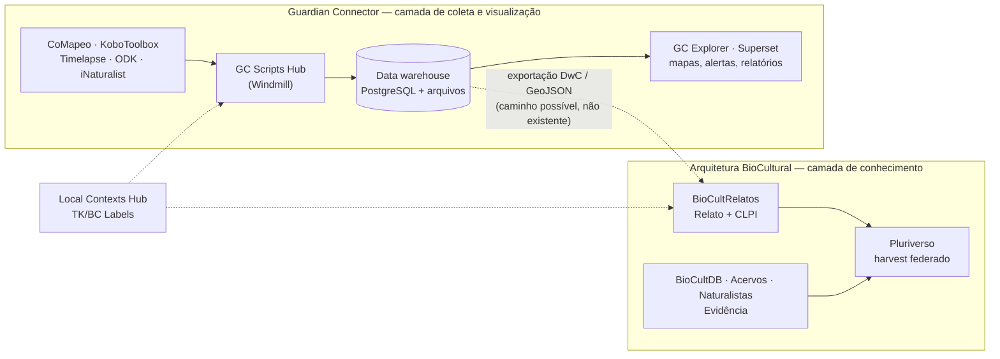

# Guardian Connector — plataforma de guardianança indígena (Conservation Metrics / Nia Tero)

**Tipo**: iniciativa internacional, software livre em produção
**Desenvolvimento**: [Conservation Metrics, Inc.](https://conservationmetrics.com/) em parceria e com financiamento de [Nia Tero](https://niatero.org/), co-criada com 12 organizações indígenas parceiras
**Documentação**: <https://docs.guardianconnector.net/> (também em português: `/pt/`)
**Repositórios**: `ConservationMetrics/gc-deploy`, `gc-landing-page`, `gc-scripts-hub`, `gc-explorer`, `gc-docs`
**Consulta às fontes**: 2026-09-17

Duas parceiras são brasileiras: **Instituto Iepé** e **UNIVAJA** (União dos Povos Indígenas do Vale do
Javari). As outras dez estão no Equador, Guiana, Suriname, Quênia, Ilhas Salomão e Namíbia.

## 1. Por que este documento existe

O Guardian Connector é a iniciativa mais próxima da Arquitetura BioCultural que este repositório
documenta até agora — e a única que **já implementou em produção** um mecanismo que aqui está
registrado como pendência aberta: a integração com o Local Contexts Hub para rótulos culturais
(pendência ② de `docs/proximosPassos.md` §4, Q4 do [ADR-015](../architecture-decisions/ADR-015-regime-enunciativo-e-rotulagem-de-acesso.md)).

A relação não é de concorrência. O Guardian Connector e a Arquitetura BioCultural resolvem problemas
**adjacentes** e quase disjuntos:

| | Guardian Connector | Arquitetura BioCultural |
|---|---|---|
| Problema | Levar dado de monitoramento territorial do campo até mapa, alerta e relatório, sob controle da organização indígena | Representar **Conhecimento** e **Evidência** sobre biodiversidade com regime enunciativo, vocabulário controlado e harvest federado |
| Quem opera a instalação | A própria organização indígena | Uma instituição (BioCultDB, BioCultAcervos, BioCultNaturalistas) ou a comunidade (BioCultRelatos) |
| Unidade de dado | Tabela/dataset no *data warehouse* | Registro — Relato ou Evidência — com regime, detentor e nível de acesso |
| Modelo semântico de biodiversidade | Nenhum próprio; usa o esquema da ferramenta de coleta | Darwin Core / DwC-DP, SKOS-XL (BioCultTermos), contrato de harvest |
| Rotulagem cultural | TK/BC Labels por **dataset**, via Local Contexts Hub | TK/BC Labels e Notices por **registro**, com Label restrito a Conhecimento (ADR-015 K1/K4) |

## 2. O que é, tecnicamente

Uma instalação por organização — o equivalente funcional da nossa **Unidade Federada**, com a mesma
regra de fronteira: os dados de uma instalação ficam separados dos dados das outras, e a organização
é dona do dado **e da infraestrutura**.

**Topologia** (`/reference/hosting/`): uma única máquina virtual, em nuvem ou *on-prem*, provisionada
com [CapRover](https://caprover.com/). Sobre ela:

| Componente | Função |
|---|---|
| **GC Landing Page** | Porta de entrada da instalação; gestão de contas, papéis, tema e aplicações extras |
| **GC Scripts Hub** | Scripts, fluxos e apps sobre [Windmill](https://www.windmill.dev/) — é onde vivem os conectores |
| **GC Explorer** | Visualização web (mapa, galeria, dashboard) lendo direto do PostgreSQL |
| **Apache Superset** | Exploração analítica e dashboards |
| **File Browser** | Gestão de arquivos e mídia |
| **Data warehouse** | PostgreSQL + armazenamento privado de arquivos; sem interface própria |
| **CoMapeo Remote Archive Server** | Recepção dos dados do CoMapeo |

**Serviços externos** (declarados como não hospedados na instalação): **Auth0** (autenticação),
**Mapbox** (mapas), **Twilio** (SMS/voz).

**Integrações centrais**: KoboToolbox, CoMapeo, Timelapse (câmeras-armadilha). Pelo Scripts Hub,
também ArcGIS/Survey123, CyberTracker, EpiCollect, Global Forest Watch, iNaturalist, Locus Map, ODK,
OpenStreetMap, QField, SMART. A doutrina declarada é explícita: **não substituir as ferramentas que a
organização já usa** — ser infraestrutura conectiva.

## 3. O achado relevante: o Local Contexts já está implementado

`/guides/data-sovereignty/guide-local-contexts/` descreve o fluxo completo, e a Conservation Metrics
é **Integration Partner certificada** do Local Contexts. O mecanismo, em quatro passos:

1. A comunidade cria perfil e conta *Community* no Hub, curva e aprova seus TK/BC Labels, cria um
   *Project* e obtém **Project ID** e **API key**.
2. O script **`Local Contexts: Fetch Labels`** (Windmill) chama a API do Hub, grava os registros de
   rótulo em tabela `localcontexts_<project_title>` no mesmo banco do warehouse e baixa os ícones
   para o *datalake*. Roda sob demanda **ou em agenda**.
3. O app **GC Local Contexts Annotations** associa rótulos a um dataset. **Não altera as linhas do
   dataset**: escreve em tabela companheira `{dataset_name}__lc_labels`, criada se não existir; salvar
   **substitui** o mapeamento anterior.
4. Qualquer cliente que consulte o warehouse resolve texto e ícone por **junção** entre
   `{dataset_name}__lc_labels` e a tabela do conjunto de rótulos.

Três consequências para as nossas decisões abertas:

**(a) A pendência ② tem precedente implementado, e ele coincide com a recomendação.** A opção
recomendada em `docs/proximosPassos.md:155` — *guardar identificador + cache do texto, nunca editar* —
é exatamente o que o Guardian Connector faz: identificador na tabela companheira, texto e ícone em
cache local sincronizado por *fetch* agendado, autoridade permanecendo no Hub. Não é argumento de
autoridade: é a confirmação de que a terceira linha da tabela de ② é construível e está em operação
em uma instalação real, por um parceiro certificado pela própria Local Contexts.

**(b) A granularidade deles é de dataset; a nossa é de registro.** O Guardian Connector trata Label
como **metadado de catálogo** — declaração sobre uma tabela inteira. A Arquitetura BioCultural precisa
do rótulo no registro, porque o regime enunciativo e o nível de acesso são campos **do registro**
(CONTEXT.md, verbete *Regime Enunciativo*; `docs/contrato-harvest.md` §4.1). O padrão
`{dataset_name}__lc_labels` não se transporta: o que se transporta é a **regra de separação** — o
rótulo nunca mora dentro da linha de dado, e o texto nunca é editado.

**(c) A legitimidade do Label está garantida pela identidade do operador, não por regra de código.**
No Guardian Connector, quem opera a instalação é a organização indígena; portanto ela **pode** aplicar
Label, e a restrição K1 do ADR-015 (instituição só declara Notice) é satisfeita por construção. Na
nossa federação isso não vale: três das quatro unidades hospedeiras são institucionais e só podem
declarar Notice. A distinção Label × Notice, que aqui é mecanismo de código, lá é consequência de
quem detém o servidor. **Nenhum dos dois desenhos dispensa o outro** — e o nosso não pode copiar o
deles sem perder a distinção.

Limite declarado por eles: exibir os rótulos no GC Explorer é **objetivo futuro**, não existe hoje;
não há receita publicada para o Superset. O rótulo está no warehouse; a exibição ainda não está no
produto.

## 4. O que o Guardian Connector **não** resolve

Mapeado contra as dificuldades de `docs/projetoPesquisa.md` §2:

- **Não modela o conhecimento.** Não há Relato, detentor, ato de enunciação, língua declarada nem
  regime enunciativo. O dado tem o esquema do formulário que o coletou. Reforça, em vez de contradizer,
  o veredito **QUALIFICA** da linha "Plataformas" da tabela de evidências em `docs/proximosPassos.md`
  §0.2: plataforma madura de soberania de dados **que não é estrutura de dados para conhecimento
  tradicional**.
- **Não há vocabulário controlado.** Nada equivalente ao BioCultTermos: sem SKOS-XL, sem rótulo
  reificado com língua (ISO 639-3), proveniência e nível de acesso por denominação.
- **Não há federação.** Cada instalação é ilha por desenho. Não existe harvest, índice comum nem
  contrato de payload entre instalações — é precisamente o problema que o Pluriverso existe para
  resolver.
- **Não trata fonte secundária.** Todo o fluxo nasce de coleta própria. Artigo científico, acervo
  museológico e obra de naturalista — as três fontes de **Evidência** da nossa arquitetura — estão
  fora do escopo.
- **Não trata CLPI como ciclo.** Há guia de protocolos e CLPI (`/guides/data-sovereignty/guide-data-sovereignty-and-protocols/`),
  mas o consentimento é prática organizacional documentada, não estado revisável do registro.

## 5. Divergências de stack — e por que elas não são defeito

| Decisão | Guardian Connector | Aqui | Observação |
|---|---|---|---|
| Persistência | PostgreSQL por instalação | SQLite com JSON1 e WAL, um arquivo por unidade ([ADR-005](../architecture-decisions/ADR-005-sqlite-json-persistence.md)) | Escala de warehouse com *multi-writer* e BI justifica PostgreSQL; nossa carga não exige |
| Empacotamento | Uma VM + CapRover, vários contêineres | Um contêiner por unidade | O deles é plataforma multi-app; o nosso é ferramenta |
| Autenticação e mapas | Auth0, Mapbox, Twilio — SaaS externo | Sem dependência de SaaS | Tensão real: SaaS externo simplifica operação e **contradiz** soberania de infraestrutura, que é o princípio declarado deles |
| Offline | Offline-first na coleta (CoMapeo, Kobo) | Demanda levantada em 18/08/2026, mecanismo não decidido (nota de retificação do [ADR-011](../architecture-decisions/ADR-011-absorcao-biocultpapers.md)) | Eles resolvem offline **na ferramenta de campo**, não no servidor. É uma resposta possível para a nossa pendência |

A dependência de Auth0/Mapbox/Twilio é o ponto onde o desenho deles cobra o preço mais alto: uma
plataforma cuja tese é "a organização é dona do dado e da infraestrutura" mantém autenticação,
tiles de mapa e notificação em três terceiros. Registrar isso não desqualifica a iniciativa — mostra
que a fronteira de soberania é difícil de manter até o fim, e que a nossa regra de zero SaaS tem custo
de operação que eles escolheram não pagar.

## 6. Aproveitamento possível

Três caminhos, nenhum decidido:

1. **Precedente para fechar a pendência ②.** Ver §3(a). Fecha uma das duas decisões que bloqueiam o
   esquema do Relato — a outra, ①, continua exigindo ir a campo.
2. **Camada de coleta para o BioCultRelatos.** CoMapeo e KoboToolbox já são offline-first, já estão em
   uso por organizações indígenas brasileiras (Iepé, UNIVAJA) e já têm conector pronto. Um Relato
   nascido em CoMapeo e ingerido pelo BioCultRelatos é caminho mais curto que construir coleta de campo
   própria. Exigiria mapeamento do esquema deles para o contrato de harvest — trabalho não avaliado.
3. **Contato institucional.** Iepé e UNIVAJA são organizações que já operam infraestrutura de dados
   própria e já discutiram TK/BC Labels na prática. São candidatas a **Ponto-Focal** (CONTEXT.md) de
   um tipo que ainda não existe na nossa lista de iniciativas parceiras: organização indígena com
   instalação em produção, não instituição de pesquisa.

## 7. Fontes consultadas

- Guardian Connector — *About* — <https://docs.guardianconnector.net/overview/>
- Guardian Connector — *Guardian Connector Toolkit* — <https://docs.guardianconnector.net/reference/gc-toolkit/>
- Guardian Connector — *Core Integrations* — <https://docs.guardianconnector.net/reference/core-integrations/>
- Guardian Connector — *Hosting Guardian Connector* — <https://docs.guardianconnector.net/reference/hosting/>
- Guardian Connector — *For Developers* — <https://docs.guardianconnector.net/reference/for-developers/>
- Guardian Connector — *Local Contexts: Annotating Datasets with TK/BC Labels* (4 páginas) — <https://docs.guardianconnector.net/guides/data-sovereignty/guide-local-contexts/>
- Guardian Connector — *Guides & Tutorials* — <https://docs.guardianconnector.net/guides/>
- Conservation Metrics, Inc. — <https://conservationmetrics.com/> · Nia Tero — <https://niatero.org/>
- ONU, Conselho de Direitos Humanos / EMRIP — *2025 Study on the Right of Indigenous Peoples to data* — <https://digitallibrary.un.org/record/4087217>

**Não verificado**: licença de cada repositório; número de instalações em produção; se Iepé ou UNIVAJA
usam o fluxo do Local Contexts. Nada neste documento depende desses três pontos.
