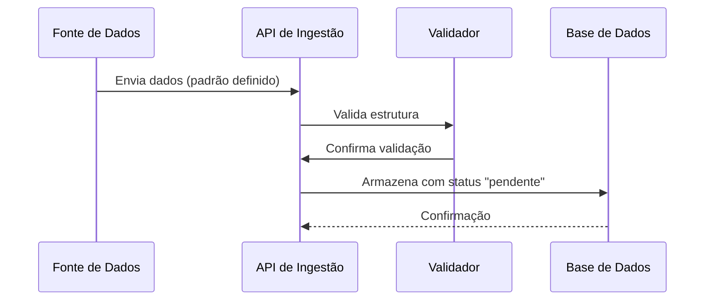
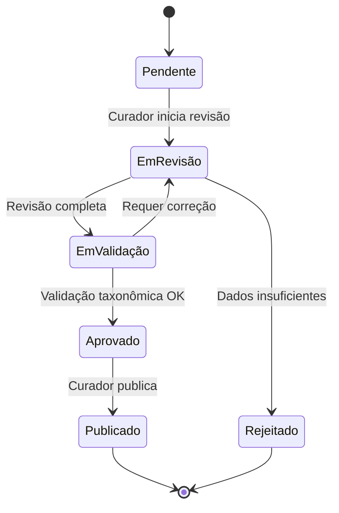

# Metodologia e Tecnologias

Documento técnico complementar ao [README.md](../README.md), detalhando a metodologia de documentação arquitetural (C4 Model) e as tecnologias avaliadas para a camada de persistência e integrações externas do sistema.

---

## Metodologia: C4 Model

A arquitetura deste sistema é documentada utilizando o **[C4 Model](https://c4model.com/)**, um framework de visualização que descreve arquiteturas de software através de 4 níveis de diagrama progressivamente mais detalhados (criado por Simon Brown):

1. **Context (Contexto)**: Visão de alto nível mostrando o sistema como uma caixa preta e suas interações com usuários e sistemas externos
2. **Container (Contêiner)**: Decomposição do sistema em contêineres tecnológicos (aplicações, bancos de dados, serviços) e como se comunicam
3. **Component (Componente)**: Detalhamento interno de cada contêiner, mostrando os componentes principais e suas responsabilidades
4. **Code (Código)**: Nível de detalhe de classes, interfaces e relações (opcional, utilizamos quando necessário)

Essa abordagem oferece clareza progressiva: iniciantes entendem o contexto geral, arquitetos visualizam containers e decisões técnicas, e desenvolvedores acessam detalhes de componentes. Os diagramas neste repositório seguem este padrão, permitindo navegação intuitiva da visão geral até a implementação.

### 1. Contexto de Aquisição

Responsável pela **entrada de dados** no sistema de múltiplas fontes:

- **Dados Secundários**: Extração de informações de artigos científicos, livros e publicações
- **Dados Primários**: Registro direto com todos os cuidados éticos e legais necessários
- **Coleta Automatizada**: Robôs que monitoram periódicos científicos (ex: etnobotânica)
- **Integrações**: APIs para consumo de dados de sistemas externos

**Características principais:**
- Padrão de dados unificado para todas as fontes
- APIs RESTful para ingestão
- Sistema de fila para processamento assíncrono
- Validação automática de dados taxonômicos via GBIF e Global Names

### 2. Contexto de Curadoria

Interface dedicada para **qualificação e validação** dos dados:

- Acesso restrito a pesquisadores e representantes de comunidades
- Workflow de aprovação e enriquecimento de dados
- Integração com APIs de validação taxonômica
- Controle de versões e auditoria de alterações

### 3. Contexto de Apresentação

Portal público para **acesso e consulta** das informações validadas:

- Interface web responsiva
- APIs públicas de consulta
- Visualizações interativas
- Sistema de busca avançada
- Exportação de dados em formatos abertos

---

## Tecnologias Consideradas

### Banco de Dados

Devido à **complexidade e flexibilidade** necessárias para armazenar conhecimento tradicional, três abordagens foram consideradas:

1. **Bancos de Dados SQL** - Modelo relacional
   - Estrutura rigorosa com esquema bem definido
   - Integridade referencial garantida
   - Consultas poderosas em dados estruturados
   - Ideal para relacionamentos complexos

2. **Bancos Orientados a Documentos (JSON)**
   - Flexibilidade no esquema
   - Escalabilidade horizontal
   - Consultas ricas em documentos estruturados como JSON
   - Armazenamento natural de dados semi-estruturados

3. **Bancos Multi-Modais**
   - Suportam múltiplos modelos de dados (documentos, grafos, relações)
   - Permitem modelar relações complexas entre entidades
   - Query language moderna e versátil
   - Flexibilidade arquitetural para evolução futura

A **versão 3.1** adota concretamente a abordagem de **bancos orientados a documentos**: cada unidade federada persiste seus dados em um único arquivo **SQLite com suporte a JSON (JSON1)**, um banco por unidade, compartilhado entre as ferramentas dessa unidade — combinando a flexibilidade de esquema dos bancos de documentos com a simplicidade operacional e a portabilidade de um banco embutido sem servidor.

### Integrações Externas - implementações potenciais futuras

#### Validação Taxonômica

- **Flora e Funga do Brasil API** (https://floradobrasil.jbrj.gov.br/consulta/) - Verificação primária de nomenclatura científica e validação de dados taxonômicos para plantas, algas e fungos brasileiros
- **Fauna do Brasil API** (https://fauna.jbrj.gov.br/) - Verificação primária de nomenclatura científica e validação de dados taxonômicos para fauna brasileira
- **GBIF API** (https://www.gbif.org/) - Validação de dados taxonômicos como fallback quando não encontrado nas bases brasileiras

#### Validação Territorial e de Proveniência

- **Plataforma de Territórios Tradicionais (MPF)** (https://territoriostradicionais.mpf.mp.br/) - Sincronização de polígonos territoriais de povos indígenas e comunidades tradicionais, validação de proveniência geográfica e cruzamento espacial de registros com seus territórios de origem

#### Fontes Autoritativas

- **Outras Fontes Autoritativas** - Padrão extensível para integração com sistemas especializados (SISGEN, SiBBr, registros comunitários) que complementam validação e enriquecimento de dados

#### Coleta Automática

- Periódicos científicos via APIs ou scraping ético, com extração de dados com auxílio de IA
