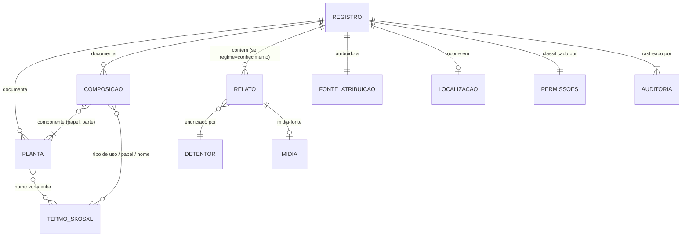

# Modelo de Dados Unificado (UDM) da Arquitetura BioCultural

*Unified Data Model — contrato lógico de dados de toda a arquitetura e suas ferramentas associadas*

> **Status: Proposta — Agosto 2026.**
> Este documento é o **objeto técnico do acordo de cooperação entre o Instituto de Pesquisas
> Jardim Botânico do Rio de Janeiro (JBRJ) e o USEFLORA**. Ele consolida, num contrato único e
> citável, o modelo de dados que hoje está distribuído entre o [ADR-003](architecture-decisions/ADR-003-data-model.md)
> e suas retificações ([ADR-015](architecture-decisions/ADR-015-regime-enunciativo-e-rotulagem-de-acesso.md),
> [ADR-016](architecture-decisions/ADR-016-contrato-de-harvest.md),
> [ADR-017](architecture-decisions/ADR-017-composicao-multiespecie.md)), a camada de persistência
> ([ADR-005](architecture-decisions/ADR-005-sqlite-json-persistence.md),
> [ADR-008](architecture-decisions/ADR-008-pluriverso-database-engine.md)) e o vocabulário
> ([Rótulos SKOS-XL — Referência Central](rotulos-skos-xl.md),
> [ADR-014](architecture-decisions/ADR-014-nomenclatura-cientifica-fora-do-vocabulario.md)).
> Em caso de divergência entre este documento e um ADR, **o ADR prevalece** e este documento é
> corrigido — o UDM consolida decisões, não as toma.

---

## 1. O que o UDM é — e o que não é

**É:**

- O **contrato lógico de dados** compartilhado por todas as Unidades Federadas (BioCultDB,
  BioCultRelatos, BioCultAcervos, BioCultNaturalistas), pelo Pluriverso e por qualquer ferramenta
  externa que queira interoperar com a federação (caso do USEFLORA).
- Um **modelo de documento JSON**, independente de engine. A persistência de referência é
  **SQLite com JSON1** — um documento por linha, `CHECK (json_valid(doc))`, índices por colunas
  geradas, busca FTS5, um único arquivo por unidade (ADR-005) — mas qualquer armazenamento que
  preserve o documento e as regras deste contrato é conforme (§8).
- A base de **interoperabilidade**: quem fala UDM consegue publicar no harvest da federação e
  mapear para Darwin Core / DwC-DP.

**Não é:**

- Um schema físico de banco de dados — cada ferramenta decide tabelas, índices e telas.
- Uma centralização de dados — o UDM define a **forma** do registro; os dados permanecem no
  arquivo soberano de cada unidade (ADR-004, ADR-005). Adotar o UDM não transfere dado algum.
- Um substituto do CLPI ou da governança — nenhum campo deste modelo autoriza publicar o que a
  comunidade não consentiu ([Proposta de Governança](../governanca/propostaGovernanca.md)).

## 2. Princípios do modelo

| # | Princípio | Fonte normativa |
|---|---|---|
| **P1** | **Documento JSON como contrato.** O registro é um documento autocontido; a engine é detalhe de implementação | ADR-003, ADR-005 |
| **P2** | **Regime Enunciativo em todo registro.** `regime: conhecimento \| evidencia` é campo do registro, nunca derivado de quem o guarda. Decide *quem pode classificar o acesso* | ADR-015 K1 |
| **P3** | **Relato como unidade de Conhecimento.** Detentor + ato de enunciação (data, lugar, língua, protocolo) + mídia-fonte + classificação de acesso. Vive sempre na unidade da comunidade detentora | ADR-015 K2, `CONTEXT.md` |
| **P4** | **Nível efetivo = o mais restritivo.** Termo, Relato e Registro/Mídia são rotuláveis independentemente; herança descendente proibida; toda classificação tem data de revisão | ADR-015 K3 |
| **P5** | **Vocabulário controlado em SKOS-XL; nomenclatura científica fora dele.** Termos de uso, nomes vernaculares e papéis vêm do BioCultTermos; o binômio latino é dado de primeira classe validado em autoridade externa (Flora e Funga / GBIF) | [rotulos-skos-xl.md](rotulos-skos-xl.md), ADR-014 |
| **P6** | **Composição multi-espécie.** Usos, preparos e artefatos referenciam 1..n plantas, com papel por componente e nome próprio do composto; o caso mono-espécie é o caso n=1 | ADR-017 R1–R7 |
| **P7** | **Língua em ISO 639-3, sempre.** `por`, `eng`, `tup`… — nunca ISO 639-1; `zxx` para conteúdo sem fala, `und` para língua não identificada; glotônimo por extenso onde não houver código | ADR-015 K5/K8.2 |
| **P8** | **Proveniência estruturada.** Todo dado atribuído tem Fonte de Atribuição `{tipo, nome}`; o tipo `comunidade_tradicional` invoca CLPI, CARE e repartição de benefícios — os demais, não | ADR-012, `CONTEXT.md` |

## 3. Entidades



| Entidade | O que é | Regras principais |
|---|---|---|
| **Registro** | O documento raiz: uma unidade de Conhecimento ou de Evidência | `regime` obrigatório (P2); `id` UUID string; `status` de workflow; `version` para bloqueio otimista |
| **Fonte de Atribuição** | `{tipo, nome}` — de quem veio o dado | Tipos: `comunidade_tradicional` (Decreto 8.750/2016, 29 categorias), `naturalista`, `colecao`, `publicacao`. Nunca achatada em string (P8) |
| **Planta** | Uma planta do registro | `id` estável dentro do registro; `nomeCientifico` validado externamente (P5); `nomeVernacular[]` alimenta o vocabulário |
| **Composição / Uso** | Uso, preparo ou artefato, referenciando 1..n plantas | `componentes[]` com `plantaId` + `papel` + `parteUsada`; nome próprio do composto quando houver (P6) |
| **Relato** | A unidade de Conhecimento (só em `regime: conhecimento`) | Detentor, ato de enunciação, língua ISO 639-3, mídia-fonte, `accessLevel` com `reviewDate` (P3). Implementação: `dwc:Assertion` |
| **Mídia** | Gravação, foto, vídeo | Entidade de primeira classe em regime `conhecimento`; formato aberto sem DRM; original nunca em plataforma de terceiros; em Relato de prática, a mídia **é** o Relato |
| **Termo (SKOS-XL)** | Rótulo de vocabulário controlado | `pref`/`alt`/`hidden`, idioma, `accessLevel`, proveniência — ver [referência central](rotulos-skos-xl.md) |
| **Localização** | Onde ocorre/foi registrado | GeoJSON; `precision: exact \| approximate \| region-only \| withheld`; generalização declarada no harvest |
| **Permissões** | Classificação de acesso do registro | `visibility` interna; nível efetivo calculado (P4); campos suprimidos declarados, nunca nulos silenciosos |
| **Auditoria** | Trilha de alterações | Quem, quando, o quê, versão; snapshot para rollback |

## 4. Documento canônico

Exemplo mínimo-completo de um registro UDM (Evidência de fonte secundária, com composição
multi-espécie; comentários indicam obrigatoriedade):

```javascript
{
  "id": "a1b2c3d4-e5f6-47a8-b9c0-d1e2f3a4b5c6",       // obrigatório, UUID, estável
  "regime": "evidencia",                                // obrigatório: conhecimento | evidencia (P2)
  "status": "aprovado",                                 // obrigatório: workflow da unidade
  "version": 2,                                         // obrigatório: bloqueio otimista

  "fonteAtribuicao": {                                  // obrigatório (P8)
    "tipo": "comunidade_tradicional",
    "nome": "Comunidade Quilombola do Campinho da Independência"
  },

  "fonte": {                                            // obrigatório: o artefato (Evidência)
    "tipo": "secundaria",                               // primaria | secundaria | acervo | obra_naturalista
    "referencia": "Silva, J. et al. (2023). …",
    "doi": "10.1234/exemplo",
    "ano": 2023
  },

  "plantas": [                                          // 1..n
    { "id": "p1",
      "nomeCientifico": "Eugenia uniflora L.",          // validado externamente (P5)
      "nomeVernacular": ["pitanga", "pitangueira"] },
    { "id": "p2",
      "nomeCientifico": "Lippia alba (Mill.) N.E.Br. ex Britton & P.Wilson",
      "nomeVernacular": ["erva-cidreira-de-arbusto"] }
  ],

  "composicoes": [                                      // 0..n (P6); uso mono-espécie = 1 componente
    { "nome": ["chá calmante composto"],
      "tipoUso": ["medicinal"],                         // termo SKOS-XL curado (P5)
      "componentes": [
        { "plantaId": "p1", "papel": "principal", "parteUsada": "folha" },
        { "plantaId": "p2", "papel": "complementar", "parteUsada": "folha" }
      ],
      "preparo": [{ "text": "infusão conjunta das folhas", "language": "por" }] }
  ],

  "relatos": [],                                        // obrigatório ≥1 se regime=conhecimento (P3)

  "localizacao": {                                      // opcional
    "municipio": "Paraty", "estado": "RJ", "pais": "BR",
    "precision": "region-only"                          // proteção de local sensível
  },

  "midia": [],                                          // 1ª classe em regime=conhecimento

  "permissions": {                                      // obrigatório
    "visibility": "public",                             // interno; harvest usa accessLevel efetivo
    "restrictions": { "reviewDate": "2027-08-16" }      // data de revisão obrigatória (P4)
  },

  "metadata": {                                         // obrigatório
    "language": "por",                                  // ISO 639-3 (P7)
    "createdAt": "2026-08-16T10:00:00Z",
    "createdBy": "user_123"
  }
}
```

Registro de regime `conhecimento` acrescenta, em `relatos[]`:

```javascript
{ "detentor": { "tipo": "coletivo",                     // individual | coletivo
                "comunidade": "…",
                "identificacao": "pseudônimo ou papel" }, // nunca expor pessoa sem decisão dela
  "enunciacao": { "data": "2026-05-10", "lugar": "…",
                  "lingua": "tup",                       // ISO 639-3; zxx sem fala; und desconhecida
                  "protocolo": "roda de conversa, CLPI 2026-04" },
  "midiaFonte": "midia_001",
  "accessLevel": "restricted",                           // nasce restricted (ADR-015 K7)
  "reviewDate": "2027-05-10" }
```

## 5. Obrigatoriedade dos campos

| Nível | Campos |
|---|---|
| **Obrigatórios** | `id`, `regime`, `status`, `version`, `fonteAtribuicao`, `fonte.tipo`, `plantas[]` (≥1) ou `composicoes[]` (≥1), `permissions` (com `reviewDate` em qualquer restrição), `metadata.language`, `metadata.createdAt/createdBy`; `relatos[]` (≥1) quando `regime: conhecimento` |
| **Recomendados** | `nomeCientifico` validado, `composicoes[].preparo`, `localizacao` (com `precision`), consentimento documentado quando houver comunidade identificada |
| **Opcionais** | `midia`, contexto cultural, dosagem/segurança, `extensions` (namespace por projeto, nunca redefinindo campo do core) |

Regra transversal: **campo ausente ≠ campo retido.** Ausente = a unidade não tem o dado. Retido =
tem e não publica — e então a supressão é declarada (`informationWithheld`), nunca um nulo
silencioso (ADR-016).

## 6. Acesso e supressão

1. Três níveis rotuláveis independentemente — Termo, Relato, Registro/Mídia (P4).
2. **Nível efetivo = o mais restritivo dos três** (+ o mais restritivo entre participantes, em
   mídia coletiva — ADR-015 K8.3).
3. Padrões de omissão: Termo nasce `public`; Relato e registro de regime `conhecimento` nascem
   `restricted`; `public` só por ato positivo da comunidade, com CLPI válido (ADR-015 K7).
4. No harvest só trafega nível efetivo `public`, com supressões e generalizações **declaradas**
   (`informationWithheld`, `dataGeneralizations`) — [contrato campo a campo](contrato-harvest.md).

## 7. Interoperabilidade

| Alvo | Mapeamento |
|---|---|
| **Federação (harvest)** | O documento UDM viaja em `data` do payload do ADR-016; `regime`, `accessLevel`, supressão e `relatedResources` na envoltória |
| **Darwin Core** | `scientificName` ← `plantas[].nomeCientifico`; `vernacularName` ← `nomeVernacular[]`; `country/stateProvince` ← `localizacao`; `informationWithheld`/`dataGeneralizations` conforme §6 |
| **DwC-DP** | Relato ↔ `dwc:Assertion` (`assertionBy`, `assertionMadeDate`, `assertionProtocol`); vínculo entre registros de membros ↔ `resource-relationship` |
| **SKOS-XL** | `tipoUso`, `papel`, `nomeVernacular` e nomes de compostos são rótulos/conceitos do BioCultTermos — [referência central](rotulos-skos-xl.md) |
| **TK/BC Labels (Local Contexts)** | Por identificador, nunca texto; Label em Conhecimento, Notice em Evidência (ADR-015 K4) |

## 8. Conformidade — o que uma ferramenta precisa para "falar UDM"

Checklist para qualquer ferramenta (interna ou externa, como o USEFLORA) declarar conformidade:

- **C1** Persistir o registro como documento JSON íntegro (qualquer engine), com `id` estável e `version`.
- **C2** Gravar e nunca inferir `regime` (P2).
- **C3** Suportar `plantas[]` 1..n e `composicoes[]` com papel por componente (P6).
- **C4** Representar Relato completo quando houver Conhecimento (P3) — ou declarar-se restrita a Evidência.
- **C5** Calcular nível efetivo pelo mais restritivo, sem herança descendente, com `reviewDate` (P4).
- **C6** Idioma sempre ISO 639-3 (P7).
- **C7** Consumir vocabulário SKOS-XL para os campos controlados; nome científico validado externamente (P5).
- **C8** Distinguir ausente de retido; declarar supressão e generalização (§5, §6).
- **C9** Manter Fonte de Atribuição `{tipo, nome}` sem achatar o tipo (P8).
- **C10** Expor (ou consumir) o endpoint de harvest do ADR-016, se participar da federação.

Conformidade **parcial é legítima e declarável** — ex.: uma ferramenta só de Evidência dispensa C4;
uma ferramenta fora da federação dispensa C10. O que não é legítimo é implementar um requisito de
forma divergente.

## 9. Governança e versionamento do UDM

- Mudança de **substância** entra por ADR (proposto → aceito pelo Comitê Federado) e só então é
  consolidada aqui. Este documento nunca é a origem de uma decisão.
- Versionamento semântico do documento: **maior** quebra conformidade (C1–C10), **menor** adiciona
  campo opcional, **correção** é editorial. Versão atual: **1.0.0-proposta**.
- No âmbito do acordo JBRJ–USEFLORA, alterações que afetem a conformidade do USEFLORA são
  comunicadas às partes antes da promoção do ADR correspondente.

## 10. Fontes normativas

| Parte do UDM | Documento |
|---|---|
| Estrutura do documento e exemplos completos | [ADR-003](architecture-decisions/ADR-003-data-model.md) (com notas de retificação) |
| Regime, Relato, três níveis de acesso, língua | [ADR-015](architecture-decisions/ADR-015-regime-enunciativo-e-rotulagem-de-acesso.md) |
| Payload da federação | [ADR-016](architecture-decisions/ADR-016-contrato-de-harvest.md) · [contrato-harvest.md](contrato-harvest.md) |
| Composição multi-espécie | [ADR-017](architecture-decisions/ADR-017-composicao-multiespecie.md) |
| Persistência SQLite+JSON1 | [ADR-005](architecture-decisions/ADR-005-sqlite-json-persistence.md) · [ADR-008](architecture-decisions/ADR-008-pluriverso-database-engine.md) |
| Vocabulário e rótulos | [rotulos-skos-xl.md](rotulos-skos-xl.md) · [ADR-014](architecture-decisions/ADR-014-nomenclatura-cientifica-fora-do-vocabulario.md) |
| Fonte de Atribuição | [ADR-012](architecture-decisions/ADR-012-manutencao-codigo-bioculttermos.md) · [`CONTEXT.md`](../CONTEXT.md) |
| Governança, CLPI, salvaguardas | [Proposta de Governança](../governanca/propostaGovernanca.md) |
