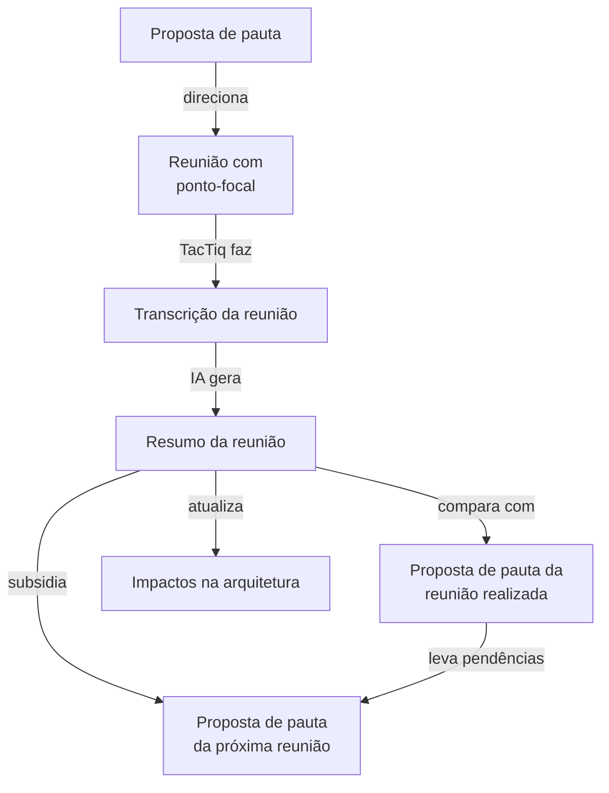

# Nova fase da Arquitetura Biocultural

A proposta da Arquitetura Biocultural (AB) entra em uma nova fase onde ajustes metodológicos e documentais precisam ser feitos.

## Contexto

Em 18/08/2026 houve uma reunião com o Comitê Gestor do USEFLORA, onde a proposta da arquitetura foi apresentada e discutida. Nesta reunião foi sinalizado para o  Comitê Gestor que, no desenvolvimento da AB, surgiram questões onde seriam necessários esclarecimentos e decisões dos representantes das comunidades tradicionais. Desta forma, foi solicitada a indicação de um ponto-focal do USEFLORA para receber atualizações do avanço da AB, sistematizar demandas e encaminhar decisões que dependem do comitê gestor e/ou das comunidades. Em 17/09/2026 Nivaldo Peroni envia e-mail indicando, formalmente, Sofia Zank como ponto-focal do USEFLORA. Em 16/09/2026, já com a indicação informal de Sofia Zank como ponto-focal, fizemos uma primeira reunião e, a partir desta reunião e das reuniões seguintes - 18/09/2026 e 29/09/2026 - ficou clara que o desenvolvimento da AB entrava em uma nova fase, com necessidades de ajustes metodológicos e documentais. Considero que estas reuniões são as primeiras reuniões de Governança da Arquitetura, conforme previsto na prosta de governança.

## O novo cenário

Este novo cenário de desenvolvimento da AB é caracterizado pela efetiva participação de Sofia, com toda sua experiência no domínio Biocultural, agregando visões e questões fundamentais para o avanço da AB, e também cumprindo o papel de "ponte" entre as demandas técnicas da AB e sua interpretação e encaminhamento junto às comunidades tradicionais e acadêmica.

Na prática, novos processos metodológicos foram implementados e são estes processos que, após a realização da terceira reunião com o ponto-focal, mostraram a necessidade de ajustes e, eventualmente, nova abordagem.

### Processos metodológicos implementados

As reuniões com o ponto-focal foram, e em sua maioria serão, remotas, via "Google Meeting". Em função disto, foi implementada a ferramenta `TacTiq` para realizar a transcrição em tempo real da reunião, que posteriormente seria utilizada para gerar, com o auxílio da IA, um resumo com os pontos mais importantes. A justificativa do uso do TacTiq foi, não só a necessidade de documentação e registro da reunião, mas também garantir que tudo o que foi discutido e abordado na reunião seria considerado. Em essência este é o *workflow* implementado:

Neste *workflow*, a cada reunião são gerados 3 documentos que passam a fazer parte da documentação da AB:

- `Resumo da reunião`
  - Documento criado pela IA que usa a transcrição completa da reunião, feita pela ferramenta TacTiq.
- `Proposta de pauta da próxima reunião`
  - Documento também criado pela IA que:
    - Registra novas questões que surgiram na reunião e precisam ser encaminhados em uma próxima reunião
    - Considerando a proposta de pauta da reunião, registra qualquer pendência - assunto ou encaminhamento previsto em pauta mas que não foi tratado na reunião.
- `Impacto na arquitetura` (atualiza)
  - A visão única e atual de **todos os itens de impacto** (`I-01`, `I-02`…) que as reuniões com o Ponto-Focal produziram sobre os documentos de arquitetura.

## Considerações sobre ajustes metodológicos e documentais necessários

A cada reunião, com base nos documentos gerados, Sofia e Eduardo, e possíveis novos colaboradores, precisam validar o resumo da reunião e a `proposta de pauta da próxima reunião`. Entretanto, apesar do `Resumo da reunião` estar com uma estrutura, linguagem e tom que considero adequados e acessíveis, o documento `proposta de pauta da próxima reunião` precisa melhorar. Penso que o documento `impactos na arquitetura` será muito mais direcionado para processamento via IA, gerando novos *Architecture Decision Record* (ADR). Assim, este documento deve estar formatado na forma mais eficiente para este uso, mas sempre acessível para *humanos*.

Penso que o documento `proposta de pauta da próxima reunião` é o que precisa de uma nova abordagem, por duas razões:

* Com o avançar das reuniões  de governança da arquitetura, inicialmente entre eu (gestor da arquitetura) e Sofia (ponto-focal do USEFLORA), haverá uma tendência ao acúmulo de pendências, o que vai gerar um documento longo e de difícil interpretação, crítica e validação pelos participantes das reuniões
* Apesar da estrutura do documento parecer adequada, ele está repleto de referências em siglas (p.ex. "ADR-019", "⑭", "K6", "I-17") e um tom mais técnico que dificulta a leitura pelos participantes e interessados. Consequentemente, dificulta a contribuição efetiva de melhoria da pauta.

Por outro lado, itens como "Para Sofia levar às comunidades (Guardiões e Conselho do USEFLORA)" são excelentes, pois são claros, objetivos e está em uma linguagem bem acessível.

Assim, gostaria de considerar uma nova abordagem workflow, documentos, estrutura de pastas que tornasse este novo *workflow* de evolução da AB baseado em reuniões de governança, que fosse mais simples, didático e acessível, sem que haja qualquer perda no que é essencial: a AB é uma construção coletiva onde todas as críticas, sugestões e contribuições devem ser registradas e consideradas. Penso que vale considerar a possibilidade de utilizar as `ISSUES` do GitHub, pois Sofia Zank já está como colaboradora e, como o repositório é público, questões pendentes voltadas, por exemplo, para comunidades podem ser debatidas e consolidadas (fechadas) nos `ISSUES` e, posteriormente, acessadas pela IA para alimentar a documentação de impactos da AB e `ADR`s.

Em um primeiro momento, gostaria de uma análise e um relatório exaustivo sobre possíveis ajustes metodológicos e documentais necessários, para análise e posterior implementação. Apresente alternativas e recomendações de forma didática.

**Relatório de análise (2026-09-30):** [`novaFaseArquitetura-analise.md`](novaFaseArquitetura-analise.md) — diagnóstico, três alternativas, recomendação (*Issues* como fila única de questões) e decisões pendentes. Nada implementado.
