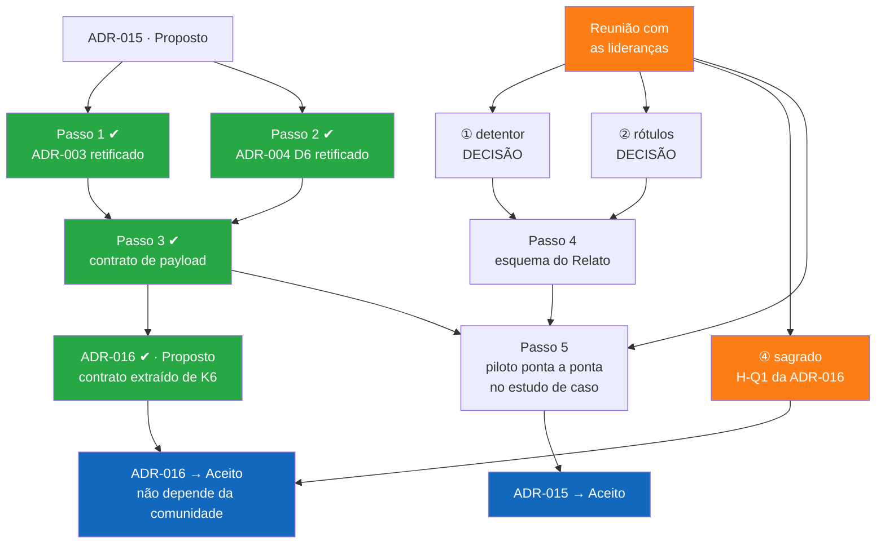

# Próximos Passos — estado do projeto e pendências

> **Arquivo de referência único do projeto.** Registra onde o projeto está e o que falta fazer. É o ponto de entrada obrigatório de qualquer nova sessão de trabalho — humana ou assistida por IA — e a garantia de continuidade entre sessões: toda pendência aberta está aqui, com estado e bloqueio explícitos.
>
> **Duas frentes, sempre separadas.** O documento é dividido em duas partes, e toda atualização futura deve respeitar essa divisão:
>
> - **Parte I — Projeto de pesquisa** (`docs/projetoPesquisa.md`): o documento de pesquisa em si — problema, objetivos, metodologia, fundamentação, referências, publicação.
> - **Parte II — Arquitetura BioCultural e seus componentes**: a arquitetura, as ADRs, o UDM, o contrato de harvest, a governança e as unidades (BioCultDB, BioCultTermos, BioCultRelatos, BioCultAcervos, BioCultNaturalistas, Pluriverso).
>
> Pendência que atravessa as duas (ex.: uma decisão de arquitetura que muda um texto do projeto de pesquisa) fica registrada na parte de onde nasce, com o vínculo explícito para a outra. Nenhuma pendência mora nas duas ao mesmo tempo.

> **Regras de manutenção:** ao final de cada sessão, atualizar (i) a data do estado, (ii) o estado do repositório, (iii) a seção da sessão, na parte correspondente, com o que foi feito e (iv) a §11, na sub-seção da frente correspondente, com a próxima ação. Pendência resolvida não é apagada: é marcada como decidida, com o `onde`. Caminhos citados são relativos à raiz do repositório.

**Estado em:** 2026-09-03 (conteúdo das §0–§10 é de 2026-08-19, salvo a §6 e as seções marcadas com a data desta sessão)

**Para quem retoma:** comece pela **§11**, que lista a próxima ação de cada frente. Para o contexto da Parte I, leia a **§0**; para o da Parte II, a **§1**, a **§10** e a **§10-bis** (a sessão de 2026-09-03, que deu registro à interlocução com iniciativas parceiras). O que depende das comunidades tradicionais está em `docs/conhecimento/pauta-comunidades.md` — documento próprio, feito para sair do computador; este arquivo continua sendo o único de pendências. Da §1 em diante, o conteúdo é o estado de 2026-08-14 e continua válido.

**Estado do repositório:** `main`, sincronizado com o remoto. Últimos commits: `ada39eb` e `15365bc` (projeto de pesquisa), sobre `6392bfc`. Marcos anteriores: **v3.8.0** (`5e1d575`), **v3.9.0** (`c6a8357`), **v3.10.0** (ADR-016).

---

# Parte I — Projeto de pesquisa (`docs/projetoPesquisa.md`)

## 0. Sessão 2026-08-19 — `projetoPesquisa.md` e uma afirmativa a verificar

### 0.1 Feito e publicado (dois commits em `main`, push ok)

| # | Onde | O que mudou |
|---|---|---|
| 1 | `projetoPesquisa.md` cabeçalho | "Estado da produção técnica" virou lista: arquitetura (v3.5/DOI, repo v3.10.0, 17 ADRs, C4) + estado de **cada** ferramenta (BioCultDB, BioCultTermos, BioCultRelatos, BioCultAcervos, BioCultNaturalistas, Pluriverso) + documentação normativa concluída |
| 2 | §2 Problema de pesquisa | Reformulado: **representação** precisa do domínio do CTA em suas manifestações, culturas e línguas **e** **garantia** plena dos princípios C.A.R.E. e da repartição justa e equitativa. A formulação anterior (soberania por arquitetura × política de uso) virou o segundo parágrafo |
| 3 | §4 | Tabela de questões Q1–Q7 **removida**. Seção passou a "Questões emergentes": as questões surgirão das comunidades tradicionais e da academia, e responder a elas é a essência do projeto. Referências órfãs a Q3/Q6 reescritas em prosa (§9.1 pauta 1, §9.4, §12); `H-Q1` da ADR-016 preservado |
| 4 | §5 Objetivos | Geral realinhado ao novo problema; específicos de 8 → 10. Novos: mapear cada subprincípio C.A.R.E. e cada exigência da Lei 13.123 ao componente que o implementa; tornar a repartição de benefícios rastreável pela arquitetura (absorveu o antigo Q7) |
| 5 | §14 Equipe | Acrescentadas Luisa Ridolph e Camila Dantas, pós-graduação ENBT/JBRJ |
| 6 | §2, item 1 | Nova dificuldade (a quinta), posicionada como **item 1** por ser a lacuna primária: ausência de proposta concreta e testada de estrutura de dados para o conjunto **dado, informação e conhecimento** tradicional associado à biodiversidade |

### 0.2 Pendência aberta: a afirmativa do item 1 de §2 não tem base citada

O item 1 afirma que **não existe** na literatura estrutura de dados concreta e testada para esse conjunto, em diferentes culturas, línguas e visões de mundo, e que o que existe são padrões parciais e implementações institucionais fechadas. É uma afirmativa forte, escrita **sem referência**. A pesquisa profunda para verificá-la foi despachada em cinco frentes paralelas e **cancelada antes de concluir** no encerramento da sessão — **nenhum resultado foi salvo**. Refazer do zero.

Frentes a re-despachar, uma por agente, em paralelo:

| Frente | O que varrer |
|---|---|
| **Plataformas** | Mukurtu CMS (Christen); Local Contexts Hub — TK/BC Labels, Notices, guia de API; TKDL Índia + TKRC (concreto, testado, **fechado** por NDA); Ara Irititja; Keeping Culture; protocolos ATSILIRN; Sq'éwlets / Plateau Peoples' Web Portal; People's Biodiversity Register (Gadgil et al.); NIKMAS/IKMS África do Sul (Britz, Lor et al.) |
| **Ontologias e knowledge graphs** | `indigenous knowledge ontology`, `traditional knowledge ontology`, `TEK ontology`, ontologias de patrimônio imaterial (ICH), CIDOC-CRM e extensões; grafos de medicina tradicional chinesa e Ayurveda — **contraexemplo mais perigoso**: concretos, testados e ricos, mas monoculturais; pluralismo ontológico e multilinguismo (SKOS-XL para vocabulários indígenas) |
| **Padrões de biodiversidade e etnobiologia** | Darwin Core; DwC-DP (`usage-policy` **já verificado**: só direito autoral, nenhum protocolo cultural — ver §9); Humboldt; Plinian Core; Audubon Core; ABCD; SocioBio/SiBBr (campos reais no GitHub); guias GBIF de dados sensíveis e de dados indígenas; padrões de reporte etnofarmacológico (WECKERLE et al.); NAEB/Moerman; PROTA |
| **Evidência da lacuna** | CARROLL et al. 2020 e 2021; JENNINGS et al.; ANDERSON & CHRISTEN; AGRAWAL; NADASDY 1999; NGULUBE; LWOGA, NGULUBE & STILWELL; STEVENS; ZANK et al. 2025; PANKARARU et al. 2026 — extrair **citação direta curta** onde a fonte declara a lacuna |
| **Brasil e revisões** | SISGEN (campos de cadastro de CTA, natureza declaratória); SinBiota; Plataforma de Territórios Tradicionais (MPF); Rede de Conhecimentos sobre Sociobiodiversidade (ICMBio/CNPT + UFSC); GEF 11269 "Entre-Ciências"; BDTD e repositórios (FERRARI, UFSC, 2020 e similares); WIPO/IGC sobre bases de dados de conhecimento tradicional; revisões sistemáticas e de escopo sobre modelos de dados para conhecimento tradicional |

Regras a repetir no despacho, porque são o que dá valor ao resultado: abrir a **fonte primária** de toda fonte central (página do DOI, PDF, esquema no GitHub), nunca citar de snippet de busca; **proibido fabricar** DOI, volume, página ou ano — campo não conferido escreve-se `[não verificado]`; devolver tabela (referência ABNT | o que é | estrutura publicada? | testada como? | escopo cultural, linguístico e dado/informação/conhecimento | **SUSTENTA / QUALIFICA / CONTRADIZ**), síntese, contraexemplos mais perigosos e termos buscados sem resultado.

**Decisão que a pesquisa vai forçar.** Se aparecer contraexemplo concreto e testado — mesmo monocultural, como os grafos de medicina tradicional chinesa, ou fechado, como o TKDL — o item 1 precisa ser **qualificado**, não mantido. Formulação provável: *não existe estrutura **aberta, intercultural e validada*** para esse conjunto, citando nominalmente os parciais e o que cada um cobre. Manter o texto atual só se as cinco frentes voltarem sem contraexemplo.

**Destino das referências:** `Referencias.md`, em seção nova (ex.: "13. Estruturas de dados para conhecimento tradicional — estado da arte"), norma ABNT NBR 6023:2018; atualizar o rodapé "Última atualização", que ainda diz Janeiro 2025. Citar no corpo do item 1 de §2 e reforçar o parágrafo "Científica" de §3, que hoje afirma a lacuna apenas para a distinção Conhecimento × Evidência no Brasil.

---

# Parte II — Arquitetura BioCultural e seus componentes

## 1. Em uma página: o que mudou

A arquitetura ganhou um **segundo eixo**, ortogonal ao da procedência (artigo / campo / acervo / naturalista):

| Regime Enunciativo | O que é | Quem manda |
|---|---|---|
| **`conhecimento`** | A relação com a biodiversidade **enunciada por quem a detém** — primeira pessoa, presa a um ato de enunciação | A comunidade detentora. Aplica **Label** |
| **`evidencia`** | A **atestação por um terceiro** de que essa relação existe — terceira pessoa, presa a um artefato | Quem custodia o artefato. Só pode declarar **Notice** |

A distinção é **deôntica, não epistêmica**. Evidência não vale menos: é conhecimento com outro dono. O que ela decide é **quem pode classificar o nível de acesso**.

Formalizado em **`docs/architecture-decisions/ADR-015-regime-enunciativo-e-rotulagem-de-acesso.md`**, status **Proposto**, oito pontos K1–K8.

**A unidade de Conhecimento chama-se `Relato`** (decidido em 2026-08-13, contra "Enunciado"). Mapeia para `dwc:Assertion` na implementação. **Vive sempre na unidade da comunidade detentora**, nunca na de quem custodia o objeto de que ele fala.

---

## 2. Correção importante feita no fim da sessão

Uma versão anterior dizia que a narrativa de uma comunidade sobre uma peça de museu seria "Conhecimento dentro do BioCultAcervos". **Estava errado** e foi corrigido em todos os arquivos.

- **BioCultAcervos** guarda evidência física custodiada por instituições: material de Spruce em Kew, exsicatas do JBRJ, peças de coleções etnológicas.
- A narrativa da comunidade sobre esse item é um **Relato no BioCultRelatos da própria comunidade**, que *referencia* o item.
- Gravá-la no SQLite do museu violaria `Conteúdo Soberano` (`CONTEXT.md`) — soberania invertida.
- A coexistência das duas narrativas (lição do Mukurtu, `propostaGovernanca.md:419`) acontece **na federação**: dois registros de dois membros, vinculados.

**Consequência prática:** BioCultDB, BioCultAcervos e BioCultNaturalistas são `evidencia` **sempre**. O único provedor com os dois regimes é o **BioCultRelatos** — onde a nota de campo do pesquisador é Evidência, por falhar Q2 do teste de K1.

**Requisito novo, ainda não especificado:** o payload de harvest precisa expressar "este registro trata do mesmo objeto que aquele registro de outro membro". O DwC-DP tem `resource-relationship` para isso.

---

## 3. Concluído na v3.8.0 — Passos 1, 2 e 3

Os três estavam prontos e sem dependência. Foram executados.

| Passo | O que foi feito | Onde |
|---|---|---|
| **1** ✔ | Nota de retificação no ADR-003, seção "1. Registro Principal (Record)": três retificações (`type` → `regime` de K1; `media` deixa de ser "(futuro)" por K5; `language` → ISO 639-3 por K5) e quatro acréscimos (`relato` de K2, `accessLevel` por nível e `reviewDate` de K3, padrão de acesso por regime de K7). Texto original preservado; o ADR-003 **não** foi promovido nem reescrito | `docs/architecture-decisions/ADR-003-data-model.md:106-129` |
| **2** ✔ | Nota de retificação no ADR-004, em **D6** e no bloco "Contrato de Publicação". Registra o que **permanece válido** (paginação, `updated_since`, `member_id` + `record_id`) e sinaliza no próprio texto que a supersessão só tem efeito quando a ADR-015 for aceita — o conflito *Aceito* × *Proposto* ficou explícito, não resolvido por omissão | `docs/architecture-decisions/ADR-004-federated-architecture.md:80-96` e `:150-154` |
| **3** ✔ | Contrato de payload campo a campo, com a envoltória, o registro, o cálculo do nível efetivo, a redação na fronteira da API, `culturalLabels`, `relatedResources` e a condição de aceitação em dez cenários | `docs/contrato-harvest.md` |

Três coisas que o Passo 3 fechou e que estavam em aberto:

- **`relatedResources`** — o vínculo entre registros de membros distintos (§2 acima). Subconjunto de `resource-relationship` do DwC-DP, com os nomes de campo verificados na fonte primária. O caso entre membros usa `externalRelatedResourceID` + `externalRelatedResourceSource`.
- **Condição de aceitação de K6** — especificada em dez cenários, inclusive os que costumam faltar: registro `public` de regime `conhecimento` **sem CLPI válido** deve estar ausente; mudança de nível de `public` para `restricted` deve desaparecer da coleta seguinte (senão o índice do Pluriverso guarda a cópia anterior); e gravação coletiva com um participante `restricted` não atravessa.
- **Ordem de restritividade** — `public < restricted < community-only < private`, com `sacred` do nível de Termo equivalendo a `private`. Esta última equivalência é **derivada de K3 e não está na ADR-015**; está marcada como tal em §4.1 do contrato, para o Comitê corrigir se discordar.

Correção de percurso: a ADR-015 ainda dizia "entidade `enunciado`" em Relações, contradizendo K2 e a decisão pelo termo **`Relato`**. Corrigido.

---

## 3-bis. Concluído na v3.10.0 — as decisões de arquitetura pura

Triagem entre o que se decide na mesa e o que só se decide na roda. Das três pendências que não dependiam da comunidade, duas foram decididas e uma se revelou mal classificada.

| # | Decisão | Onde |
|---|---|---|
| **③** ✔ | **K6 extraído para a ADR-016** — Contrato de Harvest da Federação, *Proposto*, com H1 (payload), H2 (redação na fronteira), H3 (vocabulário de vínculo) e H4 (condição de aceitação). Motivo: K6 supersedia o ADR-004 D6, **Aceito**, a partir de texto que depende de validação com comunidades. Agora o contrato tem ciclo de aceitação próprio e não espera a ADR-015 | `docs/architecture-decisions/ADR-016-contrato-de-harvest.md` |
| **⑤** ✔ | **`relationshipType` fechado em três valores**: `refers to`, `same as`, `derived from`. E uma correção: o exemplo usava `same as` entre Relato e exsicata — errado, o Relato **fala sobre** a exsicata, não **é** a exsicata. `same as` afirmaria identidade e colapsaria os dois no índice do Pluriverso | `docs/contrato-harvest.md` §6 |
| **④** → reunião | **`sacred` ≡ `private` não é decisão técnica.** Parecia; não é. O que é sagrado quem diz é a comunidade, e a equivalência pode estar tecnicamente certa e semanticamente errada. Virou **H-Q1 da ADR-016**, foi para a pauta das lideranças e para o slide de perguntas. Regra interina até lá: trata-se como `private`, que erra para o lado de não publicar | `contrato-harvest.md` §4.1, `ADR-016` H-Q1 |

Limpeza junto: a Q1 da ADR-015 ("o regime entra no glossário da federação?") constava aberta desde a v3.7.0, que já a respondera. Fechada — a contagem de questões abertas passa de seis para quatro e agora é verdadeira. (Depois desta triagem, a Q6, que tratava de um caso concreto retirado do escopo do projeto, também deixou de existir: restam três, Q3–Q5.)

---

## 4. Bloqueado: precisa de decisão

Duas perguntas. A recomendação está marcada; nenhuma foi respondida.

### ① Como identificar o detentor sem expor a pessoa

Bloqueia o formato de `relato.detentor` e, portanto, o Passo 4 (esquema como tabela).

Conflito real: `assertionByID` quer identificador estável; LGPD art. 11 protege voz+imagem+etnia; CARE A1 e a Lei 13.123 dão à pessoa **direito ao reconhecimento**. Apagar o nome "para proteger" repete o apagamento histórico do informante indígena.

| | O sistema guarda | O público vê | Quem decidiu |
|---|---|---|---|
| A | nome real, protegido | "um detentor da comunidade" | nós |
| B | só o coletivo | o nome da comunidade | nós |
| **C ← recomendada** | pseudônimo escolhido pela pessoa | o pseudônimo | **ela** |

**C é a única que exige ir a campo perguntar** — e é exatamente por isso que A e B são suspeitas: são as que se decidem sozinho.

### ② Rótulos culturais: API do Local Contexts Hub ou cópia local

| | Comunidade muda o rótulo | Serviço externo cai |
|---|---|---|
| Consultar API sempre | reflete na hora — **autoridade fica com ela** | some o rótulo |
| Copiar para o SQLite | desatualiza | funciona |
| **Guardar ID + cache do texto ← recomendada** | atualiza no próximo cache | mostra a última versão conhecida |

Tensão: soberania e simplicidade pedem não depender de serviço externo; mas copiar o rótulo para dentro significa passar a controlar algo que é da comunidade. **Nunca editar o texto** — o das Notices, em particular, é imutável por regra do Local Contexts.

---

## 5. Bloqueado: precisa da comunidade

Detalhado com roteiro de perguntas em **`docs/conhecimento/pauta-comunidades.md`** — documento próprio, feito para sair do computador, com as pautas separadas em duas seções: **pautas de desenho** (decidíveis com um corpo de representação mista, e para as quais o ponto-focal de uma iniciativa parceira responde) e **pautas de consentimento** (só a comunidade detentora, registro a registro, e que nenhum interlocutor fecha por atacado). Resumo das **sete** pautas — a quinta veio de K8, a sexta da triagem da v3.10.0 e a sétima da sessão de 2026-09-03:

1. **Como quem fala quer ser nomeado** — resolve ① acima.
2. **Quais rótulos culturais se aplicam** — sazonalidade, restrição por gênero ou família, uso comercial, e quem tem legitimidade para dizer em nome de todos.
3. **Consentimento para imagem e voz em gravação** — gravar aciona três regimes ao mesmo tempo: direito de personalidade (Código Civil art. 20), dado pessoal sensível (LGPD art. 11, que exige consentimento específico e destacado) e forma legal de comprovar o CLPI (Lei 13.123/2015 art. 9º §1º II). Um termo genérico não cobre os três. Some-se a transcrição em língua originária, que exige falante nativo — a tradução é entidade derivada, e derivada com perda (CARE R3).
4. **O que não deve ser registrado** — `propostaGovernanca.md:286`: para conhecimento sagrado, a decisão correta pode ser **não registrar**, e a plataforma tem obrigação de dizer isso.
5. **Gravações de prática e oficinas coletivas** (novo, K8) — filmar alguém fazendo um chá ou trançando uma cesta registra conhecimento sem que uma palavra seja dita; e uma oficina grava várias pessoas de uma vez. Perguntar: quem autoriza a gravação de uma prática; se cada participante decide sobre a própria imagem ou se a decisão é do grupo; e o que deve acontecer quando **um** participante muda de ideia depois — a regra adotada por ora é a mais conservadora, a gravação inteira sai.
6. **O que é sagrado — e o que acontece com ele** (novo, v3.10.0, ④/H-Q1) — quando um saber é sagrado, o registro dele deve sumir por inteiro, ou pode ficar visível que ele existe sem mostrar o conteúdo? E quem diz, por todos, que um saber é sagrado? Tecnicamente a pergunta é se `sacred` equivale a `private` ou merece nível próprio; a decisão, porém, não é técnica. Regra interina: equivale a `private`, nunca atravessa.
7. **O detentor apagado pela publicação** (novo, 2026-09-03) — em fonte secundária, o detentor do conhecimento frequentemente foi registrado pelo autor do artigo como "informante, 62 anos" e não há caminho de volta até a pessoa. O que a arquitetura faz com um registro de Conhecimento cujo detentor é inalcançável: publicar como Evidência do autor (é o que o teste de K1 da ADR-015 já implica), manter restrito por não haver quem consinta, ou tratar como caso próprio com rótulo de "detentor não identificável na fonte"? A Lei 13.123/2015, art. 2º, III distingue CTA de **origem não identificável**, e `propostaGovernanca.md` §5.1 registra que o BioCultDB lida frequentemente com esse caso. Classificar como Evidência resolve *quem manda no registro*; não resolve que o conhecimento tem dono e o dono foi apagado. **É a única pauta que o USEFLORA pode responder de imediato, e bloqueia dado já em produção** (§6: 29 registros sem `regime`).

As pautas 1, 4, 5 e 6 estão no slide "Cinco perguntas que só vocês podem responder" de `docs/apresentacoes/Arquitetura BioCultural v2.pptx`, junto com a pauta 2.

A regra de `.gitignore` para `*.mp4` permanece: nenhuma unidade mantém o único original de gravação de CLPI em plataforma de terceiros, e um remoto público é plataforma de terceiros (`propostaGovernanca.md` §5.10).

---

## 6. Pendências dos componentes (fora deste repositório)

Cada componente mantém o seu próprio `docs/proximosPassos.md`, que é a fonte de verdade das suas pendências. Aqui fica só o resumo e o link. **Regra:** pendência de implementação de uma unidade mora no repositório dela; pendência de arquitetura, contrato ou governança mora aqui.

| Componente | Estado | Pendências principais | Documento |
|---|---|---|---|
| **BioCultDB** (fontes secundárias) | Em produção, três interfaces + extração por IA + agregação SKOS-XL | Campos de acesso do ADR-003 não materializados; 29 registros sem `regime`; endpoint de harvest; qualidade da extração por IA não medida; **auditoria dos prompts contra vazamento de dado sensível a provedor externo de IA** (⑰, política em `governanca/propostaGovernanca.md` §5.12-9 — distinta da qualidade: aquela é acurácia, esta é vazamento); generalizar o `AcquisitionService` (bloqueia as outras unidades) | [`BioCultDB/docs/proximosPassos.md`](https://github.com/edalcin/BioCultDB/blob/main/docs/proximosPassos.md) |
| **BioCultRelatos** (registro primário, CLPI) | Documentação + scaffold; sem código de produção | Esquema do Relato travado pela decisão ①; protocolo CLPI como ciclo revisável; mídia como registro primário (K8.1, K8.3); três contextos; harvest; devolutiva como função da ferramenta | [`BioCultRelatos/docs/proximosPassos.md`](https://github.com/edalcin/BioCultRelatos/blob/main/docs/proximosPassos.md) |
| **BioCultAcervos** (acervos museológicos) | Repositório, documentação e home page (Express na 3003) | `AcquisitionService` (bloqueante); persistência e modelo do acervo; contextos de Registro e Curadoria; `relatedResources` para o vínculo com Relatos; harvest; scaffold Docker/CI | [`BioCultAcervos/docs/proximosPassos.md`](https://github.com/edalcin/BioCultAcervos/blob/main/docs/proximosPassos.md) |
| **BioCultNaturalistas** (obras séc. XVII–XIX) | Só documentação de fundação (F0); roadmap de 7 fases | F1 `AcquisitionService` (bloqueante); F2 scaffold; F3 cinco tabelas + FTS5; F6 harvest; ADR-003 V2 ainda precisa remover `bcn_taxons → $.nomeCientificoAtual` (ADR-014 N3) | [`BioCultNaturalistas/docs/proximosPassos.md`](https://github.com/edalcin/BioCultNaturalistas/blob/main/docs/proximosPassos.md) |
| **Pluriverso** (middleware) | Só documentação; arquitetura, contrato e stack fixados | Fase 0 esqueleto + CI; Fase 1 membership e probe anti-SSRF; Fase 2 harvest + índice FTS5; Fases 3–6 API pública, SKOS, purge, detecção de remoção. Nenhum provedor real existe: Fase 2 termina em membro simulado | [`pluriverso/docs/proximosPassos.md`](https://github.com/edalcin/pluriverso/blob/main/docs/proximosPassos.md) |
| **BioCultTermos** (módulo SKOS-XL) | Implementado; em produção só como módulo hospedado no BioCultDB | Generalizar o `AcquisitionService` para lista de pares `{tabela, campos[]}` — **bloqueia Relatos, Acervos e Naturalistas**; hospedagem nas outras três unidades | Vive como submodule; pendência registrada no `docs/proximosPassos.md` do BioCultDB |

---

## 7. Mapa de dependências

---

## 8. Onde está cada coisa

| Artefato | Caminho |
|---|---|
| Introdução objetiva e sintética à proposta | `resumoExecutivo.md` |
| Estudo completo, fontes verificadas, Relato modelado ponta a ponta | `docs/conhecimento/caracterizacao-do-conhecimento-tradicional.md` |
| **Pauta das comunidades** — o que precisa ser encaminhado com elas, com roteiro | `docs/conhecimento/pauta-comunidades.md` |
| Memórias de reunião com iniciativas parceiras | `docs/reunioes/` |
| Papel do Ponto-Focal (verbete) e estado real da governança | `CONTEXT.md` → "Federação"; `governanca/propostaGovernanca.md` §2, nota de estado |
| Decisão de arquitetura | `docs/architecture-decisions/ADR-015-regime-enunciativo-e-rotulagem-de-acesso.md` |
| Contrato de payload do harvest, campo a campo | `docs/contrato-harvest.md` |
| Contrato de harvest como ADR (H1–H4) | `docs/architecture-decisions/ADR-016-contrato-de-harvest.md` |
| Glossário da federação | `CONTEXT.md` → seção "Conhecimento e evidência" |
| Governança de acesso, CLPI, rotulagem | `governanca/propostaGovernanca.md` §5.1–§5.10 |
| Rótulos SKOS-XL e `accessLevel` | `BioCultDB/bioculttermos/manual/03-rotulos.md` |

---

## 9. Referências externas já verificadas nesta sessão

Não precisam ser reconferidas.

- ISO 639-3, registro de códigos de língua — <https://iso639-3.sil.org/>
- DwC-DP, guia ratificado TDWG 2026-04-17 — <https://dwc.tdwg.org/dp/>
- Tabelas `*-assertion` e `usage-policy` — <https://github.com/gbif/dwc-dp/tree/master/dwc-dp/table-schemas>. Confirmado: `usage-policy` só tem campos de direito autoral, **nenhum** de protocolo cultural
- TK Labels, 20 rótulos em três categorias — <https://localcontexts.org/labels/traditional-knowledge-labels/>
- Local Contexts Hub API — <https://localcontexts.org/wp-content/uploads/2023/08/API-Implementation-Guide.pdf>
- CARE Principles, subprincípios C1–E3 — <https://www.gida-global.org/careprinciples>
- W3C PROV-O — <https://www.w3.org/TR/prov-o/>

---

## 10. Pendências da discussão "conhecimento × evidência"

Consolida tudo o que a discussão abriu, em um só lugar. Itens riscados foram decididos na v3.10.0; o resto continua aberto, e onde há recomendação ela está marcada como tal.

### 10.1 O que já ficou decidido (para não reabrir)

| Questão | Decisão | Onde |
|---|---|---|
| Nome da unidade de Conhecimento | **`Relato`**. Descartados *Enunciado*, *Asserção*, *Depoimento* | ADR-015 K2, Q2 |
| Regime é campo do registro ou propriedade do provedor? | **Campo do registro**, com padrão por unidade sobreponível | ADR-015 K1 |
| Onde vive a narrativa da comunidade sobre peça de acervo | **No BioCultRelatos dela**, referenciando o item; nunca no banco do museu | ADR-015 §Contexto, §2 acima |
| O regime entra no glossário da federação? | **Sim.** Quatro termos acrescentados ao `CONTEXT.md` na v3.7.0. A Q1 da ADR-015 foi fechada na v3.10.0 | `CONTEXT.md`, "Conhecimento e evidência" |
| Mídia é anexo ou é o registro? | Em Relato de prática, **a mídia é o Relato**; a descrição é derivada | ADR-015 K8.1 |
| Língua sem fala | `zxx`; não identificada, `und` | ADR-015 K8.2 |
| Onde vive o contrato de harvest | **ADR própria, a ADR-016**, para poder ser aceita sem esperar a validação com comunidades | ADR-016, §3-bis |
| Tipos de vínculo entre registros de membros | **Três, fechados:** `refers to`, `same as`, `derived from` | ADR-016 H3 |

### 10.2 Decisões que dependem de você

| # | Pendência | Recomendação | O que trava |
|---|---|---|---|
| ① | Formato do detentor individual | Pseudônimo escolhido pela pessoa (§4). **Vai à reunião** | Esquema do Relato (Passo 4) |
| ② | Rótulos culturais: API do Hub ou cópia local | Guardar identificador + cache do texto canônico (§4). Decisão técnica, **não vai à reunião** — mas quem tem legitimidade para aplicar rótulo em nome de todos, sim (Pauta 2) | Nada no contrato; trava só a interface |
| ~~③~~ | ~~Extrair **K6** para ADR próprio~~ | **Decidido na v3.10.0: extraído para a ADR-016** | — |
| ④ | `sacred` equivale a `private`? | **Reclassificada na v3.10.0: não é decisão técnica.** Virou H-Q1 da ADR-016 e **vai à reunião** (Pauta 6). Regra interina: equivale a `private` | Promoção da ADR-016 a *Aceito* |
| ~~⑤~~ | ~~Vocabulário de `relationshipType`~~ | **Decidido na v3.10.0:** `refers to`, `same as`, `derived from`. `same as` entre Relato e exsicata estava errado e foi corrigido | — |
| ⑥ | Vocabulário controlado de `assertionType` | Q5 da ADR-015: matéria do BioCultTermos e do Comitê, fora do escopo | Esquema do Relato |
| ⑦ | Promoção da ADR-015 a *Aceito* | Depende de Q3–Q5 e da validação com comunidades | Tudo o que depende de ADR aceita |
| ⑫ | Promoção da **ADR-016** a *Aceito* | Depende só de H-Q1 (④) e do Comitê. **Não depende da comunidade para existir** — depende dela para uma linha | Implementação do endpoint de harvest |

### 10.3 Aberturas que o K8 criou

O ponto K8 nasceu de uma observação de campo — vídeo registra prática, não só fala — e abriu quatro coisas que não têm resposta ainda.

| # | Aberto | Por quê |
|---|---|---|
| ⑧ | **Quem autoriza a gravação de uma prática coletiva** — cada participante, ou o grupo? | Pauta 5. **Vai à reunião.** A regra adotada por ora é a mais conservadora: um pede reserva, sai tudo |
| ⑨ | **Versão editada de gravação** após revogação de um participante | K8.3 diz que a plataforma não edita por conta própria e que a versão editada é derivado novo. Falta dizer **se** e **como** a comunidade pede isso, e quem confere o resultado. **Não foi para a pauta desta reunião** |
| ⑩ | **Onde mora o vídeo** | K8.4 exige original em armazenamento soberano. Uma comunidade com dezenas de gravações de 60 MB tem problema real de custo e banda. **Vai à reunião** — a solução depende do que elas têm e aceitam |
| ⑪ | **`und` como estado transitório** | Precisa de um lugar na curadoria que liste os registros em `und` e cobre resolução; senão vira estado final por inércia. Puramente técnico, **não vai à reunião** |

### 10.4 Consistência a verificar quando houver fôlego

- **README, "Quatro Fontes"** — a coluna de regime foi acrescentada na v3.7.0, mas o corpo do texto ainda fala em "evidências" como termo guarda-chuva em vários pontos. Não é erro; é vocabulário anterior à distinção.
- **`propostaGovernanca.md`** — descreve Label/Notice (§5.5) sem citar o regime, que é a propriedade que decide qual dos dois se aplica. Vale uma nota de vínculo quando o documento for revisado.
- **Diagramas C4** (`docs/c4-model/`) — falam em coleta de registros `visibility: public`. Prosa conceitual, ainda correta em espírito, desatualizada na letra desde a ADR-016.
- **`docs/conhecimento/pauta-comunidades.md`** — recebeu na sessão de 2026-09-03 o roteiro das pautas 5 (gravações e oficinas) e 6 (o sagrado), que faltavam, e a pauta 7. Resta verificar se o slide "Cinco perguntas que só vocês podem responder" (`docs/apresentacoes/`) continua coerente com sete pautas em duas seções.
- **`CHANGELOG.md` v3.7.0** — as entradas daquela versão citam `conhecimento/sessao-2026-08-13-decisoes-e-pendencias.md` e `conhecimento/caracterizacao-do-conhecimento-tradicional.md` nos caminhos antigos. São registro histórico e ficam como estão; o movimento para `docs/conhecimento/` e a renomeação para `pauta-comunidades.md` estão registrados na entrada da versão desta sessão.

---

## 10-bis. Sessão 2026-09-03 — a interlocução com iniciativas parceiras passa a ter registro

A sessão não produziu decisão de modelo de dados. Produziu o que faltava para que as decisões que **não são nossas** tenham para onde ir — e consolidou os documentos de pendência em um só.

### 10-bis.1 Consolidação documental

| O que | Onde ficou |
|---|---|
| `conhecimento/` migrado para dentro de `docs/` | `docs/conhecimento/` |
| `sessao-2026-08-13-decisoes-e-pendencias.md` renomeado e reescrito | `docs/conhecimento/pauta-comunidades.md` — deixou de ser registro de sessão e passou a ser **o documento do ponto-focal**; as camadas duplicadas neste arquivo (§1, §2, §10.1, §3, §11.2) foram descartadas, e a §5 sobreviveu reorganizada |
| Memórias de reunião ganharam lugar próprio | `docs/reunioes/` |
| Introdução objetiva à proposta | `resumoExecutivo.md`, na raiz |

**Este arquivo continua sendo o único documento de pendências.** A `pauta-comunidades.md` não é um segundo: é o recorte do que só se decide fora do computador, escrito para circular.

### 10-bis.2 O papel do Ponto-Focal, e o estado honesto da governança

Registrado como decisão de governança, sem ADR — não houve alternativa genuína descartada, é a prática que emergiu.

- **Ponto-Focal** é a pessoa que uma **iniciativa parceira designa** para a interlocução com a arquitetura. Verbete em `CONTEXT.md`, com `_Avoid_: Representante` — `representante` já significa, no repositório, quem senta no Comitê Federado por um membro.
- **A resposta de um Ponto-Focal é a posição da iniciativa, nunca o consentimento da comunidade detentora** sobre um registro concreto (§5.1 da governança; Lei 13.123/2015, art. 10, §1º). Ele desenha o campo; nunca preenche o valor dele. É essa fronteira que virou **estrutura** nas duas seções da `pauta-comunidades.md`.
- **Nota de estado na `propostaGovernanca.md` §2:** as três camadas são proposta em consulta, o Comitê Federado **não está constituído**, hoje o pesquisador acumula as três, e o único mecanismo em operação real é o ponto-focal por iniciativa parceira. A governança emergiu de baixo, pela necessidade de resolver pendências — e isso é achado do projeto (§7.2 do `projetoPesquisa.md`), não detalhe administrativo.

### 10-bis.3 Pendências novas, vindas da reunião de 18/08/2026 com o USEFLORA

Fonte: `docs/reunioes/reuniao-useflora-2026-08-18.md` (versão publicável, sem atribuição nominal de falas; nomes só nos encaminhamentos com responsável).

| # | Pendência | Estado | Onde se resolve |
|---|---|---|---|
| ⑬ | **Indicação do ponto-focal do USEFLORA** | **Solicitada em 18/08/2026, prazo sugerido de 2 semanas — em atraso.** Bloqueia o canal de todas as pautas | USEFLORA (coordenação). Cobrança é ação do pesquisador |
| ⑭ | **Princípios mínimos que toda instância federada deve aceitar** (registro de logs, respeito a rótulos de sensibilidade, CLPI como ciclo) | Aberta. Encaminhada ao Comitê Gestor do USEFLORA, 4–6 semanas sugeridas. **Não é matéria nova:** o conteúdo tem casa em `ADR-004` D3 (admissão), `propostaGovernanca.md` §5.11 (contrato de adesão) e §8.1 item 13 (SDK de adesão) | Comitê Gestor + ponto-focal; consolidação em ADR quando houver texto |
| ⑮ | **Proposta de governança operacional** enviada por Laura Madeira por e-mail | Aguardando recebimento; incorporar à `propostaGovernanca.md` quando chegar | Este repositório |
| ⑯ | **Sincronização assíncrona para comunidades com baixa conectividade** (laptop/pen-drive "quando houver conexão") | Aberta, **requisito sem mecanismo**. Nota de retificação já lançada no `ADR-011`, que afirmava não haver demanda por offline. O `ADR-005` fixou um SQLite com WAL por unidade, que é *single-writer*; não se sabe se a resposta é replicação, exportação/importação por arquivo ou cópia física. ADR do mecanismo nasce quando houver alternativas a comparar | Arquitetura. Os diagramas C4 já traziam "offline-first para coleta" — a contradição era interna |
| ⑰ | **Política de IA × dado sensível** — nenhum prompt faz trafegar por provedor externo de IA conteúdo de registro com nível efetivo diferente de `public` | **Política escrita:** `propostaGovernanca.md` §5.12, item 9. Torna verificável o item 3 daquela lista, que proíbe o treinamento mas não o envio | Auditoria dos prompts é pendência do BioCultDB (§6), que opera extração por IA em produção hoje |
| ⑱ | **Capacitação das comunidades** para operar e curar a própria instância | Aberta. É o sub-princípio **R2** do C.A.R.E., já declarado como *gap* em `propostaGovernanca.md` §3.1, e é modalidade de repartição não monetária prevista na Lei 13.123/2015, art. 19 | Governança + agenda das iniciativas parceiras |

### 10-bis.4 O que a sessão deixou explícito e não resolveu

- **Consulta por procuração.** O USEFLORA é a única iniciativa com representação de comunidades tradicionais ao alcance hoje, e seu Comitê Gestor é **misto** (academia + comunidades). Ele serve, informalmente, como interlocução para pendências que nascem também do **BioCultRelatos** e do **Pluriverso**. Isso é insumo de desenho legítimo — e **não** é consentimento.
- **O vazio fica visível.** Na seção de pautas de consentimento da `pauta-comunidades.md`, o campo "com quem" está **vazio** para BioCultRelatos (a comunidade de Silveiras, SP entra pelo mestrado, sob CONEP e SisGen) e para Pluriverso (não existe membro real na federação). Preencher com "USEFLORA" seria o atalho que o projeto existe para não dar.
- **O vídeo `conhecimentoPanara.mp4`** ficou em `docs/conhecimento/`, ignorado pelo git como antes, mas agora **documentado** (§15 da caracterização): o que é, povo indicado no nome, consentimento `[não verificado]`, e o registro de que o destino correto é armazenamento soberano fora da árvore de qualquer repositório — a pendência ⑩.
---

# §11 — Próximas ações, por frente

Fora das duas partes, porque fecha as duas: a próxima ação de cada frente.

### 11.1 Parte I — Projeto de pesquisa

- **Refazer a pesquisa profunda da §0.2** — verificar a afirmativa do item 1 de §2 do `projetoPesquisa.md` e levar as referências para o `Referencias.md`. A afirmativa está publicada **sem base citada**; é a única coisa da sessão de 2026-08-19 que ficou pela metade. **Primeira coisa no computador.**
- **Registrar o resultado da §0.2** onde ele tem consequência: item 1 de §2 (qualificar ou manter) e parágrafo "Científica" de §3.

### 11.2 Parte II — Arquitetura e componentes

Passos 1–3 feitos, K8 registrado, ③ e ⑤ decididos, ④ reclassificada e levada à pauta. O que resta:

- **Cobrar a indicação do ponto-focal do USEFLORA (⑬)** — solicitada em 18/08/2026 com prazo de 2 semanas, vencido. Sem ela, as sete pautas de `docs/conhecimento/pauta-comunidades.md` não têm canal. **Primeira coisa fora do computador.**
- **Levar a pauta 7 (o detentor apagado pela publicação)** ao Comitê Gestor do USEFLORA: é a única que ele responde de imediato e bloqueia dado já em produção no BioCultDB.
- **"Decida ② e ⑪"** — as duas técnicas que sobraram e não vão à reunião: cache do texto dos rótulos, e a fila de curadoria dos registros em `und`.
- **Depois da reunião:** ① (nomeação), ④ (sagrado → fecha a ADR-016), ⑧ (autorização de gravação coletiva) e ⑩ (onde mora o vídeo).
- **Passo 4 (esquema do Relato)** continua travado por ①. **Passo 5 (piloto ponta a ponta)** continua travado pelo esquema do Relato e pela agenda do estudo de caso do BioCultRelatos.
- **Encaminhar as pendências novas da §10-bis.3:** ⑭ princípios mínimos da federação (ao Comitê Gestor, com o conteúdo que já existe em `ADR-004` D3 e `propostaGovernanca.md` §5.11/§8.1-13), ⑮ receber e incorporar a proposta de governança de Laura Madeira, ⑯ requisito de sincronização assíncrona (sem mecanismo definido), ⑰ auditoria dos prompts no BioCultDB contra a política nova de `propostaGovernanca.md` §5.12-9, ⑱ capacitação como repartição não monetária.
- **Generalizar o `AcquisitionService` do BioCultTermos** — é o único bloqueio puramente técnico que trava três unidades ao mesmo tempo (Relatos, Acervos, Naturalistas) e não depende de ninguém. Detalhe na §6.
- **Pendências de implementação de cada unidade:** ver §6 e o `docs/proximosPassos.md` do repositório correspondente.
- **Grafo de atores nacionais concluído** — `docs/iniciativas/atoresNacionais.md` mapeia beneficiários e provedores de dados (diretos e indiretos) ligados à arquitetura, a partir das quatro iniciativas documentadas e de pesquisa externa sobre o panorama nacional de dados de CTA (CGEN, FUNAI/SII, MPF/Territórios Tradicionais, ISA). Sem pendência aberta.
