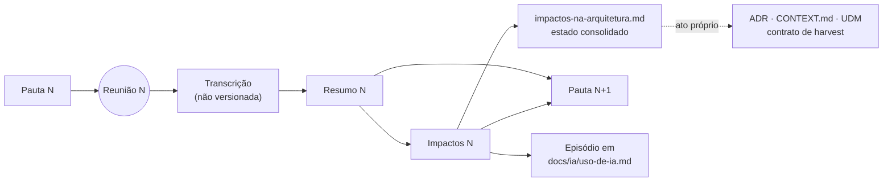

# Reuniões — resumos, impactos e pautas

Esta pasta guarda o registro das reuniões da arquitetura. As reuniões com o **Ponto-Focal** de uma
iniciativa parceira seguem um ciclo fixo, que é procedimento de pesquisa
([`../projetoPesquisa.md`](../projetoPesquisa.md) §7.2, item 7). As demais reuniões (apresentação,
comitê, articulação) têm só resumo.

## O ciclo: três documentos por reunião

Cada reunião com o Ponto-Focal gera três documentos, nesta ordem:

| # | Documento | Nome do arquivo | O que faz |
|---|---|---|---|
| 1 | **Resumo** | `AAAA-MM-DD-reuniao-<ponto-focal>.md` | Registra o que foi dito e decidido: decisões, insights, pendências, pontos de atenção, notas de leitura da transcrição. Não classifica impacto |
| 2 | **Impactos** | `AAAA-MM-DD-impactos-reuniao-<ponto-focal>.md` | Confronta cada decisão com os documentos de arquitetura e a classifica em *fecha*, *contradiz*, *acrescenta*, *confirma* ou *abre*, com o documento de destino. Cria os itens novos (`I-xx`) e revê os antigos |
| 3 | **Próxima pauta** | `proxima-pauta-reuniao-<ponto-focal>.md` → `AAAA-MM-DD-pauta-reuniao-<ponto-focal>.md` | Abre com o **retrospecto da pauta anterior** (o que foi tratado, o que ficou pendente, onde segue) e leva à próxima reunião o que ficou aberto no resumo e nos impactos |

A data do nome é sempre a **data da reunião a que o documento se refere**. Por isso, na listagem da
pasta, a pauta, o resumo e os impactos de uma mesma reunião aparecem juntos. A pauta nasce sem data
(`proxima-pauta-…`) e é renomeada com `git mv` quando a reunião é marcada.

**A pauta congela quando a reunião acontece.** Ela fica como memória do que foi proposto, e nunca
recebe o resultado da reunião. O resultado vai para o resumo, para os impactos e para o
retrospecto da pauta seguinte.

O quarto documento é único e vivo: [`impactos-na-arquitetura.md`](impactos-na-arquitetura.md), o
**estado consolidado**, com uma linha por item de impacto de todas as reuniões. Os documentos de
impactos de cada reunião são escritos uma vez e depois só recebem correção; o estado de cada item
muda apenas no consolidado.

## Regras de cada documento

**Resumo.** Mesma estrutura em todas as reuniões: cabeçalho (data, participantes, fonte, pauta base,
links do ciclo), Overview, Decisões, Insights, Pendências e encaminhamentos, Pontos de atenção, Notas
de leitura da transcrição, Links. Fica de fora tudo o que não diz respeito à arquitetura. O Ponto-Focal
pode corrigir e apagar trechos do resumo por *pull request* ([`guiaContrib/README.md`](guiaContrib/README.md)).

**Impactos.** Cita a linha do texto vigente que muda (`arquivo:linha`). Numeração `I-xx` contínua
entre reuniões, nunca reutilizada. Não altera nenhum documento de destino: aponta. Depois de escrito,
atualiza a tabela de [`impactos-na-arquitetura.md`](impactos-na-arquitetura.md).

**Próxima pauta.** Escrita para quem não é da área técnica:

- abre com o **retrospecto da pauta anterior**: uma linha por item, com o que aconteceu na reunião
  e onde segue (encerrado, bloco desta pauta, fora da pauta);
- cada pergunta que pede decisão vem com **o que está em jogo** (em palavras simples), **o que a
  arquitetura faz hoje**, as **opções** com a consequência de cada uma, e a **pergunta** em uma frase;
- todo código (`I-04`, `⑭`, `K7`) vem com o que ele significa, na mesma linha;
- separa o que o Ponto-Focal responde do que ele leva às comunidades;
- copia a tabela de rastreio da pauta das comunidades e atualiza a coluna *Estado*.

**Entre reuniões.** Dúvidas sobre a pauta vão para uma *Issue* do GitHub, citando o nome do arquivo e
o número do item. A pauta é corrigida antes da reunião.

## Índice das reuniões

| Data | Com quem | Pauta | Resumo | Impactos |
|---|---|---|---|---|
| 2026-08-18 | Comitê Gestor do USEFLORA | — | [resumo](2026-08-18-reuniao-useflora.md) | — (anterior ao ciclo) |
| 2026-09-16 | Sofia Zank (Ponto-Focal UseFlora) | [preparação](../pautaComunidades/preparacao-reuniao-2026-09-16.md) | [resumo](2026-09-16-reuniao-sofia.md) | [impactos](2026-09-16-impactos-reuniao-sofia.md) |
| 2026-09-18 | Sofia Zank | anotações de Sofia | [resumo](2026-09-18-reuniao-sofia.md) | [impactos](2026-09-18-impactos-reuniao-sofia.md) |
| 2026-09-29 | Sofia Zank | [pauta](2026-09-29-pauta-reuniao-sofia.md) | [resumo](2026-09-29-reuniao-sofia.md) | [impactos](2026-09-29-impactos-reuniao-sofia.md) |
| a definir | Sofia Zank | [próxima pauta](proxima-pauta-reuniao-sofia.md) | — | — |
