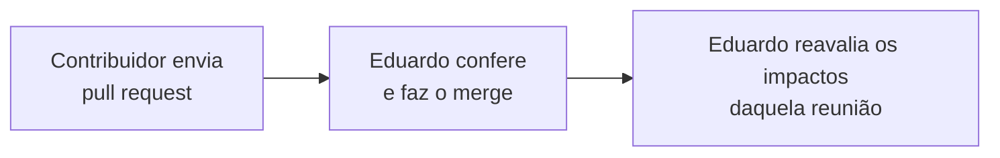

# Guia — como corrigir uma memória de reunião no GitHub

Para quem participa das reuniões e quer corrigir o registro. Não é preciso instalar nada nem conhecer
git: tudo acontece no site do GitHub.

Cada correção vira um **pedido de alteração** (*pull request*). Eduardo recebe um aviso, confere
o texto e incorpora a correção ao documento. Nada que você fizer apaga a versão anterior: o GitHub
guarda todo o histórico.

---

## Antes de começar

- Entre no GitHub com a sua conta. Se ainda não tem, crie uma em <https://github.com/signup>.
- Se você participa com frequência, peça a Eduardo acesso de colaborador ao repositório. Sem esse
  acesso o guia também funciona (ver "Perguntas comuns").
- As memórias ficam em:
  <https://github.com/edalcin/Arquitetura-BioCultural/tree/main/docs/reunioes>

---

## Os 4 passos

### 1. Abrir o arquivo e clicar no lápis

Clique no nome da memória (por exemplo, `2026-09-18-reuniao-sofia.md`). No canto superior direito
do texto, clique no **lápis** (✏️, *Edit this file*).

### 2. Editar o texto

Corrija o que for preciso, direto na caixa de texto.

- Os asteriscos (`**assim**`) deixam o texto em **negrito**. Mantenha os pares de asteriscos.
- Uma linha que começa com `-` ou `1.` é item de lista. Mantenha o sinal no início da linha.
- A aba **Preview** mostra como o texto vai ficar.

### 3. Clicar em "Commit changes…"

O botão verde fica no canto superior direito. Abre uma janela:

1. Em **Commit message**, escreva uma frase curta sobre a correção
   (ex.: `Corrige exemplo de hierarquia na decisão 5`).
2. Marque **"Create a new branch for this commit and start a pull request"**.
   **Não** marque "Commit directly to the main branch".
3. Clique em **Propose changes**.

### 4. Clicar em "Create pull request"

Abre uma página de resumo. Se quiser, explique a correção na caixa de descrição. Clique no botão
verde **Create pull request**.

Pronto. Eduardo recebe o aviso e faz o resto.

---

## Perguntas comuns

**Quero corrigir mais de uma memória.** Repita os 4 passos para cada arquivo. Um pedido por
correção é o normal.

**Esqueci uma coisa depois de enviar.** Envie um novo pedido com os mesmos 4 passos.

**Marquei a opção errada no passo 3 e o commit foi direto.** Não tem problema. Avise Eduardo; o
histórico guarda a versão anterior.

**O botão do lápis não aparece.** Confira se você entrou com a sua conta e se está vendo o
arquivo, não a pasta.

**O GitHub criou um *fork* (uma cópia do repositório na minha conta).** Isso acontece quando a sua
conta não tem acesso de colaborador. Siga os mesmos passos: o *pull request* chega ao repositório
original do mesmo modo. Com acesso de colaborador, o lápis cria o ramo direto no repositório
original, sem *fork*. Um *fork* que não é mais necessário pode ser apagado; Eduardo ajuda.

---

## Issues: conversar sobre a arquitetura entre as reuniões

Uma *Issue* é uma conversa com título, aberta no próprio repositório. Funciona como um fórum: uma
pessoa abre o assunto, as outras respondem embaixo, e tudo fica guardado e ligado aos documentos.
Não é preciso editar nenhum documento para usar.

### Quando abrir uma Issue

| Situação | Exemplo de título |
|---|---|
| Não entendi um trecho de um documento | `Dúvida: proxima-pauta-reuniao-sofia.md — item 2.1` |
| Quero propor ou questionar uma ideia da arquitetura | `Proposta: rótulo para uso comercial proibido` |
| Lembrei de algo que não foi dito na reunião | `Complemento à reunião de 29/09 — conflito entre coletivos` |
| Achei um erro, mas não sei como corrigir | `Erro: nome do decreto no resumo de 18/09` |
| Quero trazer um caso de campo ou uma referência | `Caso: sigilo sobre modo de preparo no Rio Negro` |

Correção simples de texto num resumo? Use os 4 passos acima (*pull request*). Assunto que precisa de
conversa? Abra uma *Issue*.

### Como abrir

1. Abra <https://github.com/edalcin/Arquitetura-BioCultural/issues>.
2. Clique no botão verde **New issue**.
3. **Título:** uma frase curta. Comece com o tipo (Dúvida, Proposta, Complemento, Erro, Caso) e cite
   o arquivo e o item quando houver.
4. **Texto:** diga o que você pensa e por quê. Se falar de um documento, cole o link dele. A barra de
   formatação ajuda a fazer listas e negrito.
5. Clique em **Create**.

### Depois de abrir

- Eduardo recebe um aviso por e-mail e responde na própria *Issue*. Outras pessoas também podem
  responder.
- Para chamar alguém para a conversa, escreva `@` e o nome da conta (ex.: `@edalcin`). A pessoa
  recebe um aviso.
- Quando o assunto muda um documento, a *Issue* ganha o link da alteração. Quando o assunto termina,
  ela é **fechada** (*Close*). Nada se apaga: *Issues* fechadas continuam visíveis e podem ser
  reabertas.
- Assuntos que precisam de decisão vão para a pauta da próxima reunião, com o número da *Issue*
  (ex.: `#7`).

### Cuidados

- **Tudo é público.** O repositório é aberto. Nunca escreva numa *Issue* conhecimento tradicional de
  uma comunidade, nome de detentor, local sensível ou dado pessoal. Fale do **desenho** (que campo,
  que regra, que opção), nunca do **valor** de um registro concreto.
- Um assunto por *Issue*. Dois assuntos? Duas *Issues*.
- Não há pergunta boba. Dúvida de quem não é da área técnica mostra onde a documentação precisa
  melhorar.

---

## O que acontece depois

Uma correção numa memória pode mudar a leitura que a arquitetura faz da reunião. Por isso cada
pedido passa pela conferência de Eduardo antes de entrar.
