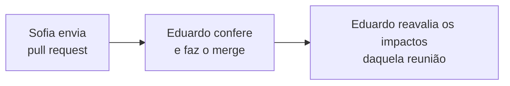

# Guia — como corrigir uma memória de reunião no GitHub

Para Sofia Zank. Não é preciso instalar nada nem conhecer git: tudo acontece no site do GitHub.

Cada correção vira um **pedido de alteração** (*pull request*). Eduardo recebe um aviso, confere
o texto e incorpora a correção ao documento. Nada que você fizer apaga a versão anterior: o GitHub
guarda todo o histórico.

---

## Antes de começar

- Entre no GitHub com a sua conta (`sofiazank`).
- As memórias ficam em:
  <https://github.com/edalcin/Arquitetura-BioCultural/tree/main/docs/reunioes>

---

## Os 4 passos

### 1. Abrir o arquivo e clicar no lápis

Clique no nome da memória (por exemplo, `2026-09-18-reuniao-sofia.md`). No canto superior direito
do texto, clique no **lápis** (✏️, *Edit this file*).

### 2. Editar o texto

Corrija o que for preciso, direto na caixa de texto.

- Os asteriscos (`**assim**`) deixam o texto em **negrito**. Mantenha os pares de asteriscos.
- Uma linha que começa com `-` ou `1.` é item de lista. Mantenha o sinal no início da linha.
- A aba **Preview** mostra como o texto vai ficar.

### 3. Clicar em "Commit changes…"

O botão verde fica no canto superior direito. Abre uma janela:

1. Em **Commit message**, escreva uma frase curta sobre a correção
   (ex.: `Corrige exemplo de hierarquia na decisão 5`).
2. Marque **"Create a new branch for this commit and start a pull request"**.
   **Não** marque "Commit directly to the main branch".
3. Clique em **Propose changes**.

### 4. Clicar em "Create pull request"

Abre uma página de resumo. Se quiser, explique a correção na caixa de descrição. Clique no botão
verde **Create pull request**.

Pronto. Eduardo recebe o aviso e faz o resto.

---

## Perguntas comuns

**Quero corrigir mais de uma memória.** Repita os 4 passos para cada arquivo. Um pedido por
correção é o normal.

**Esqueci uma coisa depois de enviar.** Envie um novo pedido com os mesmos 4 passos.

**Marquei a opção errada no passo 3 e o commit foi direto.** Não tem problema. Avise Eduardo; o
histórico guarda a versão anterior.

**O botão do lápis não aparece.** Confira se você entrou com a conta `sofiazank` e se está vendo o
arquivo, não a pasta.

**O GitHub criou um *fork* ("sofiazank/Arquitetura-BioCultural").** Não é preciso: com a sua conta,
o lápis cria o ramo direto no repositório original. O *fork* pode ser apagado; Eduardo ajuda.

---

## Como registrar uma dúvida sobre a pauta (*Issue*)

Para dúvidas e comentários entre reuniões, sem editar nenhum documento.

1. Abra <https://github.com/edalcin/Arquitetura-BioCultural/issues>.
2. Clique no botão verde **New issue**.
3. No título, cite o arquivo e o item (ex.: `proxima-pauta-reuniao-sofia.md — item 2.1`).
4. Escreva a dúvida. A barra de formatação ajuda a fazer listas.
5. Clique em **Create**. Eduardo recebe um aviso por e-mail e responde ali, como num fórum.

---

## O que acontece depois

Uma correção numa memória pode mudar a leitura que a arquitetura faz da reunião. Por isso cada
pedido passa pela conferência de Eduardo antes de entrar.
