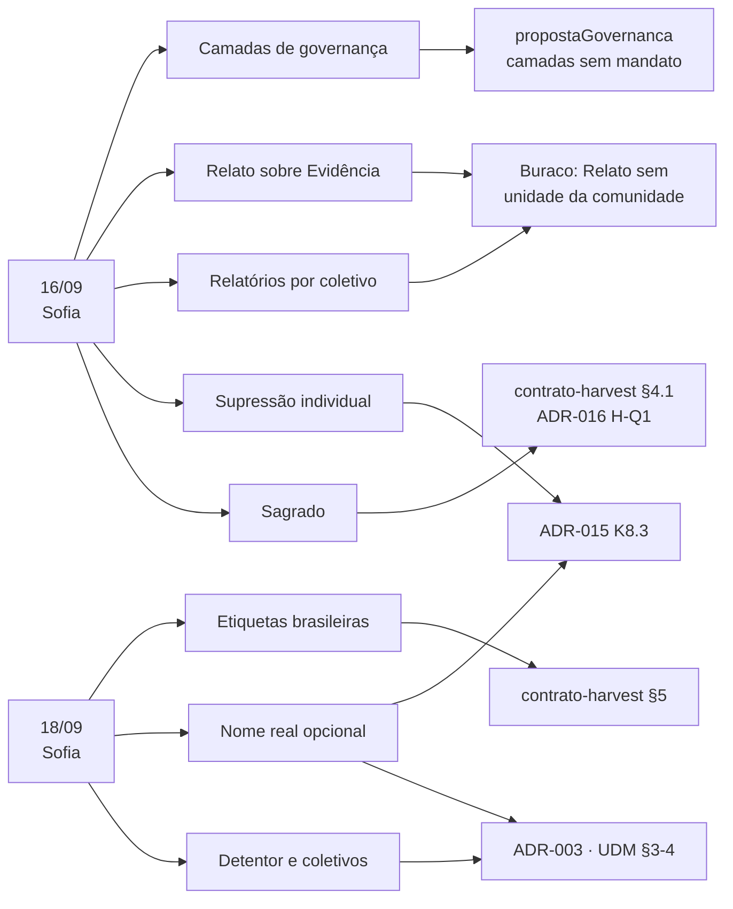

# Log de reuniões com o Ponto-Focal e seus impactos na arquitetura

> **O que este documento é.** O registro corrido das reuniões **com o Ponto-Focal** — hoje Sofia Zank,
> pelo UseFlora — e do **impacto de cada uma sobre os documentos de arquitetura**. Uma entrada por
> reunião, acrescentada logo depois que o resumo daquela reunião é escrito.
>
> **Escopo.** Só entram aqui as reuniões com o Ponto-Focal. Reuniões de apresentação, de comitê ou
> de articulação institucional têm resumo próprio em `docs/reunioes/` e **não** geram entrada neste
> log — o Ponto-Focal é o canal por onde a interlocução com as Comunidades Tradicionais chega à
> arquitetura, e é esse canal que este documento rastreia.
>
> **O que este documento não é.** Não é decisão, não é ADR e não altera nada. Ele **aponta** o que
> precisa mudar, onde, e por quê. A mudança acontece no documento de destino — ADR, `CONTEXT.md`,
> `contrato-harvest.md`, UDM — e só por ato próprio. Enquanto o destino não muda, o texto vigente
> continua vigente, inclusive quando este log já registrou a contradição.
>
> **Como usar.** Ao fechar um resumo de reunião com o Ponto-Focal: (1) acrescente a entrada em ordem
> cronológica; (2) classifique cada decisão em **fecha**, **contradiz**, **acrescenta**, **confirma**
> ou **abre**; (3) atualize a tabela de estado da §1. Uma linha só sai da tabela quando o documento
> de destino for alterado — e a alteração é anotada na coluna *Estado*.

## Sumário

- [1. Estado consolidado](#1-estado-consolidado)
- [2. Reunião de 2026-09-16 — Sofia Zank](#2-reunião-de-2026-09-16--sofia-zank)
- [3. Reunião de 2026-09-18 — Sofia Zank](#3-reunião-de-2026-09-18--sofia-zank)
- [4. O buraco estrutural em aberto](#4-o-buraco-estrutural-em-aberto)
- [5. Plano mínimo de documentos, se e quando for executado](#5-plano-mínimo-de-documentos-se-e-quando-for-executado)
- [6. Verificações pendentes](#6-verificações-pendentes)

---

## 1. Estado consolidado

Situação em 2026-09-19, depois de duas reuniões com o Ponto-Focal. Nenhum documento de arquitetura
foi alterado por efeito delas até aqui.

| # | O que a reunião produziu | Tipo | Documento de destino | Estado |
|---|---|---|---|---|
| I-01 | Três formas de nomeação da pessoa que compartilha | fecha **Q3** da ADR-015 | `ADR-015:418`; `proximosPassos.md` §4 ① | Não aplicado |
| I-02 | Formato do detentor individual no payload | fecha **pendência ①** e **H-Q2** | `contrato-harvest.md:250`; `ADR-016:132` | Não aplicado |
| I-03 | `sacred` não equivale a `private` | fecha **H-Q1**, contradizendo a regra interina | `contrato-harvest.md:96-104`; `ADR-016:131` | Não aplicado |
| I-04 | Conteúdo sagrado não é persistido, mesmo se publicado | contradiz | `ADR-015:284` (rejeição de *redaction at rest*) | Não aplicado |
| I-05 | Sai a pessoa, não sai o vídeo | contradiz | `ADR-015:349-355` (K8.3); `contrato-harvest.md:80-84`; `ADR-003:126` | Não aplicado |
| I-06 | Detentor é sempre coletivo | contradiz | `modelo-de-dados-unificado.md:155`; `ADR-015:156,178`; `CONTEXT.md:84-90` | Não aplicado |
| I-07 | Coletivo é entidade, não string | contradiz | `ADR-003:312-316`; `contrato-harvest.md:63`; `CONTEXT.md:120` | Não aplicado |
| I-08 | Nome real pode não existir na persistência | contradiz | `ADR-003:346-352,407`; UDM §5 | Não aplicado |
| I-09 | Relatórios de pendência por coletivo | acrescenta | Nenhum ADR hoje; `proximosPassos.md` do BioCultDB e do BioCultRelatos | Não aplicado |
| I-10 | Rótulo afirmativo de detentor não identificado | acrescenta | `ADR-015:159` (atribuição incompleta) | Não aplicado |
| I-11 | Default privado estendido a toda dúvida | acrescenta | `ADR-015:288-296` (K7) | Não aplicado |
| I-12 | Etiquetas próprias com tabela de correspondência | acrescenta | `ADR-015:217-230` (K4); `contrato-harvest.md:152-166` | Não aplicado |
| I-13 | Perfil de sensibilidade por coletivo | acrescenta | `ADR-015:288-296` (K7) | Não aplicado |
| I-14 | Relato da comunidade sobre Evidência publicada | **abre** — sem solução no texto vigente | `ADR-015:76,183`; ver §4 | Em aberto |
| I-15 | Composição e mandato das camadas de governança | **abre** | `propostaGovernanca.md`; `proximosPassos.md` | Em aberto |

---

## 2. Reunião de 2026-09-16 — Sofia Zank

Fonte: [`2026-09-16-reuniao-sofia.md`](2026-09-16-reuniao-sofia.md). Primeira reunião de trabalho com
o Ponto-Focal. Doze decisões.

### 2.1 O que fecha

**I-03 — `sacred` deixa de equivaler a `private`** (decisões 3 e 4).

- Vigente: `contrato-harvest.md:96-98` — "para efeito de cálculo equivale a `private` — nunca
  atravessa, em nenhuma hipótese". Regra declarada **interina** e levada à reunião como **H-Q1** da
  `ADR-016`.
- Decisão: registrar **o metadado do sagrado**, nunca o conteúdo. É legítimo afirmar que existe
  Conhecimento sagrado associado a uma espécie; é ilegítimo registrar qual é.
- Conflito: com a equivalência vigente, o metadado também não atravessa, e a decisão fica
  inimplementável. O que nunca atravessa é o **conteúdo**, não a **afirmação de existência**.
- Consequência: `sacred` sai da escala `public < restricted < community-only < private` e passa a
  dimensão do registro, com dois portadores distintos — existência (publicável) e conteúdo (não
  persistido, ver I-04). A decisão 4 acrescenta **níveis dentro do sagrado** e a matriz
  `sagrado × secreto`, com a célula "secreto não-sagrado" declarada vazia até resposta das
  comunidades.
- Fecha também a pendência "revisitar a equivalência `privado` = `secreto` no ADR-015", nomeada no
  próprio resumo de 16/09.

### 2.2 O que contradiz

**I-04 — conteúdo sagrado não deve ser persistido, ainda que o artigo o publique** (decisão 3).

- Vigente: `ADR-015:284` rejeita *redaction at rest* — "a perda é irreversível inclusive para a
  própria comunidade", e contradiria o direito de exportação integral.
- Conflito: o argumento do K6 pressupõe que o dado é da comunidade e a unidade o guarda **para** ela.
  Conteúdo sagrado extraído de artigo de terceiro não é esse caso — a comunidade não pede que a
  unidade o guarde.
- Consequência: a regra vira dupla, com a fronteira no Regime Enunciativo. *Redaction at rest* para
  conteúdo sagrado em `evidencia`; *redaction at the API boundary* para todo o resto. Atinge o
  pipeline de extração por IA do BioCultDB, que hoje extrai o que o artigo diz.
- O insight "nem IA nem curador identificam todo sagrado" acrescenta a exigência de **supressão
  retroativa a pedido da comunidade** — o controle não pode depender de marcação prévia.

**I-05 — sai a pessoa, não sai o vídeo** (decisão 2).

- Vigente: `ADR-015:349-355` (K8.3) — "Um participante que pede reserva **reserva a gravação
  inteira**"; "Editar a gravação para suprimir aquela pessoa **não é decisão da plataforma nem do
  curador**". Repetido em `contrato-harvest.md:80-84` e na nota do `ADR-003:126`.
- Decisão: o coletivo decide sobre o Conhecimento, porque o Conhecimento é coletivo; o indivíduo é
  soberano sobre imagem, voz e fala. Autorizada a publicação pela comunidade, a recusa individual
  suprime a pessoa, não o registro.
- Conflito: é uma inversão de default. Hoje a recusa individual bloqueia o registro coletivo.
- Reconciliação possível, a decidir no destino: K8.3 mantém "a plataforma não edita por conta
  própria" e mantém o original `restricted` enquanto não houver derivado; o que muda é o caminho
  esperado — a recusa individual dispara **pedido de derivado editado**, não bloqueio do coletivo. A
  cadeia PROV-O do K8.1 permanece intacta, porque a versão editada já é, por definição, derivado
  novo.

### 2.3 O que acrescenta

| # | Requisito | De onde vem | Por que não existe hoje |
|---|---|---|---|
| **I-09** | Relatórios de pendência por coletivo, periódicos e por demanda | decisão 8 | Nenhum ADR prevê. A `ADR-015:393` dá **CARE A2** por satisfeito com "a comunidade pode consultar", o que é insuficiente: o requisito é ativo, não consultivo. Exige estado "aguardando decisão" no ciclo do registro, e a hierarquia de coletivos (I-07) para a cascata nacional → regional → local |
| **I-10** | Rótulo afirmativo de detentor não identificado na fonte | decisão 7, caminho 3 | Existe como "Evidência com atribuição incompleta" (`ADR-015:159`), que é descrição de lacuna. O que se pede é um **Notice obrigatório** com redação afirmativa: *há detentor, não se sabe quem é* — nunca *não há detentor*. O insight dos ~90% do CGen é a razão: a categoria é usada como porta de fuga do consentimento, e a arquitetura não pode legitimá-la |
| **I-11** | Default privado estendido a toda dúvida de classificação | decisão 5 | O K7 (`ADR-015:288-296`) dá `restricted` por omissão só ao regime `conhecimento`; `evidencia` "segue o ADR-003", cujo exemplo nasce `public`. Falta a linha para Evidência com marcação de sagrado — que é exatamente o caso do BioCultDB |

### 2.4 O que confirma, sem mudar nada

- **Decisão 6** — a unidade declara Notice, o Label é da comunidade: é literalmente o K4
  (`ADR-015:217-230`). Nenhuma mudança.
- **Decisão 11** — quem classifica é a camada intermediária de governança: coerente com o K4, mas
  depende de **I-15** para ter sujeito. A camada existe no papel e não tem composição.
- **Decisão 1** — prioridade de Evidência, fontes secundárias: ordem de trabalho, não modelo.
- **Decisão 12** e o atrito de onboarding: documentação, não arquitetura. Resolvido na reunião
  seguinte por demonstração ao vivo do fluxo de edição e commit.

### 2.5 O que abre

- **I-14** — decisão 9, o BioCultDB precisará de capacidade de Relato. Ver §4.
- **I-15** — camadas de governança: quem decide o quê, em que camada. A camada dos dados é
  exclusivamente das comunidades e está definida; as camadas da arquitetura e das ferramentas seguem
  **sem composição, sem mandato e sem regra de formação**. Hoje a camada de arquitetura é, de fato,
  uma reunião de duas pessoas.
- **Decisão 10** — pedido de remoção de registro do banco: **adiada**, e a reunião seguinte
  confirmou o adiamento. Nomeada, não resolvida. Observação de compatibilidade: o
  `contrato-harvest.md:108-110` já determina que registro não público "não aparece **nem como
  tombstone**", o que é consistente com remoção; o que falta é a política, não o mecanismo de
  harvest.

---

## 3. Reunião de 2026-09-18 — Sofia Zank

Fonte: [`2026-09-18-reuniao-sofia.md`](2026-09-18-reuniao-sofia.md). Doze decisões.

### 3.1 O que fecha

**I-01 e I-02 — identificação do detentor** (decisões 2 e 3).

- Travava: **Q3** da `ADR-015:418`, a **pendência ①** do `contrato-harvest.md:250`, a **H-Q2** do
  `ADR-016:132` e, por consequência, o Passo 4 do `proximosPassos.md` (esquema como tabela).
- Decisão: três formas de nomeação — nome verdadeiro, pseudônimo escolhido pela própria pessoa,
  pseudônimo gerado pelo sistema. A escolha é individual e soberana, nunca do coletivo.
- Confirma a recomendação (c) da Q3 e a **amplia**: a recomendação previa o pseudônimo; a decisão
  prevê as três, e acrescenta que a exibição varia por público (decisão 4), o que é o mesmo eixo dos
  níveis de compartilhamento já previstos.
- **Nota de método, importante.** A Pauta 1 é **pauta de consentimento**
  (`pautaComunidades/pauta-comunidades.md:122`), e nenhuma pauta de consentimento se fecha por
  atacado. O que esta decisão fecha é o **cardápio de opções** — matéria de desenho, que o
  Ponto-Focal responde. O valor por pessoa continua sendo consentimento, registro a registro. A Q3
  pode ser promovida; a escolha concreta, não.

### 3.2 O que contradiz

**I-06 — o detentor é sempre coletivo; o enum `individual | coletivo` cai** (decisão 1).

- Vigente: `modelo-de-dados-unificado.md:155` — `"detentor": { "tipo": "coletivo", // individual |
  coletivo`; `ADR-015:156` (Q1 do teste do K1) e `ADR-015:178` — "detentor identificável — pessoa ou
  coletivo"; `CONTEXT.md:84-90`, verbete **Relato** — "um detentor (pessoa ou coletivo)".
- Decisão: o Conhecimento é coletivo por lei, e é o coletivo que figura como detentor. Quem
  compartilhou é **campo adicional**, opcional, e nunca substitui o vínculo com o coletivo — mesmo
  uma benzedeira isolada é vinculada ao coletivo das benzedeiras.
- Consequência: cai o discriminador `tipo`. `detentor` passa a referência obrigatória a um Coletivo;
  `compartilhadoPor` é campo separado, com a nomeação de I-01. Reescreve a Q1 do K1 e o verbete
  **Relato** do glossário da federação.

**I-07 — Coletivo é entidade, não string** (decisões 5, 6 e 7).

- Vigente: `ADR-003:312-316` — `community: { name, ethnicity, language }`, objeto plano;
  `contrato-harvest.md:63` — `holderPeople` é **string**; `CONTEXT.md:112-125` — Fonte de Atribuição
  `{tipo, nome}`, com `nome` livre.
- Decisão: raiz na denominação legal; níveis intermediários **opcionais**, que podem não existir;
  pertencimento **muitos-para-muitos** (benzedeira, raizeira e quilombola ao mesmo tempo);
  autodenominação registrada, sempre com referência ao termo legal.
- Consequência: entidade `Coletivo` com categoria legal obrigatória, autodenominação, hierarquia
  opcional, e relação N:N com pessoa. `holderPeople` precisa carregar ao menos o identificador da
  categoria legal — mudança de **forma** no contrato de harvest, não só de conteúdo.
- O caso que quebra a árvore é o **coletivo jurídico sem coletivo organizado**: a benzedeira Camila e
  a benzedeira Sueli, em comunidades diferentes, sem grupo entre elas. Forçar nível intermediário
  produz dado falso; deixar a pessoa fora de qualquer coletivo contradiz a natureza coletiva do
  Conhecimento. O único nível disponível é a categoria legal, e é suficiente.

**I-08 — o nome real pode não existir na persistência** (decisão 3).

- Vigente: `ADR-003:346-352` — `informants[].anonymized: true // Não incluir nome`, combinado com
  `permissions.hiddenFields` (`ADR-003:407`). O modelo é **guardar e ocultar**.
- Decisão: as duas opções precisam existir. Há quem recuse o **armazenamento**, não apenas a
  exibição.
- Consequência: o campo de nome real deixa de ser obrigatório-com-máscara e passa a **opcional na
  própria persistência**. É o único ponto da arquitetura em que a ausência no repouso é direito da
  pessoa, e não perda de dado. A regra "campo ausente ≠ campo retido" do UDM §5 passa a ter **três**
  estados: ausente por não se ter; retido por decisão de acesso; nunca gravado por escolha da pessoa.
- O insight que sustenta a decisão: entre as benzedeiras, a recusa veio das de religião de matriz
  africana. Não-identificação é **proteção contra dano**, não lacuna de qualidade de dado — e a
  desconfiança é sobre a promessa de não publicar, não sobre o campo.

### 3.3 O que acrescenta

| # | Requisito | De onde vem | Nota de implementação |
|---|---|---|---|
| **I-12** | Princípio das etiquetas adotado; conjunto internacional **não** adotado. Etiquetas brasileiras com tabela de correspondência para exportação | decisões 8, 9 e 11 | O K4 (`ADR-015:217-230`) nomeia TK/BC Label como **o** instrumento. A envoltória do harvest sobrevive sem mudança de forma: `culturalLabels[].id` já é identificador opaco e `hubId` já é opcional (`contrato-harvest.md:152-166`). Basta **namespace no `id`** e `hubId` ausente para rótulo próprio. As opções não são excludentes |
| **I-13** | Perfil de sensibilidade por coletivo | insight da farmacopeia popular | Para raizeiras e medicina tradicional, **registrar é proteger** — posição oposta à de povos indígenas e de terreiro. O K7 tem um default único para toda a federação. Precisa ser default **revisável pelo coletivo**, não constante global. Não contradiz o K7: mantém `restricted` como omissão segura e admite sobreposição por decisão da comunidade |

### 3.4 O que confirma ou adia

- **Decisão 10** — adoção prática do Local Contexts **adiada** até o recurso do GEF, com reunião a
  marcar com Keila e o MCTI. Isso mantém a **Q4** da `ADR-015:419` aberta, agora com motivo
  registrado: modelo de negócio pago, e um único caso de uso real encontrado — um Notice, em
  repositório pequeno, que **não propagou** para os agregadores.
- **Decisão 11** — etiqueta em exsicata de herbário viaja com o registro para o GBIF: é o argumento
  de por que adotar padrão em vez de convenção local, e confirma o caminho do BioCultAcervos.
- **Decisão 12** — resumos separados, um por reunião, com a consolidação do impacto como etapa à
  parte. **Este documento é essa etapa.**
- **Mecanismo de ocultação ou retirada de registro** — reafirmado na Pauta 4, **continua adiado**.

### 3.5 Pressão de escopo registrada, sem decisão

- Das 16 iniciativas apoiadas pelo GEF, algumas já inserem dados primários no SiBBr e procuraram o
  UseFlora para discutir política de dados. Não é escopo formal; é demanda real.
- O ICMBio / Programa Monitora identificou Conhecimento Tradicional nas próprias bases. Terceiro ator
  independente a chegar ao mesmo problema.
- Efeito sobre a arquitetura: nenhum hoje. Efeito sobre a prioridade de **I-14**: alto — é pelo
  Relato que o BioCultDB toca dado primário, independentemente do escopo declarado.

---

## 4. O buraco estrutural em aberto

**I-14 — o Relato da comunidade sobre uma Evidência publicada não tem onde nascer.**

Origem: decisão 9 de 16/09 — se a comunidade pode corrigir, contestar ou acrescentar sobre uma
Evidência, o que ela produz é Conhecimento, logo um Relato. Confirmado em 18/09 como o caminho pelo
qual o BioCultDB tangencia dado primário.

Três invariantes do texto vigente colidem:

1. `ADR-015:183` — "um Relato **vive sempre na unidade da comunidade detentora**".
2. `ADR-015:76` — "BioCultAcervos, BioCultDB e BioCultNaturalistas são `evidencia` **sempre**".
3. Na esmagadora maioria dos casos, a comunidade que se reconhece num artigo **não tem Unidade
   Federada**.

Guardar o Relato dentro do BioCultDB é a soberania invertida que a própria `ADR-015:64` rejeita
expressamente. Não guardar em lugar nenhum perde a correção — e perder a correção é perder
exatamente o momento em que, segundo o insight de 16/09, a comunidade deixa de validar e passa a
contribuir.

Caminho conservador, para consideração e **não decidido aqui**: não acrescentar armazenamento de
Relato ao BioCultDB; usar o que já existe — `relatedResources` / `resource-relationship`
(`contrato-harvest.md:128-136`) — com um valor de `relationshipType` para contestação; e tratar a
contestação sem unidade de destino como **item do relatório de pendências** (I-09), nunca como Relato
órfão.

Resta a pergunta que nenhum documento responde: **a arquitetura oferece uma instância de
BioCultRelatos à comunidade como parte da resposta, ou não?** Enquanto não houver resposta, não há
onde o Relato nascer.

---

## 5. Plano mínimo de documentos, se e quando for executado

Registrado como proposta. **Nada disto foi feito.**

| Documento | Conteúdo | Itens que consome |
|---|---|---|
| **ADR-018 — Identificação do detentor** | Coletivo obrigatório com raiz legal, hierarquia opcional, pertencimento N:N, autodenominação, campo de quem compartilhou, três formas de nomeação, nome real opcional na persistência | I-01, I-02, I-06, I-07, I-08 |
| **ADR-019 — Sagrado como dimensão, não nível** | Metadado publicável × conteúdo não persistido; matriz sagrado × secreto com níveis; default privado na dúvida; supressão retroativa a pedido | I-03, I-04, I-11 |
| Emenda à **ADR-015** | K8.3 (supressão individual); Q1 do K1 (detentor coletivo); K7 (linha de Evidência sagrada e perfil por coletivo); K4 (princípio da etiqueta, não o conjunto) | I-05, I-06, I-11, I-12, I-13 |
| Emenda ao **`contrato-harvest.md`** | §3 `holderPeople` estruturado; §4.1 escala sem `sacred`; §5 namespace no `id`; §8 baixa das pendências ① e ② | I-02, I-03, I-07, I-12 |
| Emenda ao **ADR-003** e ao **UDM** | Entidade `Coletivo`; `detentor` sem enum de tipo; três estados de ausência de campo | I-06, I-07, I-08 |
| Requisito, sem ADR | Relatórios de pendência por coletivo → `proximosPassos.md` do BioCultDB e do BioCultRelatos | I-09 |

Dois itens ficam de fora do plano por não terem resposta: **I-14** e **I-15**.

---

## 6. Verificações pendentes

- **Decreto nº 8.750/2016 × nº 8.772/2016.** O resumo de 18/09 (decisão 5) ancora a raiz de
  classificação dos coletivos no **Decreto nº 8.772/2016** e no Conselho Nacional de Povos e
  Comunidades Tradicionais. O `CONTEXT.md:120-125` e o UDM §3 ancoram nas **29 categorias do Decreto
  nº 8.750/2016**. São decretos distintos — o 8.750 institui o CNPCT; o 8.772 regulamenta a Lei nº
  13.123/2015. A nota de leitura do resumo registra "8772" como transcrição automática. Conferir
  antes de citar em ADR: se for 8.750, corrige-se o resumo; se a menção ao 8.772 for intencional,
  revisa-se o `CONTEXT.md`.
- **`community: null`.** O `planoPropostaGovernanca.md:271` prescreve `community: null` + rótulo de
  atribuição incompleta para CTA de origem não identificável. É exatamente o **nulo silencioso** que o
  UDM §5 e o `contrato-harvest.md:68-70` proíbem, e contraria a redação afirmativa exigida por
  **I-10**. Conferir na revisão da proposta de governança.
- **Leituras incertas da transcrição de 18/09** — "zípora" lido como UseFlora, e "pinhuma" não
  resolvido. Não afetam nenhum item deste log; conferir antes de citar aqueles trechos.

---

## Referências

- Resumos das reuniões com o Ponto-Focal:
  [`2026-09-16-reuniao-sofia.md`](2026-09-16-reuniao-sofia.md) ·
  [`2026-09-18-reuniao-sofia.md`](2026-09-18-reuniao-sofia.md)
- Documentos de destino: [`../../CONTEXT.md`](../../CONTEXT.md) ·
  [`../architecture-decisions/ADR-003-data-model.md`](../architecture-decisions/ADR-003-data-model.md) ·
  [`../architecture-decisions/ADR-015-regime-enunciativo-e-rotulagem-de-acesso.md`](../architecture-decisions/ADR-015-regime-enunciativo-e-rotulagem-de-acesso.md) ·
  [`../architecture-decisions/ADR-016-contrato-de-harvest.md`](../architecture-decisions/ADR-016-contrato-de-harvest.md) ·
  [`../contrato-harvest.md`](../contrato-harvest.md) ·
  [`../modelo-de-dados-unificado.md`](../modelo-de-dados-unificado.md)
- Pendências e pautas: [`../proximosPassos.md`](../proximosPassos.md) ·
  [`../pautaComunidades/pauta-comunidades.md`](../pautaComunidades/pauta-comunidades.md) ·
  [`../governanca/propostaGovernanca.md`](../governanca/propostaGovernanca.md)
