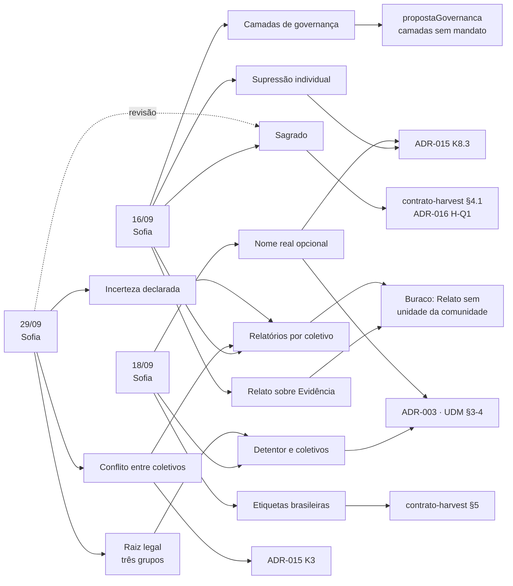

# Impactos das reuniões com o Ponto-Focal na arquitetura — estado consolidado

> **O que este documento é.** A visão única e atual de **todos os itens de impacto** (`I-01`, `I-02`…)
> que as reuniões com o Ponto-Focal produziram sobre os documentos de arquitetura. A análise de cada
> reunião fica num documento próprio, `AAAA-MM-DD-impactos-reuniao-<ponto-focal>.md`, escrito uma vez
> depois do resumo. Este documento só consolida: uma linha por item, com o estado atual.
>
> **Escopo.** Só entram aqui as reuniões com o Ponto-Focal. Reuniões de apresentação, de comitê ou
> de articulação institucional têm resumo próprio em `docs/reunioes/` e **não** geram itens de
> impacto — o Ponto-Focal é o canal por onde a interlocução com as Comunidades Tradicionais chega à
> arquitetura, e é esse canal que se rastreia aqui.
>
> **O que este documento não é.** Não é decisão, não é ADR e não altera nada. Ele **aponta** o que
> precisa mudar, onde, e por quê. A mudança acontece no documento de destino — ADR, `CONTEXT.md`,
> `contrato-harvest.md`, UDM — e só por ato próprio. Enquanto o destino não muda, o texto vigente
> continua vigente, inclusive quando um item já registrou a contradição.
>
> **Como usar.** Ao fechar o documento de impactos de uma reunião: (1) acrescente os itens novos à
> tabela da §1, com numeração que continua a anterior e nunca é reutilizada; (2) atualize a coluna
> *Estado* dos itens que a reunião reviu; (3) atualize as §2 a §4 se a reunião mexeu nelas. Uma linha
> só sai de *Não aplicado* quando o documento de destino for alterado — e a alteração é anotada na
> coluna *Estado*. O método completo está em [`README.md`](README.md).

## Sumário

- [1. Estado consolidado](#1-estado-consolidado)
- [2. O buraco estrutural em aberto](#2-o-buraco-estrutural-em-aberto)
- [3. Plano mínimo de documentos, se e quando for executado](#3-plano-mínimo-de-documentos-se-e-quando-for-executado)
- [4. Verificações pendentes](#4-verificações-pendentes)

Documentos de impactos por reunião:
[16/09](2026-09-16-impactos-reuniao-sofia.md) ·
[18/09](2026-09-18-impactos-reuniao-sofia.md) ·
[29/09](2026-09-29-impactos-reuniao-sofia.md)

---

## 1. Estado consolidado

Situação em 2026-09-29, depois de três reuniões com o Ponto-Focal. Nenhum documento de arquitetura
foi alterado por efeito delas até aqui. *Origem* é a reunião que criou o item; o documento de
impactos daquela reunião tem a análise.

| # | O que a reunião produziu | Tipo | Documento de destino | Origem | Estado |
|---|---|---|---|---|---|
| I-01 | Três formas de nomeação da pessoa que compartilha; uma escolha por pessoa, não por assunto | fecha **Q3** da ADR-015 | `ADR-015:418`; `proximosPassos.md` §4 ① | [18/09](2026-09-18-impactos-reuniao-sofia.md) | Não aplicado. 29/09 fechou a variação por assunto |
| I-02 | Formato do detentor individual no payload | fecha **pendência ①** e **H-Q2** | `contrato-harvest.md:250`; `ADR-016:132` | [18/09](2026-09-18-impactos-reuniao-sofia.md) | Não aplicado |
| I-03 | `sacred` não equivale a `private`; existência publicável | fecha **H-Q1**, contradizendo a regra interina | `contrato-harvest.md:96-104`; `ADR-016:131` | [16/09](2026-09-16-impactos-reuniao-sofia.md) | Não aplicado. Confirmado em 29/09; vocabulário sagrado × sigilo em aberto |
| I-04 | Conteúdo sagrado não é persistido, mesmo se publicado | contradiz | `ADR-015:284` (rejeição de *redaction at rest*) | [16/09](2026-09-16-impactos-reuniao-sofia.md) | **Em revisão** — 29/09 não confirmou a leitura |
| I-05 | Sai a pessoa, não sai o vídeo | contradiz | `ADR-015:349-355` (K8.3); `contrato-harvest.md:80-84`; `ADR-003:126` | [16/09](2026-09-16-impactos-reuniao-sofia.md) | Não aplicado. Fora do escopo do canal UseFlora desde 29/09; espera interlocutor de fontes primárias |
| I-06 | Detentor é sempre coletivo | contradiz | `modelo-de-dados-unificado.md:155`; `ADR-015:156,178`; `CONTEXT.md:84-90` | [18/09](2026-09-18-impactos-reuniao-sofia.md) | Não aplicado |
| I-07 | Coletivo é entidade, não string | contradiz | `ADR-003:312-316`; `contrato-harvest.md:63`; `CONTEXT.md:120` | [18/09](2026-09-18-impactos-reuniao-sofia.md) | Não aplicado. "Segmento" confirmado em 29/09 |
| I-08 | Nome real pode não existir na persistência | contradiz | `ADR-003:346-352,407`; UDM §5 | [18/09](2026-09-18-impactos-reuniao-sofia.md) | Não aplicado |
| I-09 | Relatórios de pendência por coletivo | acrescenta | Nenhum ADR hoje; `proximosPassos.md` do BioCultDB e do BioCultRelatos | [16/09](2026-09-16-impactos-reuniao-sofia.md) | Não aplicado. Ganha entradas de I-17 e I-18 |
| I-10 | Rótulo afirmativo de detentor não identificado | acrescenta | `ADR-015:159` (atribuição incompleta) | [16/09](2026-09-16-impactos-reuniao-sofia.md) | Não aplicado |
| I-11 | Default privado estendido a toda dúvida | acrescenta | `ADR-015:288-296` (K7) | [16/09](2026-09-16-impactos-reuniao-sofia.md) | Não aplicado. Confirmado em 29/09 |
| I-12 | Etiquetas próprias com tabela de correspondência | acrescenta | `ADR-015:217-230` (K4); `contrato-harvest.md:152-166` | [18/09](2026-09-18-impactos-reuniao-sofia.md) | Não aplicado |
| I-13 | Perfil de sensibilidade por coletivo | acrescenta | `ADR-015:288-296` (K7) | [18/09](2026-09-18-impactos-reuniao-sofia.md) | Não aplicado. Confirmado em 29/09 |
| I-14 | Relato da comunidade sobre Evidência publicada | **abre** — sem solução no texto vigente | `ADR-015:76,183`; ver §2 | [16/09](2026-09-16-impactos-reuniao-sofia.md) | Em aberto. Reafirmado em 29/09 |
| I-15 | Composição e mandato das camadas de governança | **abre** | `propostaGovernanca.md`; `proximosPassos.md` | [16/09](2026-09-16-impactos-reuniao-sofia.md) | Em aberto. Convite a Viviane Kruel (fontes primárias), 29/09 |
| I-16 | Raiz legal com três grupos (Lei nº 13.123); listas de categorias não exaustivas | contradiz | `CONTEXT.md:127-128`; `modelo-de-dados-unificado.md:77` | [29/09](2026-09-29-impactos-reuniao-sofia.md) | Não aplicado |
| I-17 | Conflito entre coletivos: o privado prevalece (embargo), mesmo contra autorização já dada por outro coletivo | acrescenta; **abre** entre unidades | `ADR-015:205` (K3); relatórios (I-09) | [29/09](2026-09-29-impactos-reuniao-sofia.md) | Não aplicado; mecanismo entre unidades em aberto. Leitura ajustada pela revisão de Sofia (PR #4) |
| I-18 | Incerteza declarada ("não sei se é secreto ou se pode ser publicado") como valor de classificação | acrescenta | `ADR-015:288-296` (K7); UDM; relatórios (I-09) | [29/09](2026-09-29-impactos-reuniao-sofia.md) | Não aplicado. Leitura ajustada pela revisão de Sofia (PR #4): secreto, não sagrado; se vale para sagrado, em aberto |
| I-19 | Evidência de domesticação e manejo | **abre** | Nenhum documento hoje | [29/09](2026-09-29-impactos-reuniao-sofia.md) | Em aberto |

```mermaid
flowchart LR
  R1["16/09<br/>Sofia"] --> S["Sagrado"]
  R1 --> V["Supressão individual"]
  R1 --> P["Relatórios por coletivo"]
  R1 --> C["Relato sobre Evidência"]
  R1 --> GOVC["Camadas de governança"]
  R2["18/09<br/>Sofia"] --> D["Detentor e coletivos"]
  R2 --> N["Nome real opcional"]
  R2 --> E["Etiquetas brasileiras"]
  R3["29/09<br/>Sofia"] --> L["Raiz legal<br/>três grupos"]
  R3 --> K["Conflito entre coletivos"]
  R3 --> U["Incerteza declarada"]
  R3 -. revisão .-> S
  L --> D
  K --> P
  U --> P
  S --> H["contrato-harvest §4.1<br/>ADR-016 H-Q1"]
  V --> A15["ADR-015 K8.3"]
  K --> A15K3["ADR-015 K3"]
  D --> A03["ADR-003 · UDM §3-4"]
  N --> A03
  N --> A15
  E --> H5["contrato-harvest §5"]
  C --> GAP["Buraco: Relato sem<br/>unidade da comunidade"]
  P --> GAP
  GOVC --> GOV["propostaGovernanca<br/>camadas sem mandato"]
```

---

## 2. O buraco estrutural em aberto

**I-14 — o Relato da comunidade sobre uma Evidência publicada não tem onde nascer.**

Origem: decisão 9 de 16/09 — se a comunidade pode corrigir, contestar ou acrescentar sobre uma
Evidência, o que ela produz é Conhecimento, logo um Relato. Confirmado em 18/09 como o caminho pelo
qual o BioCultDB tangencia dado primário, e reafirmado em 29/09.

Três invariantes do texto vigente colidem:

1. `ADR-015:183` — "um Relato **vive sempre na unidade da comunidade detentora**".
2. `ADR-015:76` — "BioCultAcervos, BioCultDB e BioCultNaturalistas são `evidencia` **sempre**".
3. Na esmagadora maioria dos casos, a comunidade que se reconhece num artigo **não tem Unidade
   Federada**.

Guardar o Relato dentro do BioCultDB é a soberania invertida que a própria `ADR-015:64` rejeita
expressamente. Não guardar em lugar nenhum perde a correção — e perder a correção é perder
exatamente o momento em que, segundo o insight de 16/09, a comunidade deixa de validar e passa a
contribuir.

Caminho conservador, para consideração e **não decidido aqui**: não acrescentar armazenamento de
Relato ao BioCultDB; usar o que já existe — `relatedResources` / `resource-relationship`
(`contrato-harvest.md:128-136`) — com um valor de `relationshipType` para contestação; e tratar a
contestação sem unidade de destino como **item do relatório de pendências** (I-09), nunca como Relato
órfão.

Resta a pergunta que nenhum documento responde: **a arquitetura oferece uma instância de
BioCultRelatos à comunidade como parte da resposta, ou não?** Enquanto não houver resposta, não há
onde o Relato nascer.

---

## 3. Plano mínimo de documentos, se e quando for executado

Registrado como proposta. **Nada disto foi feito.**

| Documento | Conteúdo | Itens que consome | Pronto para escrever? |
|---|---|---|---|
| **ADR-018 — Identificação do detentor** | Grupo legal da Lei nº 13.123 e categoria por lista não exaustiva; coletivo obrigatório, hierarquia opcional, pertencimento N:N, autodenominação; campo de quem compartilhou; três formas de nomeação, uma por pessoa; nome real opcional na persistência | I-01, I-02, I-06, I-07, I-08, I-16 | **Sim** — todos confirmados até 29/09 |
| **ADR-019 — Sagrado como dimensão, não nível** | Existência publicável × conteúdo protegido; sagrado e secreto independentes (quatro células); default privado na dúvida; supressão retroativa e liberação a pedido; sigilo por campo | I-03, I-04, I-11 | **Não** — espera o vocabulário sagrado × sigilo e a decisão sobre I-04 |
| Emenda à **ADR-015** | K8.3 (supressão individual); Q1 do K1 (detentor coletivo); K3 (eixo entre coletivos); K7 (linha de Evidência sagrada, perfil por coletivo, incerteza declarada); K4 (princípio da etiqueta, não o conjunto) | I-05, I-06, I-11, I-12, I-13, I-17, I-18 | Em parte — I-05 espera interlocutor de fontes primárias |
| Emenda ao **`contrato-harvest.md`** | §3 `holderPeople` estruturado; §4.1 escala sem `sacred`; §5 namespace no `id`; §8 baixa das pendências ① e ② | I-02, I-03, I-07, I-12 | Depois da ADR-018 e da ADR-019 |
| Emenda ao **ADR-003**, ao **UDM** e ao **`CONTEXT.md`** | Entidade `Coletivo`; `detentor` sem enum de tipo; três estados de ausência de campo; verbete **Comunidade Tradicional** com três grupos | I-06, I-07, I-08, I-16 | Depois da ADR-018 |
| Requisito, sem ADR | Relatórios de pendência por coletivo, com três entradas: sem decisão, embargado, incerto → `proximosPassos.md` do BioCultDB e do BioCultRelatos | I-09, I-17, I-18 | Sim |

Ficam de fora do plano por não terem resposta: **I-14**, **I-15**, **I-19** e a parte de **I-17** entre
unidades.

---

## 4. Verificações pendentes

- **Número de segmentos do Decreto nº 8.750/2016.** O `CONTEXT.md:127` e o UDM dizem 29 categorias;
  Sofia disse 28 em 29/09. A diferença pode estar em contar ou não "povos indígenas" e "juventude".
  Conferir no texto do decreto antes de escrever a ADR-018.
- **"Agricultor tradicional" × "agricultor familiar".** Sofia disse "agricultores familiares" em 29/09;
  a Lei nº 13.123/2015, art. 2º, usa *agricultor tradicional*. Conferir antes de citar.
- **Lista de referência de povos indígenas.** ISA, IBGE (Censo 2022) ou FUNAI — Viviane circula o dado
  da FUNAI. Escolher a lista padrão para I-16.
- **`community: null`.** O `planoPropostaGovernanca.md:271` prescreve `community: null` + rótulo de
  atribuição incompleta para CTA de origem não identificável. É exatamente o **nulo silencioso** que o
  UDM §5 e o `contrato-harvest.md:68-70` proíbem, e contraria a redação afirmativa exigida por
  **I-10**. Conferir na revisão da proposta de governança.
- **Leituras incertas das transcrições** — 18/09: "zípora" lido como UseFlora, e "pinhuma" não
  resolvido; 29/09: "Fenaleiro" e "Lucas elesco" sem leitura. Não afetam nenhum item; conferir antes
  de citar aqueles trechos.
- ~~**Decreto nº 8.750/2016 × nº 8.772/2016.**~~ Resolvida em 29/09: os dois valem, com papéis
  diferentes (ver I-16).

---

## Referências

- Método, convenção de nomes e índice das reuniões: [`README.md`](README.md)
- Documentos de destino: [`../../CONTEXT.md`](../../CONTEXT.md) ·
  [`../architecture-decisions/ADR-003-data-model.md`](../architecture-decisions/ADR-003-data-model.md) ·
  [`../architecture-decisions/ADR-015-regime-enunciativo-e-rotulagem-de-acesso.md`](../architecture-decisions/ADR-015-regime-enunciativo-e-rotulagem-de-acesso.md) ·
  [`../architecture-decisions/ADR-016-contrato-de-harvest.md`](../architecture-decisions/ADR-016-contrato-de-harvest.md) ·
  [`../contrato-harvest.md`](../contrato-harvest.md) ·
  [`../modelo-de-dados-unificado.md`](../modelo-de-dados-unificado.md)
- Pendências e pautas: [`../proximosPassos.md`](../proximosPassos.md) ·
  [`../pautaComunidades/pauta-comunidades.md`](../pautaComunidades/pauta-comunidades.md) ·
  [`../governanca/propostaGovernanca.md`](../governanca/propostaGovernanca.md)
