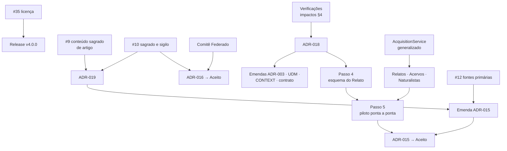

# Próximos Passos — o que falta fazer

> **Só olha para frente.** Este arquivo lista o que precisa ser feito para o projeto avançar, com o
> que bloqueia cada coisa. Não guarda histórico: quando um item termina, ele **sai** daqui. O que foi
> feito fica no [`CHANGELOG.md`](CHANGELOG.md), nas ADRs, nos resumos de reunião
> ([`../Governanca/Arquitetura/Reunioes/`](../Governanca/Arquitetura/Reunioes/)), no histórico de
> método ([`metodo-de-evolucao.md`](../Governanca/Arquitetura/metodo-de-evolucao.md) §5) e no git.
>
> **Ponto de entrada de toda sessão** — humana ou de IA. Onde está cada documento: `CLAUDE.md`
> (seção "Estrutura do repositório") e [`../README.md`](../README.md).
>
> **Regras de manutenção.** Ao fim de cada sessão: (i) tirar o que foi concluído; (ii) acrescentar o
> que surgiu; (iii) atualizar a linha "Agora". Uma pendência que depende da resposta de uma pessoa
> vive como *Issue* no [painel #6](https://github.com/edalcin/Arquitetura-BioCultural/issues/6);
> aqui fica só o link. Pendência de implementação de uma ferramenta vive no repositório dela (§4).
> Caminhos citados são relativos à raiz do repositório.

**Agora:** versão 4.0.0 pronta, ainda não publicada. Próximo marco: release no Zenodo (§1.1).
Último release publicado: v3.4 (DOI 10.5281/zenodo.21738427). DOI conceitual, que sempre leva à
versão mais recente: 10.5281/zenodo.17710619.

---

## 1. Próximas ações, em ordem

### 1.1 Publicar a versão 4.0.0

1. **Concordância de Sofia com a licença CC BY 4.0** — questão
   [#35](https://github.com/edalcin/Arquitetura-BioCultural/issues/35). Bloqueia o release.
2. **Leitura humana dos textos novos** — `ComecePorAqui/` (resumo executivo, glossário, guias),
   `docs/Governanca/README.md` e READMEs das camadas, `docs/Pesquisa/README.md`. Foram escritos por
   subagentes e ninguém da governança os revisou.
3. **Ajustes de citação:** citar o DOI conceitual no `README.md` e em
   `docs/Pesquisa/projetoPesquisa.md`; corrigir no cabeçalho do projeto de pesquisa a afirmação
   "v3.5 publicada e citável" (o último release é v3.4) e atualizar o resto do bloco "Estado da
   produção técnica" (versão do repositório, ADRs, licença).
4. **`.zenodo.json`** na raiz: título "Arquitetura BioCultural — Versão 4.0", autor (com ORCID, se
   houver), licença `cc-by-4.0`, descrição curta, palavras-chave.
5. **Release:** `gh release create v4.0.0`. A integração GitHub→Zenodo está ativa e deposita
   sozinha; conferir no registro do Zenodo se a licença saiu como CC BY 4.0.

### 1.2 Próxima reunião de governança da arquitetura

- **Pauta pronta:** [`proxima-pauta-reuniao-sofia.md`](../Governanca/Arquitetura/Reunioes/proxima-pauta-reuniao-sofia.md),
  gerada da [milestone "Próxima reunião"](https://github.com/edalcin/Arquitetura-BioCultural/milestone/1).
  Data: Sofia agenda.
- **Antes da reunião:** Revisão das Issues (leitura) e nova geração da pauta, pelo ciclo de
  [`../Governanca/Arquitetura/README.md`](../Governanca/Arquitetura/README.md).
- **Na reunião:** demonstração do formato novo e pergunta "funciona para você?"; decisões
  [#7](https://github.com/edalcin/Arquitetura-BioCultural/issues/7),
  [#8](https://github.com/edalcin/Arquitetura-BioCultural/issues/8),
  [#9](https://github.com/edalcin/Arquitetura-BioCultural/issues/9),
  [#10](https://github.com/edalcin/Arquitetura-BioCultural/issues/10),
  [#11](https://github.com/edalcin/Arquitetura-BioCultural/issues/11); informes #12 a #15.
- **Depois:** o primeiro ciclo completo no formato novo — resumo, revisão de Sofia, Revisão das
  Issues (aplicação), impactos, episódio em `docs/Pesquisa/IA/uso-de-ia.md`.
- **Depois de duas reuniões no formato novo:** comparar as medidas de M-10
  (`docs/Governanca/Arquitetura/metodo-de-evolucao.md` §5).
- **Quando #11 e #12 forem respondidas:** trocar o sufixo `-sofia` dos arquivos de reunião por
  `-governanca`, num commit só, corrigindo os links.

### 1.3 Arquitetura — o que já pode ser escrito

Fonte: [`impactos-na-arquitetura.md`](impactos-na-arquitetura.md) §3 (plano mínimo de documentos).

1. **Escrever a ADR-018 — identificação do detentor.** Pronta: consome I-01, I-02, I-06, I-07,
   I-08 e I-16, todos confirmados. Antes, fechar as verificações do §4 do documento de impactos
   (número de segmentos do Decreto nº 8.750/2016; "agricultor tradicional"; lista de povos
   indígenas, que espera [#15](https://github.com/edalcin/Arquitetura-BioCultural/issues/15)).
   Destrava a Q3 da ADR-015, a pendência ① (§2) e a H-Q2 da ADR-016.
2. **Depois da ADR-018:** emendas ao ADR-003, ao UDM e ao `CONTEXT.md` (entidade Coletivo,
   detentor sem enum de tipo, três estados de ausência de campo, verbete Comunidade Tradicional com
   três grupos) e ao `contrato-harvest.md` (§3 `holderPeople` estruturado).
3. **Requisito sem ADR:** relatórios de pendência por coletivo, com três entradas (sem decisão,
   embargado, incerto) — I-09, I-17, I-18. Registrar no `docs/proximosPassos.md` do BioCultDB e do
   BioCultRelatos.
4. **Escrever a ADR-019 — sagrado como dimensão.** Bloqueada por
   [#9](https://github.com/edalcin/Arquitetura-BioCultural/issues/9) e
   [#10](https://github.com/edalcin/Arquitetura-BioCultural/issues/10); o vocabulário final espera
   [#26](https://github.com/edalcin/Arquitetura-BioCultural/issues/26).
5. **Emenda à ADR-015** (K8.3, K1 Q1, K3, K7, K4) — em parte já possível; a parte de K8.3 (I-05)
   espera quem responda pelas fontes primárias
   ([#12](https://github.com/edalcin/Arquitetura-BioCultural/issues/12)).

### 1.4 Decisões técnicas que não dependem de ninguém

- **② Rótulos culturais** — guardar identificador + cache do texto canônico, nunca editar
  (recomendada; precedente no Guardian Connector, `docs/Pesquisa/iniciativas/guardianConnector.md`
  §3). Decidir e registrar.
- **⑪ `und` como estado transitório** — fila de curadoria que liste os registros em `und` e cobre
  resolução.
- **Generalizar o `AcquisitionService` do BioCultTermos** para lista de pares
  `{tabela, campos[]}`. É o único bloqueio puramente técnico que trava três unidades ao mesmo tempo
  (Relatos, Acervos, Naturalistas).
- **Marcar como Evidência os 29 registros do BioCultDB sem `regime`** —
  [#30](https://github.com/edalcin/Arquitetura-BioCultural/issues/30).

---

## 2. Pendências numeradas em aberto

A numeração é estável e citada em outros documentos (ADRs, contrato de harvest). Pendência que
fecha sai desta tabela.

| # | Pendência | O que falta | Trava |
|---|---|---|---|
| ① | Formato do detentor individual | Decidido nas reuniões (I-01, I-02); falta aplicar na ADR-018 (§1.3) | Esquema do Relato (Passo 4) |
| ② | Rótulos culturais: API do Local Contexts Hub ou cópia local | Decisão técnica (§1.4). Quem pode aplicar rótulo em nome de todos é questão das comunidades (Pauta 2; [#20](https://github.com/edalcin/Arquitetura-BioCultural/issues/20), [#21](https://github.com/edalcin/Arquitetura-BioCultural/issues/21)) | Interface dos rótulos |
| ④ | `sacred` equivale a `private`? (H-Q1 da ADR-016) | [#10](https://github.com/edalcin/Arquitetura-BioCultural/issues/10). Regra interina: equivale a `private` | ADR-016 → *Aceito* |
| ⑥ | Vocabulário controlado de `assertionType` (Q5 da ADR-015) | Matéria do BioCultTermos e do Comitê | Esquema do Relato |
| ⑦ | ADR-015 → *Aceito* | Q3–Q5 e validação com comunidades | Tudo o que depende de ADR aceita |
| ⑧ | Quem fala pelo grupo numa gravação coletiva | [#29](https://github.com/edalcin/Arquitetura-BioCultural/issues/29) | Emenda K8.3 |
| ⑨ | Versão editada de gravação após revogação | [#24](https://github.com/edalcin/Arquitetura-BioCultural/issues/24) | Emenda K8.3 |
| ⑩ | Onde mora o vídeo original | [#25](https://github.com/edalcin/Arquitetura-BioCultural/issues/25) | Mídia no BioCultRelatos (K8.4) |
| ⑪ | `und` como estado transitório | Decisão técnica (§1.4) | Curadoria |
| ⑫ | ADR-016 → *Aceito* | ④ e o Comitê | Endpoint de harvest |
| ⑭ | Princípios mínimos que toda instância aceita | [#14](https://github.com/edalcin/Arquitetura-BioCultural/issues/14); conteúdo já tem casa em ADR-004 D3 e `propostaGovernanca.md` §5.11 | Admissão de membros |
| ⑮ | Composição da governança da arquitetura | [#11](https://github.com/edalcin/Arquitetura-BioCultural/issues/11); convites em [#33](https://github.com/edalcin/Arquitetura-BioCultural/issues/33) | Entrada de novos participantes |
| ⑯ | Sincronização assíncrona para baixa conectividade | Requisito sem mecanismo: replicação, exportação por arquivo ou cópia física. ADR quando houver alternativas a comparar | Uso em campo |
| ⑰ | Auditoria dos prompts do BioCultDB contra envio de dado sensível a provedor externo de IA | Política escrita (`propostaGovernanca.md` §5.12, item 9); auditoria pendente no BioCultDB | Conformidade da extração por IA |
| ⑱ | Capacitação das comunidades para operar a própria instância | C.A.R.E. R2; repartição não monetária (Lei 13.123/2015, art. 19) | Adoção pelas comunidades |
| Passo 4 | Esquema do Relato como tabela | ADR-018 (①) | BioCultRelatos |
| Passo 5 | Piloto ponta a ponta no estudo de caso | Esquema do Relato e agenda do estudo de caso do BioCultRelatos | ADR-015 → *Aceito* |

---

## 3. Mapa de dependências

---

## 4. Pendências das ferramentas (em outros repositórios)

Cada ferramenta mantém o seu `docs/proximosPassos.md`, que é a fonte de verdade das pendências de
implementação dela.

| Ferramenta | Pendências principais | Documento |
|---|---|---|
| **BioCultDB** (fontes secundárias) | Campos de acesso do ADR-003 não materializados; 29 registros sem `regime` (#30); endpoint de harvest; qualidade da extração por IA não medida; auditoria dos prompts (⑰); generalizar o `AcquisitionService` | [`BioCultDB/docs/proximosPassos.md`](https://github.com/edalcin/BioCultDB/blob/main/docs/proximosPassos.md) |
| **BioCultRelatos** (registro primário, CLPI) | Esquema do Relato (Passo 4); CLPI como ciclo revisável; mídia como registro primário (K8.1, K8.3); três contextos; harvest; devolutiva | [`BioCultRelatos/docs/proximosPassos.md`](https://github.com/edalcin/BioCultRelatos/blob/main/docs/proximosPassos.md) |
| **BioCultAcervos** (acervos) | `AcquisitionService` (bloqueante); persistência e modelo do acervo; contextos de Registro e Curadoria; `relatedResources`; harvest; Docker/CI | [`BioCultAcervos/docs/proximosPassos.md`](https://github.com/edalcin/BioCultAcervos/blob/main/docs/proximosPassos.md) |
| **BioCultNaturalistas** (obras séc. XVII–XIX) | F1 `AcquisitionService` (bloqueante); F2 scaffold; F3 cinco tabelas + FTS5; F6 harvest; remover `bcn_taxons → $.nomeCientificoAtual` (ADR-014 N3) | [`BioCultNaturalistas/docs/proximosPassos.md`](https://github.com/edalcin/BioCultNaturalistas/blob/main/docs/proximosPassos.md) |
| **Pluriverso** (middleware) | Fase 0 esqueleto + CI; Fase 1 membership e probe anti-SSRF; Fase 2 harvest + índice FTS5; Fases 3–6 | [`pluriverso/docs/proximosPassos.md`](https://github.com/edalcin/pluriverso/blob/main/docs/proximosPassos.md) |
| **BioCultTermos** (módulo SKOS-XL) | Generalizar o `AcquisitionService`; hospedagem nas outras três unidades | `docs/proximosPassos.md` do BioCultDB |

---

## 5. Verificações e consistência a fazer

- **Verificações do documento de impactos** — [`impactos-na-arquitetura.md`](impactos-na-arquitetura.md) §4 (antes da ADR-018).
- **Diagramas C4** (`docs/tecnico/c4-model/`) — falam em coleta de registros `visibility: public`; desatualizados na letra desde a ADR-016.
- **`propostaGovernanca.md` §5.5** — descreve Label/Notice sem citar o regime enunciativo, que decide qual dos dois se aplica.
- **`propostaGovernanca.md` §6.4 e lacuna 4** — ainda dizem que a licença está "a definir"; a CC BY 4.0 foi adotada.
- **Descrição técnica** (`docs/tecnico/README.md`, "Quatro Fontes") — ainda usa "evidências" como termo guarda-chuva em vários pontos.
- **Slide "Cinco perguntas que só vocês podem responder"** (`docs/Pesquisa/apresentacoes/`) — conferir se segue coerente com as pautas e as *Issues* atuais.
- **BioCultPapers** — repositório arquivado; 1 link no `README.md` e 1 no `CLAUDE.md` apontam para caminhos antigos. Só corrige se for desarquivado.
- **Neste Windows**, `sed -i` sobre arquivos do repositório apaga o arquivo quando falha: editar com o editor ou com Python.
