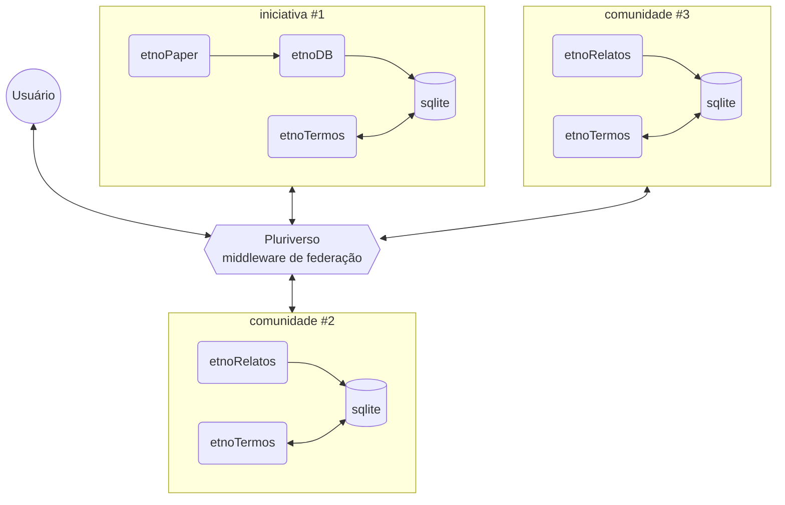

Preciso redefinir esta arquitetura (versão 3.0) para que seja explicitamente federada. Desta forma, iniciativas de sistematização de conhecimento tradicional associado à biodiversidade (CTA) de fontes secundárias, como o USEFLORA,  e iniciativas de sistematização de CTA a partir de fontes primarias (junto às comunidades) seriam completamente independentes e soberanas na gestão de seus próprios dados, garantindo os princípios C.A.R.E. em  sua essência.

Nesta nova versão, uma nova ferramenta será desenvolvida, o "Pluriverso". O Pluriverso será o "Middleware" da Federação, servindo de interface para usuários ou aplicações-cliente, via API, para acesso ao conjunto de CTAs das diferentes entidades federadas.

O Pluriverso deve servir também como mediador da camada semântica, gerida pela ferramenta etnoTermos, promovendo a harmonização semântica entre os termos das diferentes entidades, baseado metodologicamente pelo padrão SKOS-XL.

Toda a documentação da arquitetura deve ser atualizada, assim como a dos seus componentes, em:

../etnoDB

../etnopapers

../etnoRelatos

../etnotermos

../pluriverso

Em todos os README.md de todos os componentes deve estar documentado e explícita a relação entre eles e que fazem parte de uma arquitetura única para gestão de conhecimento tradicional.

Sempre use diagramas Mermaid para ilustrar, de forma simples e didática, conforme acima, a arquitetura e seus componentes.

Use sempre a metodologia "C4 Model" para descrever e documentar os componentes.

Nenhuma implementação ou mudança no código será feita neste momento, em nenhum dos componentes. Porém, em cada um dos componentes deve ficar documentada esta nova arquitetura e, em um nível de abstração bem alto, as necessidades de mudança que devem ser feitas no código-fonte de cada componente para atender esta nova arquitetura federada.

Note que o repositório ../pluriverso foi recém criado, e deve ser populado com um README.md simples mas descritivo do seu papel na arquitetura.