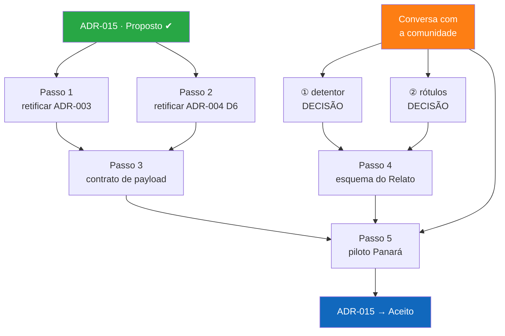

# Próximos Passos — retomada após a sessão de 2026-08-13

**Para quem retoma:** leia este arquivo primeiro, depois `conhecimento/sessao-2026-08-13-decisoes-e-pendencias.md`. Os dois juntos dão o estado completo sem precisar reler a sessão inteira.

**Estado do repositório:** `main`, árvore limpa. Último commit relevante: `fc3ebe2` (ADR-015) + o commit desta retomada.

---

## 1. Em uma página: o que mudou

A arquitetura ganhou um **segundo eixo**, ortogonal ao da procedência (artigo / campo / acervo / naturalista):

| Regime Enunciativo | O que é | Quem manda |
|---|---|---|
| **`conhecimento`** | A relação com a biodiversidade **enunciada por quem a detém** — primeira pessoa, presa a um ato de enunciação | A comunidade detentora. Aplica **Label** |
| **`evidencia`** | A **atestação por um terceiro** de que essa relação existe — terceira pessoa, presa a um artefato | Quem custodia o artefato. Só pode declarar **Notice** |

A distinção é **deôntica, não epistêmica**. Evidência não vale menos: é conhecimento com outro dono. O que ela decide é **quem pode classificar o nível de acesso**.

Formalizado em **`docs/architecture-decisions/ADR-015-regime-enunciativo-e-rotulagem-de-acesso.md`**, status **Proposto**, sete pontos K1–K7.

**A unidade de Conhecimento chama-se `Relato`** (decidido em 2026-08-13, contra "Enunciado"). Mapeia para `dwc:Assertion` na implementação. **Vive sempre na unidade da comunidade detentora**, nunca na de quem custodia o objeto de que ele fala.

---

## 2. Correção importante feita no fim da sessão

Uma versão anterior dizia que a narrativa de uma comunidade sobre uma peça de museu seria "Conhecimento dentro do BioCultAcervos". **Estava errado** e foi corrigido em todos os arquivos.

- **BioCultAcervos** guarda evidência física custodiada por instituições: material de Spruce em Kew, exsicatas do JBRJ, peças de coleções etnológicas.
- A narrativa da comunidade sobre esse item é um **Relato no BioCultRelatos da própria comunidade**, que *referencia* o item.
- Gravá-la no SQLite do museu violaria `Conteúdo Soberano` (`CONTEXT.md`) — soberania invertida.
- A coexistência das duas narrativas (lição do Mukurtu, `propostaGovernanca.md:419`) acontece **na federação**: dois registros de dois membros, vinculados.

**Consequência prática:** BioCultDB, BioCultAcervos e BioCultNaturalistas são `evidencia` **sempre**. O único provedor com os dois regimes é o **BioCultRelatos** — onde a nota de campo do pesquisador é Evidência, por falhar Q2 do teste de K1.

**Requisito novo, ainda não especificado:** o payload de harvest precisa expressar "este registro trata do mesmo objeto que aquele registro de outro membro". O DwC-DP tem `resource-relationship` para isso.

---

## 3. Comece por aqui: os três passos prontos

Nenhum depende de decisão pendente nem de ida a campo. Executáveis na ordem.

### Passo 1 — Nota de retificação no ADR-003

**Arquivo:** `docs/architecture-decisions/ADR-003-data-model.md`
**Convenção do repositório:** nota no topo do ponto afetado, **texto original preservado abaixo** — como feito no ADR-001 e nas retificações da v3.6.0 (ver `CHANGELOG.md`, v3.6.0, "Modificado").

Três pontos a retificar:

| Linha | Hoje | Retificação (ADR-015) |
|---|---|---|
| `110` | `type: "traditional_knowledge", // Fixo por enquanto` | Acrescentar campo `regime` (`conhecimento` \| `evidencia`) — K1 |
| `337-338` | `// Vídeos, áudios, etc. (futuro)` / `media: []` | `media` deixa de ser "(futuro)": entidade de primeira classe para registros `conhecimento` — K5 |
| `371` | `language: "pt-BR"` | Migra para **ISO 639-3**. `pt-BR` não codifica `kre`; o BioCultTermos já exige ISO 639-3 desde a migração de 2601 conceitos de `pt` para `por` — K5 |

Acrescentar também: entidade `relato` (K2), `accessLevel` por nível (K3) e `permissions.restrictions.reviewDate` (K3).

> **Atenção:** o ADR-003 está em status *Proposto*. A nota de retificação não o promove nem o reescreve.

### Passo 2 — Nota de retificação no ADR-004 D6

**Arquivo:** `docs/architecture-decisions/ADR-004-federated-architecture.md`, ponto **D6** (payload em `:145-148`).

K6 **supersede o contrato de payload**. O restante do D6 — paginação obrigatória, `updated_since`, identificador estável `member_id` + `record_id` — permanece válido e deve ser dito na nota.

> **Sinalizado e não resolvido:** o ADR-004 está `Aceito`; o ADR-015 está `Proposto`. É revogação de decisão aceita por documento ainda em discussão. Se isso incomodar, a alternativa é extrair K6 para um ADR próprio. **Decisão pendente do responsável.**

### Passo 3 — Contrato de payload do harvest, campo a campo

Especificar, a partir do esqueleto de K6:

```json
{
  "id": "<member_id>/<record_id>",
  "regime": "conhecimento | evidencia",
  "accessLevel": "public",
  "informationWithheld": "…",
  "dataGeneralizations": "…",
  "culturalLabels": [{ "tipo": "label | notice", "id": "…" }],
  "holderPeople": "…",
  "updated_at": "…",
  "data": { }
}
```

Pendências a fechar neste passo:
- Acrescentar o vínculo entre registros de membros distintos (`resource-relationship`) — §2 acima.
- **Condição de aceitação obrigatória (K6):** teste automatizado que **falhe** se qualquer registro com nível efetivo diferente de `public` atravessar o endpoint de harvest.
- Redação na **fronteira da API**, não *at rest* — a justificativa e a alternativa rejeitada estão em K6.

---

## 4. Bloqueado: precisa de decisão

Duas perguntas. A recomendação está marcada; nenhuma foi respondida.

### ① Como identificar o detentor sem expor a pessoa

Bloqueia o formato de `relato.detentor` e, portanto, o Passo 4 (esquema como tabela).

Conflito real: `assertionByID` quer identificador estável; LGPD art. 11 protege voz+imagem+etnia; CARE A1 e a Lei 13.123 dão à pessoa **direito ao reconhecimento**. Apagar o nome "para proteger" repete o apagamento histórico do informante indígena.

| | O sistema guarda | O público vê | Quem decidiu |
|---|---|---|---|
| A | nome real, protegido | "um ancião Panará" | nós |
| B | só o coletivo | "Panará" | nós |
| **C ← recomendada** | pseudônimo escolhido pela pessoa | o pseudônimo | **ela** |

**C é a única que exige ir a campo perguntar** — e é exatamente por isso que A e B são suspeitas: são as que se decidem sozinho.

### ② Rótulos culturais: API do Local Contexts Hub ou cópia local

| | Comunidade muda o rótulo | Serviço externo cai |
|---|---|---|
| Consultar API sempre | reflete na hora — **autoridade fica com ela** | some o rótulo |
| Copiar para o SQLite | desatualiza | funciona |
| **Guardar ID + cache do texto ← recomendada** | atualiza no próximo cache | mostra a última versão conhecida |

Tensão: soberania e simplicidade pedem não depender de serviço externo; mas copiar o rótulo para dentro significa passar a controlar algo que é da comunidade. **Nunca editar o texto** — o das Notices, em particular, é imutável por regra do Local Contexts.

---

## 5. Bloqueado: precisa da comunidade

Detalhado com roteiro de perguntas em `conhecimento/sessao-2026-08-13-decisoes-e-pendencias.md` **§5** — a seção feita para sair do computador. Resumo das quatro pautas:

1. **Como quem fala quer ser nomeado** — resolve ① acima.
2. **Quais rótulos culturais se aplicam** — sazonalidade, restrição por gênero ou família, uso comercial, e quem tem legitimidade para dizer em nome de todos.
3. **O vídeo Panará**, quatro pendências: CLPI não localizado; consentimento específico para imagem e voz; transcrição em `kre` inexistente; grafia não verificada com pesquisadores Panará.
4. **O que não deve ser registrado** — `propostaGovernanca.md:286`: para conhecimento sagrado, a decisão correta pode ser **não registrar**, e a plataforma tem obrigação de dizer isso.

Enquanto a Pauta 3 não fechar, `conhecimento/conhecimentoPanara.mp4` é `restricted` de fato, não atravessa harvest, e o `.gitignore` de `*.mp4` deve permanecer.

---

## 6. Fora deste repositório

| Onde | O quê |
|---|---|
| `BioCultDB` | 29 registros existentes precisam de valor de `regime`. Trivial: `evidencia` para todos, correto por construção da unidade |
| `BioCultDB` | Campos de acesso do ADR-003 (`visibility`, `restrictions`, `permissions`) **nunca foram materializados** no banco de produção |
| `BioCultRelatos` | Absorve K1–K7 como restrição de projeto **antes da primeira linha de código** — momento mais barato |
| `BioCultNaturalistas` | `docs/decisions/ADR-003` V2 ainda precisa remover `bcn_taxons → $.nomeCientificoAtual` (pendência da v3.6.0, ADR-014 N3 — **não é desta sessão**) |
| `dadosEtnoJBRJ_Panara` | `docs/esclarecer.md:218-221` pergunta sobre CLPI, ética, FUNAI e SisGen, sem resposta registrada |

---

## 7. Mapa de dependências



---

## 8. Onde está cada coisa

| Artefato | Caminho |
|---|---|
| Estudo completo, fontes verificadas, caso Panará modelado | `conhecimento/caracterizacao-do-conhecimento-tradicional.md` |
| Registro da sessão + **pauta da comunidade (§5)** | `conhecimento/sessao-2026-08-13-decisoes-e-pendencias.md` |
| Decisão de arquitetura | `docs/architecture-decisions/ADR-015-regime-enunciativo-e-rotulagem-de-acesso.md` |
| Glossário da federação | `CONTEXT.md` → seção "Conhecimento e evidência" |
| Governança de acesso, CLPI, rotulagem | `governanca/propostaGovernanca.md` §5.1–§5.10 |
| Rótulos SKOS-XL e `accessLevel` | `BioCultDB/bioculttermos/manual/03-rotulos.md` |
| Modelo de relato do projeto Panará | `dadosEtnoJBRJ_Panara/relatos.md` |
| Vídeo caso-teste (não versionado) | `conhecimento/conhecimentoPanara.mp4` — 42 s, HEVC 1080p, língua `kre` |

---

## 9. Referências externas já verificadas nesta sessão

Não precisam ser reconferidas.

- ISO 639-3 `kre` = Panará, *Active* — <https://iso639-3.sil.org/code/kre>. A *reference name* era `Kreen-Akarore` até a solicitação 2006-019, adotada em 2007-07-18: <https://iso639-3.sil.org/request/2006-019>
- DwC-DP, guia ratificado TDWG 2026-04-17 — <https://dwc.tdwg.org/dp/>
- Tabelas `*-assertion` e `usage-policy` — <https://github.com/gbif/dwc-dp/tree/master/dwc-dp/table-schemas>. Confirmado: `usage-policy` só tem campos de direito autoral, **nenhum** de protocolo cultural
- TK Labels, 20 rótulos em três categorias — <https://localcontexts.org/labels/traditional-knowledge-labels/>
- Local Contexts Hub API — <https://localcontexts.org/wp-content/uploads/2023/08/API-Implementation-Guide.pdf>
- CARE Principles, subprincípios C1–E3 — <https://www.gida-global.org/careprinciples>
- W3C PROV-O — <https://www.w3.org/TR/prov-o/>

---

## 10. Primeira coisa a fazer ao retomar

Escolher entre:

- **"Siga com os passos 1–3"** — trabalho de documentação, sem dependências, fecha a decisão nos lugares normativos.
- **"Responda ① e ②"** — se já houver conversa com a comunidade, destrava o Passo 4.
- **"Extraia K6 para ADR próprio"** — se a revogação do ADR-004 D6 por documento *Proposto* incomodar.
