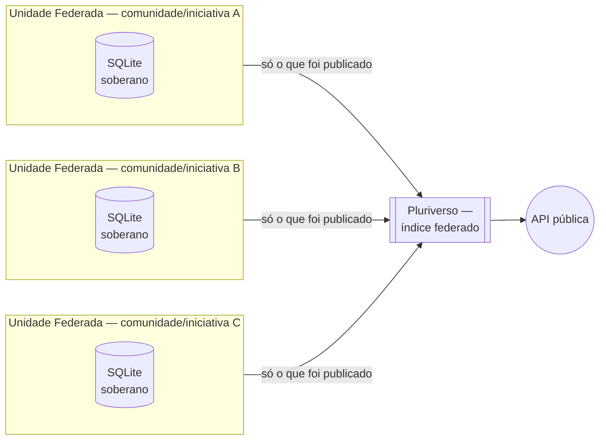

# Resumo Executivo — Arquitetura BioCultural

Este documento apresenta, de forma objetiva e sem pressupor leitura prévia, o que é a Arquitetura BioCultural: o problema que ela ataca, a proposta técnica, o estado real de cada peça e o que ainda depende de decisão alheia ao projeto. É a porta de entrada; para o detalhamento completo, ver [`README.md`](README.md) e os documentos listados na última seção.

A arquitetura está publicada como versão citável (DOI [10.5281/zenodo.21738427](https://doi.org/10.5281/zenodo.21738427)) e é hoje também o objeto de um projeto de pesquisa formal, descrito em [`docs/projetoPesquisa.md`](docs/projetoPesquisa.md). Proponente: Eduardo Dalcin, Instituto de Pesquisas Jardim Botânico do Rio de Janeiro (JBRJ).

## 1. O problema

O conhecimento tradicional associado à biodiversidade (CTA) — a relação entre comunidades tradicionais brasileiras e as plantas, animais e ecossistemas com que convivem — existe disperso em artigos científicos, registros de campo, acervos museológicos e obras de naturalistas dos séculos XVII a XIX. As soluções que hoje tentam reunir esse acervo em um único sistema fazem isso **centralizando** os dados num banco de dados institucional. Essa centralização produz um efeito que raramente é dito com todas as letras: quem passa a decidir o que se publica é a instituição que hospeda o banco, não a comunidade detentora do conhecimento — mesmo que um termo de consentimento diga o contrário. A soberania fica declarada em papel; a arquitetura não a sustenta.

## 2. A proposta

A Arquitetura BioCultural inverte essa dependência: cada comunidade ou iniciativa que participa opera uma **unidade federada** — soberana, com seu próprio contêiner de software e seu próprio arquivo de banco de dados (SQLite), que só ela controla — e publica apenas o que decide publicar. Um middleware de coleta, o **Pluriverso**, faz **harvest** (coleta periódica, via internet, do que cada unidade marcou como público) e indexa exclusivamente esses registros publicados; ele nunca acessa o banco interno de nenhuma unidade.

A tese central é que **soberania de dados é propriedade da arquitetura, não da política de uso** de quem opera o sistema. Uma promessa escrita em termo de consentimento pode ser descumprida sem que ninguém perceba; um dado que fisicamente nunca sai do arquivo da comunidade, e só é coletado se ela o expuser, é verificável, auditável e reversível por construção — a comunidade pode revogar a publicação, ou sair da federação inteira, sem depender de decisão de terceiro.

Cada retângulo é soberano: nada sai dali sem um ato explícito de publicação. O Pluriverso é só o índice do que já foi publicado — nunca a origem do dado, e nunca ponto único de falha para a soberania de uma unidade.

## 3. Os dois eixos que organizam o dado

**O primeiro eixo é a fonte.** A arquitetura acolhe quatro tipos de proveniência, cada uma com processo de aquisição próprio:

| Tipo de fonte | Descrição | Regime predominante | Ferramenta |
|---|---|---|---|
| Fontes primárias | Registro direto em campo, junto à comunidade (consentimento obrigatório) | Conhecimento | BioCultRelatos |
| Fontes secundárias | Artigos científicos já publicados | Evidência | BioCultDB |
| Acervos históricos e museológicos | Coleções e documentos preservados em museus e arquivos | Evidência | BioCultAcervos |
| Obras de naturalistas | Relatos de naturalistas em visita ao Brasil, séculos XVII a XIX | Evidência | BioCultNaturalistas |

**O segundo eixo, ortogonal ao primeiro, é o regime enunciativo**: todo registro declara se é **Conhecimento** — a relação com a biodiversidade enunciada por quem a detém, em primeira pessoa, presa a um ato datado e localizado — ou **Evidência** — a atestação, por um terceiro, de que essa relação existe, presa a um artigo, item de acervo ou obra histórica. A distinção não é sobre qual dos dois vale mais; é **deôntica, não epistêmica** — Evidência não é conhecimento de segunda categoria, é conhecimento com outro dono. O que a distinção decide, na prática, é **quem tem autoridade para classificar o nível de acesso** daquele registro: sobre Conhecimento, só a comunidade decide; sobre Evidência, quem custodia o artefato pode apenas declarar o que sabe, nunca falar em nome de quem não consultou.

Regime é propriedade do registro, não da ferramenta que o guarda: BioCultDB, BioCultAcervos e BioCultNaturalistas produzem Evidência sempre; o único provedor com os dois regimes é o BioCultRelatos, porque mesmo ali a nota de campo do pesquisador é testemunho dele, não relato do detentor.

## 4. Os componentes — o que existe de fato

| Componente | O que faz | Estado |
|---|---|---|
| **BioCultDB** | Gerencia conhecimento tradicional de fontes secundárias — aquisição (inclui extração por IA de PDFs), curadoria e apresentação pública | Em produção |
| **BioCultTermos** | Vocabulário controlado (SKOS-XL — extensão do padrão W3C SKOS em que cada rótulo carrega idioma, proveniência e nível de acesso próprios), compartilhado por todas as unidades | Implementado; em produção só embarcado no BioCultDB |
| **BioCultRelatos** | Registra Conhecimento primário diretamente com comunidades, sob CLPI (Consentimento Livre, Prévio e Informado) | Documentação e scaffold; sem código de produção |
| **BioCultAcervos** | Documenta acervos históricos e museológicos | Repositório e documentação |
| **BioCultNaturalistas** | Documenta obras de naturalistas dos séculos XVII a XIX | Só documentação de fundação; código não iniciado |
| **Pluriverso** | Middleware de federação: coleta (harvest) e indexa apenas o que cada unidade publicou | Só documentação; código não iniciado |

Nenhum componente além do BioCultDB está em produção. O UDM — Modelo de Dados Unificado, o contrato lógico que qualquer ferramenta precisa seguir para "falar" com a federação — está formalizado, mas em status de proposta (versão 1.0.0-proposta), assim como as decisões técnicas que fecham a distinção Conhecimento × Evidência (ADR-015) e o contrato de coleta federada (ADR-016), ambas hoje "Proposto".

## 5. Governança — quem decide o quê

A [Proposta de Governança](governanca/propostaGovernanca.md) organiza a decisão em três camadas, cada uma com sua instância própria:

| Camada | Quem decide | Sobre o quê |
|---|---|---|
| **Dados** | A comunidade | O que se registra, o que se publica, o que se retira |
| **Ferramentas** | O mantenedor da instância | Deploy, versão, backup, segurança |
| **Arquitetura** | O Comitê Federado | ADRs, contrato de harvest, admissão de membros |

Esta divisão é uma **proposta em consulta**, não uma estrutura já em funcionamento. O Comitê Federado — o corpo que decidiria, por representantes de cada membro, admissão e regras da federação — **ainda não existe**. Hoje, quem acumula as três camadas na prática é o próprio pesquisador responsável (Eduardo Dalcin, JBRJ), porque não há ainda outra instância constituída para exercê-las.

O único mecanismo de governança em operação real hoje é o **Ponto-Focal**: o interlocutor designado por uma iniciativa parceira para dialogar com o projeto. A resposta do Ponto-Focal é a posição técnica e institucional da iniciativa que o designou — informada e competente — mas **nunca** é o consentimento da comunidade detentora sobre um registro concreto, porque a titularidade do CTA é coletiva por lei, e não delegável a um interlocutor técnico. O Ponto-Focal desenha o campo da conversa; quem preenche o valor de cada decisão sobre um dado específico é sempre a comunidade titular.

## 6. O que a plataforma nunca fará

Compromissos negativos, porque são mais verificáveis do que promessas:

- Nunca vender dados de conhecimento tradicional, agregados ou não.
- Nunca ceder a base a terceiros sem decisão da comunidade titular de cada registro envolvido.
- Nunca treinar modelo de IA comercial com registros restritos — acesso a um dado público não é autorização para usá-lo como treino.
- Nunca coletar registros marcados como restritos sem autorização explícita e específica para isso.
- Nunca reciclar o identificador de um membro que saiu da federação.
- Nunca publicar um registro sem consentimento válido, nem tratar "publicado" como substituto de consentimento.
- Nunca exigir justificativa de uma comunidade para revogar publicação ou sair da federação.
- Nunca aplicar, em nome de uma comunidade, um rótulo cultural que só ela tem autoridade para aplicar.

## 7. O que ainda não está resolvido

- **A federação não tem, hoje, nenhuma comunidade tradicional com voz direta.** O USEFLORA — cujo Comitê Gestor é misto, com academia e comunidades tradicionais — é a única iniciativa parceira com esse alcance; foi solicitado, em reunião, que indicasse um Ponto-Focal, e a indicação ainda não ocorreu. Até que ela ocorra, o USEFLORA serve apenas como interlocução provisória e por procuração para pendências que nascem também de outras iniciativas (BioCultRelatos, Pluriverso) cujas comunidades afetadas ainda não estão na conversa — isso é insumo de desenho, nunca consentimento.
- **Decisões que só uma comunidade pode tomar continuam em aberto**: como um detentor individual quer ser identificado sem se expor; quais rótulos culturais valem para cada relato; como obter consentimento específico para gravação de voz e imagem; o que simplesmente não deve ser digitado. Nenhuma dessas perguntas é técnica, e nenhuma está resolvida por decisão do projeto.
- **O Comitê Federado não está constituído**, e o protocolo de admissão de membros tem um bloqueador não resolvido: hoje não há mecanismo técnico que garanta que uma decisão de admitir ou recusar um membro reflete deliberação coletiva, e não a ação isolada de quem opera o sistema.
- **As duas decisões técnicas de fundo — regime enunciativo (ADR-015) e contrato de coleta federada (ADR-016) — seguem com status "Proposto"**, aguardando a validação comunitária que as pendências acima bloqueiam.
- **BioCultRelatos, a única unidade que registraria Conhecimento diretamente com detentores, ainda não tem código de produção** — o que significa que, hoje, a distinção Conhecimento × Evidência que estrutura toda a proposta não foi testada com um caso real de comunidade publicando o próprio relato.

## 8. Onde ler mais

| Documento | Caminho |
|---|---|
| Arquitetura completa | [`README.md`](README.md) |
| Projeto de pesquisa (problema, objetivos, metodologia) | [`docs/projetoPesquisa.md`](docs/projetoPesquisa.md) |
| Modelo de Dados Unificado (UDM) | [`docs/modelo-de-dados-unificado.md`](docs/modelo-de-dados-unificado.md) |
| Proposta de Governança | [`governanca/propostaGovernanca.md`](governanca/propostaGovernanca.md) |
| Contrato de harvest, campo a campo | [`docs/contrato-harvest.md`](docs/contrato-harvest.md) |
| Decisões arquiteturais (ADRs) | [`docs/architecture-decisions/`](docs/architecture-decisions/) |
| Glossário da federação | [`CONTEXT.md`](CONTEXT.md) |
| Estado do projeto e pendências | [`docs/proximosPassos.md`](docs/proximosPassos.md) |
| Pauta das comunidades — o que depende delas, com roteiro | [`docs/conhecimento/pauta-comunidades.md`](docs/conhecimento/pauta-comunidades.md) |
| Conhecimento × Evidência, o estudo completo | [`docs/conhecimento/caracterizacao-do-conhecimento-tradicional.md`](docs/conhecimento/caracterizacao-do-conhecimento-tradicional.md) |
